# Create and connect to an Azure Database for MySQL Single Server

**Introduction**

During this lab, you will learn how to create an Azure Database for MySQL with the Azure Portal and Azure CLI. You will also learn how to connect your Azure Database for MySQL Single Server through using the MySQL Command Tool in Cloud Shell and [MySQL Workbench](https://www.mysql.com/products/workbench/) tool, after configuring firewall rules for your Azure Database for MySQL Single Server. You will leverage Azure Portal to configure firewall rule in this lab.


**Objectives**

After completing this lab, you will be able to: 

- Create an Azure Database for MySQL Single Server through the Portal.
- Create an Azure Database for MySQL Single Server through the Azure CLI Shell.
- Configure a server-level firewall rule
- Get the connection information
- Connect to the MySQL Database by using mysql in Cloud Shell or MySQL Workbench
- Create new databases using mysql or MySQL Workbench

**Estimated Time:** 60 minutes

--- 

## Exercise 1: Create an Azure Database for MySQL Single Server in the Azure portal

The steps below show you how to create an Azure Database for MySQL Single Server using the Azure portal.

**Tasks**

1. Connect to Microsoft Azure Portal
    
   Open Microsoft Edge and navigate to the [Azure Portal](http://ms.portal.azure.com) to connect to Microsoft Azure Portal. Login with your subscriptions credentials.
    
 1. Create an Azure Database for MySQL Resource
    
   Click on **+ Create a resource** in the upper-left corner of the portal
    
   Look for **Azure Database for MySQL** and select it.
    
   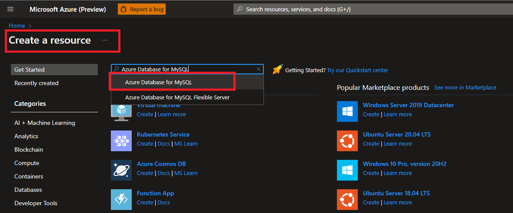
    
   Click on **Create**
    
   
    
   Select **Single Service**
    
   
   
   Configure the new server using the following information:

   >If the server exists, use a different number at the end of the name. The server name must be unique across all Azure customers.

   | Property             | Value                              |
   | -------------------- | -----------------------------------|
   | **Subscription**     | Select your subscription           |
   | **Resource group**   | mysqllab                           |
   | **Servername**       | mysqlserver[your name initials]    |
   | **Data source**      | none                               |
   | **Admin Username**   | admmysql                           |
   | **Password**         | Use a complex password. The server admin login and password that you specify here are required to sign into the server and its databases. Remember or record this information for later use                              |
   | **Confirm Password** | Use same value used for Password   |
   | **Location**         | Select the Location near to you    |
   | **Version**          | 8.0                                |
   | **Compute + storage**| General Purpose, 2Vcores, 15GB storage. Use default values for other setting |                  

   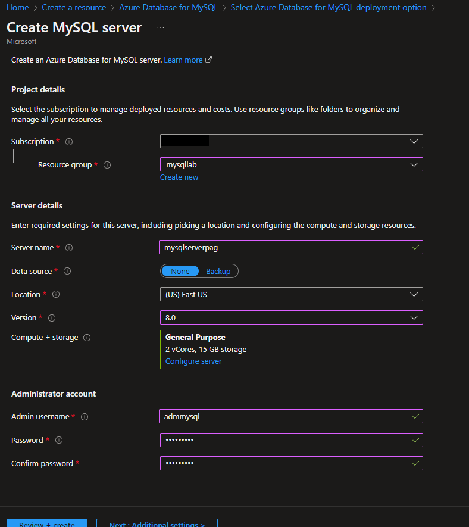
    
   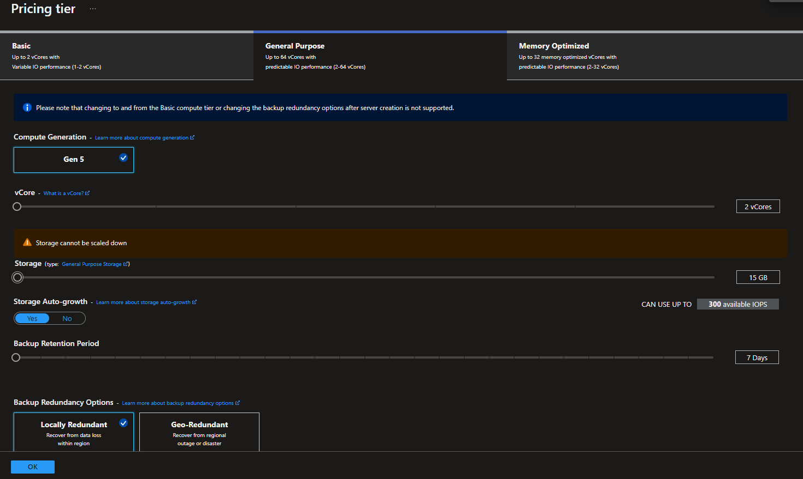
    
   Select **Create + Review**
    
   Review the configuration and click on **Create** to provision the server. This operation may take a few minutes.
    
   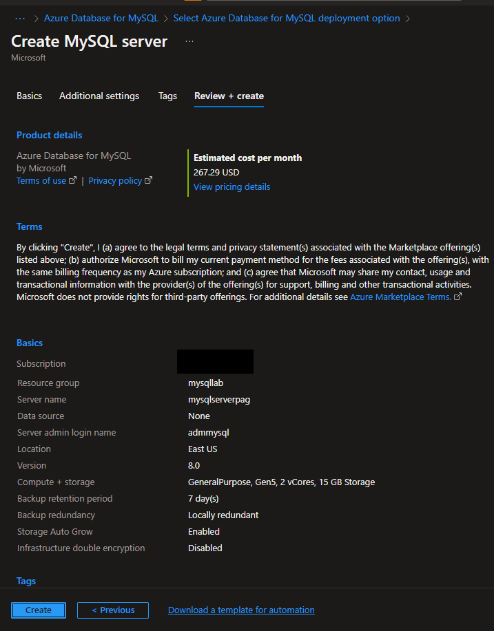
   
   Wait until the server is created.
    
   On the toolbar, select the Notifications icon (a bell) to monitor the deployment process. Once the deployment is done, you can select **Pin to dashboard**, which creates a tile for this server on your Azure portal dashboard as a shortcut to the server's Overview page. Click on **Go to resource** to open the server's Overview page
    
   
    
   The Azure Database for MySQL Single Server has been created and it is ready for use.
    
   

1. Delete the Azure Database for MySQL Single Server (optional)
    
   To save money, delete the server you just created

   >This step is optional. If you will complete the next Lab soon, do not delete it to save time.

   On the **Overview** Pane, select **Delete**. Type the server name and click on **Delete**

   

Congratulations! You have successfully completed this exercise.

---

## Exercise 2: Create an Azure Database for MySQL Single Server using Azure CLI

The steps below show you how to create an Azure Database for MySQL Single Server using Azure CLI

Azure CLI can be used from the Azure Cloud Shell or can be installed locally in your machine.

This lab uses Azure CLI from the Azure Cloud Shell

For instructions on how to install Azure CLI locally refer to [Install Azure CLI](https://docs.microsoft.com/en-us/cli/azure/install-azure-cli-windows?view=azure-cli-latest)

**Tasks**

1. Connect to your Azure subscription
    
   Open Microsoft Edge and navigate to the [Azure Portal](http://ms.portal.azure.com) to connect to Microsoft Azure Portal. Login with your subscriptions credential.

1. Open Azure Cloud Shell
    
   Select the **Cloud Shell** button on the menu in the upper-right corner of the Azure Portal
    
   
    
   Select the PowerShell option for the Azure Cloud Shell
    
   
    
   If this is the first time we are opening, Azure will prompt us to select a subscription to create a storage account and Microsoft Azure Files share If so, click on **Create storage** and wait until the creation ends.
    
   
    
   When the Azure Cloud Shell is ready to use you will see a screen as the following:
    
   

1. Connect to your subscription
    
   List the subscriptions available by executing:
    
   ```bash
   az account list
   ```
    
   
    
   Identify the subscription you will use for this exercise and make sure you are on in by executing:
    
   ```bash
   az account set --subscription <subscription id>
   ```
   
    

1. Create the Azure Database for MySQL Single Server
    
   NOTE: You will use the resource group (**mysqllab**) created on exercise 1 for the new server
    
   To create a server named mysqlserver[your name initials]2 on westus and using a similar configuration used in exercise 1, execute:

   ```bash
   az mysql server create --name mysqlserver[your name initials]2 --resource-group mysqllab --location westus --admin-user mysqladmin --admin-password  <server_admin_password> --sku-name GP_Gen5_2
   ```

   NOTE: Make sure you modify the server name and server admin password before executing the command. You can use a region closer to you.
   
   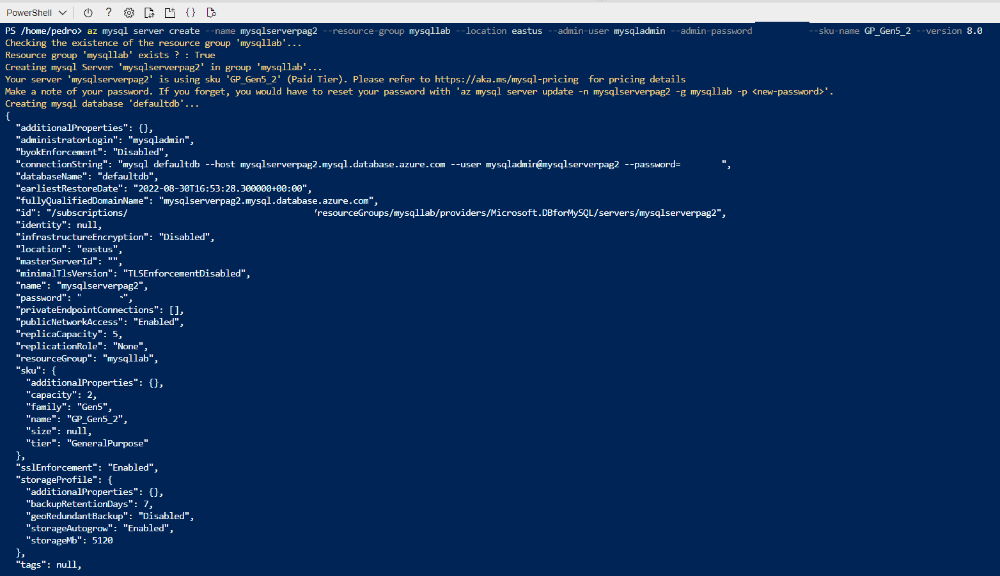
    
   Go to the portal, and look for the server you just created and click on it
    
   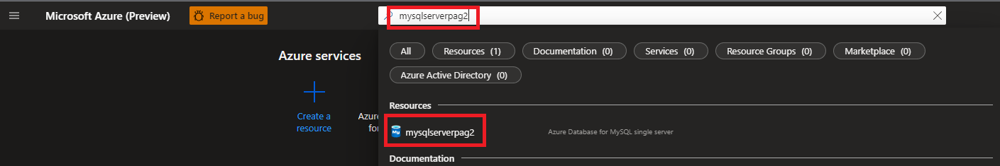
    
   The Azure Database for MySQL have been created and it is ready for use.
    
   

1. Delete the Azure Database for MySQL Single Server
    
   To save money, delete the server you created during this exercise
    
   On the Overview Pane, select **Delete**. Type the server name and click on **Delete**
    
   

Congratulations! You have successfully completed this exercise.

## Exercise 3: Configure a server-level firewall rule

Azure Database for MySQL creates a firewall at the server level. It prevents external applications and tools from connecting to the server and any databases on the server, unless you create a rule to open the firewall for specific IP addresses. Server-level firewall rules enable administrators to access an Azure Database for MySQL Single Server from a specified IP address or range of IP addresses.

**Tasks**

1. Connect to Microsoft Azure Portal
    
   Open Microsoft Edge and navigate to the [Azure Portal](http://ms.portal.azure.com) to connect to Microsoft Azure Portal. Login with your subscriptions credential.
    
   

1. Go to your MySQL Server

   Go to your Azure Database for MySQL Single Server in any way you prefer to look for a resource on Azure. One method is: on the Server Resources (global) bar, type the name of your server, and select it when shown

   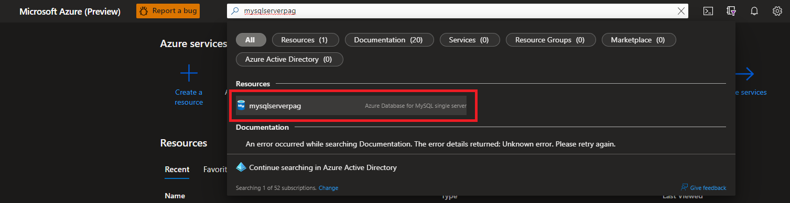

1. Configure firewall rule for your Azure Database for MySQL Resource

   On the MySQL server page, under **Settings** heading, click **Connection security** to open the Connection security page for the Azure Database for MySQL.

   

   Click **Add client IP** on the toolbar. This automatically creates a firewall rule with the public IP address of your computer, as perceived by the Azure system. Change the name of the rule to *Lab-VM-Public-IP*.

   

   Verify your IP address before saving the configuration. In some situations, the IP address observed by Azure portal differs from the IP address used when accessing the internet and Azure servers. Therefore, you may need to change the Start IP and End IP to make the rule function as expected. Use a search engine or other online tool to check your own IP address. For example, search for "what is my IP."

   Click **Save** on the toolbar to save this server-level firewall rule. Wait for the confirmation that the update to the firewall rules was successful

   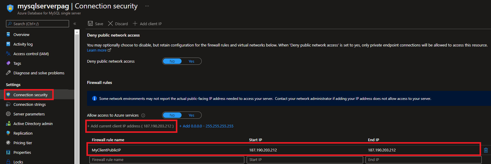

1. Allow access to Azure services option to YES
    
   On your MySQL server page, under **Settings** page, click **Connection security** to open the Connection security page for the Azure Database for MySQL
    
   Set **Allow access to Azure services** option to **Yes** in the portal from the Connection security pane and click **Save**
    
   >This step is necessary to connect to the Azure Database for MySQL Single Server from the Azure Cloud Shell.
    
   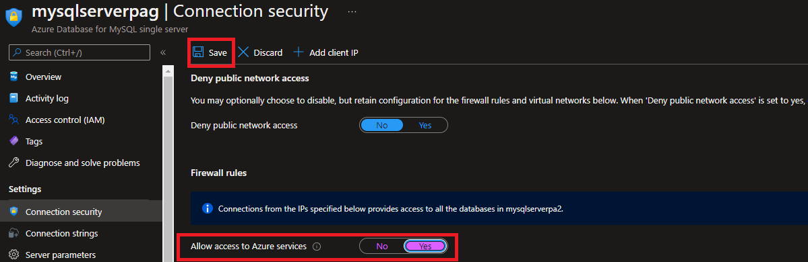
    
Congratulations! You have successfully completed this exercise.

---

## Exercise 4: Get the connection information

When you create your Azure Database for MySQL Single Server, a default database named postgres is created. To connect to your database server, you need your full server name and admin login credentials. You can easily find the server name and login information on the server **Overview** page in the portal.

**Tasks**

1. Connect to Microsoft Azure Portal
    
   Open Microsoft Edge and navigate to the [Azure Portal](http://ms.portal.azure.com) to connect to Microsoft Azure Portal. Login with your subscriptions credential.
    
   

1. Go to your MySQL Server

   Go to your Azure Database for MySQL Single Server in any way you prefer to look for a resource on Azure

1. Get the connection information for your Azure Database for MySQL Single Server
    
   On your MySQL server page, go to the **Overview** page.
    
   Make a note of the Server name and the Server admin login name. Hover your cursor over each field, and the copy symbol appears to the right of the text. Select the copy symbol as needed to copy the values.
    
   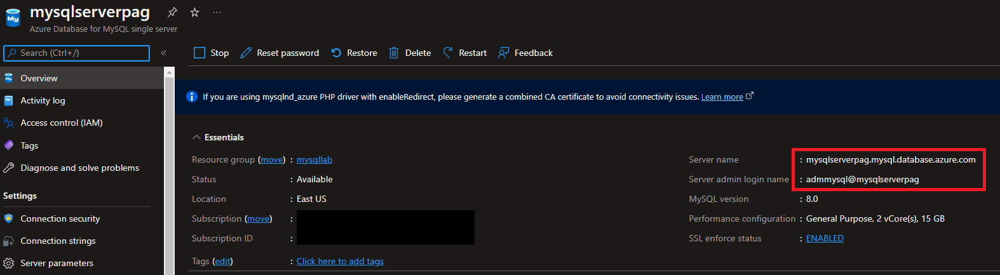

Congratulations! You have successfully completed this exercise.

---

## Exercise 5: Connect to the MySQL Database by using mysql CLI in Cloud Shell

There are several applications you can use to connect to your Azure Database for MySQL Single Server. Let's first use the mysql command-line utility to illustrate how to connect to the server. You can use a web browser and Azure Cloud Shell as described here without the need to install any additional software. If you have the mysql command-line utility installed locally on your own machine, you can connect from there as well.

**Tasks**

1. Connect to Microsoft Azure Portal
    
   Open Microsoft Edge and navigate to the [Azure Portal](http://ms.portal.azure.com) to connect to Microsoft Azure Portal. Login with your subscriptions credential.
    
   

1. Open Azure Cloud Shell
    
   Select the **Cloud Shell** button on the menu in the upper-right corner of the Azure Portal.
    
   
    
   Select the PowerShell option for the Azure Cloud Shell
    
   
   
   If this is the first time we are opening, Azure will prompt us to select a subscription to create a storage account and Microsoft Azure Files share If so, click on **Create storage** and wait until the creation ends.
    
   
    
   When the Azure Cloud Shell is ready to use you will see a screen as the following:
    
   

1. Connect to your Azure Database for MySQL Single Server using mysql tool.
    
   At the Cloud Shell prompt, connect to a database in your Azure Database for MySQL Single Server by typing the mysql command line.
    
   To connect to an Azure Database for MySQL Single Server with the mysql utility, use the following as format:
    
   ```bash
   mysql -h <yourserver> -u <server admin login> -p
   ```
    
    Example

   ```bash
    mysql -h mysqlserverdvvr.mysql.database.azure.com -u admmysql@mysqlserverdvvr -p
   ```
    
   After you run the mysql command with your own parameter values, you're prompted to enter the server admin password. This password is the same one that you provided when you created the server
    
   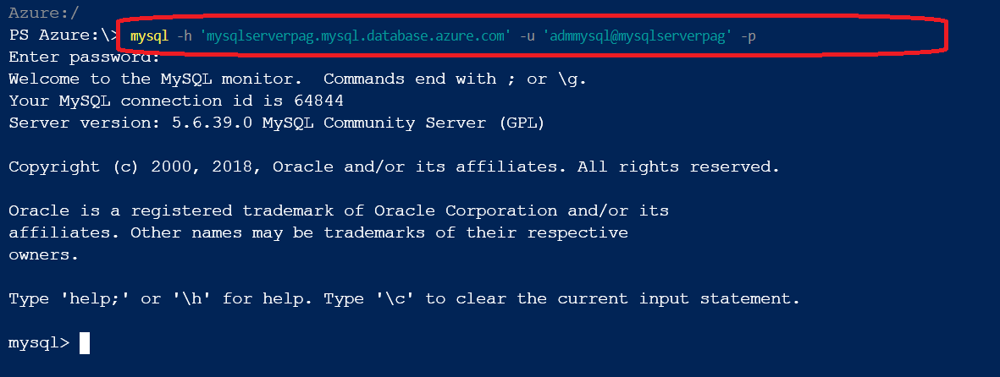

1. Create a new database
    
   Create your own database to work with by executing:
    
   ```sql
   CREATE DATABASE <your initials>db;
   ```
  
   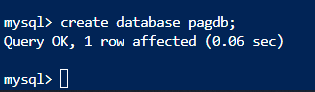
   
   List databases in the server (you will find your new database) by executing 

   ```sql
   Show Databases
   ```

   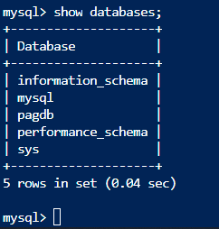

   
   switch connections to the newly created database by executing:
    
   ```sql
   use <your initials>db;
   ```
    
   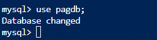
    
   Type **exit**, and then press the **Enter** key to quit mysql. You can close Cloud Shell after you're finished.
    
   

Congratulations! You have successfully completed this exercise.

---

## Exercise 6: Connect to the MySQL Server using MySQL Workbench

 MySQL Workbench is an open-source tool used with MySQL. You can install MySQL Workbench from the [MySQL Workbench](https://www.mysql.com/products/workbench/). Read the MySQL Workbench documentation if you need additional guidance.

**Tasks**

1. Connect to your Azure Database for MySQL Single Server using MySQL Workbench tool.
    
   Open **MySQL Workbench**.
   
   On the main dashboard, click on '+' to add a new connection
   
   
   
   In the **Set up New Connection** dialog box, enter a unique friendly name or the server. Then fill in the user name and host name. Use the connection information you got in exercise 2.
   
   
       
    
   Select the option **Store password in vault**
    
   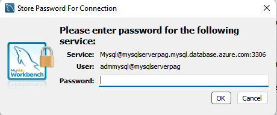
    
   Select **OK**
    
   In the MySQL Workbench main dashboard, select your server.
    
   
    
   After the connection is established; you can click on 'Administration' and then on Dashboard to see the following view:
    
   

1. Create a new database in your Azure Database for MySQL Single Server
    
   You can create multiple databases per server with Azure Database for MySQL. To create a database, use the query tool with the following statement:
   ```sql
   create database <database__name>;
   ```

    
   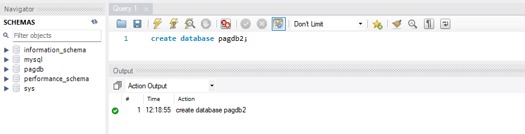
    
  
    
   In the Browser pane, once the database is successfully created, you can see it in the list of databases under your server name. Double click on it
    
   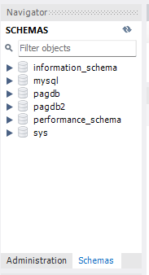

1. Delete the Azure Database for MySQL Single Server (optional)
    
   To save money, delete the server used during this lab.

   >This step is optional. If you will complete the next Lab soon, do not delete it to save time.

   On the Overview Pane, select **Delete**. Type the server name and click on **Delete**

   

Congratulations!. You have successfully completed this exercise and the Lab. 