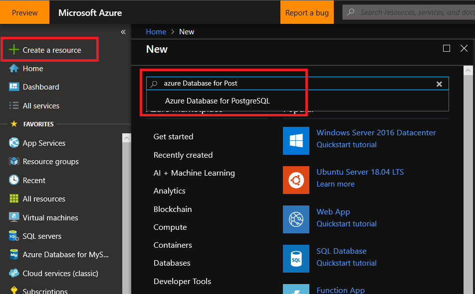
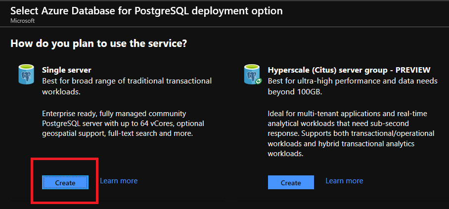
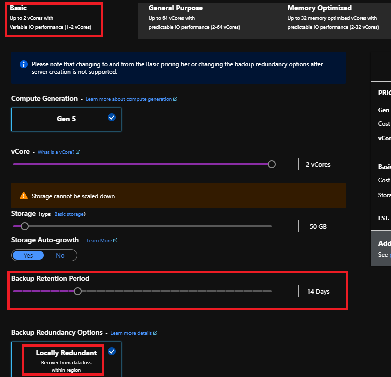
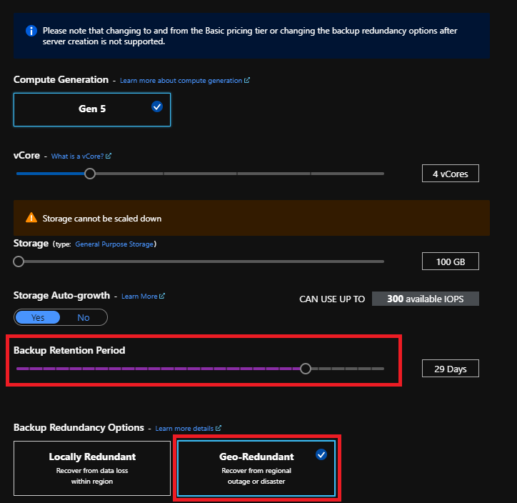
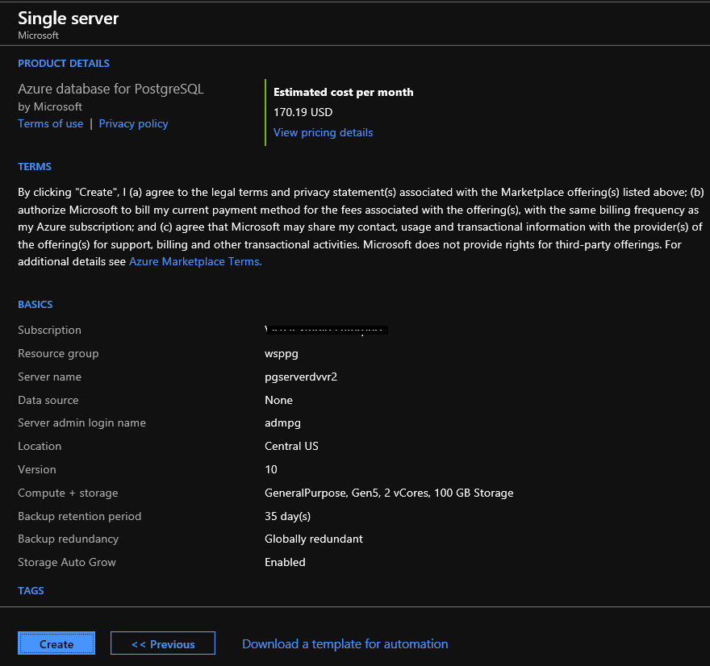
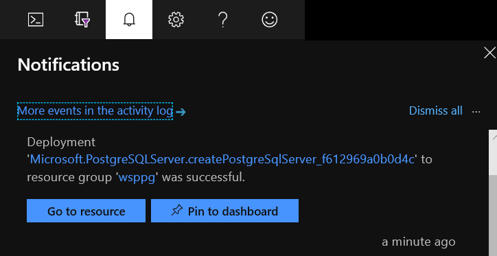
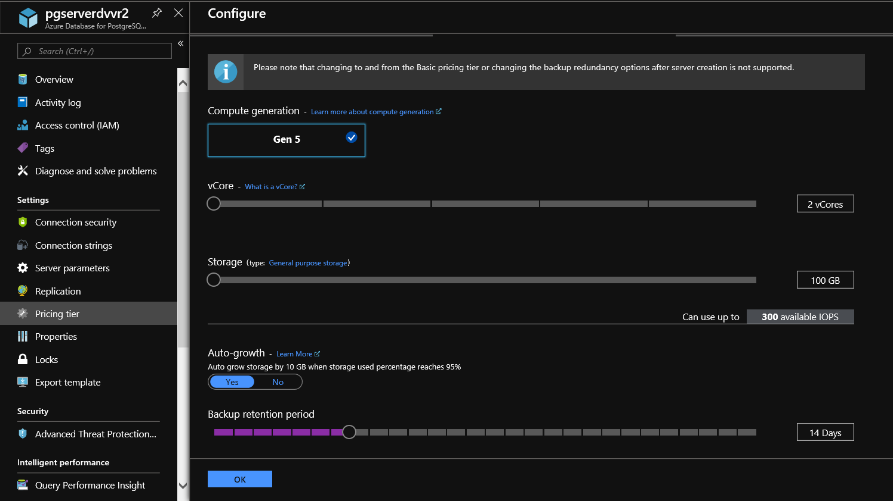
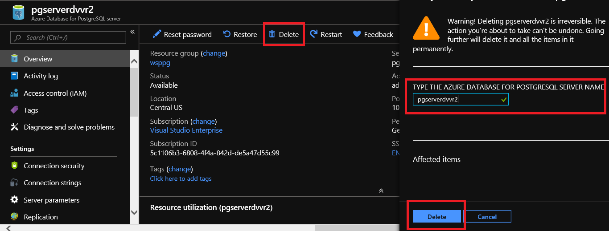

# Set and change the retention policy and the backup geo replication option for an Azure Database for MySQL Single Server

**Introduction** 

During this lab, you will learn how to configure the retention policy and backup geo replication options during a database creation and for an existing database

**Objectives** 

After completing this lab, you will be able to: 

- How to set the backup retention policy and set backup geo replication during an Azure Database for MySQL Single Server creation
- How to change the backup retention policy for an existing Azure Database for MySQL Single Server

**Estimated Time:** 20 minutes

---

## Exercise 1: Configure the retention policy and the backup geo replication during creation

This exercise shows how to configure the retention policy and backup geo replication options during a database creation

**Tasks**

1. Connect to Microsoft Azure Portal
    
   Open Microsoft Edge and navigate to the [Azure Portal](http://ms.portal.azure.com) to connect to Microsoft Azure Portal. Login with your subscriptions credential.
    
1. Create Azure Database for MySQL Resource
    
   Click on **+ Create a resource** in the upper-left corner of the portal
    
   Look for **Azure Database for MySQL** and select it.
    
   
    
   Click on **Create**
    
   
    
   Select **Single Server**
    
   
    
   Configure the new server using the following information:

   | Property             | Value                              |
   | -------------------- | -----------------------------------|
   | **Subscription**     | Select your subscription           |
   | **Resource group**   | mysqllab                           |
   | **Servername**       | mysqlserver[your name initials]2   |
   | **Data source**      | none                               |
   | **Admin Username**   | admmysql                           |
   | **Password**         | Use a complex password. The server admin login and password that you specify here are required to sign into the server and its databases. Remember or record this information for later use                              |
   | **Confirm Password** | Use same value used for Password   |
   | **Location**         | Select a Location near to you    |
   | **Version**          | 8.0                                |
   | **Compute + storage**| General Purpose, 2Vcores, 15GB storage. Use default values for other setting |        

   >**NOTE:** If the server exists, use a different number at the end of the name. The server name must be unique across all Azure customers.
   
   >**Important:** Do not create the server yet

1. Configure the Pricing Tier
    
   In **Compute + storage**, click **Configure server**

   Select **Basic**
    
   Play around with the **Backup Retention Period** bar. Notice that the minimum retention is 7 days and the maximum is 35 days.
    
   Notice that for Basic Tier, the only backup redundancy option is *Locally Redundant* and there is no way to disable it.

   >A note indicates clearly that changing to and from the Basic pricing tier or changing the backup redundancy options after server creation is not supported, so you have to decide which tier supports your need before creating the server.

   

   Select *General Purpose* or *Memory Optimized*.

   Play around with the **Backup Retention Period** bar and notice that the minimum retention is 7 days and the maximum is 35 days.

   Notice that you have two options for the backup redundancy: *Locally Redundant* and *Geo-Redundant*. Notice that you must select one of the two options, it is not way to disable redundancy.

   For this server, select:
   - General Purpose tier
   - Compute generation Gen 5
   - 2 vCores
   - 5 GB Storage
   - 35 days backup retention
   - "Geo-Redundant" for the backup redundancy option.
  
   
    
   Click **OK**

1. Create the server
    
   Select **Create + Review**
    
   
    
   Review the configuration and click on **Create** to provision the server. This operation may take a few minutes
    
   Wait for the server to be created and pin it to the dashboard
    
   

Congratulations! You have successfully completed this exercise.

---

## Exercise 2: Change the retention policy and the backup geo replication option for and existing server

This exercise shows how to change the retention policy and backup geo replication options for an existing database

**Tasks**

1. Connect to Microsoft Azure Portal
    
   Open Microsoft Edge and navigate to the [Azure Portal](http://ms.portal.azure.com) to connect to Microsoft Azure Portal. Login with your subscriptions credential.
    
   

1. Go to your MySQL Server
    
   Go to the Azure Database for MySQL Single Server you create on the previous exercise in any way you prefer to look for a resource on Azure

1. Change the backup retention period
    
   To change the retention policies, go to **Pricing Tier**
    
   
    
   You can change the retention period to any value between 7 days and 35 days. Set it to 14 days
    
   Notice that it is not possible to change the backup redundancy option once the server is created and only the one you selected during server creating is displayed and cannot unselect it. For this reason, you must define your redundancy needs before creating your server as you cannot change it later.
    
   Click **Ok**

1. Delete the Azure Database for MySQL Single Server
    
   To save money, delete the server you created during this exercise: mysqlserver[your name initials]2
    
   On the Overview Pane, select **Delete**. Type the server name and click on **Delete**
    
   

Congratulations!. You have successfully completed this exercise and the Lab. 