# Create a Read replica for an Azure Database for MySQL Single Server

**Introduction**

During this lab, you will learn how to create a Read replica for an Azure Database for MySQL Single Server using the Azure Portal

The read replica feature helps to improve the performance and scale of read-intensive workloads. Read workloads can be isolated to the replicas, while write workloads can be directed to the source.

A common scenario is to have BI and analytical workloads use the read replica as the data source for reporting.

Because replicas are read-only, they don't directly reduce write-capacity burdens on the source. This feature isn't targeted at write-intensive workloads.

The read replica feature uses MySQL asynchronous replication. The feature isn't meant for synchronous replication scenarios. There will be a measurable delay between the source and the replica. The data on the replica eventually becomes consistent with the data on the source. Use this feature for workloads that can accommodate this delay.

**Objectives**

After completing this lab, you will be able to: 

- Set a read replica for an Azure Database for MySQL Single Server
- Read from an Azure Database for MySQL Single Server read replica

**Considerations**

This lab considers that an Azure Database for MySQL Single Server General Purpose or Memory Optimized named mysqlserver[your name initials] exists with a server admin login named *admmysql*, if not, create it or use another existing server before continuing with the lab.

**Estimated Time:** 50 minutes

---

# Exercise 1: Create a sample schema on the Azure Database for MySQL Single Server

This exercise shows how to create a sample schema on the Azure Database for MySQL Single Server

**Tasks**

## Exercise 1: Create a sample database on the Azure Database for MySQL Single Server

**Tasks**

1. Create the *employees* database on the Azure Database for MySQL Single Server
   
   Downlad and extract the content of [employees demo database](https://github.com/danvalero/AzureOSSDBLabs/raw/main/Azure%20Database%20for%20MySQL%20Single%20Server/MySQLSSLabFiles/create_employees.zip) in **C:\\MySQLSSLabFiles** folder

   Open a Windows Command Prompt and execute a script to restore the *employees* database using:

   >This is destructive action. If there is a database named employees in the Azure Database for MySQL Single Server, the existing *employees* database will be dropped and replaced.
    
   ```bash
   mysql -h <server_name>.mysql.database.azure.com -u <admin_user>@<server_name> -p sys < C:\MySQLSSLabFiles\create_employees.sql
   ```
   for example:    
    
   ```bash
   mysql -h mysqlserver--ms.mysql.database.azure.com -u admmysql@mysqlserver--ms -p sys < C:\MySQLSSLabFiles\create_employees.sql
   ```

   You need to enter password when prompted. 
     
   If the operation does not seem to complete after 5 minutes, press enter again

   If you get a message like:
   
   Client with IP address **45.23.185.251** is not allowed to connect to this MySQL server.
   
   You must allow access from your machine to the Azure Database for MySQL Single Server by adding a rule for the client machine IP address. Go to **Connection security** under **Settings**, add the rule and click **Save**.
   
   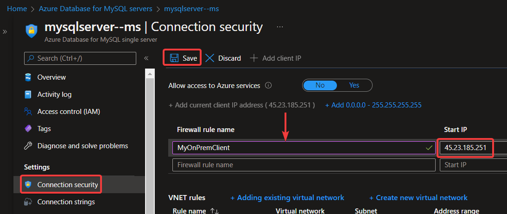

Congratulations!. You have successfully completed this exercise. 

---

# Exercise 2: Add a replica

This exercise shows how to add a read replica for an Azure Database for MySQL Single Server.

The read replica feature is only available for Azure Database for MySQL Signle Servers in the General Purpose or Memory Optimized pricing tiers.

**Tasks**

1. Connect to Microsoft Azure Portal
    
   Open Microsoft Edge and navigate to the [Azure Portal](http://ms.portal.azure.com) to connect to Microsoft Azure Portal. Login with your subscriptions credential.

1. Go to your MySQL Server

   Go to your Azure Database for MySQL Single Server in any way you prefer to look for a resource on Azure

1. Go to Replication
    
   Select **Replication** from the menu, under **SETTINGS**
    
   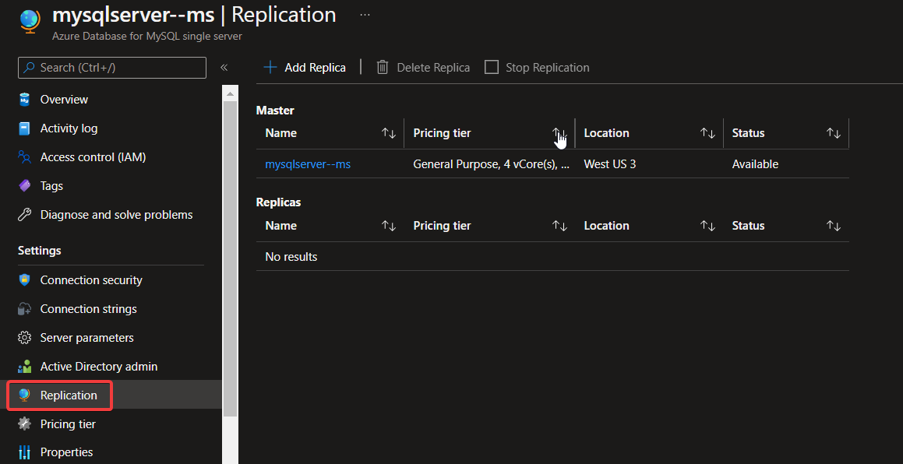
    
   Notice that no replica has been set.

1. Add a replica
    
   Click on **Add Replica**.
    
   Configure the new server using the following instruction:

   - Name your server using the same name of the master server and add -r1 at the end.
    
     NOTE: This is just a suggestion for the lab. You can name your server in any way you want as long as it not used by you or any other Azure customer.

   - The default location is the same as the master server. You can select any other region. For this lab, use the same region as the master server

     Cross-region replication can be helpful for scenarios like disaster recovery planning or bringing data closer to your users. A source server can have a replica in its paired region or the universal replica regions. For further information refer to [Cross-region replication](https://docs.microsoft.com/en-us/azure/mysql/single-server/concepts-read-replicas#cross-region-replication)

   - Notice that you cannot select the tier.
    
     Read replicas are created with the same server configuration as the master. The replica server configuration can be changed after it has been created. 
     
     >It is recommended that the replica server's configuration should be kept at equal or greater values than the master to ensure the replica is able to keep up with the master.
    
   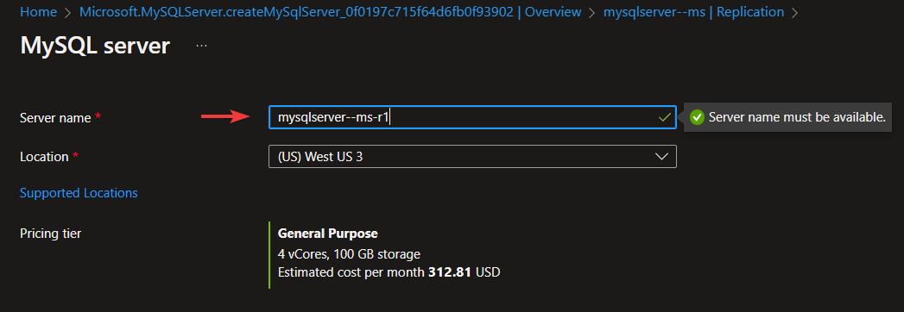
    
   Click **OK** and wait until the server creation finishes. It can take up to 15 minutes, this is good time to take a break.
   
   When you create a replica for a master that has no existing replicas, the master will first restart to prepare itself for replication. Please take this into consideration and perform these operations during an off-peak period:

   - Server that has General purpose storage v1, the log_bin parameter will be OFF by default. The value will be turned ON when you create the first read replica.If a source server has no existing read replicas, source server will first restart to prepare itself for replication. Please consider server restart and perform this operation during off-peak hours.

   - Source server that has General purpose storage v2, the log_bin parameter will be ON by default and does not require a restart when you add a read replica.

   For information about the General purpose storage versions refer to [General purpose storage](https://docs.microsoft.com/en-us/azure/mysql/single-server/concepts-pricing-tiers#general-purpose-storage)

1. Review the replication configuration
    
   In the replication panel you will see that the replica is now listed.
    
   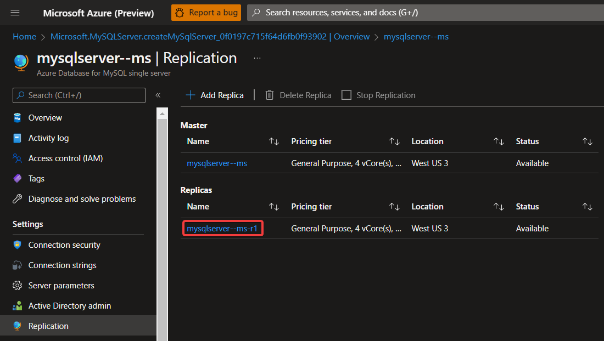
    
   You have configured a read replica for your Azure Database for MySQL Single Server.

   Congratulations!!! You have successfully completed this exercise.

---

# Exercise 3: Read from a replica

This exercise shows a data notification being replicated a how to read from a replica server.

**Tasks**

1. Query the master replica
    
   Register your Azure Database for MySQL master server on MySQL Workbench and connect to it.
    
   
    
   Create a New SQL Tab by pressing **Ctrl+T**, and execute:
    
   ```sql
   SELECT * FROM employees.departments;
   ```

   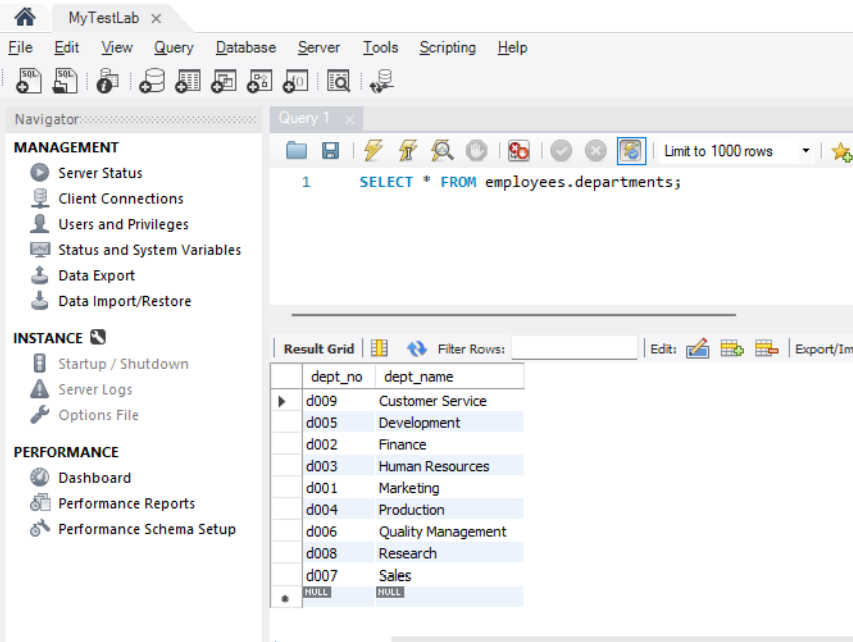
    
   9 rows must be returned.

1. Query the read replica
    
   Register your Azure Database for MySQL replica on MySQL Workbench and connect to it.
    
   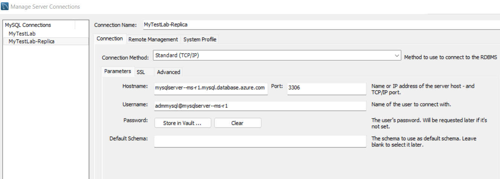
      
   >When you create a read replica server, the firewall rule configuration is replicated, however, any change made on the master server regarding firewall rules after the replication is in place is not replicated. 
   
   If you get a message like:
   
   Client with IP address **45.23.185.251** is not allowed to connect to this MySQL server.
   
   You must allow access from your machine to the Azure Database for MySQL Single Server by adding a rule for the client machine IP address. Go to **Connection security** under **Settings**, add the rule and click **Save**.

   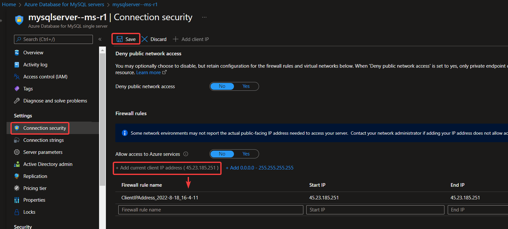
    
   Once you connect to the server and create a New SQL Tab for executing queries by pressing **Control+T**, and execute:
    
   ```sql
   SELECT * FROM employees.departments;
   ```
    
   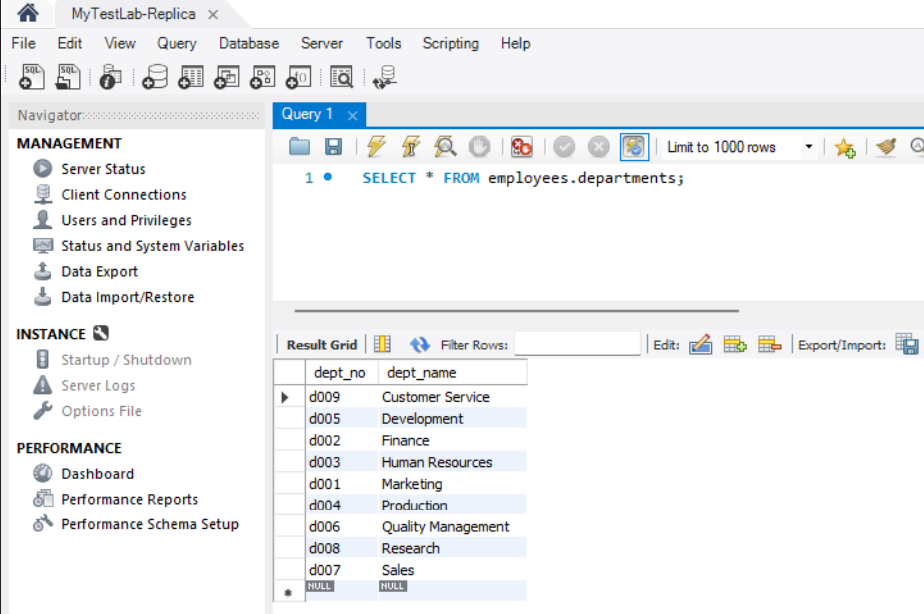
    
   9 rows must be returned. You see the same data than in the master server.

1. Insert a new record on the master server
    
   Connect to your master server and create a New SQL Tab for executing queries by pressing Ctrl+T, and execute:
    
   ```sql
   INSERT INTO employees.departments VALUES ('d025 ', 'IT ');
   ```

   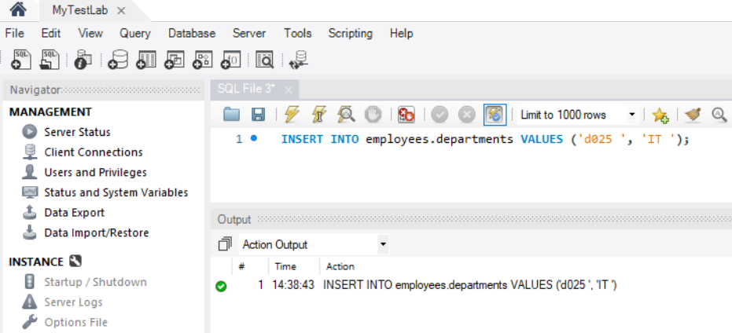

1. Verify the replication is working
    
   Go back to the tab where you queried the employees.departments table on the read replica server and execute again:
    
   ```sql
   SELECT * FROM employees.departments;
   ```
  
   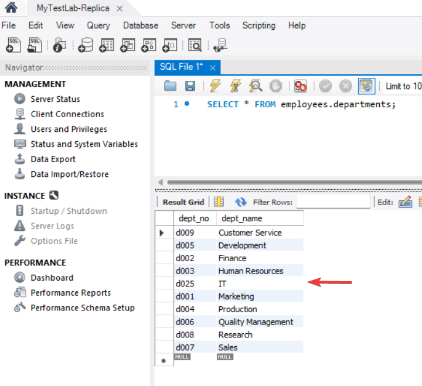
    
   Now the query returns 10 rows, including the row you just inserted on the master. The row inserted on the master server was already replicated to the replica.

Congratulations!. You have successfully completed this exercise.

---

# Exercise 4: Stop Replication 

This exercise shows how to stop the replication

**Tasks**

1. Connect to Microsoft Azure Portal
    
   Open Microsoft Edge and navigate to the [Azure Portal](http://ms.portal.azure.com) to connect to Microsoft Azure Portal. Login with your subscriptions credential.

1. Go to your master MySQL Server

   Go to your master Azure Database for MySQL Single Server in any way you prefer to look for a resource on Az

1. Stop replication
    
   To stop replication between the primary and replica server:

   - Go to the master or the replica Azure Database for MySQL Single Server

   - Select **Replication** from the menu, under **SETTINGS**

   - Select the replica server you wish to stop replication for. In this case, you only have one replica.
    
   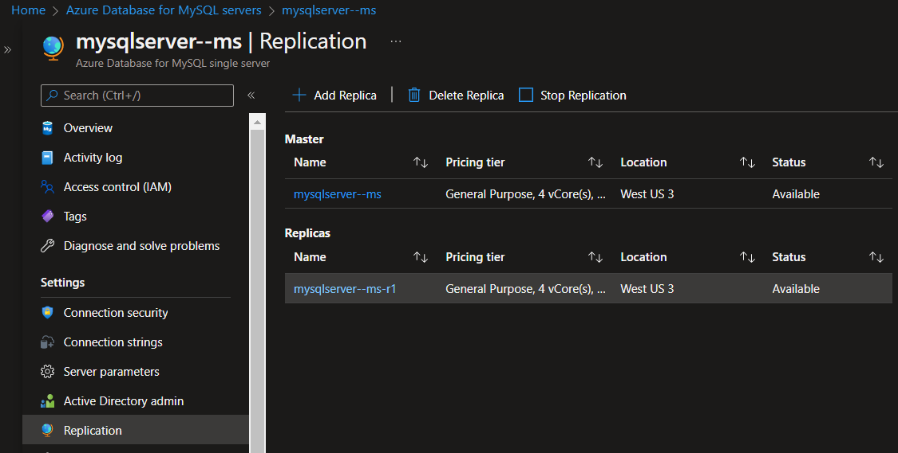

   - Click **Stop Replication** and click on **OK** to confirm the operation.
    
   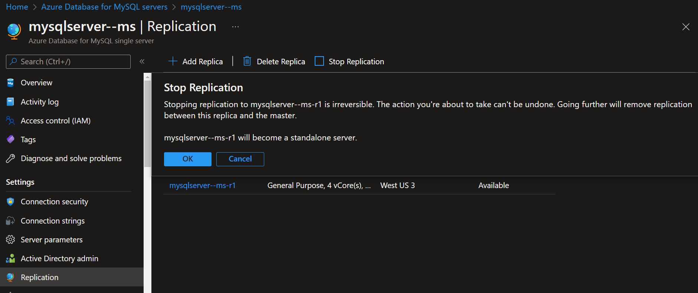
   
   >The stop action causes the replica to restart and to remove its replication settings. Once you stopped the replication, the former replica server became a regular standalone server.

1. Clena up environment.
    
   To save money, delete the server you created as replica during this lab.
    
   On the Overview Pane, select **Delete** and then confirm deletion.

Congratulations!. You have successfully completed this exercise and the Lab.
