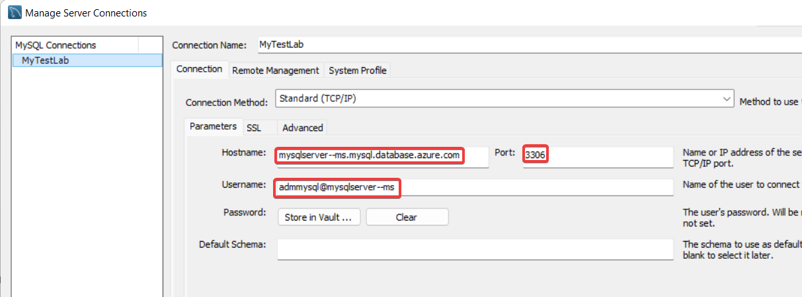

# Create a Read replica for an Azure Database for MySQL Single Server

**Introduction**

During this lab, you will learn how to create a Read replica for an Azure Database for MySQL Single Server using the Azure Portal

**Objectives**

After completing this lab, you will be able to: 

- Set a read replica for an Azure Database for MySQL Single Server
- Read from an Azure Database for MySQL read replica

**Considerations**

This lab considers that an Azure Database for MySQL Single Server named mysqlserver[your name initials] exists with a server admin login named *admmysql*, if not, create it or use another existing server before continuing with the lab.

**Estimated Time:** 50 minutes

---

# Exercise 1: Create a sample schema on the Azure Database for MySQL Single Server

This exercise shows how to create a sample schema on the Azure Database for MySQL Single Server

**Tasks**

1. ## Exercise 1: Create a sample database on the Azure Database for MySQL Single Server

**Tasks**


1. Create the *employees* database on the Azure Database for MySQL Single Server
   
   Downlad and extract the content of [employees demo database](https://github.com/danvalero/AzureOSSDBLabs/raw/main/Azure%20Database%20for%20MySQL%20Single%20Server/MySQLSSLabFiles/create_employees.zip) in **C:\\\MySQLSSLabFiles** folder

   Open a Windows Prompt and execute a script to restore the *employees* database using:
    
   ```bash
   mysql -h <server_name>.mysql.database.azure.com -u <admin_user>@<server_name> -p sys < C:\\MySQLSSLabFiles\\create_employees.sql
   ```
   for example:    
    
   ```bash
   mysql -h mysqlserver--ms.mysql.database.azure.com -u admmysql@mysqlserver--ms -p sys < C:\\MySQLSSLabFiles\\create_employees.sql
   ```

   >You need to enter password when prompted. 
   
   >This is destructive action. If there is a database named employees in the Azure Database for MySQL Single Server, the existing *employees* database will be dropped and replaced.
   
   If the operation does not seem to complete after 5 minutes, press enter again

Congratulations!. You have successfully completed this exercise.


    
  
  
   If you get a message like:
   
   Client with IP address **45.23.185.251** is not allowed to connect to this MySQL server.
   
   You must allow access from the Virtual Machine to the Azure Database for MySQL by adding a rule for the client machine IP address. Go to Connection security in Settings, add the rule and click Save.
   
   

Congratulations!. You have successfully completed this exercise. 

---

# Exercise 2: Add a replica

This exercise shows how to add a read replica for an Azure Database for MySQL Single Server.

**Tasks**

1. Connect to Microsoft Azure Portal
    
   Open Microsoft Edge and navigate to the [Azure Portal](http://ms.portal.azure.com) to connect to Microsoft Azure Portal. Login with your subscriptions credential.

1. Go to your MySQL Server

   Go to your Azure Database for MySQL Single Server in any way you prefer to look for a resource on Azure

1. Go to Replication
    
   Select **Replication** from the menu, under **SETTINGS**
    
   
    
   Notice that no replica has been set.

1. Add a replica
    
   Click on **Add Replica**.
    
   Configure the new server using the following instruction:

   - Name your server using the same name of the master server and add -r1 at the end.
    
     NOTE: This is just a suggestion for the lab. You can name your server in any way you want as long as it not used by you or any other Azure customer.

   - The default location is the same as the master server. You can select any other region. For this lab, use the same region as the master server

   - Notice that you cannot select the tier.
    
     Read replicas are created with the same server configuration as the master. The replica server configuration can be changed after it has been created. It is recommended that the replica server's configuration should be kept at equal or greater values than the master to ensure the replica is able to keep up with the master.
    
     
    
   Click **OK** and wait until the server creation finishes. It can take up to 30 minutes, this is good time to take a break, or even better, use this time to ask questions to the instructor.
    
   When you create a replica for a master that has no existing replicas, the master will first restart to prepare itself for replication. Please take this into consideration and perform these operations during an off-peak period.

1. Review the replication configuration
    
   In the replication panel you will see that the replica is now listed.
    
   
    
   You have configured a read replica for your Azure Database MySQL Server.


Congratulations!!! You have successfully completed this exercise.

---

# Exercise 3: Read from a replica

This exercise shows a data notification being replicated a how to read from a replica server.

**Tasks**

1. Query the master replica
    
   Register your Azure Database for MySQL on MySQL Workbench and connect to it.
    
   
    
   Create a New SQL Tab by pressing **Ctrl+T**, and execute:
    
   ```sql
   SELECT * FROM employees.departments;
   ```

   
    
   9 rows must be returned.

1. Query the read replica
    
   Register your Azure Database for MySQL replica on MySQL Workbench and connect to it.
    
   
    
   You will not be able to connect as your IP is not authorized on the replica server and prompt the following error below:

   
    
   When you create a replica, it doesn't inherit the firewall rules or VNet service endpoint of the master server. These rules must be set up independently for the replica.
    
   You must allow access from the Virtual Machine to the Azure Database for MySQL by adding a rule for the client machine IP address. Go to Connection security in Settings, add the rule and click Save.
    
   
    
   Once the firewall rules are set, connect to the server and create a New SQL Tab for executing queries by pressing **Control+T**, and execute:
    
   ```sql
   SELECT * FROM employees.departments;
   ```
    
   
    
   9 rows must be returned. You see the same data than in the master server.

1. Insert a new record on the master server
    
   Connect to your master server and create a New SQL Tab for executing queries by pressing Ctrl+T, and execute:
    
   ```sql
   INSERT INTO employees.departments VALUES ('d025 ', 'IT ');
   ```

   

1. Verify the replication is working
    
    Go back to the tab where you queried the employees.departments table on the read replica server and execute again:
    
   ```sql
   SELECT * FROM employees.departments;
   ```
  
   
    
   Now the query returns 4 rows, including the row you just inserted on the master. The row inserted on the master server was already replicated to the replica.

Congratulations!. You have successfully completed this exercise.

---

# Exercise 4: Stop Replication 

This exercise shows how to stop the replication

**Tasks**

1. Connect to Microsoft Azure Portal
    
   Open Microsoft Edge and navigate to the [Azure Portal](http://ms.portal.azure.com) to connect to Microsoft Azure Portal. Login with your subscriptions credential.

1. Go to your master PostgreSQL Server

   Go to your master Azure Database for PostgreSQL Single Server in any way you prefer to look for a resource on Az

1. Stop replication
    
   To stop replication between the primary and replica server:

   - Go to the master Azure Database for MySQL Single Server

   - Select **Replication** from the menu, under **SETTINGS**

   - Select the replica server you wish to stop replication for. In this case, you only have one replica.
    
   

   - Click **Stop Replication** and click on **OK** to confirm the operation.
    
    
   
   >The stop action causes the replica to restart and to remove its replication settings. Once you stopped the replication, the former replica server became a regular standalone server.

Congratulations!. You have successfully completed this exercise and the Lab.
