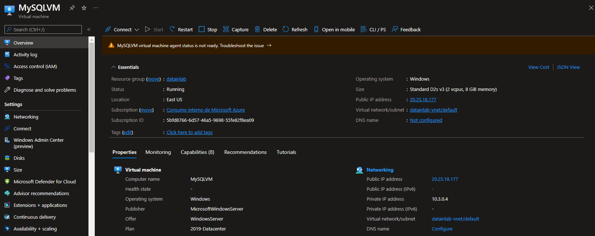
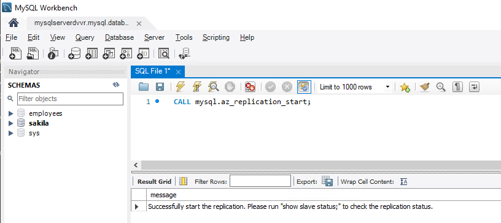
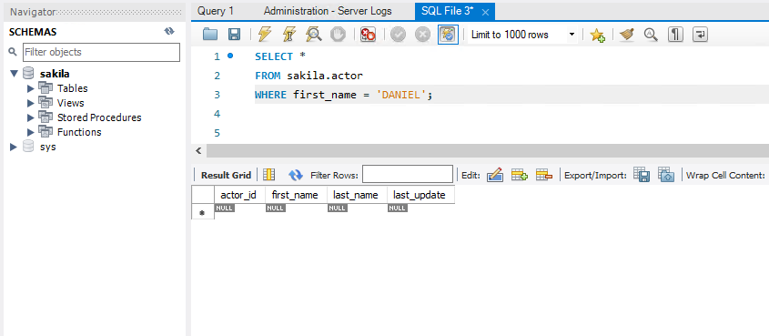

# Set Data-In replication for MySQL from on premise into Azure Database for MySQL

**Introduction**

During this lab, you will learn how to set up Data-in Replication in the Azure Database for MySQL Single Server v8.0 service by configuring the primary and replica servers.

Data-in Replication allows you to synchronize data from a primary MySQL server running on-premises, in a VM, or database services hosted by other cloud providers into a replica in the Azure Database for MySQL service.

**Objectives**

After completing this lab, you will be able to: 

- Prepare a MySQL server running in an Azure VM (the primary server) and the Azure Database for MySQL Server Single Server (the replica server) for data-in replication
- Link the primary and replica servers and start data-in replication
- Stop data-in replication and remove replication relationships

**Prerequisites**

This lab considers that an Azure Database for MySQL Single Server named mysqlserver[your name initials] exists with a server admin login named *admmysql*, if not, create it or use another existing server before continuing with the lab.

**Estimated Time:** 90 minutes

**Exercise list**
- [Set Data-In replication for MySQL from on premise into Azure Database for MySQL](#set-data-in-replication-for-mysql-from-on-premise-into-azure-database-for-mysql)
  - [Exercise 1: Create a source server](#exercise-1-create-a-source-server)
  - [Exercise 2: Configure the primary server](#exercise-2-configure-the-primary-server)
  - [Exercise 3: Dump primary server and Restore in Azure Database for MySQL server](#exercise-3-dump-primary-server-and-restore-in-azure-database-for-mysql-server)
  - [Exercise 4: Link primary and replica server to start Data-In Replication](#exercise-4-link-primary-and-replica-server-to-start-data-in-replication)
  - [Exercise 5: Stop Replication](#exercise-5-stop-replication)
  - [Exercise 6: Remove replication relationship](#exercise-6-remove-replication-relationship)

---

## Exercise 1: Create a source server

In this exercise, MySQL will be installed in an Azure VM to be used as primary server in the DataIn replication configuration. 

**Tasks**

1. Connect to Microsoft Azure Portal
    
   Open Microsoft Edge and navigate to the [Azure Portal](http://ms.portal.azure.com) to connect to Microsoft Azure Portal. Login with your subscriptions credential.
      
1. Create an Windows Server VM
    
   Click on **+ Create a resource** and then in **Virtual Machine**
    
   
   
   Configure the VM using the following information in the **Basics** section:
   - **Resource Group**: Create a new resource group named *datainlab* 
   - **Name**: MySQLVM
   - **Region**: The same region as the Azure Database for MySQL Single Server
   - **Availability option**: No infrastucture redundancy required
   - **Security type**: Standard
   - **Image**: Windows Server 2019 Datacenter
   - **Size**: Any tier with at least 2vCores and 8GB memory is ok
   - **Username**: vmadmin
   - **Password**: Set a strong password
   - **Public inbound ports**: Allow selected ports
   - **Select inbound ports**: RDP(3389)
   - Use default for all other configurations
 
   

   Click on **Review + Create**
    
   Click on **Create**
    
   Wait until the VM is created

1. Go to your new Virtual Machine

   Go to the Virtual Machine *MySQLVM* in any way you prefer to look for a resource on Azure

1. Identify private and public IP addresses for the VM

   Take note of the public IP addresses of the VM as we will be using them at later sections.

   

1. Connect to the *MySQLVM* virtual machine

   Open Remote Desktop Application and connect to the *MySQLVM* virtual machine using the Public IP Address of the VM and the *vmadmin* user

   

1. Disable IE Enhanced Security Configuration

   >This is done just for lab purposes

   Go to **Server Manager**, then to **Local Server** and click on **IE Enhanced Security Configuration: ON**

   

   Select *Off* for the Administrator.

   

1. Install MySQL

   >This installation is a simple configuration for lab purposes so not all the security best practices are followed in interest of time and because it is out of the scope of this lab.

   In the MySQL VM, open Internet Explorer and disable software with invalid signature to run in Internet Explorer
   - Open Internet Explorer browser from Desktop.
   - From the menu bar select Tools Select Internet Options.
   - In the Internet Options window, select Advanced tab.
   - Scroll down and un-check the Allow software to run or install even if the signature is invalid
   - Click OK to save the settings. Then close the Internet Options window.

   Restart Internet Explorer and go to https://dev.mysql.com/downloads/windows/installer/8.0.html
   
   

   Select the mysql-installer-community msi option.

   

   

   Start the installer, 

   Select **Custom** in the **Choose a Setup Type** screen

   Select:
   - MySQL Server
   - MySQL Workbench

   and click **Next**

   

   Complete the installation steps (use default values if not instructed otherwise in this manual). During server configuration set a strong password for the *root* user and create a new user *admin* with the *DB Admin* role

   

   Add the MySQL bin folder to Windows PATH using Powershell as an Administrator

   ```bash
   [Environment]::SetEnvironmentVariable("PATH", $Env:PATH + ";C:\Program Files\MySQL\MySQL Server 8.0\bin", [EnvironmentVariableTarget]::Machine)
   ```

   
      
1. Create the *sakila* sample database

   Using Internet Explorer, download https://downloads.mysql.com/docs/sakila-db.zip and extract the content in *C:\\temp* 

   Open a Windows Command Prompt and connect to the local instance

   ```
   mysql -u admin -p
   ```

   Execute the sakila-schema.sql script to create the database structure, and execute the sakila-data.sql script to populate the database structure, by using the following commands:

   >Type the commands, do not copy/paste
      
   ```text
   SOURCE C:\temp\sakila-db\sakila-schema.sql
   SOURCE C:\temp\sakila-db\sakila-data.sql
   ```

   Exit MySQL

   ```
   \q
   ```

1. Open port 3306 in the VM

   >The default port for MySQL is 3306

   In Azure Portal, go to the MySQL VM 

   Go to **Networking** under **Settings**.
   
   

   For all the security groups associated, click **Add inbound port rule**

   Configure the rule using the following information:
   - **Service**: MySQL
   - **Name**: MySQL
   - Use default values for all other settings
 
   
    
   Click **Add**
 
   Wait until the rule is created. The final configuration should look like:

   
  
Congratulations!. You have successfully completed this exercise.

---

## Exercise 2: Configure the primary server

This exercise shows how to enable binary logging on the primary server and enable other parameters required for Data-In replication

**Tasks**

1. Connect to the MySQL running on the VM

   Using MySQL Workbench or any other MySQL client took and connect to the MySQL running on the VM using the *admin* mysql user.

   >You can connect remotely or you can connect to the VM using RDP and use the mysql tool from there

   > In this lab, MySQL Workbench will be used
    
1. Turn on binary logging
    
   >In earlier MySQL versions, binary logging was disabled by default, and was enabled if you specified the --log-bin option. From MySQL 8.0, binary logging is enabled by default, with the log_bin system variable set to ON

   For further information about log_bin system variable refer to [log_bin](https://dev.mysql.com/doc/refman/8.0/en/replication-options-binary-log.html#sysvar_log_bin)

   Check to see if binary logging has been enabled on the primary by running the following command:
    
   ```sql
   SHOW VARIABLES LIKE 'log_bin';
   ``` 

   If the variable [log_bin](https://dev.mysql.com/doc/refman/8.0/en/replication-options-binary-log.html#sysvar_log_bin) is returned with the value **ON**, binary logging is enabled on your server.
    
   

1. Check lower_case_table_names parameter
    
   Data-in Replication requires parameter **lower_case_table_names** to be consistent between the primary and replica servers. This parameter is 1 by default in Azure Database for MySQL.

   Consider that: 
   - lower_case_table_names parameter can be changed in Azure database for MySQL single servers versions 5.6 and 5.7.
   - lower_case_table_names cannot be changed in Azure database for MySQL Single servers version 8, due to a limitation of MySQL (Not Azure) that prohibits to start the server with a lower_case_table_names setting that is different from the setting used when the server was initialized.

   MySQL public docs [lower_case_table_names](https://dev.mysql.com/doc/refman/8.0/en/server-system-variables.html#sysvar_lower_case_table_names ) says:

   >It is prohibited to start the server with a lower_case_table_names setting that is different from the setting used when the server was initialized. The restriction is necessary because collations used by various data dictionary table fields are determined by the setting defined when the server is initialized, and restarting the server with a different setting would introduce inconsistencies with respect to how identifiers are ordered and compared.

   **IMPORANT:** If the source server is MySQL 8 runing on Linux using the default **lower_case_table_names** value (0), it is not possible to set up DataIn Replication
 
   To check the current configuration execute:

    ```sql
    SHOW VARIABLES LIKE 'lower_case_table_names';
    ```

    
    
    >This is a MySQL Server running on Windows, the default value for **lower_case_table_names** is 1. If the source server is a Linux server, consider that on Linux and other Unix-like systems, the default is 0. In MySQL 8.0, you can change the default value during server initialization.

1. Create a new replication role and set up
    
    Create a user account on the primary server that is configured with replication privileges. This can be done through SQL commands or a tool like MySQL Workbench. Consider whether you plan on replicating with SSL as this will need to be specified when creating the user. For this lab, SSL will not be used, but you can refer to the MySQL documentation to understand how to [create users](https://dev.mysql.com/doc/refman/8.0/en/create-user.html) on your primary server.

    To create the user for replication, execute the commands below:
    
    >The new replication user is able to access the primary from any machine, not just the machine that hosts the primary itself. This is done by specifying "syncuser@'%'" in the create user command. See the MySQL documentation to learn more about [specifying account names](https://dev.mysql.com/doc/refman/5.7/en/account-names.html).
    
    ```sql
    CREATE USER 'syncuser'@'%' IDENTIFIED BY 'SuperStrongPassw0rd1!.';
    GRANT REPLICATION SLAVE ON *.* TO 'syncuser'@'%';
    ```
    
    

Congratulations!. You have successfully completed this exercise.

---

## Exercise 3: Dump primary server and Restore in Azure Database for MySQL server

This exercise shows how to dump primary server and restore in Azure Database for MySQL server

**Tasks**

1. Connect to Microsoft Azure Portal
    
   Open Microsoft Edge and navigate to the [Azure Portal](http://ms.portal.azure.com) to connect to Microsoft Azure Portal. Login with your subscriptions credential.
      
1. Connect to the *MySQLVM* virtual machine

   Open Remote Desktop Application and connect to the *MySQLVM* virtual machine using the Public IP Address of the VM and the *vmadmin* user

1. Set the primary server to read-only mode
    
   Before starting to dump out the database, the server needs to be placed in read-only mode. While in read-only mode, the primary will be unable to process any write transactions. Evaluate the impact to your business and schedule the read-only window in an off-peak time if necessary.
   
   Using MySQL Workbench or any other MySQL client took and connect to the MySQL running on the VM using the *admin* mysql user, execute:

   ```sql
   FLUSH TABLES WITH READ LOCK;
   SET GLOBAL read_only = ON;
   ```

    

1. Get binary log file name and offset
    
   To determine the current binary log file name and offset, execute: 
   
   ```sql
   show master status
   ```

   )

   Write down the binary file name as it will be used in later step. 
   
1. Backup the primary server
    
   On the MySQLVM, open a Windows Prompt and dump the sakila database (or schema in MySQL terms):
   
   ```sql
   mysqldump -u admin -B sakila --add-drop-database -p > c:\temp\sakila_backup.sql
   ```
  
   

1. Set databases on the primary server to read/write mode
    
   Change the primary MySQL server back to read/write mode.

   Using MySQL Workbench or any other MySQL client took and connect to the MySQL running on the VM using the *admin* mysql user, execute:
    
   ```sql
   SET GLOBAL read_only = OFF;
   UNLOCK TABLES;
   ```

   

1. Make necessary changes to the **c:\temp\sakila_backup.sql** file

   DEFINER is not supported in Azure Database for MySQL Single Server as domuented at [Unsupported](https://docs.microsoft.com/en-us/azure/mysql/single-server/concepts-limits#unsupported-1)

   Using Notepad, open the **c:\temp\sakila_backup.sql** replace
    
   ```
   DEFINER=`admin`@`%`
   ```

   with 
   
   ```
   DEFINER=CURRENT_USER
   ```

   

 1. Enable **log_bin_trust_function_creators** on your Azure Database for MySQL Single Server

    **log_bin_trust_function_creators** variable applies when binary logging is enabled. It controls whether stored function creators can be trusted not to create stored functions that causes unsafe events to be written to the binary log. 
    - If set to 0 (the default), users are not permitted to create or alter stored functions unless they have the SUPER privilege in addition to the CREATE ROUTINE or ALTER ROUTINE privilege. A setting of 0 also enforces the restriction that a function must be declared with the DETERMINISTIC characteristic, or with the READS SQL DATA or NO SQL characteristic. 
    - If the variable is set to 1, MySQL does not enforce these restrictions on stored function creation. This variable also applies to trigger creation. See Section 23.7, “Stored Program Binary Logging”.

    You can refer to [log_bin_trust_function_creators](https://dev.mysql.com/doc/refman/8.0/en/replication-options-binary-log.html#sysvar_log_bin_trust_function_creators) for further information.

    In the Azure Portal, go to your Azure Database for MySQL Single Server in any way you prefer to look for a resource on Azure

    Set the **log_bin_trust_function_creators** parameter to **ON** and Save.

    

1. Restore the dump file to an Azure Database for MySQL

   Open a Windows Prompt and restore the *sakila* database (or schema in MySQL terms) using the following syntax:
    
   ```bash
   mysql -h mysqldemo<your name initials>.mysql.database.azure.com -u <adminuser>@<your name initials> -p < c:\temp\sakila_backup.sql
   ```
   
   for example:
    
   ```bash
   mysql -h mysqlserverdvvr.mysql.database.azure.com -u admmysql@mysqlserverdvvr -p < c:\temp\sakila_backup.sql
   ```
   
   
    
   If you get error:
   >ERROR 9000 (HY000): Client with IP address '20.25.18.177' is not allowed to connect to this MySQL server.

   Add a firewall rule in the Azure Database for MySQL Single Server for the Public IP Address of the MySQL VM

   

Congratulations!. You have successfully completed this exercise.

---

## Exercise 4: Link primary and replica server to start Data-In Replication 

This exercise shows how to link the primary and replica server to start Data-In Replication

**Tasks**

1. Set primary server
    
    All Data-in Replication functions are done by stored procedures. You can find all procedures at [Data-in Replication Stored Procedures](https://docs.microsoft.com/en-us/azure/mysql/reference-data-in-stored-procedures). The stored procedures can be run in the MySQL shell or MySQL Workbench.
    
    To link two servers and start replication, login to the target replica server in the Azure DB for MySQL service and set the external instance as the primary server. This is done by using the **mysql.az_replication_change_primary** stored procedure on the Azure DB for MySQL server.
    
    ```
    CALL mysql.az_replication_change_primary('<master_host>', '<master_user>', '<master_password>', 3306, '<master_log_file>', <master_log_pos>, '<master_ssl_ca>');
    ```
    
    - **master_host:** hostname/Public IP of the primary server
    - **master_user:** username for the primary server
    - **master_password:** password for the primary server
    - **master_log_file:** binary log file name from running show master status
    - **master_log_pos:** binary log position from running show master status
    - **master_ssl_ca:** CA certificate's context. If not using SSL, pass in empty string.
    
    On the Azure Database for MySQL Server, execute the command to link it with the on-premise MySQL server, for example:
    
    ```sql
    CALL mysql.az_replication_change_master( '20.25.18.177'
                                        ,'syncuser'
                                        ,'SuperStrongPassw0rd1!.'
                                        , 3306
                                        , 'MySQLVM-bin.000002'
                                        , 1389292
                                        , '');
    ```
    
    NOTE: Syncuser is the user you created on step 4 of exercise 2. The **master_log_file** and the **master_log_pos** are the values that you got at step 7 of exercise 1 at the end of exercise 1. 
        
    

1. Start replication
    
    Call the **mysql.az_replication_start** stored procedure to initiate replication.
    
    ```sql
    CALL mysql.az_replication_start;
    ```
    
    

1. Check replication status
    
    Call the show slave status command on the replica server to view the replication status.
    
    ```SQL
    show slave status;
    ```
    
    
    
    If the state of Slave_IO_Running and Slave_SQL_Running are **Yes** and the value of **Seconds_Behind_Master** is **0**, replication is working well. It can take some seconds for both columns to show **Yes**. If you don't see them in **yes**, execute the previous command again.
    
    **Seconds_Behind_Master** indicates how late the replica is. If the value is not **0**, it means that the replica is processing updates.

1. Verify the replication is working
    
    Connect to your Azure Database for MySQL server and confirm that there is no actor named *DANIEL* in the sakila.actors table by executing:

    ```SQL  
    SELECT * 
    FROM sakila.actor
    WHERE first_name = 'DANIEL';
    ```
    
    

    Now, connect to the MySQL server on the VM and insert a new row in the table *sakila.actor* source MySQL database by executing:

    ```SQL    
    INSERT INTO sakila.actor VALUES (500,'DANIEL','VALERO',current_timestamp());
    ```

    
    
    Once again, query the *sakila.actor* table on the Azure Database for MySQL server to see that the row has been replicated. Execute:

    ```SQL    
    SELECT * 
    FROM sakila.actor
    WHERE first_name = 'DANIEL';
    ```
    
    
    
    The row was replicated!!!


Congratulations!. You have successfully completed this exercise.

---

## Exercise 5: Stop Replication 

This exercise shows how to rename old and new databases

---

**Tasks**

1. Stop replication
    
   To stop replication between the primary and replica server, in the replica server execute:
    
   ```SQL 
   CALL mysql.az_replication_stop;
   ``` 
    
   Call the show slave status command on the replica server to view the replication status:
  
   ```SQL 
   show slave status;
   ```  
   
   Notice that the state of **Slave_IO_Running** and **Slave_SQL_Running** is now **no**

Congratulations!. You have successfully completed this exercise.

---

## Exercise 6: Remove replication relationship 

This exercise shows how to rename old and new databases

**Tasks**

1. Remove replication relationship
    
   To remove the relationship between primary and replica server, in the replica server execute:
   
   ```SQL
   CALL mysql.az_replication_remove_master;
   ```

   

Congratulations!. You have successfully completed this exercise and the Lab.