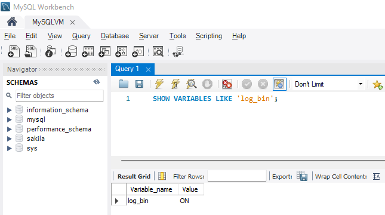
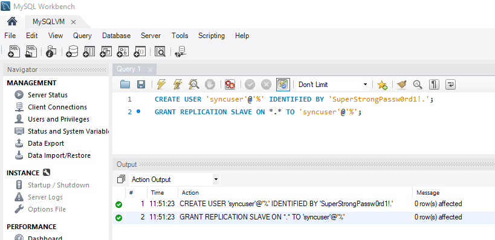
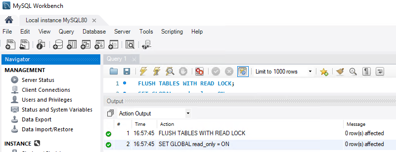
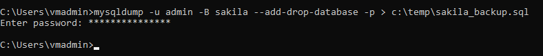
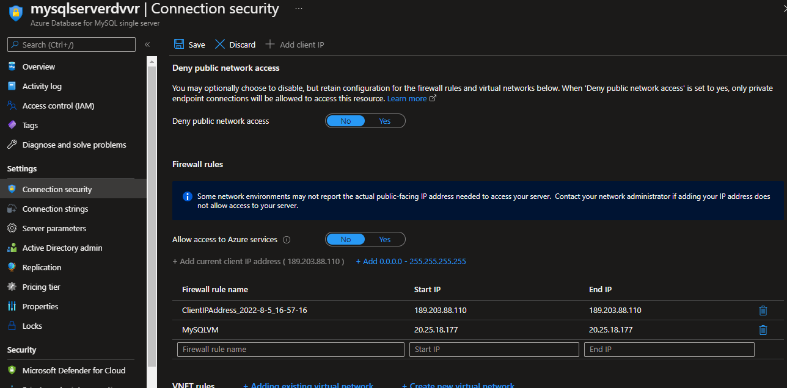

# Set Data-In replication for MySQL from on premise into Azure Database for MySQL

**Introduction**

During this lab, you will learn how to set up Data-in Replication in the Azure Database for MySQL service by configuring the primary and replica servers. Data-in Replication allows you to synchronize data from a primary MySQL server running on-premises, in a VM, or database services hosted by other cloud providers into a replica in the Azure Database for MySQL service.

**Objectives**

After completing this lab, you will be able to: 

- Prepare an on-premise MySQL server (the primary server) and the Azure Database for MySQL Server (the replica server) for data-in replication
- Link the primary and replica servers and start data-in replication
- Stop data-in replication and remove replication relationships

**Estimated Time:** 40 minutes

---

# Exercise 1: Configure the primary server

This exercise shows how to enable binary logging on the primary server and enable other parameters required for Data-In replication

**Tasks**

1. Open MySQL Workbench and connect to the local instance
    
   **Connect** using the root user. The root password is Password1!

1. Turn on binary logging
    
   Check to see if binary logging has been enabled on the primary by running the following command:
    
   ```SQL
   SHOW VARIABLES LIKE 'log_bin';
   ```
    
   If the variable [log_bin](https://dev.mysql.com/doc/refman/8.0/en/replication-options-binary-log.html#sysvar_log_bin) is returned with the value **ON**, binary logging is enabled on your server.
    
   
    
   If **log_bin** is returned with the value **OFF**, modify the configuration file **C:\\ProgramData\\MySQL\\MySQL Server 5.7\\my.ini**. At the end of the file, add **log-bin**
    
   
    
   Save the file and restart MySQL using the Windows Service Manager. The service name is MySQL57
    
   Once again, execute the following command to confirm that binary logging is enabled:
    
   ```
   #Include to allow replication to an Azure Database for MySQL
   
   lower_case_table_names = 1
   ```

   ```SQL
   SHOW VARIABLES LIKE 'log_bin';
   ```
    
   

1. Primary server settings
    
    Data-in Replication requires parameter **lower_case_table_names** to be consistent between the primary and replica servers. This parameter is 1 by default in Azure Database for MySQL.
    
    To set this option modify the configuration file **C:\\ProgramData\\MySQL\\MySQL Server 5.7\\my.ini**. At the end of the file, add:
    
    ```
    #Include to allow replication to an Azure Database for MySQL
    
    lower_case_table_names = 1
    ```

    
    
    Save the file and restart MySQL using the Windows Service Manager. The service name is MySQL57

1. Create a new replication role and set up
    
    Create a user account on the primary server that is configured with replication privileges. This can be done through SQL commands or a tool like MySQL Workbench. Consider whether you plan on replicating with SSL as this will need to be specified when creating the user. For this lab, SSL will not be used, but you can refer to the MySQL documentation to understand how to [add user accounts](https://dev.mysql.com/doc/refman/5.7/en/adding-users.html) on your primary server.
    
    To create the user for replication, execute the commands below. The new replication user is able to access the primary from any machine, not just the machine that hosts the primary itself. This is done by specifying "syncuser@'%'" in the create user command. See the MySQL documentation to learn more about [specifying account names](https://dev.mysql.com/doc/refman/5.7/en/account-names.html).
    
    ```SQL
    CREATE USER 'syncuser'@'%' IDENTIFIED BY 'SuperStrongPassw0rd1!.';
    
    GRANT REPLICATION SLAVE ON *.* TO 'syncuser'@'%';
    ```
    
    

1. Set the primary server to read-only mode
    
    Before starting to dump out the database, the server needs to be placed in read-only mode. While in read-only mode, the primary will be unable to process any write transactions. Evaluate the impact to your business and schedule the read-only window in an off-peak time if necessary.
    
    In a new query, execute:

    ```SQL  
    FLUSH TABLES WITH READ LOCK;
    
    SET GLOBAL read_only = ON;
    ```

    

1. Get binary log file name and offset
    
    Run the **show master status** command to determine the current binary log file name and offset. Write down the binary file name as it will be used in later step. The results should be looks like:
    
    

### Congratulations!

You have successfully completed this exercise. Click **Next** to advance to the next exercise.

===

# Exercise 2: Dump primary server and Restore in Azure Database for MySQL server

This exercise shows how to dump primary server and restore in Azure Database for MySQL server

---

### Tasks

1. Connect to the Virtual Machine
    
    Connect to **Windows Client** virtual machine

1. Backup the primary server
    
    On the VM, open a Windows Prompt and dump the employees database (or schema in MySQL terms):
    
    `mkdir c:\temp`
    
    `mysqldump -u root -p employees > c:\temp\employees_backup.sql`
    
    Enter the root password when requested. The root password is Password1!
    
    

1. Set databases on the primary server to read/write mode
    
    Open MySQL Workbench and connect to the local server
    
    Change the primary MySQL server back to read/write mode.
    
    ```
    SET GLOBAL read_only = OFF;
    
    UNLOCK TABLES;
    ```

    

1. Create the schema on the Azure Database for MySQL server
    
    NOTE: this lab considers that an Azure Database for MySQL server named mysqldemo\<your name initials\> exists, if not, create it or use another existing server before continuing with the lab
    
    Register your Azure Database for MySQL on MySQL Workbeach
    
    
    
    Test the connection. If you get a message like:
    
    Client with IP address **40.124.1.212** is not allowed to connect to this MySQL server.
    
    You must Allow access from your on-premise machine to the Azure Database for MySQL by adding a rule for the client machine IP address. Go to Connection security in Settings, add the rule and click Save
    
    
    
    Connect to you Azure Database for MySQL server and create the employee schema. To make sure that the database employees does not exist, execute the following commands:
    
    ```
    DROP DATABASE IF EXISTS 'employees';
    
    CREATE SCHEMA 'employees' ;
    ```

    

1. Make necessary changes to the **c:\temp\employees_backup.sql** file
    
    Using MySQL Workbench, open the **c:\temp\employees_backup.sql** file and comment lines 386 and 404. Save the File.
    
    >To comment a line, add two hyphen and a space at the begging of the line
    
    The result should look like the following image:
    
    
    
    DEFINER requires super privileges to create and is restricted in Azure Database for MySQL.

1. Restore the dump file to an Azure Database for MySQL
    
    Open a Windows Prompt and restore the employees database (or schema in MySQL terms) using the following syntax:
    
    `mysql -h mysqldemo<your name initials>.mysql.database.azure.com -u <adminuser>@<your name initials> -p employees < c:\temp\employees_backup.sql`
    
    for example:
    
    `mysql -h mysqldemoirts.mysql.database.azure.com -u myadmin@mysqldemoirts -p employees < c:\temp\employees_backup.sql`
    
    
    
    >If the restore does not seem to complete after 5 minutes, press enter again

### Congratulations!

You have successfully completed this exercise. Click **Next** to advance to the next exercise.

===

# Exercise 3: Link primary and replica server to start Data-In Replication 

This exercise shows how to link the primary and replica server to start Data-In Replication

---

### Tasks

1. Set primary server
    
    All Data-in Replication functions are done by stored procedures. You can find all procedures at [Data-in Replication Stored Procedures](https://docs.microsoft.com/en-us/azure/mysql/reference-data-in-stored-procedures). The stored procedures can be run in the MySQL shell or MySQL Workbench.
    
    To link two servers and start replication, login to the target replica server in the Azure DB for MySQL service and set the external instance as the primary server. This is done by using the **mysql.az_replication_change_primary** stored procedure on the Azure DB for MySQL server.
    
    `CALL mysql.az_replication_change_primary('<master_host\>', '<master_user>', '<master_password>', 3306, '<master_log_file>', <master_log_pos>, '<master_ssl_ca>');`
    
    **master_host:** hostname of the primary server
    
    **master_user:** username for the primary server
    
    **master_password:** password for the primary server
    
    **master_log_file:** binary log file name from running show master status
    
    **master_log_pos:** binary log position from running show master status
    
    **master_ssl_ca:** CA certificate's context. If not using SSL, pass in empty string.
    
    To get the IP address of the VM used during this lab, open a command prompt and execute:
    
    `ipconfig`
    
    
    
    On the Azure Database for MySQL Server, execute the command to link it with the on-premise MySQL server, for example:
    
    `CALL mysql.az_replication_change_master('199.101.111.150', 'syncuser', 'SuperStrongPassw0rd1!.', 3306, 'ASDLAB01-bin.000001', 603, '');`
    
    NOTE: Syncuser is the user you created on step 5 of exercise 1. The **master_log_file** and the **master_log_pos** are the values that you got at step 7 of exercise 1 at the end of exercise 1. Make sure you use the IP address for your local MySQL server for the **master_host** parameter.
    
    

1. Start replication
    
    Call the **mysql.az_replication_start** stored procedure to initiate replication.
    
    `CALL mysql.az_replication_start;`
    
    

1. Check replication status
    
    Call the show slave status command on the replica server to view the replication status.
    
    `show slave status;`
    
    
    
    If the state of Slave_IO_Running and Slave_SQL_Running are **Yes** and the value of **Seconds_Behind_Master** is **0**, replication is working well. It can take some seconds for both columns to show **Yes**. If you don't see them in **yes**, execute the command again.
    
    **Seconds_Behind_Master** indicates how late the replica is. If the value is not **0**, it means that the replica is processing updates.

1. Verify the replication is working
    
    Connect to you Azure Database for MySQL server and confirm that there is no department IT in the employees.departments table by executing:

    ```    
    SELECT *
    FROM employees.departments
    WHERE dept_name = 'IT';
    ```
    
    
    
    Now, connect to the MySQL server on the VM and insert a row for the department IT in the on-premise MySQL database by executing:

    ```    
    INSERT INTO 'employees'.'departments' ('dept_no', 'dept_name')
    
    VALUES ('d101', 'IT');
    ```

    
    
    Once again, query the employees.department table on the Azure Database for MySQL server to see that the row has been replicated. Execute:

    ```    
    SELECT *
    
    FROM employees.departments
    
    WHERE dept_name = 'IT';
    ```
    
    
    
    The row was replicated!!!

### Congratulations!

You have successfully completed this exercise. Click **Next** to advance to the next exercise.

===

# Exercise 4: Stop Replication 

This exercise shows how to rename old and new databases

---

### Tasks

1. Stop replication
    
    To stop replication between the primary and replica server, in the replica server execute:
    
    `CALL mysql.az_replication_stop;`
    
    Call the show slave status command on the replica server to view the replication status:
    
    `show slave status;`
    
    Notice that the state of **Slave_IO_Running** and **Slave_SQL_Running** is now **no**

### Congratulations!

You have successfully completed this exercise. Click **Next** to advance to the next exercise.

===

# Exercise 5: Remove replication relationship 

This exercise shows how to rename old and new databases

---

### Tasks

1. Remove replication relationship
    
    To remove the relationship between primary and replica server, in the replica server execute:
    
    `CALL mysql.az_replication_remove_master;`

    

### Congratulations!

You have successfully completed this exercise. Click **Next** to advance to the next lab.
