# Review the different access controls for Azure Database for MySQL Single Server

**Introduction**

During this lab, you will learn how to configure Firewall and Virtual Network rules for Azure Database for MySQL

**objectives**

After completing this lab, you will be able to: 

- Configure Firewall rules
- Understand and implement Virtual Network access

**Considerations**

This lab considers that an Azure Database for MySQL Single Server named mysqlserver[your name initials] exists with a server admin login named *admmysql*, if not, create it or use another existing server before continuing with the lab.

**Estimated Time:** 120 minutes

----

## Exercise 1: Create a firewall rule in the Azure portal

This exercise shows how to create a server-level firewall rule in the Azure portal for Azure Database for MySQL.

**Tasks**

1. Connect to Microsoft Azure Portal
    
   Open Microsoft Edge and navigate to the [Azure Portal](http://ms.portal.azure.com) to connect to Microsoft Azure Portal. Login with your subscriptions credential.

   

1. Configure a server-level firewall rule

   The Azure Database for MySQL service creates a firewall at the server level. It prevents external applications and tools from connecting to the server and any databases on the server, unless a firewall rule is created to open the firewall for specific IP addresses.

   Go to your Azure Database for MySQL Single Server in any way you prefer to look for a resource on Azure
   
   Select **Connection security** under **Settings**

   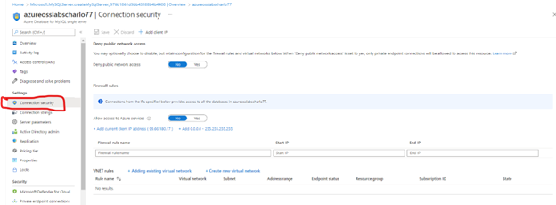
   

   If no rule exists, click **Add client IP** on the toolbar. This automatically creates a firewall rule with the public IP address of your computer, as perceived by the Azure system. Change the name of the rule to “Lab-VM-Public-IP”.

   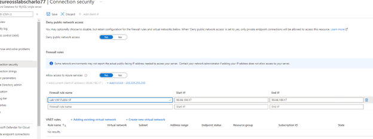

   As you can see the IP address of my computer is 99.66.180.17
   After adding it make sure you click save or else the rule will not be added.
   If enabled, configure the server to not Allow access to Azure services

   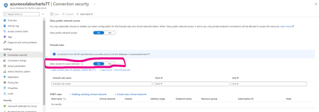

   Add to new rule for a single IP: Rule-1-Single-Address from 73.109.45.192 to 73.109.45.192
   Add to new rule for an IP range: Rule-2-Range-of-IP-Addresses from 73.109.44.0 to 73.109.44.255
   The final configuration must look like:

   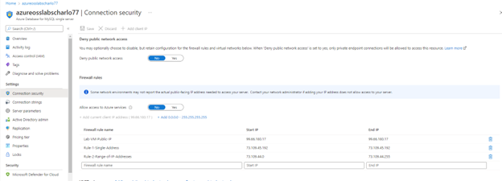

  
   After adding the fule, click SAVE.
  

   To allow applications from Azure to connect to your Azure Database for MySQL Single Server, Azure connections must be enabled. For example, to host an Azure Web Apps application, or an application that runs in an Azure VM, or to connect from an Azure Data Factory data management gateway. The resources do not need to be in the same Virtual Network (VNet) or Resource Group for the firewall rule to enable those connections. When an application from Azure attempts to connect to your database server, the firewall verifies that Azure connections are allowed. There are a couple of methods to enable these types of connections:
   - A firewall setting with starting and ending address equal to 0.0.0.0 indicates these connections are allowed. 
   - You can set the **Allow access to Azure services** option to **Yes** in the portal from the **Connection security** pane and hit **save**. 
   
   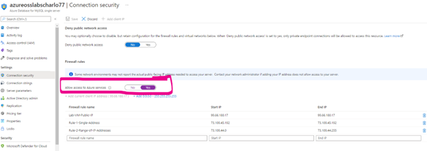
   
   If the connection attempt is not allowed, the request does not reach the Azure Database for MySQL Single Server.

   Setting **Allow access to Azure services** option to **ON** configures the firewall to allow all connections from Azure including connections from the subscriptions of other customers. When selecting this option, make sure your login and user permissions limit access to only authorized users.

   Congratulations!. You have successfully completed this exercise.

---

## Exercise 2: Connect to an Azure Database for MySQL Single Server from a VM in Azure thought the VNET 

This exercise shows how to connect to Azure Database for MySQL Single Server from a VM in a VNET.

**Tasks**

1. Connect to Microsoft Azure Portal
    
   Open Microsoft Edge and navigate to the [Azure Portal](http://ms.portal.azure.com) to connect to Microsoft Azure Portal. Login with your subscriptions credential.

1. Create a VNET for your Azure Virtual Machine

   Click on **+ Create a resource** and look for **virtual network** If you don’t see Virtual network amongst the listed resources, please type it on the search bar above 

   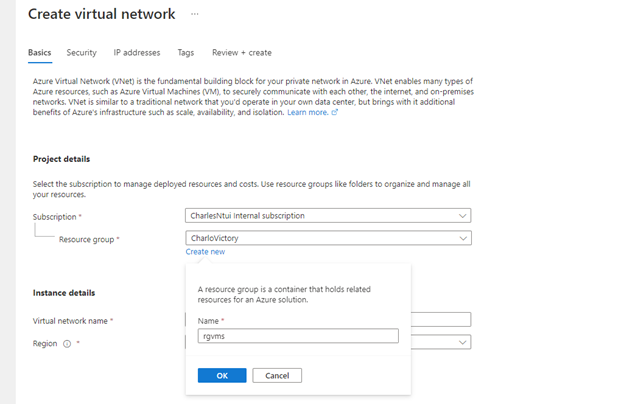

   Select **Virtual Network**

   On the **Virtual Network** screen, make sure the **Resource Manager** deployment model is selected and click on **Create**

   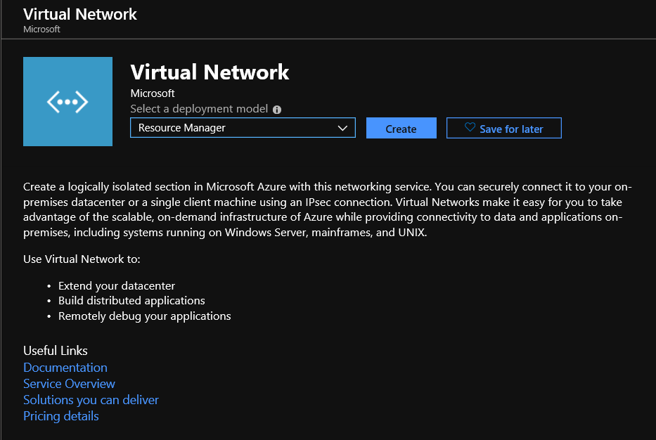

   Configure the VNET using the following information:
    
   In the **Basics** tab
   - **Resource group**: Create a new one named *rgvms**
   - **Name**: VNETDB
   - **Location**: use the same location as your Azure Database for MySQL Single Server

    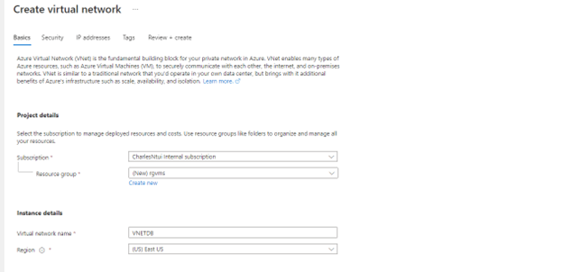

  Click next it will take you to the security tab that has options on how to enhance the security of your virtual network. Click next again and it take take you to the IP addresses tab.

   In the **IP Addresses** tab

    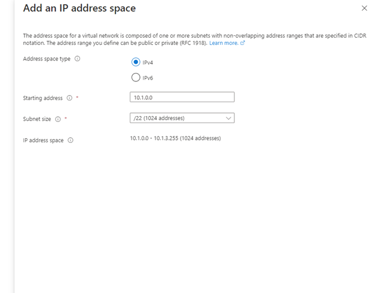

   - **Address Space**: 10.1.0.0/22
   - **Subnet/Name**: Add a subnet named **default**
   - **Subnet/Address range**: 10.1.0.0/24
   - Use default values for all other settings

    
    
   Click **Create** and wait for the deployment to complete

1. Create a JumpBox VM to manage Azure Database for MySQL.

   Click on **+ Create a resource** and look for **windows 10.**

   Select the latest version (it can be different from the one in the image below)

   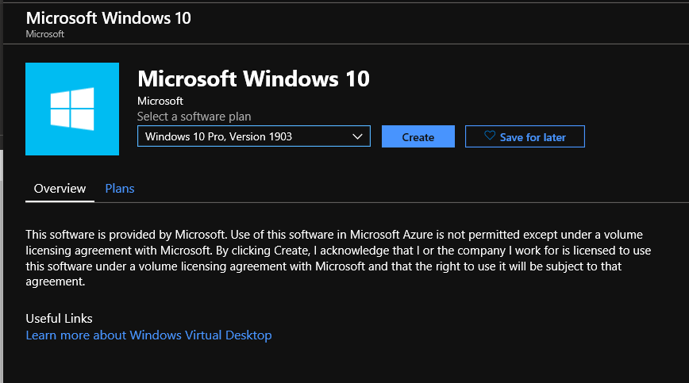

   Click on **Create**

   Configure the VM using the following information on the **Basic** tab:
   - **Resource group:** rgvms (the same used by the VNET created in the previous task)
   - **Name:** VMWin10PG
   - **Region:** use the same region as your Azure Database for MySQL Single Server and the VNET created in the previous task
   - **Size:** Standard D2
   - **Administrator Account**: define it yourself. Take note of the user and the password
   - **Inbound port rules**: allow RDP (3389)
   - Use default values for all other settings

   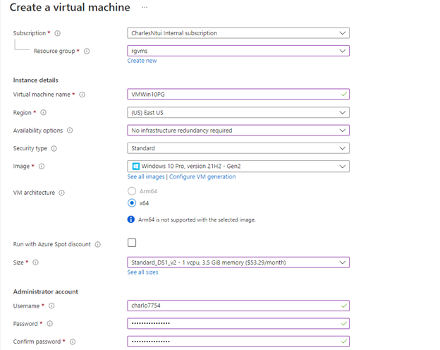
  Make sure you confirm that you have an eligible Windows 10/11 license with multi-tenant hosting rights. Click next it will take you to the Disk tab. Click next to Networking. 
   On the **Networking** tab, make sure the VNET created in the previous task is selected (VNETDB on this manual)

   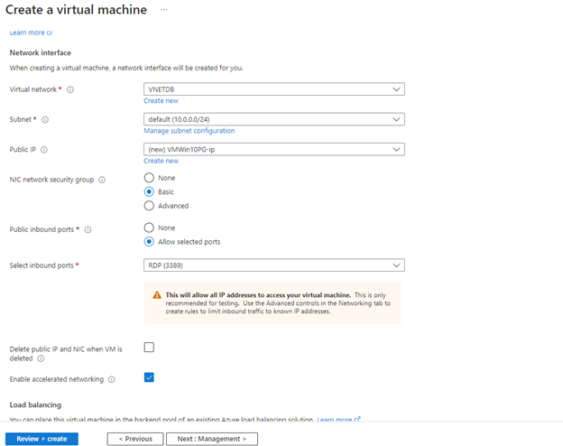

   Click on **Review + create**

   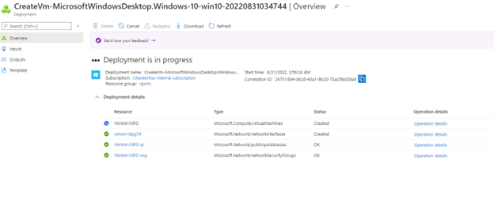

   Click **Create** and wait until the VM is created. It can take up to 10 minutes. This is a good time to take a break.

   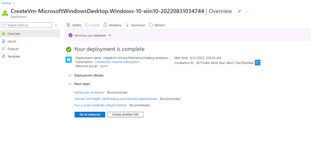

1. Connect to the Azure VM and install MySQL Workbench
    
   Go to the Azure VM you just created. Click on **Connect**.
    
   
    
   Click on **Download RDP File**
    
   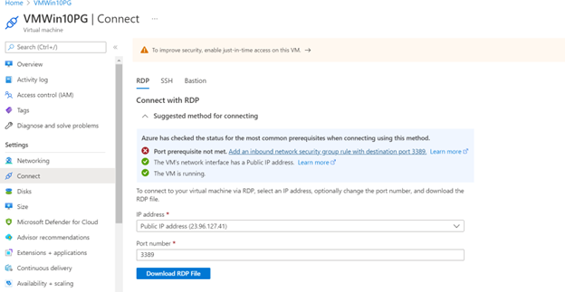
   
   Click on Add an inbound network security group rule with destination port 3389

   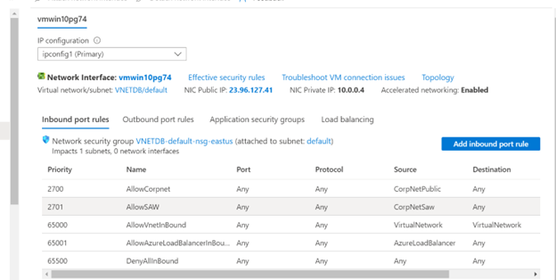
   Click on add Inbound port rule
   Since the port number I am trying to connect to is 3389 I changed the inbound rule to allow Click add

   For service select RDP and destination port will be selected

   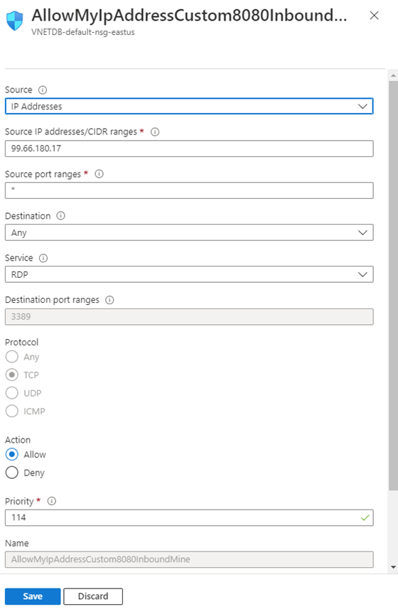

   

    After this go back to the VM and test if you can connect now. 

   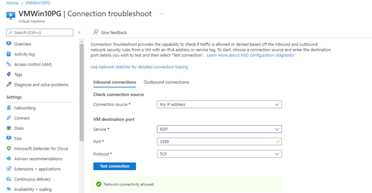

   A Remote Desktop Protocol (.rdp) file is created and downloaded to your computer.
    
   Open the downloaded rdp file. If prompted, select **Connect**. Enter the username and password you specified when creating the VM. You may need to select **More choices**, then **Use a different account**, to specify the credentials you entered when you created the VM.
    
   Select **OK**.
    
   You may receive a certificate warning during the sign-in process. If you receive the warning, select **Yes** or **Continue**, to proceed with the connection.
    
   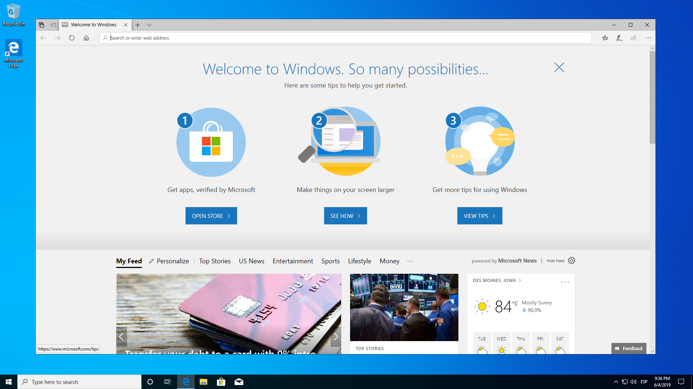
    
 1.  In the VM, open Microsoft Edge and go to https://www.mysql.com/products/workbench/
    
   Download the last version available and install it

2. Connect to the Azure Database for MySQL from the VM in the VNET
    
   In the VM, open MySQL Workbench
    
   Register your Azure Database for MySQL Single Server

   After entering all the credentials, click test connection
    
   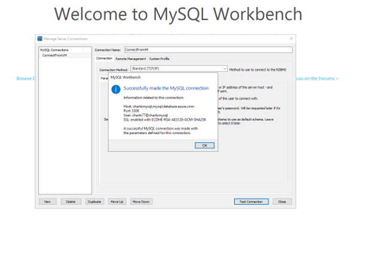

   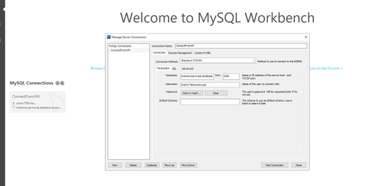

   I am able to connect to My Azure database For MySQL through my VM. 
   Take note: I was able to connect because I have set Allow access to Azure services to YES on my Azure database for MySQL

   

   If this was set to NO, then the connection will fail in which case I will need to add a VNET Rule to my Azure database for MySQL  as below
   Create a VNET rule

   You cannot connect to the Azure Database for MySQL Single Server because:
   - Allow access to Azure services is disabled.
   - There is no firewall rule for the IP used by this VM.
   - There is no VNET rule for the Virtual Network used by this VM.

   You could enable **Allow access to Azure services** but this option configures the firewall to allow all connections from Azure including connections from the subscriptions of other customers. In this lab, we want to limit the access to the server for security reasons.

   You could create a rule for the Public IP of the virtual machine, but you need to make sure it is a statics IP or you will need to update the rule if the VM gets a different IP in the future

   In this lab, you will create a VNET rule to allow connections from the VNET used by the Virtual Machine.

   On the newly created Azure database for MySQL, click on connection security

   	Click Adding existing virtual network

   	Add it as below and give it a name and click ok

   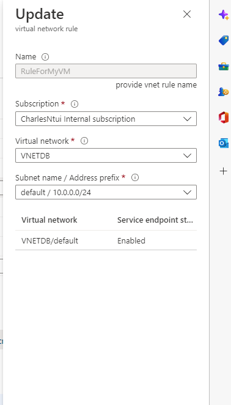

   After that go back to your VM and try connecting again. It will work this time.

   o	Launch the Workbench application on your computer.

   o	In Setup New Connection dialog box, enter the following information on the Parameters tab

   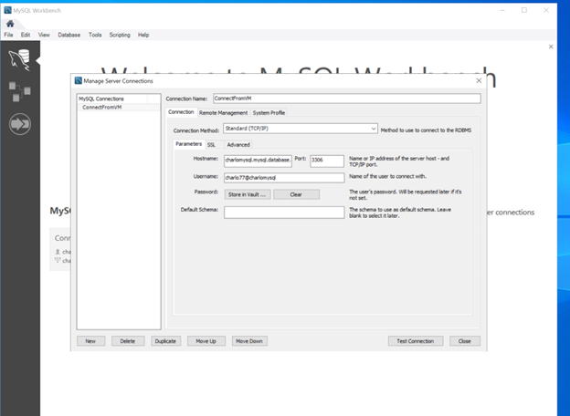
   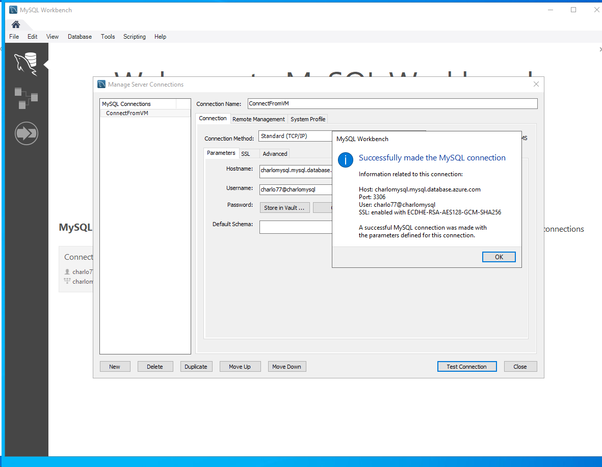

   
   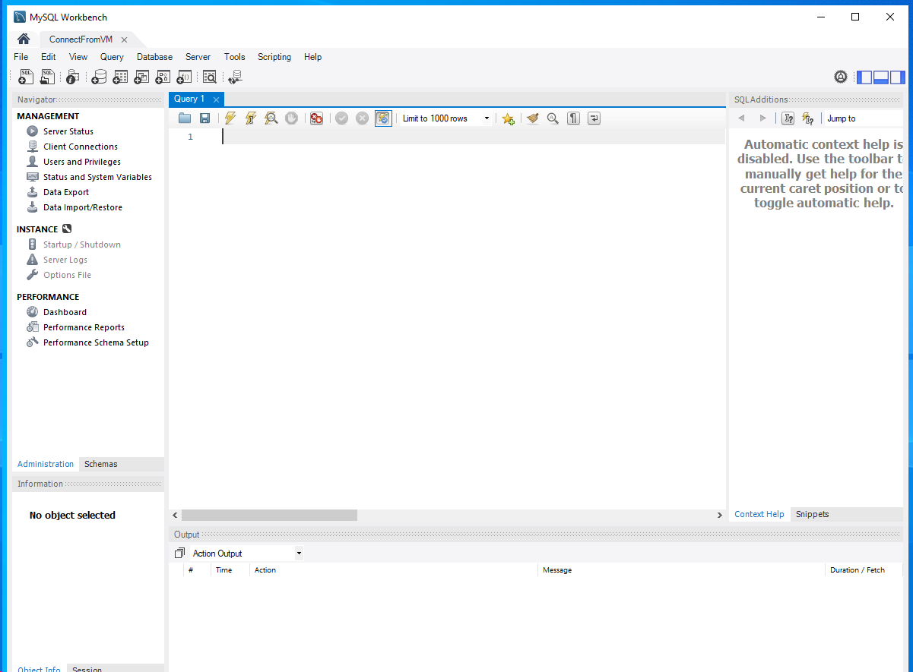
    
   Why does this happen?

1. Create a VNET rule

   You cannot connect to the Azure Database for PostgreSQL Single Server because:
   - Allow access to Azure services is disabled.
   - There is no firewall rule for the IP used by this VM.
   - There is no VNET rule for the Virtual Network used by this VM.

   You could enable **Allow access to Azure services** but this option configures the firewall to allow all connections from Azure including connections from the subscriptions of other customers. In this lab, we want to limit the access to the server for security reasons.

   You could create a rule for the Public IP of the virtual machine, but you need to make sure it is a statics IP or you will need to update the rule if the VM gets a different IP in the future

   In this lab, you will create a VNET rule to allow connections from the VNET used by the Virtual Machine.

   Go to your Azure Database for PostgreSQL Single Server. Select **Connection security** under **Settings**

   Click on **+ Adding existing virtual network** in the **VNET Rules** section

   Set a name for the rule, select your subscription and the VNET you created in task 3.

   

   Before creating the rule, you must enable the service endpoint for Microsoft.Sql on the VNET. To do it, click on **Enable**. Enabling access may take up to 15 minutes to complete.

   Once the **service** endpoint is enabled, click **OK**

   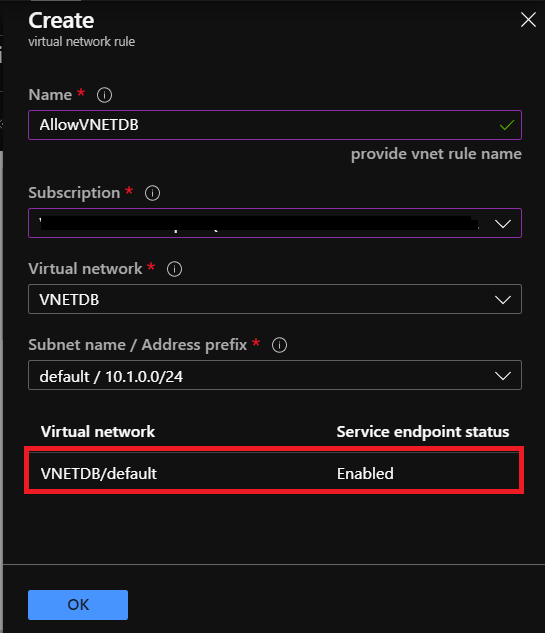

   The rule will be listed for the server

   

   Congratulations!. You have successfully completed this exercise.

---

## Exercise 3: Connect using SSL

1. Connect to the Azure Database for MySQL from the VM in the VNET
    
   To connect to Azure MySQL Server by using the GUI tool MySQL Workbench:
    
   - Launch the MySQL Workbench application on your computer.
    
   - In Setup New Connection dialog box, enter the following information on the Parameters tab

     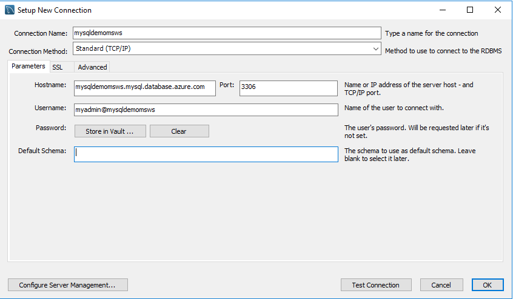

    - Download the certificate needed to communicate over SSL with your Azure Database for MySQL server from <https://www.digicert.com/CACerts/BaltimoreCyberTrustRoot.crt.pem>
    
      >Remember the location where you save the file as you will need it in the next step

    - Configure the MySQL Workbench to connect securely over SSL. From the Setup New Connection dialogue, navigate to the SSL tab. In the SSL CA File: field, enter the file location of the **BaltimoreCyberTrustRoot.crt.pem**.
    
      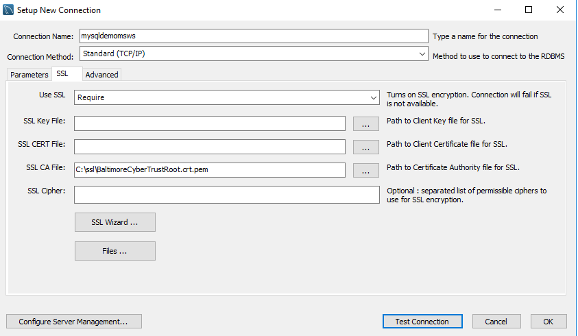

    - Click Test Connection to test if all parameters are correctly configured.
    
      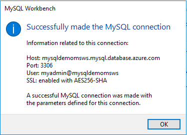

    - Click OK to save the connection.

    - In the listing of MySQL Connections, click the tile corresponding to your server, and then wait for the connection to be established.

    - A new SQL tab opens with a blank editor where you can type your queries.
    
Congratulations!. You have successfully completed this exercise.

---

## Exercise 4: Cleanup the environment

To save money, delete the VM you created in this lab.

To make the process simpler, delete the Resource Group you created to contain the VM and the Virtual Network. Deleting a resource group deletes all the resources contained within it.

**Tasks**

1. Connect to Microsoft Azure Portal
    
   Open Microsoft Edge and navigate to the [Azure Portal](http://ms.portal.azure.com) to connect to Microsoft Azure Portal. Login with your subscriptions credential.

1. Delete the resource group
    
   On the left blade click on **Resource Groups**
   
   Click on the resource group *rgvms* (or the resource group you created on exercise 2)
    
   In the upper menu click on **Delete resource group**.
    
   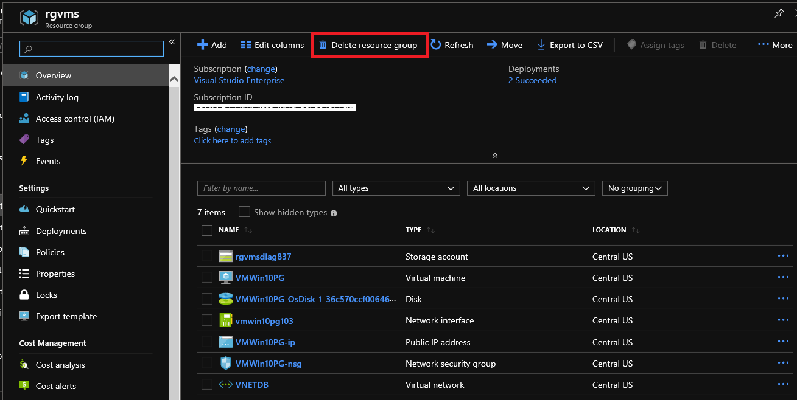
    
   Type the name of the resource group and click **Delete**

Congratulations!. You have successfully completed this exercise and the Lab. 