# Add additional users to an Azure Database for MySQL Single Server Single Server

**Introduction** 

During this lab, you will review how to add additional users for application connectivity

**Objectives**

After completing this lab, you will be able to: 

- Create database users in Azure Database for MySQL
- Magane database users with Azure Active Directory (AAD) authentication

**Considerations**

This lab considers that an Azure Database for MySQL Single Server named mysqlserver[your name initials] exists with a server admin login named *admmysql*, if not, create it or use another existing server before continuing with the lab.

**Estimated Time:** 35 minutes

---

## Exercise 1: Create additional admin users in Azure Database for MySQL

This exercise shows how to create additional admin users in Azure Database for MySQL

**Tasks**

1. Connect to Microsoft Azure Portal
    
   Open Microsoft Edge and navigate to the [Azure Portal](http://ms.portal.azure.com) to connect to Microsoft Azure Portal. Login with your subscriptions credential.

1. Connect to your Azure Database for MySQL Single Server

   Open **MySQL Workbench** and connect to your server using the admin user. 

1. Review the default roles defined when The Azure Database for MySQL Single Server is created
           
   The Azure Database for MySQL Single Server is created with the 3 default roles defined.
    
   On the **postgres** database, run the following command:
    
   ```sql
   SELECT rolname FROM pg_roles;
   ```
   
   You will see the three default roles defined on every Azure Database for MySQL Single Server:
   - azure_pg_admin
   - azure_superuser
   - your server admin user
   
   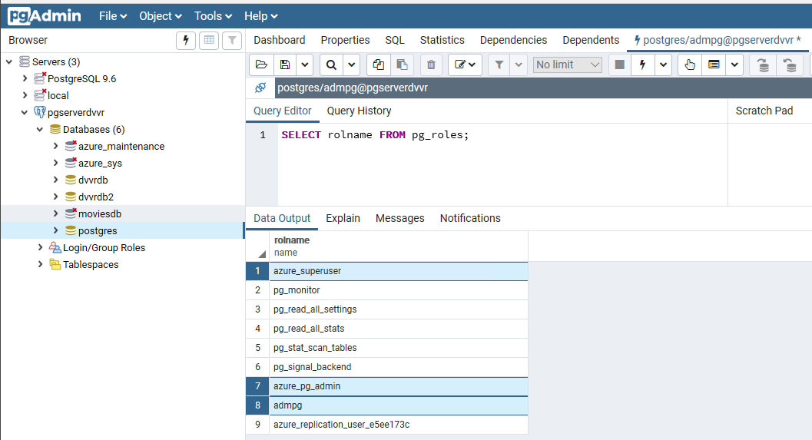
    
   >Your server admin user is a member of the *azure_pg_admin* role. However, the server admin account is not part of the azure_superuser role. Since this service is a managed PaaS service, only Microsoft is part of the super user role.
    
   In Azure Database for MySQL, the server admin user is granted these privileges: LOGIN, NOSUPERUSER, INHERIT, CREATEDB, CREATEROLE, NOREPLICATION
    
   The server admin user account can be used to create additional users and grant those users into the *azure_pg_admin* role. Also, the server admin account can be used to create less privileged users and roles that have access to individual databases and schemas.

1. Create a new admin user
    
   To create a new admin user, on the **postgres** database, execute:
    
   ```sql
   CREATE ROLE [new_user] WITH LOGIN NOSUPERUSER INHERIT CREATEDB CREATEROLE NOREPLICATION PASSWORD '[StrongPassword]';

   GRANT azure_pg_admin TO [new_user];
   ```

   For example:

   ```sql
   CREATE ROLE admin2 WITH LOGIN NOSUPERUSER INHERIT CREATEDB CREATEROLE NOREPLICATION PASSWORD 'SuperStrongPassword!';

   GRANT azure_pg_admin TO admin2;
   ```
    
   >IMPORTANT: Replace *[new_user]* with your new username and replace *[StrongPassword]* with your own strong password.
    
   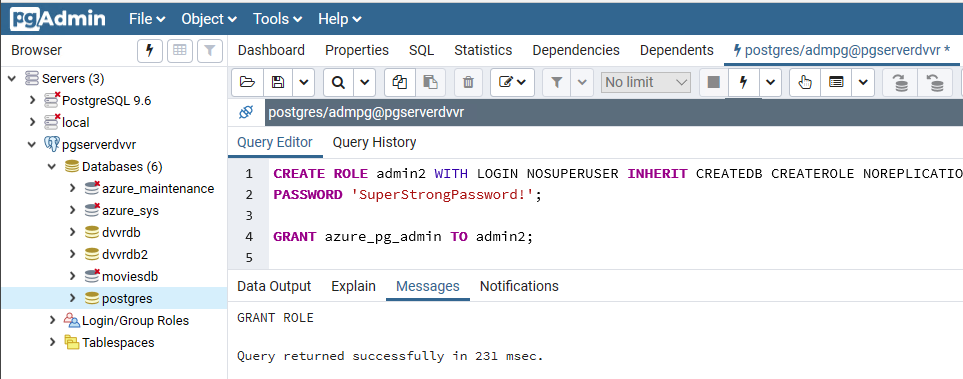

Congratulations!. You have successfully completed this exercise.

---

## Exercise 2: Create database users in Azure Database for MySQL

This exercise shows how to Create less privileged users and roles that have access to individual databases and schemas

**Tasks**

2. Connect to Microsoft Azure Portal
    
   Open Microsoft Edge and navigate to the [Azure Portal](http://ms.portal.azure.com) to connect to Microsoft Azure Portal. Login with your subscriptions credential.

3. Go to your MySQL Server

   Go to your Azure Database for MySQL Single Server in any way you prefer to look for a resource on Azure

4. Create new database users

   To create a new user and grant connect privileges to the new database for that user, on the **postgres** database, execute:

   ```sql
   CREATE DATABASE testdb;
   CREATE USER 'db_user'@'%' IDENTIFIED BY 'StrongPassword!';
   GRANT ALL PRIVILEGES ON testdb . * TO 'db_user'@'%';
   FLUSH PRIVILEGES;
   ```

   Now you need to grant object permissions to the user, for example, to create tables or read tables.

   To grant permissions to create schemas and tables to the new user, execute:

   ```sql
   GRANT ALL PRIVILEGES ON testdb . * TO 'db_user'@'%';
   FLUSH PRIVILEGES;
   ```

   

   Refer to the [MySQL documentation](https://www.MySQL.org/docs/current/static/ddl-priv.html) for further details on database roles and privileges.

1. Verify the grants within the database.
    
   Run "Show Grants For" to get the permissions for the database user.

   ```sql
   USE testdb;
   SHOW GRANTS FOR 'db_user'@'%';
   ```

   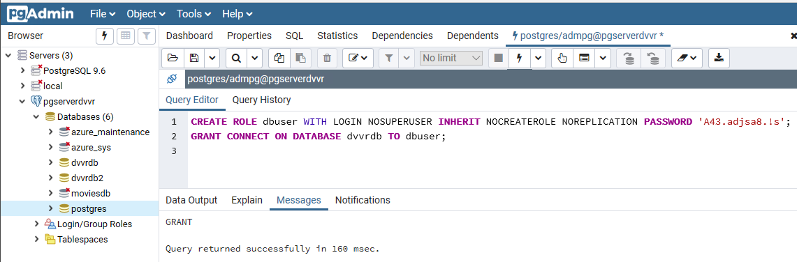

5. Log in to your server, using the new username and create a table
    
   Using MySQL Workbench, connect to your database with *db_user*.
    
   When registering the server, make sure you set the database where you granted permission in the previous tasks in the **Maintenance Database** field
    
   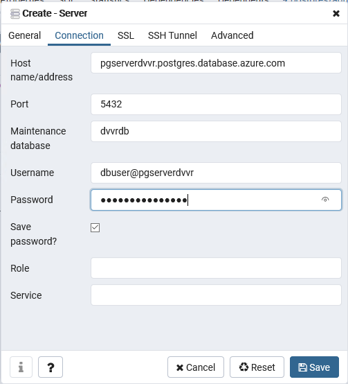
    
   Explore the database

   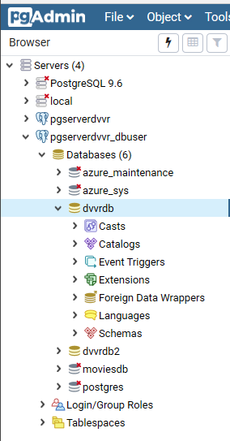

   Connected to the database, open the query tool. Create a table by executing:

    ```sql
    USE testdb;

    CREATE TABLE testtable
    (   id integer not null,
        name character varying(25) not null,
        primary key (id)
    )
    ```

    List the tables in the database, you will see the table you just created.

    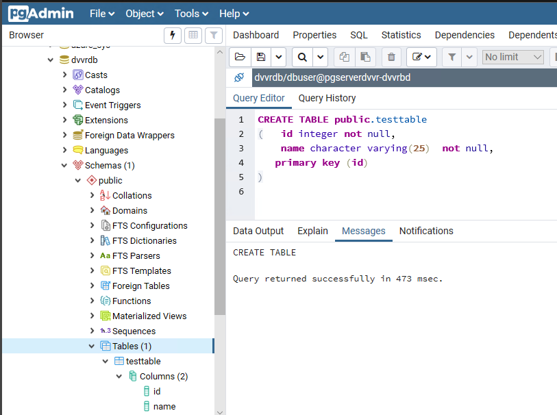

Congratulations!. You have successfully completed this exercise.

---

## Exercise 3: Setting and connecting with the Azure AD Admin user

This exercise shows how to configure Azure Active Directory access with Azure Database for MySQL, and how to connect using an Azure AD token

**Tasks**

1. Connect to Microsoft Azure Portal
    
   Open Microsoft Edge and navigate to the [Azure Portal](http://ms.portal.azure.com) to connect to Microsoft Azure Portal. Login with your subscriptions credential.

1. Go to your MySQL Server

   Go to your Azure Database for MySQL Single Server in any way you prefer to look for a resource on Azure

1. Set the Azure Active Directory admin user
    
   Under the **Settings** section in the sidebar, select **Active Directory admin**
    
   Click on **Set Admin**
   
   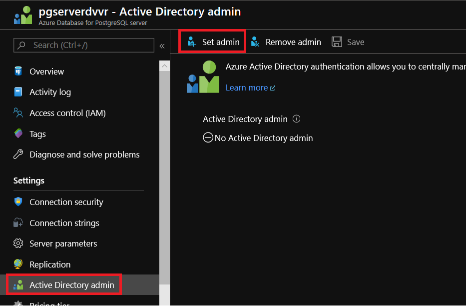
   
   Look for the user you want to add. For this lab, look for the user you are logged in with. Click **Select**
    
   
   
   You will see the selected user as the Active Directory Admin. Click on **Save**
    
   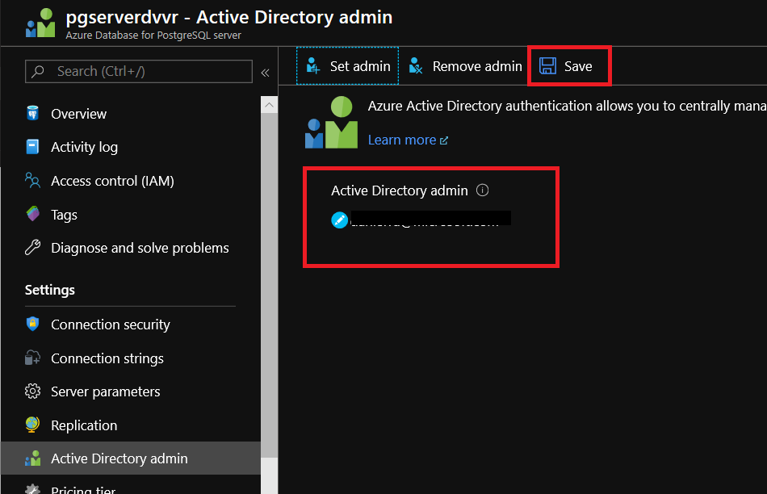

   >Only one Azure AD admin can be created per MySQL server and selection of another one will overwrite the existing Azure AD admin configured for the server. You can specify an Azure AD group instead of an individual user to have multiple administrators. Note that you will then sign in with the group name for administration purpose

1. Install Azure CLI

   If you have not done it yet. Isntall Azure CLI following the instrcutions at [How to install the Azure CLI](https://docs.microsoft.com/en-us/cli/azure/install-azure-cli) 

2. Connect Azure Database for MySQL Single Server using Azure Active Directory
    
   Open a **Command Prompt**
    
   Invoke the Azure CLI tool to authenticate with Azure AD. It requires you to give your Azure AD user ID (the one you set as Azure Active Directory admin in the previous step) and the password:
    
   ```bash
   az login
   ```
    
   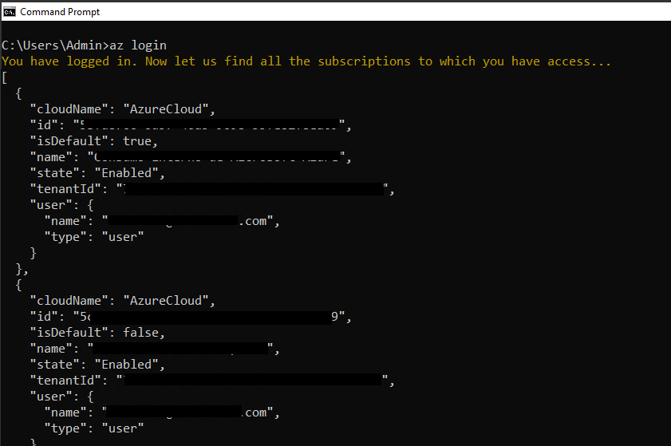
    
   Select the subscription where your Azure Database for MySQL Single Server lives by executing:

   ```bash
   az account set --subscription <name or id>
   ```
    
   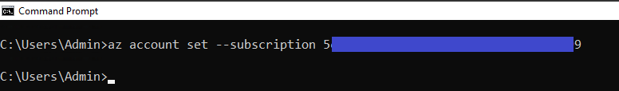
    
   Acquire an access token for the Azure AD authenticated user to access Azure Database for MySQL by executing:

   ```bash
   az account get-access-token --resource https://ossrdbms-aad.database.windows.net
   ```

   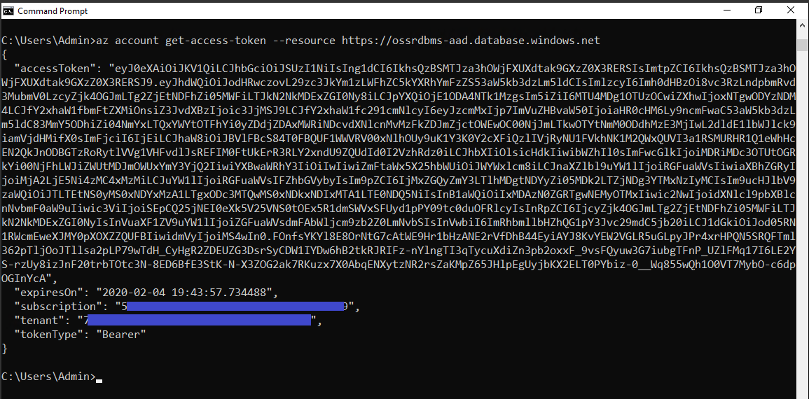
    
   Use token as password for logging in with MySQL using psql by executing:

   ```bash
   set PGPASSWORD=<copy/pasted TOKEN value from az account get-access-token command>
    
   psql -h pgserver<your name initials>.postgres.database.azure.com -U <user@domain>@pgserver<your name initials> -d postgres
   ```

   >When using the psql command line client, the access token needs to be passed through the PGPASSWORD environment variable, since the access token exceeds the password length that psql can accept directly

   Get a list of databases just to validate you have successfully logged in using the Azure Active Directory admin by executing:

   ```bash
   \l
   ``` 

   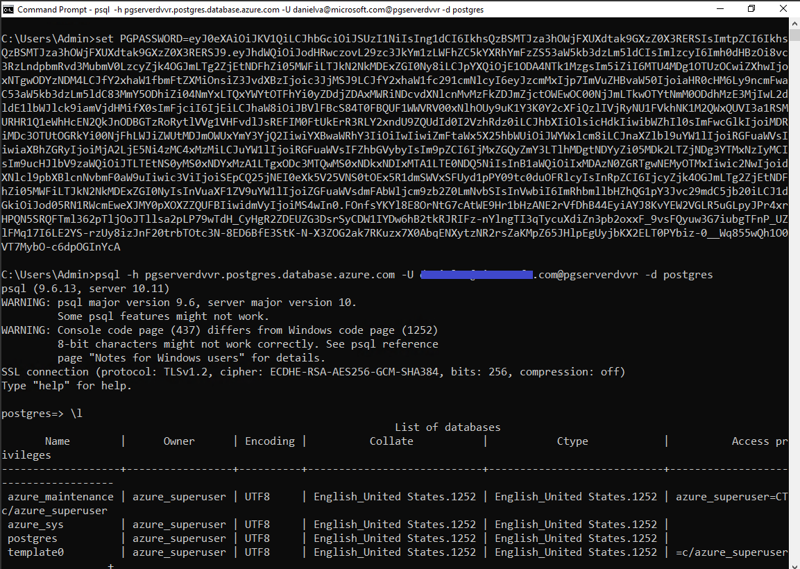

   You have successfully set an Azure Active Directory admin and logged to the Azure Database for MySQL Single Server with it.

Congratulations!. You have successfully completed this exercise.

---

## Exercise 4: setting and connecting with  Azure AD users in Azure Database for MySQL

This exercise shows how to configure Azure Active Directory access with Azure Database for MySQL, and how to connect using an Azure AD token

**Tasks**

1. Connect to Microsoft Azure Portal
    
   Open Microsoft Edge and navigate to the [Azure Portal](http://ms.portal.azure.com) to connect to Microsoft Azure Portal. Login with your subscriptions credential.

1. Go to your MySQL Server

   Go to your Azure Database for MySQL Single Server in any way you prefer to look for a resource on Azure


*****************
guide: -> https://docs.microsoft.com/en-us/azure/MySQL/single-server/how-to-configure-sign-in-azure-ad-authentication#creating-azure-ad-users-in-azure-database-for-MySQL
***************

Congratulations! You have successfully completed this exercise and the Lab. 
