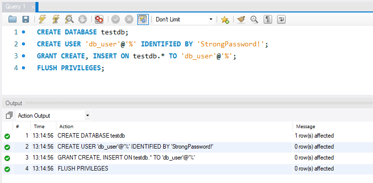
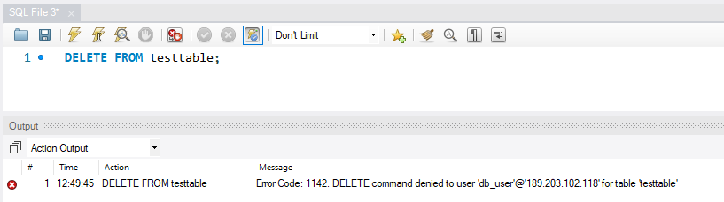

# Add additional users to an Azure Database for MySQL Single Server Single Server

**Introduction** 

During this lab, you will review how to add additional users for application connectivity

**Objectives**

After completing this lab, you will be able to: 

- Create database users in Azure Database for MySQL Single Server
- Magane database users with Azure Active Directory (AAD) authentication

**Considerations**

This lab considers that an Azure Database for MySQL Single Server named mysqlserver[your name initials] exists with a server admin login named *admmysql*, if not, create it or use another existing server before continuing with the lab.

**Estimated Time:** 60 minutes

---

## Exercise 1: Create additional admin users in Azure Database for MySQL Single Server

This exercise shows how to create additional admin users in Azure Database for MySQL Single Server

**Tasks**

1. Connect to Microsoft Azure Portal
    
   Open Microsoft Edge and navigate to the [Azure Portal](http://ms.portal.azure.com) to connect to Microsoft Azure Portal. Login with your subscriptions credential.

1. Go to your MySQL Server
   
   Go to your Azure Database for MySQL Single Server in any way you prefer to look for a resource on Azure. Get the connection information as you will use it during the lab

      

1. Connect to your Azure Database for MySQL Single Server

   Open **MySQL Workbench** and connect to your server using your server information retrieved in the previous step. 

      

1. Review the default users defined when the Azure Database for MySQL Single Server is created
           
   To list existing users, run the following command:
    
   ```sql
   use sys;

   SELECT user, host FROM mysql.user;
   ```
   
   You will see the two default users defined on every Azure Database for MySQL Single Server:
   - azure_superuser
   - your server admin user
   
   
   
   In Azure Database for MySQL, the server admin user is granted these privileges: 
   - SELECT
   - INSERT
   - UPDATE
   - DELETE
   - CREATE
   - DROP
   - RELOAD
   - PROCESS
   - REFERENCES
   - INDEX
   - ALTER
   - SHOW DATABASES
   - CREATE TEMPORARY TABLES
   - LOCK TABLES
   - EXECUTE
   - REPLICATION SLAVE
   - REPLICATION CLIENT
   - CREATE VIEW
   - SHOW VIEW
   - CREATE ROUTINE
   - ALTER ROUTINE
   - CREATE USER
   - EVENT
   - TRIGGER
   - CREATE ROLE
   - DROP ROLE
   - ROLE_ADMIN
   - XA_RECOVER_ADMIN
    
2. Create a new admin user
   
   Create the new admin user, on the **MySQL** database, execute:
   ```sql
   CREATE USER '<new_admin_user>'@'%' IDENTIFIED BY '<password>';
   ```

   >IMPORTANT: Replace *[new_master_user]* with your new username and replace *[StrongPassword]* with your own strong password.
   
   For example:
   ```sql
   CREATE USER 'new_master_user'@'%' IDENTIFIED BY 'StrongPassword!';
   ```
 
   

   Check the current privileges of the admin user:
 
    ```sql
   SHOW GRANTS;
   ```

   Select all the rows in the result, right click on them and select **Copy Row (unquoted)**, 

   

   paste it back to MySQL Workbench and, in each of the lines, replace the current user name with the new admin user, and execute them 

   >Make sure you add ; by the end of each GRANT

   >In the example below the first GRANT command was set in multiple lines for visualization purposes

   

   Your new user now has the same permission as the admin user you set when the server was created. You can create user with less privileges, it will depend on your administrative and security needs.

Congratulations!. You have successfully completed this exercise.

---

## Exercise 2: Create database users in Azure Database for MySQL

This exercise shows how to Create less privileged users and roles that have access to individual databases and schemas

**Tasks**

1. Connect to your Azure Database for MySQL Single Server

   Open **MySQL Workbench** and connect to your server using your server information retrieved in the previous exercise. 

      

1. Create new database users

   To create a new user and grant connect privileges to the new database for that user, execute:

   ```sql
   CREATE DATABASE <database_name>;
   CREATE USER '<username>'@'%' IDENTIFIED BY '<password>';
   GRANT CREATE, INSERT ON <database_name>.* TO '<username>'@'%';
   FLUSH PRIVILEGES;
   ```

   For example:
   ```sql
   CREATE DATABASE testdb;
   CREATE USER 'db_user'@'%' IDENTIFIED BY 'StrongPassword!';
   GRANT CREATE, INSERT ON testdb.* TO 'db_user'@'%';
   FLUSH PRIVILEGES;
   ```
   >IMPORTANT: Replace *[db_user]* with your new username and replace *[StrongPassword]* with your own strong password.

   

   Refer to the [Privileges Provided by MySQL](https://dev.mysql.com/doc/refman/8.0/en/privileges-provided.html) for further details on database roles and privileges.

1. Verify the grants within the database.
    
   Use "SHOW GRANTS FOR" to get the permissions for the database user.

   ```sql
   USE <database_name>;
   SHOW GRANTS FOR '<username>'@'%';
   ```

   For example:
   ```sql
   USE testdb;
   SHOW GRANTS FOR 'db_user'@'%';
   ```

   

1. Log in to your server, using the new username and create a table
    
   Using MySQL Workbench, connect to your database with *db_user*.
    
   When registering the server, make sure you set the default schema to the database where the use has pemissions: *testdb*
    
   

   Open the query tool and create a table by executing:

    ```sql
    USE testdb;

    CREATE TABLE testtable
    (   id integer not null,
        name character varying(25) not null,
        primary key (id)
    );
    ```

    Then insert a row in the table by executing:

    ```sql
    INSERT INTO testtable VALUES (1,'xxxxxx');
    ```

    

    Then delete the content of the table by executing: 

    ```sql
    DELETE FROM testtable;
    ```

    

    The delete fails because the user only has permission to create objects and to insert, not delete. 


Congratulations!. You have successfully completed this exercise.

---

## Exercise 3: Setting and connecting with the Azure AD Admin user

This exercise shows how to configure Azure Active Directory access with Azure Database for MySQL, and how to connect using an Azure AD token

**Tasks**

1. Connect to Microsoft Azure Portal
    
   Open Microsoft Edge and navigate to the [Azure Portal](http://ms.portal.azure.com) to connect to Microsoft Azure Portal. Login with your subscriptions credential.

1. Go to your MySQL Server

   Go to your Azure Database for MySQL Single Server in any way you prefer to look for a resource on Azure

1. Set the Azure Active Directory admin user
    
   Under the **Settings** section in the sidebar, select **Active Directory admin**
    
   Click on **Set Admin**
   
   
   
   Look for the user you want to add. For this lab, look for the user you are logged in with. Click **Select**
    
   
   
   You will see the selected user as the Active Directory Admin. Click on **Save**
    
   >Only one Azure AD admin can be created per MySQL server and selection of another one will overwrite the existing Azure AD admin configured for the server. You can specify an Azure AD group instead of an individual user to have multiple administrators. Note that you will then sign in with the group name for administration purpose

   Your final configuration should look similar to the image below

   

1. Install Azure CLI

   If you have not done it yet. Install Azure CLI following the instructions at [How to install the Azure CLI](https://docs.microsoft.com/en-us/cli/azure/install-azure-cli) 

1. Connect Azure Database for MySQL Single Server using Azure Active Directory
    
   Open the **Powershell**
    
   Invoke the Azure CLI tool to authenticate with Azure AD. It requires you to give your Azure AD user ID (the one you set as Azure Active Directory admin in the previous step) and the password:
    
   ```bash
   az login
   ```
    
   
    
    
   Acquire an access token for the Azure AD authenticated user to access Azure Database for MySQL by executing:

   ```bash
   az account get-access-token --resource-type oss-rdbms
   ```

   

   Copy the token from the previous command (do not include the quotes " on the beginning and the end)

   Connect to MySQL Workbench:
   - Launch MySQL Workbench and Click the Database option, then click "Connect to database"
   - In the hostname field, enter the MySQL FQDN eg. mydb.mysql.database.azure.com
   - In the username field, enter the MySQL Azure Active Directory administrator name and append this with MySQL server name, not the FQDN e.g. user@tenant.onmicrosoft.com@mydb
   - In the password field paste the content of the token that you copied from the "az account get-access-token" command
   - Click the advanced tab and ensure that you check "Enable Cleartext Authentication Plugin"
   - Click OK to connect to the database

   

   
   
   Once connected you will be able to perform any administrative task on the server

   

   You have successfully set an Azure Active Directory admin and logged to the Azure Database for MySQL Single Server with it.

Congratulations!. You have successfully completed this exercise.

---

## Exercise 4: setting and connecting with regular Azure AD users in Azure Database for MySQL

This exercise shows how to configure Azure Active Directory access with Azure Database for MySQL to add a non-admin user
**Tasks**

> For this exercise you will need to have completed the previous exercise

1. Connect Azure Database for MySQL Single Server using Azure Active Directory admin user

   Connect Azure Database for MySQL Single Server using Azure Active Directory admin user as explained in the previous exercise.

1. Add the Azure AAD non admin user  

   Create the Azure AAD non admin user by executing: 
   
   >Don´t use the name of a user or gruop already set at Admin User for the server:

   ```SQL
   CREATE AADUSER '<userid>@<domain>';
   ```

   >IMPORTANT: Replace *\<userid\>@\<domain\>* with the user you want to add.

   

   Now the user that you just add can connect to the MySQL database using AAD authentication. The next step would be grant permissions as you would do with any other database user

Congratulations! You have successfully completed this exercise and the Lab. 
