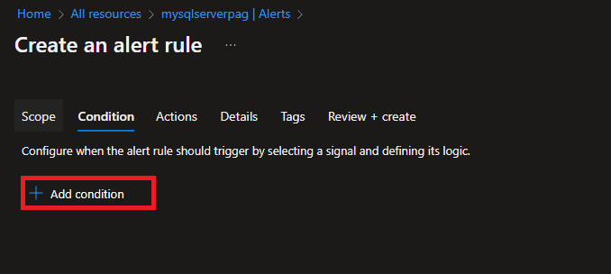
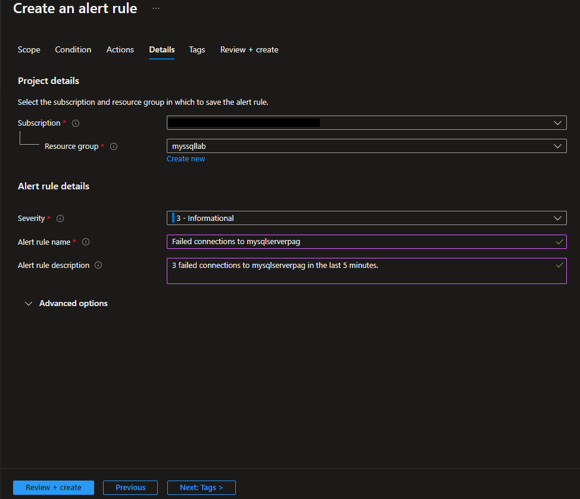
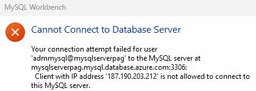
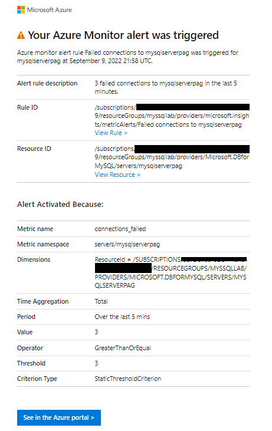
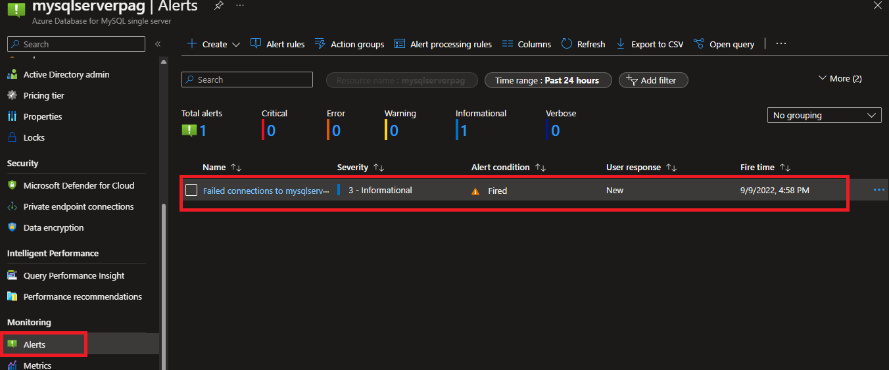
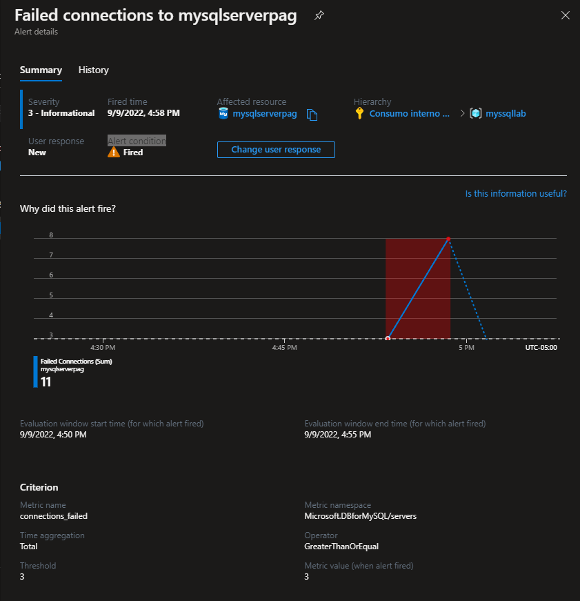
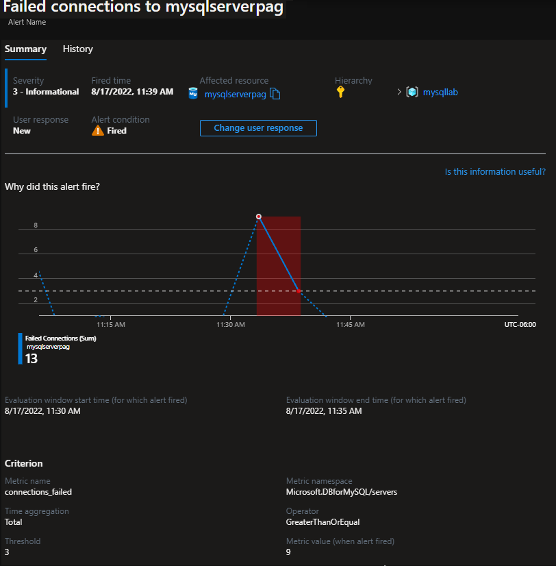
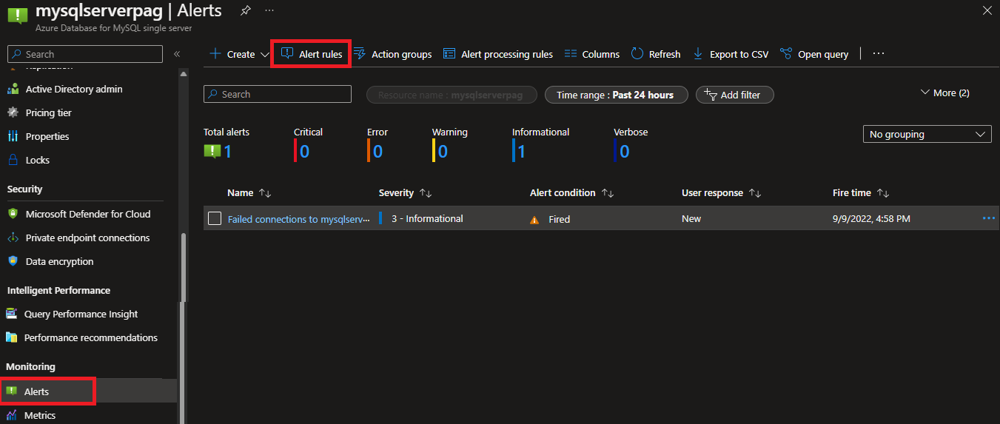
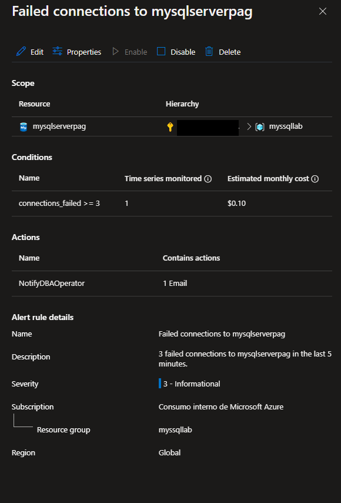

# Setup alerts on metrics for Azure Database for MySQL Single Server

**Introduction**

During this lab, you will learn how to create alerts on metrics for Azure Database for MySQL.

**Objectives**

After completing this lab, you will be able to: 

- Create an alert rule on a metric from the Azure portal
- Test an alert rule configured for Azure Database for MySQL
- Manage alerts configured for Azure Database for MySQL

**Considerations**

This lab considers that an Azure Database for MySQL Single Server named mysqlserver[your name initials] exists with a server admin login named *admmysql*, if not, create it or use another existing server before continuing with the lab.

**Estimated Time:** 40 minutes

---

## Exercise 1: Create metric alerts using the Azure Portal

This exercise shows how to, create alerts on metrics for Azure Database for MySQL.

**Tasks**

1. Connect to Microsoft Azure Portal
    
   Open Microsoft Edge and navigate to the [Azure Portal](http://ms.portal.azure.com) to connect to Microsoft Azure Portal. Login with your subscriptions credential.

1. Enable Microsoft.insights for your subscription

   >This step is necessary only if Microsoft.insights has not been already enabled for the subscription.
 
   Go to your subscription.

   Go to **Resource providers** under **Settings**

   Select Microsoft.insights and click on **Register**. It can take several minutes to register the provider.

   

   When the register completes, it will be mark as Registered

   

1. Go to your MySQL Server

   Go to your Azure Database for MySQL Single Server in any way you prefer to look for a resource on Azure

1. Create an alert for the **Failed Connections** metric
    
   Go to **Alerts** under **Monitoring**
    
   
    
   Click on **New alert rule**
   
   The **Create rule** page opens.
   
   
   
   Within the **Condition** section, click **Add**.
   
   
   
   Review the different available metrics.
   
   
   
   Select the **Failed Connections** metric from the list of signals to be alerted on.
   
   Configure the alert with the following values:
   - Operator: Greater or equal to
   - Aggregation type: Count
   - Threshold value: 3
   - Aggregation granularity: 5 minutes
   - Frequency of evaluation: every 5 minutes
    
   Click **Done**
   
   
   
   The condition and the estimated monthly cost will be shown
    
   
   
   Within the **Action Groups** section, click on **Select action group** and then click on **Create action group** to create a new group to receive notifications on the alert.
    
   
    
   Fill out the **Add action group** using the following information:
   - Action group name: DBAOperator
   - Short name: DBAOperator
   - Resource Group: use the same Resource Group of the Azure Database for MySQL Single Server. It should be wsppg
   - Action Name: SendEmail
   - Action Type: Email/SMS/Push/Voice
   
   
    
   >For this Lab you will use Action Type: Email/SMS/Voice, for production environments we recommend using Azure RBAC to notify via Azure Roles.
    
   When you select the action type **Email/SMS/Push/Voice**, a dialog opens to configure the action. Select **Email**, type your email address and click **OK**
   
   
   
   Click **OK** to create the action group.
   
   The action group will be shown
   
   
   
   Fill out the **ALERT DETAILS** using the following information:
   - Alert rule name: Failed connections to mysqlserver[your name initials]
   - Description: 3 failed connections to mysqlserver[your name initials] in the last 5 minutes.
   - Severity: Sev 3
   
   
    
   Select **Create alert rule** to create the alert.
    
   Within 10 minutes, the alert is active and triggers as previously described.

Congratulations! You have successfully completed this exercise.

---

## Exercise 2: Test an alert rule configured for Azure Database for MySQL

This exercise shows how to test an alert on metrics for Azure Database for MySQL.

**Tasks**

1. Connect to Microsoft Azure Portal
    
   Open Microsoft Edge and navigate to the [Azure Portal](http://ms.portal.azure.com) to connect to Microsoft Azure Portal. Login with your subscriptions credential.

1. Go to your MySQL Server

   Go to your Azure Database for MySQL Single Server in any way you prefer to look for a resource on Azure

1. Identify the connection information for the Azure Database for MySQL Single Server

   Make a note of the **Server name** and the **Server admin login name**.

   

1. Force a failed connection to the Azure Database for MySQL from pgAdmin

   Open **pgAdmin** and register your Azure Database for MySQL using the admin user.

   From the toolbar go to Object, hover over Create, and select Server.

   In the **Create - Server** dialog box, on the **General** tab, enter a unique friendly name for the server, such as *mysqlserver[your name initials]*.

   

   In the **Create - Server** dialog box, on the **Connection** tab, fill in the settings table. Make sure you use an invalid password

   

   >To validate the alert rule configured “Failed connections” provide an invalid password

   In the **Create - Server** dialog box, on the **SSL** tab, select SSL mode *Require*.

   

   Click **Save**. You will get a connection error. Try to save 4 times, to generate 4 failed connections.

   If you get an error similar to the following error, try to save the configuration at least 3 times. The alert will trigger as a failed connection event will be logged because you cannot access the server as connections are not allowed from the lab virtual machine.

   

   >If you had already allowed access to you IP Address to the Azure Database for PostgresSQL server, you will not get the previous error. It is OK, you will get a message indicating the user/password provided is not valid and the alert will trigger any way because you will try to connect using an invalid password.

1. Validate the failed connection attempts
  
   Go to your MySQL Server in the Azure Portal and click on **Metrics**. 

   On the right pane, select the **Failed Connections** metric and the **Count** aggregation, adjust to see just the data for the last 30 minutes. Review the Failed connections attempts.
    
   

1. After 5 minutes the rule will generate the alert,
    
   Check your email inbox, you should have received an email as defined in the action
    
   

Congratulations!. You have successfully completed this exercise.

---

## Exercise 3: Manage alerts configured for Azure Database for MySQL

This exercise shows how to, manage alerts configured for Azure Database for MySQL.

**Tasks**

1. Connect to Microsoft Azure Portal
    
   Open Microsoft Edge and navigate to the [Azure Portal](http://ms.portal.azure.com) to connect to Microsoft Azure Portal. Login with your subscriptions credential.

1. Go to your MySQL Server

   Go to your Azure Database for MySQL Single Server in any way you prefer to look for a resource on Azure

1. View fired alerts

   Go to **Alerts** under **Monitoring**. You will see an alert was fired.

   

   Click on **Sev 3** to display the configured alerts with Severity equals 3.

   

   If the alert monitor threshold has triggered and there were less than 3 failed connections over the last 5 minutes, then the alert will be marked as Resolved.

   Click on the rule name to see the details of the alert

   

   After the review, close the failed connections blade.

1. See and modify the alerts
    
   Click on **Manage alert rules**
    
   
    
   Click on the failed connections rule to see the current configuration
    
   
    
   From the rule management, you will be able to disable the alert, reconfigure the signal logic by clicking the condition, change the action group or delete the alert rule
    
   Disable the rule by clicking on **Disable**
    
   

Congratulations!. You have successfully completed this exercise and the Lab.
