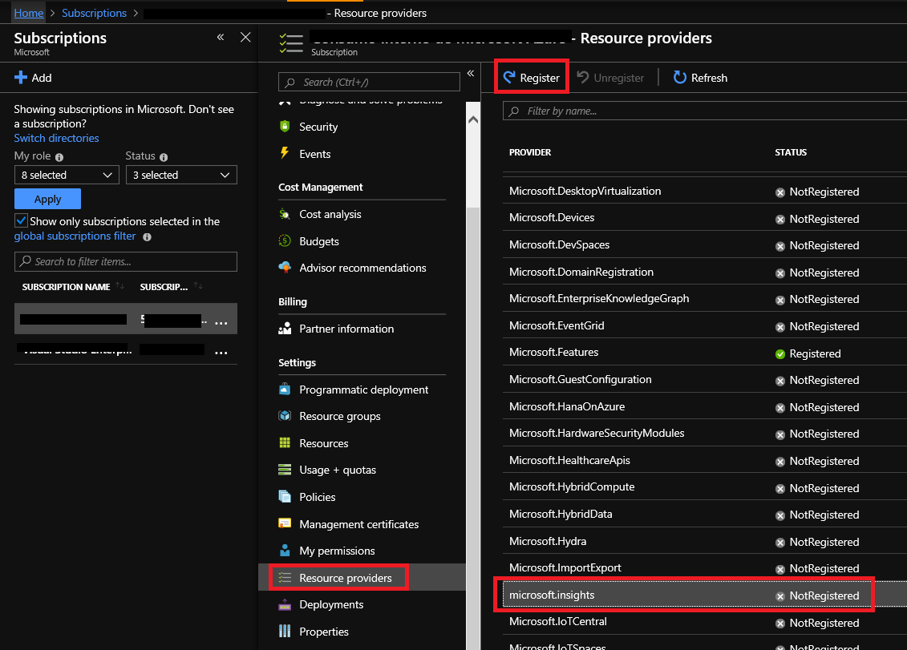
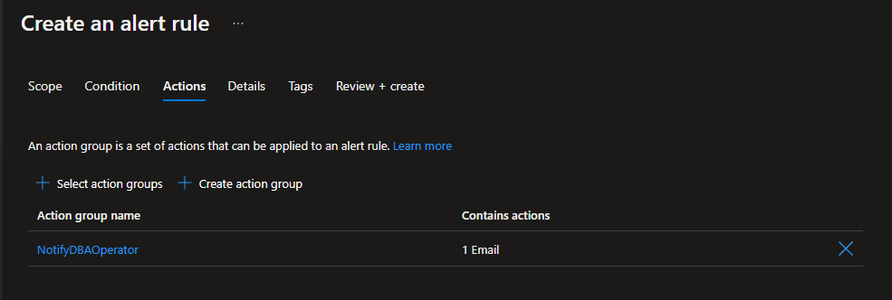
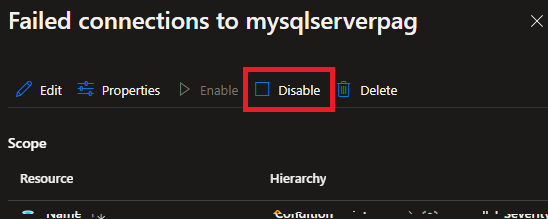

# Setup alerts on metrics for Azure Database for MySQL Single Server

**Introduction**

During this lab, you will learn how to create alerts on metrics for Azure Database for MySQL Single Server

**Objectives**

After completing this lab, you will be able to: 

- Create an alert rule on a metric from the Azure portal
- Test an alert rule configured for Azure Database for MySQL Single Server
- Manage alerts configured for Azure Database for MySQL Single Server

**Prerequisites**

This lab considers that an Azure Database for MySQL Single Server named mysqlserver[your name initials] exists with a server admin login named *admmysql*, if not, create it or use another existing server before continuing with the lab.

**Estimated Time:** 40 minutes

**Exercise list**
- [Setup alerts on metrics for Azure Database for MySQL Single Server](#setup-alerts-on-metrics-for-azure-database-for-mysql-single-server)
  - [Exercise 1: Create metric alerts using the Azure Portal](#exercise-1-create-metric-alerts-using-the-azure-portal)
  - [Exercise 2: Test an alert rule configured for Azure Database for MySQL](#exercise-2-test-an-alert-rule-configured-for-azure-database-for-mysql)
  - [Exercise 3: Manage alerts configured for Azure Database for MySQL](#exercise-3-manage-alerts-configured-for-azure-database-for-mysql)

---

## Exercise 1: Create metric alerts using the Azure Portal

This exercise shows how to create alerts on metrics for Azure Database for MySQL Single Server.

**Tasks**

1. Connect to Microsoft Azure Portal
    
   Open Microsoft Edge and navigate to the [Azure Portal](http://ms.portal.azure.com) to connect to Microsoft Azure Portal. Login with your subscriptions credential.

1. Enable Microsoft.insights for your subscription

   >This step is necessary only if Microsoft.insights has not been already enabled for the subscription.
 
   Go to your subscription.

   Go to **Resource providers** under **Settings**

   Select Microsoft.insights and click on **Register**. It can take several minutes to register the provider.

   

   When the register completes, it will be mark as Registered

   

1. Go to your MySQL Server

   Go to your Azure Database for MySQL Single Server in any way you prefer to look for a resource on Azure

1. Create an alert for the **Failed Connections** metric
    
   Go to **Alerts** under **Monitoring**. 
   
   Click on **+ Create** and select **Alert rule**
     
   
   
   The **Create an alert rule** page opens.
   
   >If you click on **Scope**, you will see that the scope is predefined to the server you are working on

   >
      
   You will see all the possible signal (elements you can create an alert on)
   
   
   
   Select the **Failed Connections** metric from the list of signals to be alerted on.
   
   Configure the alert with the following values:
   - Operator: Greater than or equal to
   - Aggregation type: Total
   - Threshold value: 3
   - Check every: 5 minutes
   - Look at the data from the last: 5 minutes
   
   you can see the estimated cost in the right side of the screen 

   
 
   Click **Next: Actions >**

   Within the **Action** section, click on **+ Create action group** to create a new group to receive notifications on the alert.
    
   
    
   Fill out the **Add action group** using the following information:
   - Action group name: NotifyDBAOperator
   - Short name: NotifyDBAOp
   - Resource Group: use the same Resource Group of the Azure Database for MySQL Single Server. It should be mysqllab
   
   
    
   Click **Next: Notifications >**
      
   Configure the notification using:
   
   - Name: SendEmail
   - Notification Type: Email/SMS/Push/Voice

   >For this Lab you will use Action Type: Email/SMS/Voice, for production environments we recommend using Azure RBAC to notify via Azure Roles.
    
   When you select the action type **Email/SMS/Push/Voice**, a dialog opens to configure the action. Select **Email**, type your email address and click **OK**
   
   
   
   Click **Review + Create**, then click on **Create**
     
   The action group will be shown
   
   

   Click **Next: Details >**
      
   Fill out the details using the following information:
   - Alert rule name: Failed connections to \<your_server_name\>
   - Description: 3 failed connections to \<your_server_name\> in the last 5 minutes.
   - Severity: *3 - Informational*. You can set other value depending on your needs.
   
   
    
   Select **Review + create** and then click **Create** to create the alert.
    
   Within minutes, the alert will be enabled.

Congratulations! You have successfully completed this exercise.

---

## Exercise 2: Test an alert rule configured for Azure Database for MySQL

This exercise shows how to test an alert on metrics for Azure Database for MySQL Single Server.

**Tasks**

1. Connect to Microsoft Azure Portal
    
   Open Microsoft Edge and navigate to the [Azure Portal](http://ms.portal.azure.com) to connect to Microsoft Azure Portal. Login with your subscriptions credential.

1. Go to your MySQL Server

   Go to your Azure Database for MySQL Single Server in any way you prefer to look for a resource on Azure

1. Identify the connection information for the Azure Database for MySQL Single Server

   Make a note of the **Server name** and the **Server admin login name**.

   

1. Force a failed connection to the Azure Database for MySQL from MySQL Workbench

   Open **MySQL Workbench** and register your Azure Database for MySQL using the admin user.

   In the **Set up new connection** dialog box, enter a unique friendly name for the server, such as *mysqlserver*, and provide connection information

   

   Click **OK**. 
   
   Click on the server you just registered and enter a wrong password. this will cause a failed connection to the server that will help to validate the alert.
   
   

   You will get a connection error. Try to connect 4 times in total (using a wrong password) to generate 4 failed connections.

   If you get an error similar to the following error, try to save the configuration at least 3 times. The alert will trigger as a failed connection event will be logged because you cannot access the server as connections are not allowed from the lab virtual machine.

   

   >If you had already allowed access to you IP Address to the Azure Database for MySQL Single Server, you will not get the previous error. It is OK, you will get a message indicating the user/password provided is not valid and the alert will trigger any way because you will try to connect using an invalid password.

1. Validate the failed connection attempts
  
   Go to your MySQL Server in the Azure Portal and click on **Metrics**. 

   On the right pane, select the **Failed Connections** metric and the **Count** aggregation, adjust to see just the data for the last 30 minutes. Review the Failed connections attempts.
    
   

1. After 5 minutes the rule will generate the alert
    
   Check your email inbox, you should have received an email as defined in the action
    
   

Congratulations!. You have successfully completed this exercise.

---

## Exercise 3: Manage alerts configured for Azure Database for MySQL

This exercise shows how to manage alerts configured for Azure Database for MySQL Single Server.

**Tasks**

1. Connect to Microsoft Azure Portal
    
   Open Microsoft Edge and navigate to the [Azure Portal](http://ms.portal.azure.com) to connect to Microsoft Azure Portal. Login with your subscriptions credential.

1. Go to your MySQL Server

   Go to your Azure Database for MySQL Single Server in any way you prefer to look for a resource on Azure

1. View fired alerts

   Go to **Alerts** under **Monitoring**. You will see the alert that was fired.

   

   Click on the alert to see its details

   

   >If the alert monitor threshold has triggered but at least one of the conditions is no longer true for three consecutive checks, the alert will be marked as *Resolved*.

   You can click on **Change user response** to mark it as *Acknowledged* or *Closed* and document your actions.
    
   After the review, close the failed connections blade.

1. See and modify the alerts
    
   Click on **Alert rules**
    
   

   Then click on the three dots and the edit option for the rule.

   
    
   This will show the current rule configuration
    
   
    
   From the rule management, you will be able to disable the alert, reconfigure the signal logic by clicking the condition, change the action group or delete the alert rule
    
   Disable the rule by clicking on **Disable**
    
   

Congratulations!. You have successfully completed this exercise and the Lab.
