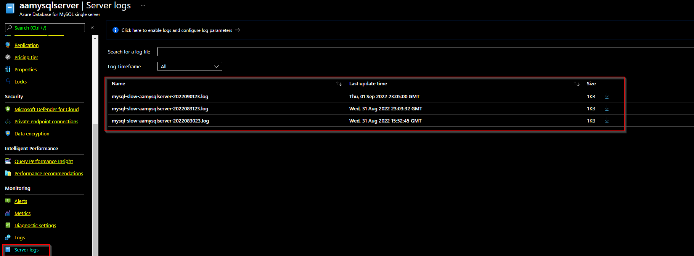
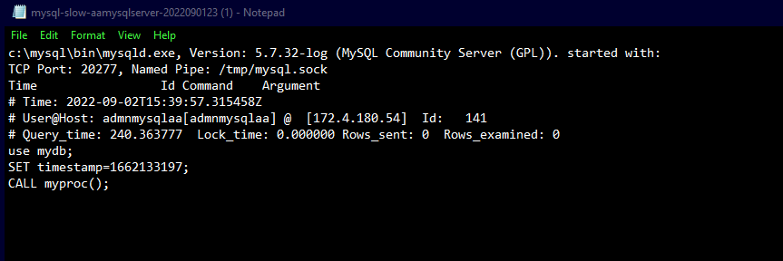

# Configure and access server logs for Azure Database for MySQL Single Server Single Server

**Introduction**

During this lab, you will learn how to Configure and access server logs in Azure Database for MySQL.

**Objectives**

After completing this lab, you will be able to: 

- Configure server logs in Azure Database for MySQL from the Azure portal
- Access server logs in Azure Database for MySQL from the Azure portal

**Considerations**

This lab considers that an Azure Database for MySQL Single Server named pgserver[your name initials] exists with a server admin login named *admpg*, if not, create it or use another existing server before continuing with the lab.

**Estimated Time:** 30 minutes

---

# Exercise 1: Enabling Logging using Azure Portal

This exercise shows how to enable server logging for the MySQL database using Azure portal.

**Tasks**

1. Connect to Microsoft Azure Portal
    
   Open Microsoft Edge and navigate to the [Azure Portal](http://ms.portal.azure.com) to connect to Microsoft Azure Portal. Login with your subscriptions credential.

1. Go to your MySQL Server

   Go to your Azure Database for MySQL Single Server in any way you prefer to look for a resource on Azure

1. Go to the **Server Log** page
    
   Under the **Monitoring** section in the sidebar, select **Server Logs** as shown below

   

1. Server Parameters page
    
   Select the heading **Click here to enable logs and configure log parameters** to see the server parameters.
    
   Change the parameters that you need to adjust. All changes you make in this session are highlighted in purple. We need to click the Save button at the end.
    
   
    
   Some of the important parameters for which we can enable logging are described below:

   | Parameter  | Description  |
   | ---------- | ------------ |
   | **long_query_time**  | if a query takes longer than long_query_time (in seconds) that query is logged. The default is 10 seconds.  |
   | **log_slow_admin_statements** | if ON includes administrative statements like **ALTER_TABLE** and **ANALYZE_TABLE** in the statements written to the slow_query_log. |
   | **log_queries_not_using_indexes** | determines whether queries that do not use indexes are logged to the **slow_query_log** |
   | **log_throttle_queries_not_using_indexes** | This parameter limits the number of non-index queries that can be written to the slow query log. This parameter takes effect when **log_queries_not_using_indexes** is set to ON. |

Congratulations!. You have successfully completed this exercise.

---

# Exercise 2: List and Download Logs using Azure Portal

This exercise shows how to view or list the MySQL database logs using Azure portal.

**Tasks**

1. Connect to Microsoft Azure Portal
    
   Open Microsoft Edge and navigate to the [Azure Portal](http://ms.portal.azure.com) to connect to Microsoft Azure Portal. Login with your subscriptions credential.

1. Go to your MySQL Server

   Go to your Azure Database for MySQL Single Server in any way you prefer to look for a resource on Azure

1. Go to the **Server Log** page
    
   Under the **Monitoring** section in the sidebar, select **Server Logs** as shown below:

   

   >The naming convention of the log is: mysql-slow-\< your server name\>-yyyymmddhh.log.

   The date and time used in the file name is the time is when the log was issued. Logs files are rotated every 24 hours or 7.5 GB, whichever comes first.

1. Use the **Search to filter items** option
    
   The Azure portal gives us options to select logs from **last 24 hours, 2 days and 4 days**.
    
   When we see a lot of log files we can provide part of the logfile name (kind of a substring) to search for logfiles which contains that substring.

1. Downloading the Logs
    
   Now that we have enabled logging for some of the parameters and we have few sets of logs, it is time to download the logs and examine them. There will be a **Download** button for each of the logfileas shown below:
    
   

1. Run a Query and Review the Logs
    
   In our example we had turned on the logging for **slow_query_log**.
    
   Let us run the following sample code and try to review the logs.
    
   In this code we will create a database named mydb, create a table named mytab and then a stored procedure named myproc(). We will then execute this stored procedure.
    
   Through this stored procedure we will try to add 10000 rows in that table.
    
   Connect to your MySQL database using the **MySQL Workbench** tool


    ```sql
    -- create a sample database named mydb
    CREATE DATABASE mydb

    -- inside mydb create a table named mytab
    use mydb

    CREATE TABLE mytab (id int primary key auto_increment, batch_seq int)

    -- the following piece of code will create a stored procedure named myproc
    DELIMITER $$
    DROP PROCEDURE IF EXISTS myproc$$
    CREATE PROCEDURE myproc()
    BEGIN
    DECLARE x INT;
    set x = 10000;
    WHILE x <= 20000 DO
    insert into mytab (batch_seq) values(x);
    set x = x+1;
    END WHILE;
    END$$
    DELIMITER ;

    -- Let us call this procedure so that it inserts 10,000 rows in mytab
    CALL myproc();

    SELECT * FROM mytab;
    ```

   After few minutes download the latest log file for this MySQL Server from the **Server Logs** section. The logs will show output similar to the one shown below:

   ```
   c:\\mysql\\bin\\mysqld-detour.exe, Version: 5.7.21-log (MySQL Community Server (GPL)). started with:
   TCP Port: 20277, Named Pipe: /tmp/mysql.sock
   Time Id Command Argument
   \# Time: 2022-09-02T15:39:57.31548Z
   \# User@Host: admnmysqlaa\[admnmysqlaa\] @ \[172.4.180.54\] Id: 141
   \# Query_time: 240.363777 Lock_time: 0.000000 Rows_sent: 0 Rows_examined: 0
   use mydb;
   SET timestamp=1662133197;
   CALL myproc();
   ```
  
   The logs provide following information:
   - **Version of MySQL:** 5.7.32
   - **Port on which the server is listening:** 20277
   - **The Time at which long query was run:** 2022-09-02 at 15:39 pm
   - **The username who ran that query:** admnmysqlaa
   - **The IP of the end user machine:** IP of your workstation from which the query was run
   - **Query Duration:** Approx 240 seconds
   - **Time spent in lock waits:** 0
   - **Rows sent to caller:** 0 (our proc just add data to a table)
   - **Rows examined:** 0 (we do not have any Select in the proc)
   - **Query Text:** CALL myproc()

Congratulations!. You have successfully completed this exercise and the Lab.