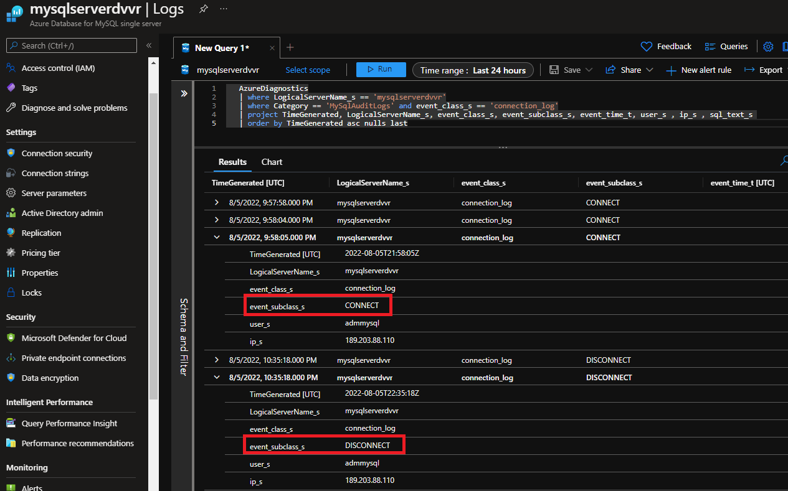

# Configure and access audit logs for Azure Database for MySQL

**Introduction**

During this lab, you will learn how to Configure and access audit logs for Azure Database for MySQL in the Azure portal.

**Objectives**

After completing this lab, you will be able to: 

- Configure and access audit logs for Azure Database for MySQL in the Azure portal

**Considerations**

This lab considers that an Azure Database for MySQL Single Server named mysqlserver[your name initials] exists with a server admin login named *admmysql*, if not, create it or use another existing server before continuing with the lab.

**Estimated Time:** 40 minutes

**Exercises list**
- [Configure and access audit logs for Azure Database for MySQL](#configure-and-access-audit-logs-for-azure-database-for-mysql)
  - [Exercise 1: Configure audit logging](#exercise-1-configure-audit-logging)
  - [Exercise 2: Set up diagnostic logs](#exercise-2-set-up-diagnostic-logs)
  - [Exercise 3: Accessing the audit log](#exercise-3-accessing-the-audit-log)

---

## Exercise 1: Configure audit logging

This exercise shows how to configure audit logging

**Tasks**

1. Connect to Microsoft Azure Portal
    
   Open Microsoft Edge and navigate to the [Azure Portal](http://ms.portal.azure.com) to connect to Microsoft Azure Portal. Login with your subscriptions credential.

1. Go to your MySQL Server

   Go to your Azure Database for MySQL Single Server in any way you prefer to look for a resource on Azure

1. Set auditing parameters

   Under the **Settings** section in the sidebar, select **Server parameters**.
   
   Then filter by **audit_log**

   

1. To enable auditing, set the **audit_log_enabled** parameter to ON.
    
   

1. Select the event types to be logged by updating the **audit_log_events** parameter. 

   For lab purposes, select **CONNECTION**, **DML_SELECT** and **DML_NONSELECT**

   

   For reference, the events description in the table below:

   |Event	             |Description                      |
   |---------------------|--------------------------------------------------------------|
   |CONNECTION	          |Connection initiation (successful or unsuccessful), User reauthentication with different user/password during session and connection termination |
   |DML_SELECT	          |SELECT queries
   |DML_NONSELECT	       |INSERT/DELETE/UPDATE queries
   |DML	                |DML = DML_SELECT + DML_NONSELECT
   |DDL	                |Queries like "DROP DATABASE"
   |DCL	                |Queries like "GRANT PERMISSION"
   |ADMIN	             |Queries like "SHOW STATUS"
   |GENERAL	             |All in DML_SELECT, DML_NONSELECT, DML, DDL, DCL, and ADMIN
   |TABLE_ACCESS	       | Table read,delete, intert and update statements, such as SELECT or INSERT INTO ... SELECT, DELETE or TRUNCATE TABLE, INSERT or REPLACE ad UPDATE |

   >It is recommended to only log the event types and users required for your auditing purposes to ensure your server's performance is not heavily impacted and minimum amount of data is collected.

   > It is possible to indicate what users you want to audit or what users you want to exclude from auditing by setting **audit_log_include_users** **audit_log_exclude_users** parameter repectivly. 
   > Refer to [Audit Logs in Azure Database for MySQL](https://docs.microsoft.com/en-us/azure/mysql/single-server/concepts-audit-logs) for further details
 

1. Once you have changed the parameters, click Save.
    
   

Congratulations!. You have successfully completed this exercise.

---

## Exercise 2: Set up diagnostic logs

Audit logs are integrated with Azure Monitor Diagnostic Logs. Once you've enabled audit logs on your MySQL server, you can emit them to Azure Monitor logs, Event Hubs, or Azure Storage.

This exercise shows how to set up diagnostic logs

**Tasks**

1. Connect to Microsoft Azure Portal
    
   Open Microsoft Edge and navigate to the [Azure Portal](http://ms.portal.azure.com) to connect to Microsoft Azure Portal. Login with your subscriptions credential.

1. Create a Storage Account

   Create a Storage Account in the same region as your Azure Database for MySQL Server using the instructions at [Create a storage account](https://docs.microsoft.com/en-us/azure/storage/common/storage-account-create?tabs=azure-portal)

1. Create a Log Analytics workspace

   Create a Log Analytics workspace in the same region as your Azure Database for MySQL Server using the instructions at [Create a Log Analytics workspace](https://docs.microsoft.com/en-us/azure/azure-monitor/logs/quick-create-workspace?tabs=azure-portal)

1. Go to your MySQL Server

   Go to your Azure Database for MySQL Single Server in any way you prefer to look for a resource on Azure

1. Add a Diagnostic Setting 

   Under the **Monitoring** section in the sidebar, select **Diagnostic settings** and then click on **+ Add diagnostic setting**

   

1. Configure the Diagnostic Setting 

   - Provide a diagnostic setting name.
   - Specify which data sinks to send the audit logs. For this lab use storage account and Log Analytics workspace created in the previous tasks.
   - Select **MySqlAuditLogs** as the log type and archive to a storage account 
   - Set the Retention (days) to 90. this indicates the retention of the log in the Storage Account

   

   Click Save and close the tile. You will see the new Diagnostic Setting listed for the server

   


Congratulations!. You have successfully completed this exercise.

---

## Exercise 3: Accessing the audit log

1. Using MySQL Workbench or any other MySQL client tool connect to the database server

1. Create a simple database and table

    Execute:

   ```sql
   CREATE DATABASE dbtest;

   USE dbtest;

   CREATE TABLE people
   ( id   INT
    ,name VARCHAR(25)
   );
   ```

1. Modify and query the table

   Insert a few test rows:

   ```sql
   INSERT INTO people VALUES (1,'DANIEL');
   INSERT INTO people VALUES (2,'ANDREA');
   INSERT INTO people VALUES (3,'JOHN');
   ```

   Query the table

   ```sql
   SELECT * FROM people;

   SELECT * FROM people WHERE id = 1;
   ```

   Update the table

   ```sql
   UPDATE people set name = 'SCOTT' WHERE id = 1;
   ```

1. Consult the audit log in Log Analytics

   Under the **Monitoring** section in the sidebar, select **Logs** 

   

   - To see the **DML_SELECT** and **DML_NONSELECT** events, run:

     ```kusto
     AzureDiagnostics
     | where LogicalServerName_s == '<servername>'
     | where Category == 'MySqlAuditLogs' and event_class_s == 'general_log'
     | project TimeGenerated, LogicalServerName_s, event_class_s, event_subclass_s, event_time_t, user_s , ip_s , sql_text_s 
     | order by TimeGenerated asc nulls last
      ```
   
     >Make sure you replace *\<servername\>* with your server name

     You will find the entries for the events including:
     - when it happened (TimeGenerated[UTC])
     - the user (user_s) who executed the action
     - the source IP addrres (ip_s) for the connection
     - The query executed (sql_text_s)

     

     This query is just an example, you can modify it to add the filters you need to get only the information you are looking for.
     For example, if you want to see only update events on the table *people*, you can use 

     ```kusto
     AzureDiagnostics
     | where LogicalServerName_s == '<servername>'
     | where Category == 'MySqlAuditLogs' and event_class_s == 'general_log'
     | where sql_text_s has_all ('UPDATE','people')
     | project TimeGenerated, LogicalServerName_s, event_class_s, event_subclass_s, event_time_t, user_s , ip_s , sql_text_s 
     | order by TimeGenerated asc nulls last
     ```

     

     >Kusto Query Language is very powerful, if you want to get familiar with it go to [Tutorial: Use Kusto queries](https://docs.microsoft.com/en-us/azure/data-explorer/kusto/query/tutorial?pivots=azuredataexplorer) 

   - To see the **CONNECTION** events, run: 

     ```kusto
     AzureDiagnostics
     | where LogicalServerName_s == '<servername>'
     | where Category == 'MySqlAuditLogs' and event_class_s == 'connection_log'
     | project TimeGenerated, LogicalServerName_s, event_class_s, event_subclass_s, event_time_t, user_s , ip_s , sql_text_s 
     | order by TimeGenerated asc nulls last
     ```
  
     You will find the entries for the events including:
     - when it happened (TimeGenerated[UTC])
     - the user (user_s) who connected/disconnected
     - If it is a connection or a disconnection (event_subclass_s) 
     - the source IP addrres (ip_s) for the connection
   
     

1. Consult the audit log in the Storage Account

   Go to the Storage Account you set in the Diagnostics Setting
    
   Under the **Data Storage** section in the sidebar, select **Container**. 
   You will see a folder named **insights-logs-mysqlauditlogs** that was created automatically. 

   

   click on the folder, and continue doing so until you get to the log for the resource group, server name, date and time you want to review

   

   Click on the JSON with the log entries. Then click on **Download**

   

   Open the file using your favorite editor/JSON formatter and explore it. You will see the audit events in there 

   

Congratulations!. You have successfully completed this exercise and the Lab. 