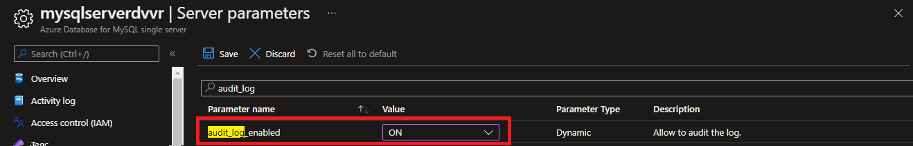
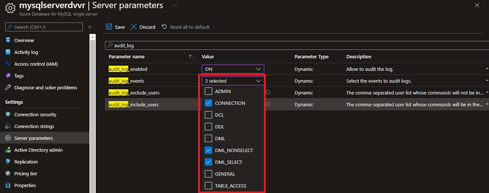
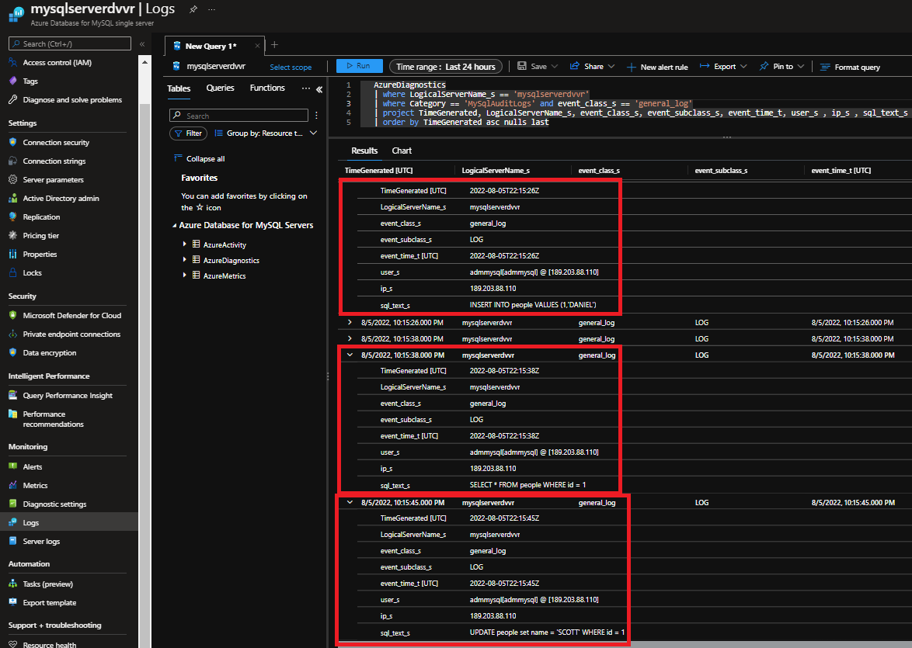

# Configure and access audit logs for Azure Database for MySQL

**Introduction**

During this lab, you will learn how to Configure and access audit logs for Azure Database for MySQL in the Azure portal.

**Objectives**

After completing this lab, you will be able to: 

- Configure and access audit logs for Azure Database for MySQL in the Azure portal

**Estimated Time:** 20 minutes

---

# Exercise 1: Create an Azure Database for MySQL server

This exercise shows how to create an Azure Database for MySQL server

**Tasks**

1. You create an Azure Database for MySQL server with a defined set of [compute and storage resources](https://docs.microsoft.com/en-us/azure/mysql/concepts-compute-unit-and-storage). You create the server within an [Azure resource group](https://docs.microsoft.com/en-us/azure/azure-resource-manager/resource-group-overview).

1. Select **Create a resource (+)** in the upper-left corner of the portal.

1. Select Databases \> Azure Database for MySQL. You can also enter MySQL in the search box to find the service.
    
   

1. Fill out the new server details form with the following information after creating resource group if you don't have one before:
    
   

   | Setting | Suggested value | Field description |
   |:----- |: ----- |:----- |
   | Server name | Unique server name | Enter a unique name that identifies your Azure Database for MySQL server. For example, mydemoserver2019. The domain name .mysql.database.azure.com is appended to the server name you provide. The server name can contain only lowercase letters, numbers, and the hyphen (-) character. It must contain from 3 to 63 characters. |
   | Subscription | Your subscription | Select the Azure subscription that you want to use for your server. If you have multiple subscriptions, choose the subscription in which you get billed for the resource. |
   | Resource group | myresourcegroup | Provide a new or existing resource group name. |
   | Select source | None | Select None to create a new server from scratch. (You select Backup if you are creating a server from a geo-backup of an existing Azure Database for MySQL server). |
   | Server admin login | myadmin | A sign-in account to use when you're connecting to the server. The admin sign-in name cannot be azure_superuser, admin, administrator, root, guest, or public. |
   | Password | Your choice Example: pass@word1 | Provide a new password for the server admin account. It must contain from 8 to 128 characters. Your password must contain characters from three of the following categories: English uppercase letters, English lowercase letters, numbers (0-9), and non-alphanumeric characters (!, $, #, %, and so on). |
   | Confirm password | Your choice | Confirm the admin account password. |
   | Location | The region closest to your users | Choose the location that is closest to your users or your other Azure applications. |
   | Version | The latest major version | The latest major version (unless you have specific requirements that require another version). |
   | Pricing tier | **General Purpose**, **Gen 5**, **2 vCores**, **5 GB**, **7 days**, **Geographically Redundant** | The compute, storage, and backup configurations for your new server. Select **Pricing tier**. Next, select the **General Purpose** tab. Gen 5, 4 vCores, 100 GB, and 7 days are the default values for **Compute Generation**, **vCore**, **Storage**, and **Backup Retention Period**. You can leave those sliders as is. To enable your server backups in geo-redundant storage, select **Geographically Redundant** from the **Backup Redundancy Options**. To save this pricing tier selection, select **OK**. The next screenshot captures these selections. |
	
   >Consider using the Basic pricing tier if light compute and I/O are adequate for your workload. Note that servers created in the Basic pricing tier cannot later be scaled to General Purpose or Memory Optimized

   

1. Select Create to provision the server. Provisioning can take up to 20 minutes.

1. Select Notifications on the toolbar (the bell icon) to monitor the deployment process.
    
   By default, the following databases are created under your server: **information_schema**, **mysql**, **performance_schema**, and **sys**.  

Congratulations!. You have successfully completed this exercise.

---

# Exercise 2: Configure audit logging

This exercise shows how to configure audit logging

**Tasks**

1. Connect to Microsoft Azure Portal
    
   Open Microsoft Edge and navigate to the [Azure Portal](http://ms.portal.azure.com) to connect to Microsoft Azure Portal. Login with your subscriptions credential.

1. Go to your PostgreSQL Server

   Go to your Azure Database for PostgreSQL Single Server in any way you prefer to look for a resource on Azure

1. Under the Settings section in the sidebar, select Server parameters.
    
   

1. Update the **audit_log_enabled** parameter to ON.
    
   

1. Select the event types to be logged by updating the **audit_log_events** parameter. 

   

1. Add any MySQL users to be excluded from logging by updating the **audit_log_exclude_users** parameter. Specify users by providing their MySQL username. Audit log exclude users ( leave as default for this lab)
    
   

1. Once you have changed the parameters, you can click Save, or you can Discard your changes. Save it.
    
   

Congratulations!. You have successfully completed this exercise.

---

# Exercise 3: Set up diagnostic logs

This exercise shows how to set up diagnostic logs

** Tasks**

1. Under the Monitoring section in the sidebar, select Diagnostic settings.

1. Click on **+ Add diagnostic setting** Add diagnostic setting
    
   

1. Provide a diagnostic setting name.

1. Specify which data sinks to send the audit logs (storage account, event hub, and/or Log Analytics workspace).

1. Select **MySqlAuditLogs** as the log type and archive to a storage account 
 
   >If you don't have storage account, create one using the following steps:
   >
   >- Create resource and specify storage account in search box  
   >      
   >    
   >
   >- Configure the storage as below to match audit configuration
   >
   >    
   >
   >- Once completed click create

   

1. Once you've configured the data sinks to pipe the audit logs to, you can click Save. Save diagnostic setting
    
   

1. Access the audit logs by exploring them in the data sinks you configured. It may take up to 10 minutes for the logs to appear.

**********************
---> Add more deatils, such as how to query log analytics
**********************

Congratulations!. You have successfully completed this exercise and the Lab. 