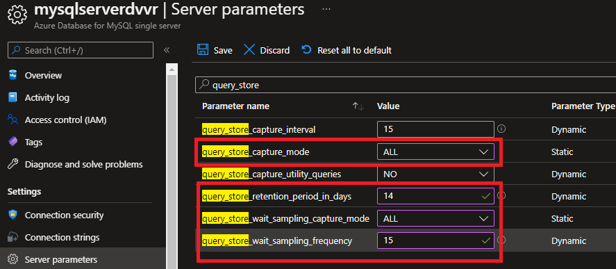
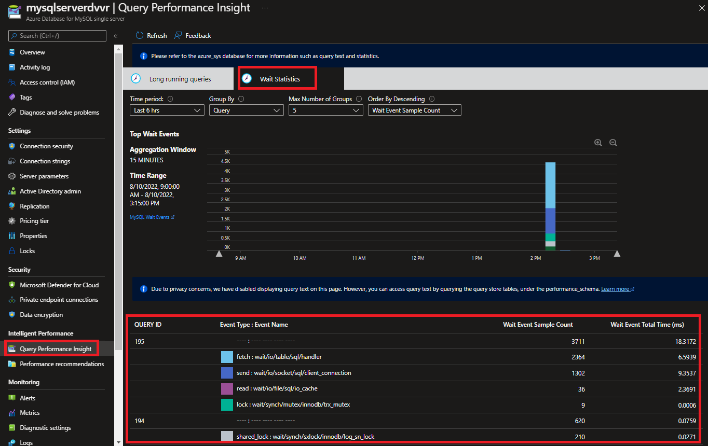
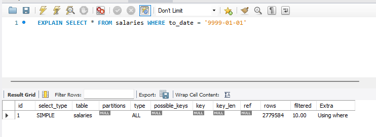
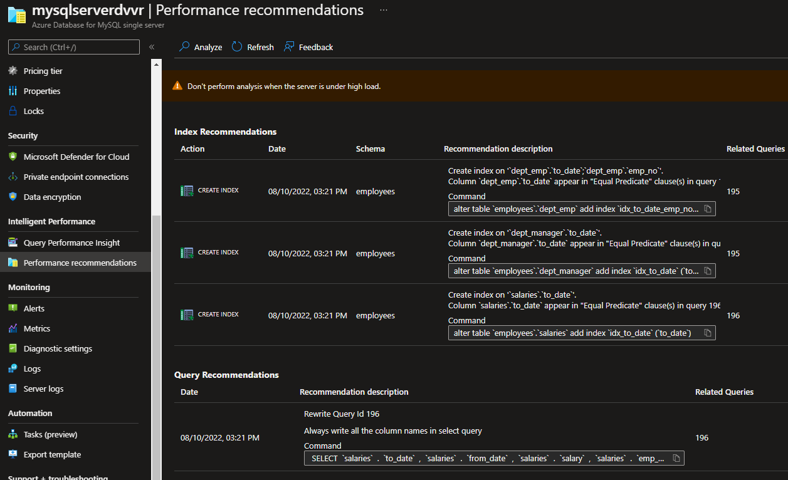
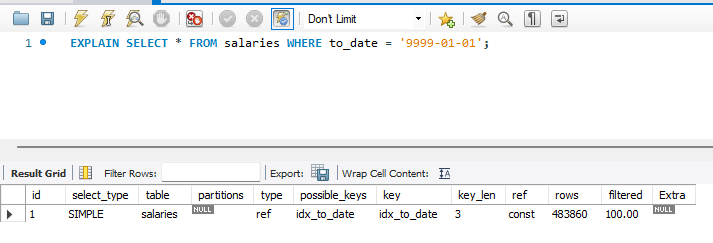

# Troubleshooting query performance in Azure Database for MySQL Single Server

**Introduction** 

During this lab, you will learn how to use multiple tools that will help you troubleshooting query performance in Azure Database for MySQL.

**Objectives** 

After completing this lab, you will be able to: 

- Setup Query Store for an Azure Database for MySQL Single Server.
- Review Performance Recommendation on the Portal for Azure Database for MySQL.
- Review Query Performance Insight on the Portal for Azure Database for MySQL.

**Considerations**

This lab considers that an Azure Database for MySQL Single Server named pgserver[your name initials] exists with a server admin login named *admmysq*, if not, create it or use another existing server before continuing with the lab.

**Estimated Time:** 50 minutes

---

## Exercise 1: Create a sample database on the Azure Database for MySQL Single Server

**Tasks**

1. Connect to Microsoft Azure Portal
    
   Open Microsoft Edge and navigate to the [Azure Portal](http://ms.portal.azure.com) to connect to Microsoft Azure Portal. Login with your subscriptions credential.

1. Go to your MySQL Server

   Go to your Azure Database for MySQL Single Server in any way you prefer to look for a resource on Azure

1. Identify the connection information for the Azure Database for MySQL Single Server

   Make a note of the **Server name** and the **Server admin login name**.

1. Create the *employees* database on the Azure Database for MySQL Single Server
   
   Dowonlad and extract the [employees demo database](https://github.com/danvalero/AzureOSSDBLabs/raw/main/Azure%20Database%20for%20MySQL%20Single%20Server/MySQLSSLabFiles/create_employees.zip) in **C:\\\MySQLSSLabFiles** folder

   Open a Windows Prompt and execute a script to restore the *employees* database using:
    
   ```bash
   mysql -h <server_name>.mysql.database.azure.com -u <admin_user>@<server_name> -p sys < C:\\MySQLSSLabFiles\\create_employees.sql
   ```
   for example:    
    
   ```bash
   mysql -h mysqlserverdvvr.mysql.database.azure.com -u admmysql@mysqlserverdvvr -p sys < C:\\MySQLSSLabFiles\\create_employees.sql
   ```

   >You need to enter password when prompted. 
   
   >This is destructive action. If there is a database named employees in the Azure Database for MySQL Single Server, the existing *employees* database will be dropped and replaced.
   
   The restore takes a few minutes to complete

Congratulations!. You have successfully completed this exercise.

---

## Exercise 2: Enable Query Store and review performance info in the Query Store

This exercise shows how to enable Query Store and use it to review performance data of your queries.

**Tasks**

1. Connect to Microsoft Azure Portal
    
   Open Microsoft Edge and navigate to the [Azure Portal](http://ms.portal.azure.com) to connect to Microsoft Azure Portal. Login with your subscriptions credential.

1. Go to your MySQL Server

   Go to your Azure Database for MySQL Single Server in any way you prefer to look for a resource on Azure

1. Go to Server Parameters
    
   

1. Enable query capture and enable wait statistics

   Search for *query_store*
    
   Set **query_store_capture_mode** to **ALL.**.

   Set **query_store_retention_period_in_days** to **14**. This option will allow you to set the retention period of the query store it can be between 1 and 30 days.Avoid keeping historical data you do not plan to use. Increase the value if you need to keep data longer.

   Set **query_store_wait_sampling_capture_mode** to **ALL**. This option will enable the wait statistics

   Set **query_store_wait_sampling_frequency** to **15**. This option specifies how often (in seconds) wait events are sampled.

   >For *query_store_wait_sampling_frequency*, the shorter the period, the more frequent the sampling. More information is retrieved, but that comes with the cost of greater resource consumption. Increase this period if the server is under load or you don't need the granularity.

   

   >Other configuration options are available Rfefer to [Configuration options](https://docs.microsoft.com/en-us/azure/mysql/single-server/concepts-query-store#configuration-options) for further information 
   
   Click **Save**.

   It should only take a few seconds for each parameter to change. When the paremters are updated you will see the notification
    
   

1. Run some queries to populate its statistics on the Query Store.
    
   Using MySQL Workbench or any other MySQL client tool connect to the database server and the **employees** database

   Execute 4 times the following query:

   ```sql
   SELECT E.emp_no AS employee_numnber
        , CONCAT_WS(',',E.last_name,E.first_name) AS employee_name
        , E.hire_date 
        , D.dept_name AS employee_department
        , DE.from_date AS start_date_in_department
        , CONCAT_WS(',',DME.last_name,DME.first_name) AS manager_name
   FROM employees E
	   INNER JOIN dept_emp DE 
         ON E.emp_no = DE.emp_no
         AND DE.to_date = ( SELECT MAX(to_date)
                            FROM dept_emp DE1
                            WHERE E.emp_no = DE1.emp_no)
         AND DE.to_date = '9999-01-01'                         
	   INNER JOIN departments D
         ON D.dept_no = DE.dept_no
	   INNER JOIN dept_manager DM
         ON DM.dept_no = D.dept_no
	   INNER JOIN employees DME
	     ON DM.emp_no = DME.emp_no AND DM.to_date = '9999-01-01' 
   ORDER BY E.emp_no ASC;
   ```
   
   
      
   Also, execute 3 times the following query:
   
   ```sql
   SELECT * FROM salaries WHERE to_date = '9999-01-01';
   ```
   
   

1. Review the query statistics on the Query Store
    
   Query Store data is stored in the *mysql* database on your Postgres server.

   >Allow up to 20 minutes for the first batch of data to persist in the *mysql* database. You might want to take a break now

   To see execution statistics for the 1st query you ran in the previous Task, connect to *mysql* and execute the following query:

   ```sql
   SELECT *
   FROM  mysql.query_store
   WHERE query_sample_text LIKE 'SELECT E.emp_no%';
   ```

   

   You can see the 4 executions of the query queryID (195 in the example image), the whole query test, the execution count, etc.

   To see all the waits encountered for a query, connect to *mysql*, and execute the following query:

   ```sql
   SELECT * 
   FROM mysql.query_store_wait_stats
   WHERE query_id = '<query_id>';
   ```
   
   >Replace *<query_id>* with one of the query_id returned in the previous query

   

   For further details of the meaning of each event_name, refer to [Wait Instrument Elements](https://dev.mysql.com/doc/refman/8.0/en/performance-schema-instrument-naming.html#performance-schema-wait-instrument-elements)

   Additionally, expand the *mysql* database and review the views with names that start with *query_store* to see what else this query store has to offer. For further infomation about the meaning of each column refer to [Views and functions](https://docs.microsoft.com/en-us/azure/mysql/single-server/concepts-query-store#views-and-functions)

Congratulations!. You have successfully completed this exercise.

---

## Exercise 3: Query Performance Insight for Azure Database for MySQL Single Server 

Query Performance Insight helps you to quickly identify what your longest running queries are, how they change over time, and what waits are affecting them.

This exercise shows how to use Query Performance Insight for Azure Database for MySQL Single Server

**Tasks**

1. Connect to Microsoft Azure Portal
    
   Open Microsoft Edge and navigate to the [Azure Portal](http://ms.portal.azure.com) to connect to Microsoft Azure Portal. Login with your subscriptions credential.

1. Go to your MySQL Server

   Go to your Azure Database for MySQL Single Server in any way you prefer to look for a resource on Azure

1. Go to **Query Performance Insight** under **Intelligent Performance**
    
   Under **Long Running Queries** tab, you will be able to see the different execution for the longest running queries.

   In this tab:
   - By default you will see the top five longest running queries but you can view the top *10* or top *15* queries by changing the value of the *Number of Queries* pulldown.
   - You can also see the *min, max, sum* values by changing the *Selected by* pulldown, with *avg* as the default value.
   - You can change the *Time Period* pull down to see the queries for the last *6 hours, last week* or *last month*, with the last *24 hours* as the default value.

   
    
   Notice that the queries executed in the previuos Exercise are reported.
       
   Under **Wait Statistic** tab, you will be able to see the Top Events (waits) by either individual Queries or by Event type.
    
   In this tab:
   - By default, you should be able to see the events in the last *24 hours* or change the *Time Period* pulldown to *6 hours, last week* or *last month*.
   - You can change how to group the report by either *Query* or *Event* by changing the value of the *Group By* pulldown.

   
    
   Examine the wait types that affected the queries executed in the previous exercise.
    
1. Identify the query text

   Due to privacy concerns, the query text is not shown in the Query Performance Insight
   
   To access query text, connect to the *mysql* database and execute

   ```sql
   SELECT *
   FROM  mysql.query_store
   WHERE query_id = '<query_id>';
   ```

   >Make sure you replace *\<query_id\>* with the id you see in the query Performance Insight screen for the query that was executed 3 times

   

   Notice is the query you executed 3 times in the previos exercise

   ```sql
   SELECT * FROM salaries WHERE to_date = '9999-01-01';   
   ```

1. Basic troubleshooting

   Connect to the **employees** database and run the query using EXPLAIN 

   ```sql
   EXPLAIN SELECT * FROM salaries WHERE to_date = '9999-01-01';
   ```

   

   This is a simple query, however, MySQL is doing a Full Table Scan on *salaries*. You can tell this as *key* is null

   As *possible_keys* is also null, you can tell there is no index that can help the query
   
   The query has a simple conditin in the WHERE clause to filter by *to_date*

   Review the indexes for *salaries* by executing:

   ```sql
   SHOW INDEX FROM employees.salaries;
   ```

   

   There is only only index, the one for the primary key by columns emp_no and from_date
      
   To optimize this query, an index on column *to_date* on table *salaries* could help. 

   >Do not create any index yet.

Congratulations!. You have successfully completed this exercise.

---

## Exercise 4: Performance Recommendations for Azure Database for MySQL Single Server

This exercise shows how to use the Azure Portal's Performance Recommendations for Azure Database for MySQL.

**Tasks**

1. Connect to Microsoft Azure Portal
    
   Open Microsoft Edge and navigate to the [Azure Portal](http://ms.portal.azure.com) to connect to Microsoft Azure Portal. Login with your subscriptions credential.

1. Go to your MySQL Server

   Go to your Azure Database for MySQL Single Server in any way you prefer to look for a resource on Azure

1. Go to **Performance Recommendations** under **Intelligent Performance**
    
   The first time you run this service, it will show no recommendations, and advice you to perform and analysis. 
   
   Click on the **Analyze** option

   

   Wait for the recommendations to be generated.


1. Review recommendations
    
   You should get a similar result as the one shown below.
    
   
    
   Azure is recommending to create some indexes and rewriting a query (queryID 196 in this example), the same query idenitified on the previous exercise that could benfit of an index on column *to_date* on table *salaries*. 

   

1. Apply index recommendation and evaluate resuts 

    Create the index using the command in the "Recomendation description"

    ```sql
    alter table `employees`.`salaries` add index `idx_to_date` (`to_date`)
    ```

    > In a production environment you would evaluate the recommendations and apply those that you believe will improve the performance of your queries.

    Review the execution plan by executing

    ```sql
    EXPLAIN SELECT * FROM salaries WHERE to_date = '9999-01-01';
    ```

    

    The query now uses an Non-Unique Key Lookup using index *idx_to_date* on *salaries* instead of a Full Table Scan. 

    The recomendation was valid and helpuful for performance.

Congratulations!. You have successfully completed this exercise and the Lab.