# Azure Database for PostgreSQL Flexible Server and SSL

**Author**: Daniel Valero

I have divided the explanation if four sections to make reading easier.

- [PostgreSQL SSL fundamentals](#postgresql-ssl-fundamentals)
- [How to tell if a connection is using SSL](#how-to-tell-if-a-connection-is-using-ssl)
- [Azure Database for PostgreSQL Flexible server behavior for sslmode and require_secure_transport](#azure-database-for-postgresql-flexible-server-behavior-for-sslmode-and-require_secure_transport)
  - [1. Using require_secure_transport=on (the server forces encrypted connections)](#1-using-require_secure_transporton-the-server-forces-encrypted-connections)
  - [2. Using require_secure_transport=off (the server does not force encrypted connections)](#2-using-require_secure_transportoff-the-server-does-not-force-encrypted-connections)
- [Summary](#summary)
 
## PostgreSQL SSL fundamentals

- SSL support is always enabled on Azure Database for PostgreSQL Flexible Server
  Sever parameter *ssl* is set **ON* by default and cannot be disabled. If you try to disable it you get an error
 
  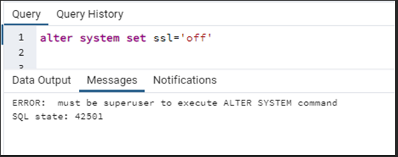
 
- If the connection must use SSL or not is defined by require_secure_transport (set to ON by default)
 
- The clients define if they want to user SSL or not using the sslmode parameter. Consider that different clients can have use a different default sslmode so it is recommended to define the value explicitly base on your needs 
 
- According to public PostgreSQL documentation at [PostgreSQL: Documentation: 15: 34.19. SSL Support](https://www.postgresql.org/docs/current/libpq-ssl.html), there are 3 types of attacks you can protect from using SSL:
 
   | | |
   |---|---|
   |Eavesdropping|If a third party can examine the network traffic between the client and the server, it can read both connection information (including the user name and password) and the data that is passed. SSL uses encryption to prevent this.|
   |Man-in-the-middle (MITM)|If a third party can modify the data while passing between the client and server, it can pretend to be the server and therefore see and modify data even if it is encrypted. The third party can then forward the connection information and data to the original server, making it impossible to detect this attack. Common vectors to do this include DNS poisoning and address hijacking, whereby the client is directed to a different server than intended. There are also several other attack methods that can accomplish this. SSL uses certificate verification to prevent this, by authenticating the server to the client.|
   |Impersonation|If a third party can pretend to be an authorized client, it can simply access data it should not have access to. Typically this can happen through insecure password management. SSL uses client certificates to prevent this, by making sure that only holders of valid certificates can access the server.|
 
- The SSL mode indicate the type of protection you desire

   |sslmode     | Eavesdropping protection | MITM protection | Statement |
   |---|---|---|---|
   |disable	    | No	                      | No	             | I don't care about security, and I don't want to pay the overhead of encryption.|
   |allow	    | Maybe	                   | No              |	I don't care about security, but I will pay the overhead of encryption if the server insists on it.|
   |prefer	    | Maybe	                   | No	             | I don't care about encryption, but I wish to pay the overhead of encryption if the server supports it.|
   |require	    | Yes	                   | No	             | I want my data to be encrypted, and I accept the overhead. I trust that the network will make sure I always connect to the server I want.|
   |verify-ca	 | Yes	                   | Depends on CA policy	| I want my data encrypted, and I accept the overhead. I want to be sure that I connect to a server that I trust.|
   |verify-full |	Yes	                   | Yes	          | I want my data encrypted, and I accept the overhead. I want to be sure that I connect to a server that I trust.|
 
- Depending on the value of *sslmode* used by the client and the *require_secure_transport* parameter on the server, you will get different results.
  
  To get the higher level of protection (Eavesdropping protection and MITM protection) you must use **sslmode=verify-full* in the client and set *require_secure_transport* to **ON** on the server.
 
- Azure Database for PostgreSQL does not support client certificates. To limit client access you can use firewall rules (for public access server) or NSG or other azure networking mechanism to restrict client reaching the server (when using VNET integrated  servers)
 

## How to tell if a connection is using SSL 
 
- To confirm what sessions are using SSL or not by executing:

  ```sql
  SELECT pg_stat_activity.pid
       , pg_stat_activity.datname
       , pg_stat_activity.usename
       , pg_stat_activity.application_name
       , pg_stat_activity.client_addr
       , pg_stat_ssl.ssl
       , pg_stat_ssl.version
  FROM pg_stat_ssl
  JOIN pg_stat_activity
  ON pg_stat_ssl.pid = pg_stat_activity.pid
  WHERE usename != 'azuresu';
  ```

- To confirm if your current session is using SSL or not you can run:

  ```sql
  SELECT * 
  FROM pg_stat_ssl 
  WHERE pg_stat_ssl.pid = pg_backend_pid();
  ```

## Azure Database for PostgreSQL Flexible server behavior for sslmode and require_secure_transport
 
To illustrate the SSL behavios of connections depending on server and client settings, I did several tests:
 
### 1. Using require_secure_transport=on (the server forces encrypted connections)
 
Results:
- Connections using sslmode **disable** are not allowed. That is the expected behavior
- Connections using sslmode **allow**, **prefer**, **require**, **verify-ca** or **verify-all** use SSL. That is the expected behavior
 
Details of tests:
 
- When using **sslmode=disable**, the connection is rejected as expected, because the client is telling encryption is not required and the server requires SSL.
 
  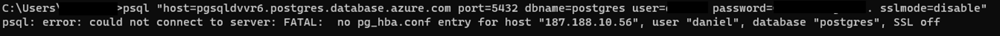

- When using **sslmode=allow**, the connection uses SSL (ssl = t) as expected because the server requires it.
 
  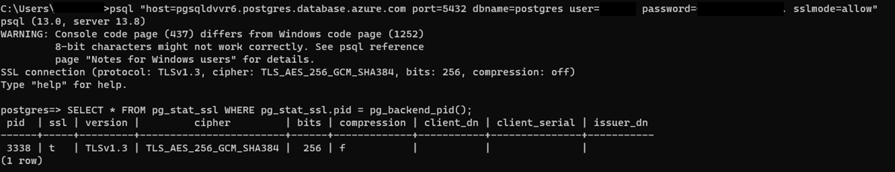
 
- When using **sslmode=prefer**, the connection use SSL (ssl = t) as expected 
 
  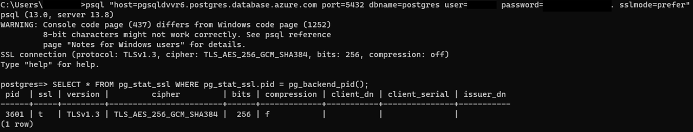
 
- When using **sslmode=require**, the connection use SSL (ssl = t) as expected
 
  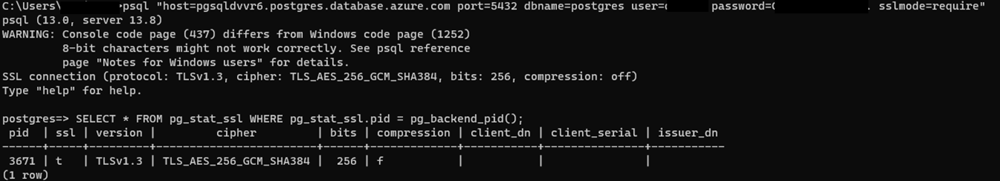
 
- When using **sslmode= verify-ca**, the connection use SSL (ssl = t) as expected
 
  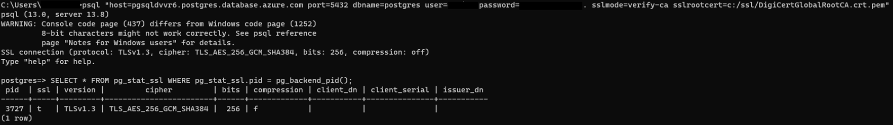
 
- When using **sslmode= verify-full**, the connection use SSL (ssl = t) as expected
 
  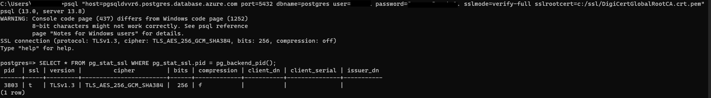

### 2. Using require_secure_transport=off (the server does not force encrypted connections)
 
Results:
- Connections using sslmode **disable** or **allow** does not use SSL. That is the expected behavior
- Connections using sslmode **prefer**, **require**, **verify-ca** or **verify-all** use SSL. That is the expected behavior
 
Details of tests:
 
- When using **sslmode=disable**, the connection does not use SSL (ssl = f) as expected, because the client is telling encryption is not required
 
  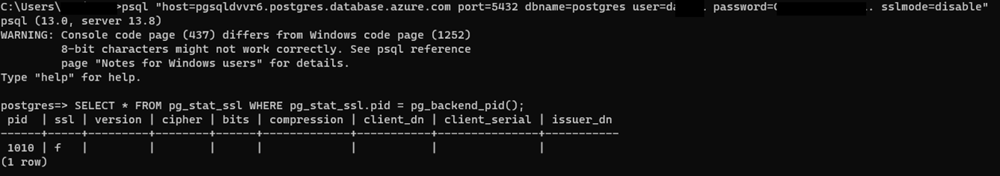

- When using **sslmode=allow**, the connection does not use SSL (ssl = f) as expected as the server does not force SSL
 
  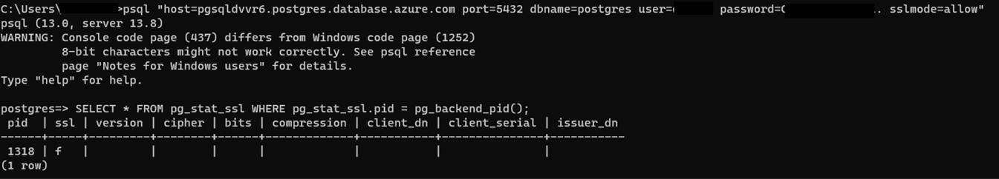
 
- When using **sslmode=prefer**, the connection use SSL (ssl = t) as expected 
 
  
 
- When using **sslmode=require**, the connection use SSL (ssl = t) as expected
 
  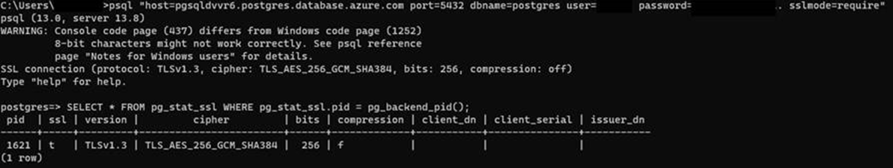
 
- When using **sslmode= verify-ca**, the connection use SSL (ssl = t) as expected
 
  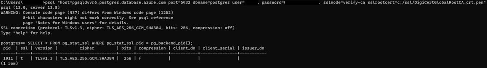
 
- When using **sslmode= verify-full**, the connection use SSL (ssl = t) as expected
 
  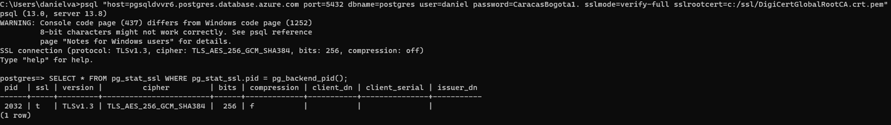

## Summary
- SSL support is always enabled on Azure Database for PostgreSQL Flexible Server, and by default SSL connections are required (require_secure_transport=ON)
- The clients define if they want to user SSL or not using the sslmode parameter. Consider that different clients can have use a different default sslmode so it is recommended to define the value explicitly base on your needs 
- To get Eavesdropping protection and MITM protection, you must use **sslmode=verify-full** in the client and set require_secure_transport to ON on the server.
- When require_secure_transport=on  (default)
  - Connections using sslmode **disable** are not allowed. 
  - Connections using sslmode **allow**, **prefer**, **require**, **verify-ca** or **verify-all** use SSL. 
- When require_secure_transport=off 
  -	Connections using sslmode **disable** or **allow** does not use SSL. 
  -	Connections using sslmode **prefer**, **require**, **verify-ca** or **verify-all** use SSL. 
-	Azure Database for PostgreSQL does not support client certificates. To limit client access you can use firewall rules (for public access server) or NSG or other azure networking mechanism to restrict client reaching the server (when using VNET integrated servers). 
