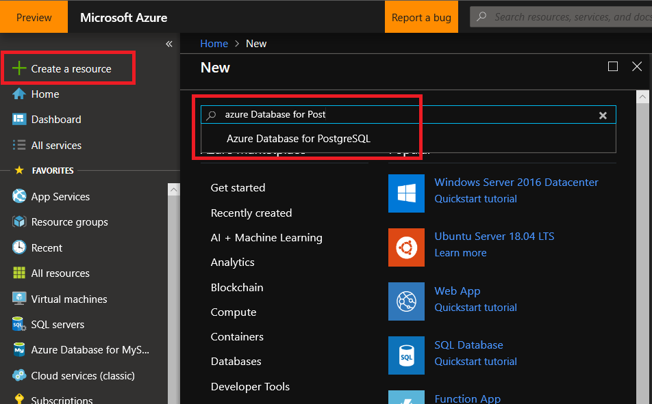
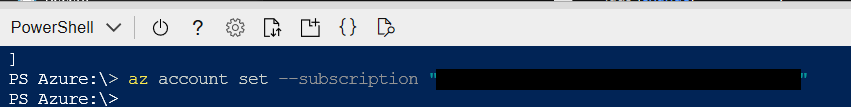
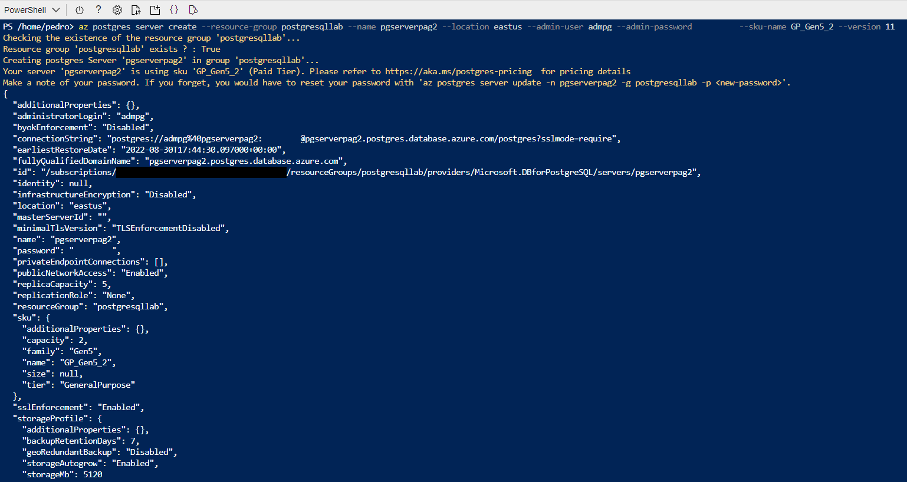
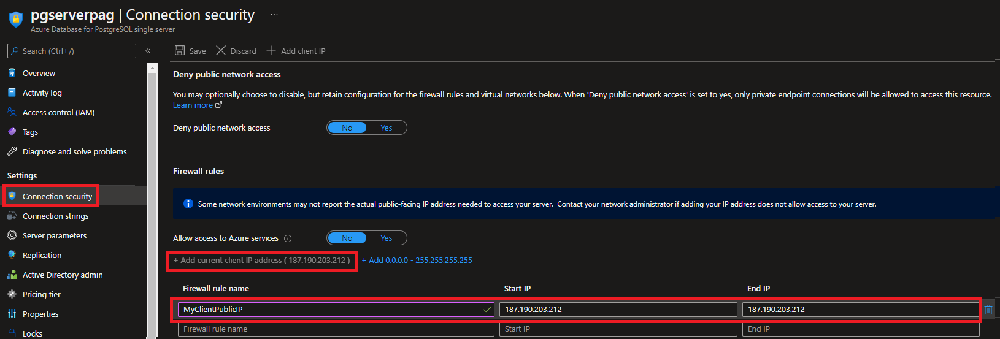
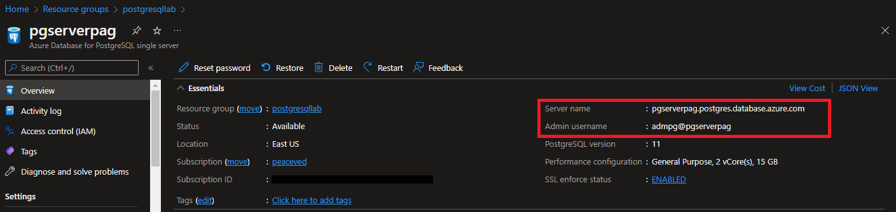
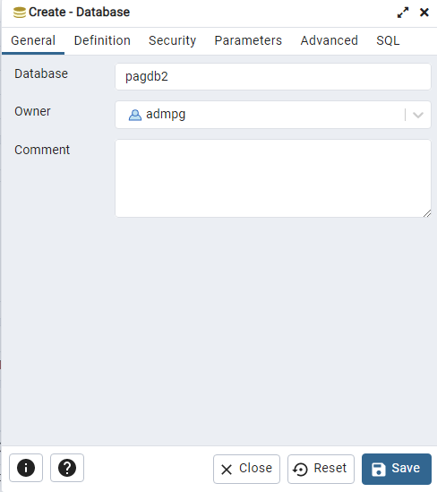
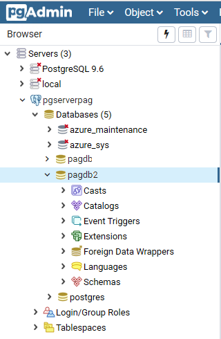

# Create and connect to an Azure Database for PostgreSQL Single Server

**Introduction**

In this Lab, we will walk through provisioning Azure Database for PostgreSQL Single Server using Azure Portal and Azure CLI. You will also learn how to connect your Azure Database for PostgreSQL Single Server through using [psql](https://www.postgresql.org/docs/9.6/static/app-psql.html) utility in Cloud Shell and [pgAdmin](http://www.pgadmin.org/) tool, after configuring firewall rules for your Azure Database for PostgreSQL Single Server. You will leverage Azure Portal to configure firewall rule in this lab.

**Objectives** 

After completing this lab, you will be able to: 

- Provision Azure Database for PostgreSQL Single Server using the Azure Portal
- Provision Azure Database for PostgreSQL Single Server using Azure CLI
- Configure a server-level firewall rule
- Get the connection information
- Connect to the PostgreSQL Database by using psql in Cloud Shell and pgAdmin
- Create new databases using psql and pgAdmin

**Estimated Time:** 60 minutes

**Exercise list**
- [Create and connect to an Azure Database for PostgreSQL Single Server](#create-and-connect-to-an-azure-database-for-postgresql-single-server)
  - [Exercise 1: Create an Azure Database for PostgreSQL Single Server in the Azure Portal](#exercise-1-create-an-azure-database-for-postgresql-single-server-in-the-azure-portal)
  - [Exercise 2: Create an Azure Database for PostgreSQL Single Server using Azure CLI](#exercise-2-create-an-azure-database-for-postgresql-single-server-using-azure-cli)
  - [Exercise 3: Configure a server-level firewall rule](#exercise-3-configure-a-server-level-firewall-rule)
  - [Exercise 4: Get the connection information](#exercise-4-get-the-connection-information)
  - [Exercise 5: Connect to the PostgreSQL Database by using psql in Cloud Shell](#exercise-5-connect-to-the-postgresql-database-by-using-psql-in-cloud-shell)
  - [Exercise 6: Connect to the PostgreSQL Server using pgAdmin](#exercise-6-connect-to-the-postgresql-server-using-pgadmin)

---

## Exercise 1: Create an Azure Database for PostgreSQL Single Server in the Azure Portal

The steps below show you how to create an Azure Database for PostgreSQL Single Server using the Azure Portal.

**Tasks**

1. Connect to Microsoft Azure Portal
    
   Open Microsoft Edge and navigate to the [Azure Portal](http://ms.portal.azure.com) to connect to Microsoft Azure Portal. Login with your subscriptions credential.
    
1. Create Azure Database for PostgreSQL Resource
    
   Click on **+ Create a resource** in the upper-left corner of the Portal
   
   Look for **Azure Database for PostgreSQL** and select it.
   
   
   
   Click on **Create**
    
   
    
   Select **Single Server**
    
   
    
   Configure the new server using the following information:

   >If the server exists, use a different number at the end of the name. The server name must be unique across all Azure customers.

   | Property             | Value                              |
   | -------------------- | -----------------------------------|
   | **Subscription**     | Select your subscription           |
   | **Resource group**   | postgresqllab                      |
   | **Servername**       | pgserver[your name initials]       |
   | **Data source**      | none                               |
   | **Admin Username**   | admpg                              |
   | **Password**         | Use a complex password. The server admin login and password that you specify here are required to sign into the server and its databases. Remember or record this information for later use                              |
   | **Confirm Password** | Use same value used for Password   |
   | **Location**         | Select a Location near to you      |
   | **Version**          | 11                                 |
   | **Compute + storage**| General Purpose, 2Vcores, 15GB storage. Use default values for other setting |                  

   
    
   
    
   Select **Create + Review**
    
   Review the configuration and click on **Create** to provision the server. This operation may take a few minutes.
    
   
    
   Wait until the server is created.
    
   On the toolbar, select the Notifications icon (a bell) to monitor the deployment process. Once the deployment is done, you can select **Pin to dashboard**, which creates a tile for this server on your Azure Portal dashboard as a shortcut to the server's Overview page. Click on **Go to resource** to open the server's Overview page
    
   
    
   The Azure Database for PostgreSQL have been created and it is ready for use.
    
   

Congratulations! You have successfully completed this exercise.

---

## Exercise 2: Create an Azure Database for PostgreSQL Single Server using Azure CLI

The steps below show you how to create an Azure Database for PostgreSQL Single Server using Azure CLI

Azure CLI can be used from the Azure Cloud Shell or can be installed locally in your machine.

This lab uses Azure CLI from the Azure Cloud Shell

For instructions on how to install Azure CLI locally refer to [Install Azure CLI](https://docs.microsoft.com/en-us/cli/azure/install-azure-cli-windows?view=azure-cli-latest)

**Tasks**

1. Connect to your Azure subscription
    
   Open Microsoft Edge and navigate to the [Azure Portal](http://ms.portal.azure.com) to connect to Microsoft Azure Portal. Login with your subscriptions credential.

1. Open Azure Cloud Shell
    
   Select the **Cloud Shell** button on the menu in the upper-right corner of the Azure Portal
    
   
    
   Select the PowerShell option for the Azure Cloud Shell
    
   
    
   If this is the first time we are opening, Azure will prompt us to select a subscription to create a storage account and Microsoft Azure Files share If so, click on **Create storage** and wait until the creation ends.
    
   
    
   When the Azure Cloud Shell is ready to use you will see a screen as the following:
    
   

1. Connect to your subscription
    
   List the subscriptions available by executing:
    
   ```bash
   az account list
   ```
    
   
    
   Identify the subscription you will use for this exercise and make sure you are on it by executing:
    
   ```bash
   az account set --subscription <subscription id>
   ```
   
   

1. Create the Azure Database for PostgreSQL Single Server
    
   NOTE: You will use the resource group (**postgresqllab**) created on exercise 1 for the new server
   
   To create a server named pgserver[your name initials]2 on eastus and using a similar configuration used in exercise 1, execute:

   ```bash
   az postgres server create --resource-group postgresqllab --name pgserver<your name initials>2 --location eastus --admin-user admpg --admin-password <server_admin_password> --sku-name GP_Gen5_2 --version 11
   ```

   NOTE: Make sure you modify the server name and server admin password before executing the command. You can use a region closer to you.
    
   
    
   Go to the Azure Portal, and look for the server you just created and click on it
    
   
    
   The Azure Database for PostgreSQL have been created and it is ready for use.
   
   

Congratulations! You have successfully completed this exercise.

---

## Exercise 3: Configure a server-level firewall rule

Azure Database for PostgreSQL creates a firewall at the server level. It prevents external applications and tools from connecting to the server and any databases on the server, unless you create a rule to open the firewall for specific IP addresses. Server-level firewall rules enable administrators to access an Azure Database for PostgreSQL Single Server from a specified IP address or range of IP addresses.

**Tasks**

1. Connect to Microsoft Azure Portal
    
   Open Microsoft Edge and navigate to the [Azure Portal](http://ms.portal.azure.com) to connect to Microsoft Azure Portal. Login with your subscriptions credential.

1. Go to your PostgreSQL Server

   Go to your Azure Database for PostgreSQL Single Server created in Exercise 1 (named pgserver[your name initials]) in any way you prefer to look for a resource on Azure. 

1. Configure firewall rule for your Azure Database for PostgreSQL Resource

   On the PostgreSQL server page, under **Settings** heading, click **Connection security** to open the Connection security page for the Azure Database for PostgreSQL.
   
   Click **Add client IP** on the toolbar. This automatically creates a firewall rule with the public IP address of your computer, as perceived by the Azure system. Change the name of the rule to *MyClientPublicIP*.

   >Verify your IP address before saving the configuration. In some situations, the IP address observed by Azure portal differs from the IP address used when accessing the internet and Azure servers. Therefore, you may need to change the Start IP and End IP to make the rule function as expected. Use a search engine or other online tool to check your own IP address. For example, search for "what is my IP."

   Click **Save** on the toolbar to save this server-level firewall rule. Your final configuration should look like:

   

1. Allow access to Azure services option to Yes
    
   On your PostgreSQL server page, under **Settings** page, click **Connection security** to open the Connection security page for the Azure Database for PostgreSQL
    
   Set **Allow access to Azure services** option to **Yes** in the Azure Portal from the Connection security pane and click **Save**
    
   >This step is necessary to connect to the Azure Database for PostgreSQL Single Server from the Azure Cloud Shell.
    
   
    
   >**Note:** You will learn about this feature in the following lessons.

Congratulations! You have successfully completed this exercise.

---

## Exercise 4: Get the connection information

When you create your Azure Database for PostgreSQL Single Server, a default database named postgres is created. To connect to your database server, you need your full server name and admin login credentials. You can easily find the server name and login information on the server **Overview** page in the Azure Portal.

**Tasks**

1. Connect to Microsoft Azure Portal
    
   Open Microsoft Edge and navigate to the [Azure Portal](http://ms.portal.azure.com) to connect to Microsoft Azure Portal. Login with your subscriptions credential.
   
1. Go to your PostgreSQL Server

   Go to your Azure Database for PostgreSQL Single Server in any way you prefer to look for a resource on Azure

1. Get the connection information for your Azure Database for PostgreSQL Single Server
    
   On your PostgreSQL server page, go to the **Overview** page.
    
   Make a note of the Server name and the Server admin login name. Hover your cursor over each field, and the copy symbol appears to the right of the text. Select the copy symbol as needed to copy the values.
    
   

Congratulations! You have successfully completed this exercise.

---

## Exercise 5: Connect to the PostgreSQL Database by using psql in Cloud Shell

There are several applications you can use to connect to your Azure Database for PostgreSQL Single Server. Let's first use the psql command-line utility to illustrate how to connect to the server. You can use a web browser and Azure Cloud Shell as described here without the need to install any additional software. If you have the psql utility installed locally on your own machine, you can connect from there as well.

**Tasks**

1. Connect to Microsoft Azure Portal
    
   Open Microsoft Edge and navigate to the [Azure Portal](http://ms.portal.azure.com) to connect to Microsoft Azure Portal. Login with your subscriptions credential.

1. Open Azure Cloud Shell
    
   Select the **Cloud Shell** button on the menu in the upper-right corner of the Azure Portal.
    
   
    
   Select the PowerShell option for the Azure Cloud Shell
    
   
   
   When the Azure Cloud Shell is ready to use you will see a screen as the following:
    
   

1. Connect to your Azure Database for PostgreSQL Single Server using psql tool.
    
   At the Cloud Shell prompt, connect to a database in your Azure Database for PostgreSQL Single Server by typing the psql command line.
    
   To connect to an Azure Database for PostgreSQL Single Server with the psql utility, use the following as format:
    
   ```bash
   psql --host=<yourserver> --port=<port> --username=<server admin login> --dbname=<database name>
   ```
    
   Example

   ```bash
   psql --host=pgserverpag.postgres.database.azure.com --port=5432 --username=admpg@pgserverpag --dbname=postgres
   ```
    
   After you run the psql command with your own parameter values, you're prompted to enter the server admin password. This password is the same one that you provided when you created the server
    
   

1. Create a new database
    
   Create your own database to work with by executing:
    
   ```sql
   create database <your initials>db;
   ```
  
   
   
   List databases in the server (you will find your new database) by executing 

   ```bash
   \list 
   ```
   
   
    
   switch connections to the newly created database by executing :
    
   ```bash
   \c <your initials>db
   ```
    
   
    
   Type **\q**, and then press the **Enter** key to quit psql. You can close Cloud Shell after you're finished.
    
   

Congratulations! You have successfully completed this exercise.

---

## Exercise 6: Connect to the PostgreSQL Server using pgAdmin

pgAdmin is an open-source tool used with PostgreSQL. You can install pgAdmin from the [pgAdmin website](http://www.pgadmin.org/). Read the pgAdmin documentation if you need additional guidance.

**Tasks**

1. Connect to your Azure Database for PostgreSQL Single Server using pgAdmin tool.
    
   Open **pgAdmin**.
   
   On the left panel, right click on **Servers**, select **Create** and then **Server**
   
   
   
   In the **Create - Server** dialog box, on the **General** tab, enter a unique friendly name or the server.
   
   
    
   In the **Create - Server** dialog box, on the **Connection** tab, fill in the settings table. Use the connection information you got in exercise 4.
    
   Select the option **Save password?**
    
   
    
   Select **Save**
    
   In the Browser pane on the left, expand the **Servers** node and select your server.
    
   
    
   Expand your server node, and then expand **Databases** under it. The list should include the database you create in the exercise 5.
    
   

1. Create a new database in your Azure Database for PostgreSQL Single Server
    
   You can create multiple databases per server with Azure Database for PostgreSQL. To create a database, right-click **Databases**, choose the **Create** menu, and then select **Database**
    
   
    
   In the **Create – Database** form
    
   Type a database name of your choice in the Database field, such as [your initials]db2
    
   Use the server admin user as database owner.
    
   
   
   Select **Save** to create a new blank database
    
   In the Browser pane, once the database is successfully created, you can see it in the list of databases under your server name. Double click on it to explore it.
    
   

1. Clean up the environment (optional)

   To save money, delete the two servers created during this lab.

   >If you will complete the next Lab soon, do not delete thes server named pgserver[your name initials] to save time.

   To delete a server, select **Delete** on the **Overview** pane, confirm deletion and click on **Delete**

   

Congratulations!. You have successfully completed this exercise and the Lab.