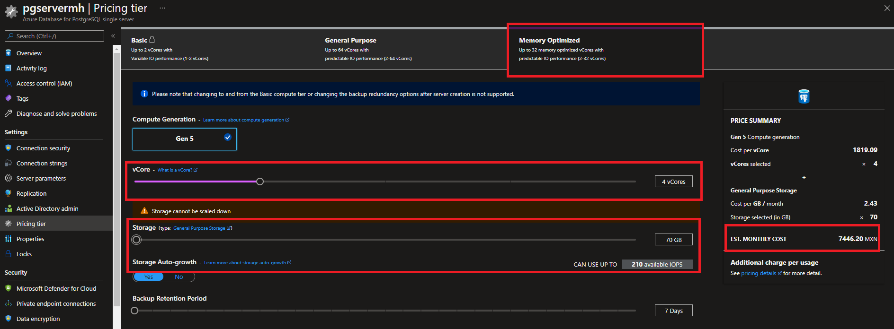
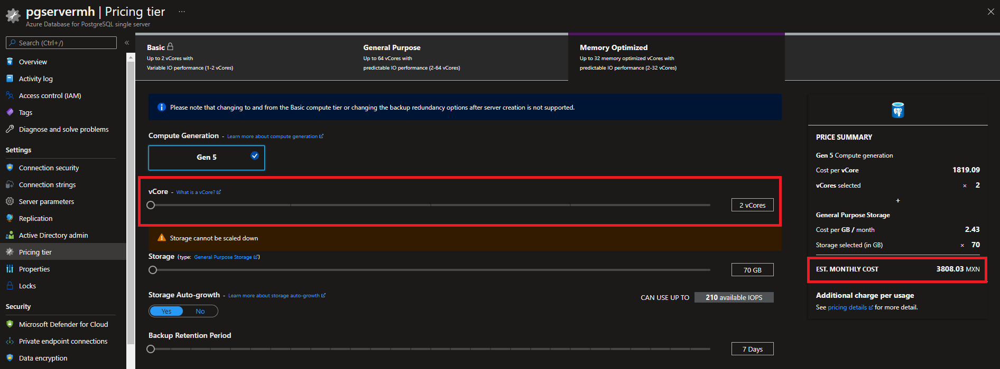

# Scale up and down an Azure Database for PostgreSQL Single Server

**Introduction**

During this lab, you will learn how to scale up/down vcores ad how to scale up storage and IOPS for an existing Azure Database for PostgreSQL Single Server

**Objectives**

After completing this lab, you will be able to: 

- Change the pricing tier of an existing Azure Database for PostgreSQL Single Server.
- Scale up vcores for an existing Azure Database for PostgreSQL Single Server.
- Scale up storage and IOPS for an existing Azure Database for PostgreSQL Single Server.
- Scale down vcores for an existing Azure Database for PostgreSQL Single Server.

**Considerations**

This lab considers that an Azure Database for PostgreSQL Single Server General Purpose named pgserver[your name initials] exists with a server admin login named *admpg*, if not, create it or use another existing server before continuing with the lab.

**Estimated Time:** 20 minutes

---

## Exercise 1: Scale up an Azure Database for PostgreSQL Single Server

This exercise shows how to, for an existing Azure Database for PostgreSQL Single Server, change the Pricing Tier, how to scale up vcores and how to scale up storage and IOPS

**Tasks**

1. Connect to Microsoft Azure Portal
    
   Open Microsoft Edge and navigate to the [Azure Portal](http://ms.portal.azure.com) to connect to Microsoft Azure Portal. Login with your subscriptions credential.

1. Go to your PostgreSQL Server

   Go to your Azure Database for PostgreSQL Single Server in any way you prefer to look for a resource on Azure

1. Go to Pricing Tier
    
   
    
   >In this example, the server is a General Purpose server with 2 vCores and disk size is 5GB with 100 IOPS top

1. Scale up the server
    
   We will change the tier to *Memory Optimized*. Select the *Memory Optimized* tier. Please note that changing to the Basic pricing tier after server creation is not supported.
       
   Increase the number of vCores. For this lab, move the vCore scale duplicate your current number of vCores. Notice that the estimated monthly cost is updated to reflect the option you selected.
   
   Move the Storage scale to add additional 65GB. Notice that the available IOPS increases when you provision more storage and that the estimated monthly cost is updated to reflect the option you selected.
    
   >Notice that you can scale up the vCores and the storage independently.
    
   
    
   Click **OK** to confirm changes.
    
   The internal process to create a new server with the required configuration is started.
    
   Wait until it finishes.

Congratulations! You have successfully completed this exercise.

---

## Exercise 2: Scale down an Azure Database for PostgreSQL Single Server

This exercise shows how to, for an existing Azure Database for PostgreSQL Single Server, reduce (scale down) the number of vcores. It also shows that it is no possible to scale down storage once it has been provisioned.

**Tasks**

1. Connect to Microsoft Azure Portal
    
   Open Microsoft Edge and navigate to the [Azure Portal](http://ms.portal.azure.com) to connect to Microsoft Azure Portal. Login with your subscriptions credential.

1. Go to your PostgreSQL Server

   Go to your Azure Database for PostgreSQL Single Server in any way you prefer to look for a resource on Azure.

1. Go to Pricing Tier
    
   
    
   In this example, we have a server in a Memory Optimized server with 4 vCores and it can grow up to 70GB with 210 IOPS top

1. Scale down the server
    
   Note that changing to the Basic pricing tier after server creation is not supported. You can select between *General Purpose* and *Memory Optimized*. In this lab, we will keep the server as *Memory Optimized*.
    
   Move the vCore scale to reduce the number the vCores by half. Notice that the estimated monthly cost is updated to reflect the option you selected.
    
   Try to reduce the maximum storage. You cannot!!!
    
   >It is not possible to scale down storage. Make sure you do not over provision storage on server creation if you will not use it as storage costs will be higher and you will not be able to reduce it.
    
   
    
   Click **Ok** to confirm changes.
    
   The internal process to create a new server with the required configuration is started.
    
   Wait until it finishes.

Congratulations!. You have successfully completed this exercise and the Lab.