# Restore an Azure Database for PostgreSQL Single Server to a point in time

**Introduction**

During this lab, you will learn how to restore an Azure Database for PostgreSQL Single Server to a point in time and how to restore a deleted server

**Objectives** 

After completing this lab, you will be able to: 

- Restore an Azure Database for PostgreSQL Single Server to a point in time
- Restore a Deleted Azure Database for PostgreSQL Single Server

**Prerequisites**

This lab considers that an Azure Database for PostgreSQL Single Server named pgserver[your name initials] exists with a server admin login named *admpg*, if not, create it or use another existing server before continuing with the lab.

**Estimated Time:** 60 minutes

**Exercise list**
- [Restore an Azure Database for PostgreSQL Single Server to a point in time](#restore-an-azure-database-for-postgresql-single-server-to-a-point-in-time)
  - [Exercise 1: Restore a server to a point in time](#exercise-1-restore-a-server-to-a-point-in-time)
  - [Exercise 2: Restore a Deleted Azure Database for PostgreSQL Single Server](#exercise-2-restore-a-deleted-azure-database-for-postgresql-single-server)

---

## Exercise 1: Restore a server to a point in time

This exercise shows how to restore an Azure Database for PostgreSQL Single Server to a point in time

**Tasks**

1. Connect to Microsoft Azure Portal
    
   Open Microsoft Edge and navigate to the [Azure Portal](http://ms.portal.azure.com) to connect to Microsoft Azure Portal. Login with your subscriptions credential.
    
1. Go to your PostgreSQL Server

   Go to your Azure Database for PostgreSQL Single Server in any way you prefer to look for a resource on Azure

1. Restore the server to a point in time
    
   Click **Restore**
    
   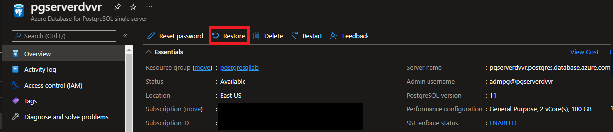

   Select the recovery point and the name of the new server. The last recovery points depend on when the server was created and the retention policy.

   >For lab purposes, if your server was created recently, select a recovery point not older than 5 minutes.

   Notice that a message indicates the retention policy configured for this server. You will see the following message (you can see a different message if using another server or have not completed previous labs).

   

   As the name of the server, use the name of your server and add *-recovered* at the end.

   Notice that the new server will be created at the same location and using the same pricing tier as the original server (but you can change it later.)

   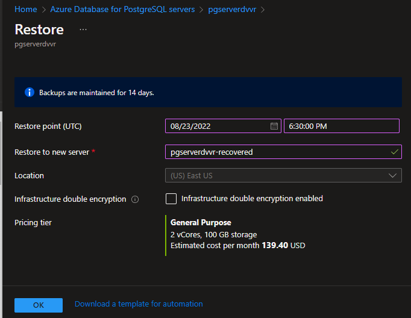

   Click **OK**

   Wait for the new server to be created.

   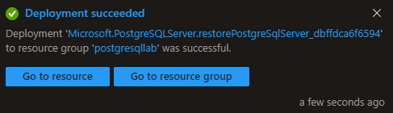

1. Access the restored server
    
   Go to the PostgreSQL Server you create in the previous step using your preferred method.
   
   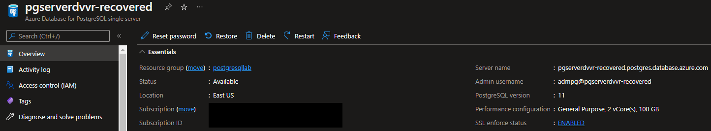

   Now you can administer and access this server as you do with any other Azure Database for PostgreSQL. You can change the administrator password, change the backup retention policies, change the pricing tier and do any administrative task you want as this is server independent of the one you restored from.
     
1. Delete the Azure Database for PostgreSQL Single Server
    
   To save money, delete the server you created as part of the restore operation
    
   On the Overview Pane, select **Delete** and then confirm deletion.

Congratulations! You have successfully completed this exercise.

---

## Exercise 2: Restore a Deleted Azure Database for PostgreSQL Single Server

This exercise shows how to restore a Deleted Azure Database for PostgreSQL Single Server

When a server is deleted, the database server backup can be retained up to five days in the service and will work only if the backup for the server is still available and not deleted from the system.

>For lab purposes, you will delete the server used for this lab. 

**Tasks**

1. Connect to Microsoft Azure Portal
    
   Open Microsoft Edge and navigate to the [Azure Portal](http://ms.portal.azure.com) to connect to Microsoft Azure Portal. Login with your subscriptions credential.
    
1. Go to your PostgreSQL Server

   Go to your Azure Database for PostgreSQL Single Server in any way you prefer to look for a resource on Azure

1. Delete the Azure Database for PostgreSQL Single Server
    
   On the Overview Pane, select **Delete** and then confirm deletion.

   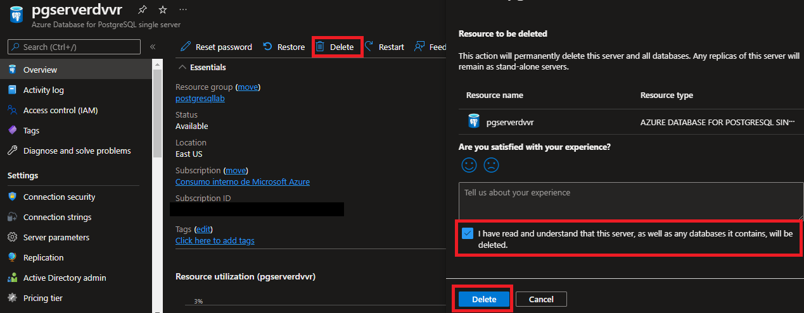
   
   >NOOOO!!! You deleted a production server... now you need to recover it.

1. Get the deletion details

   Go to the **Activity Log** and identify the event for the server deletion. 

   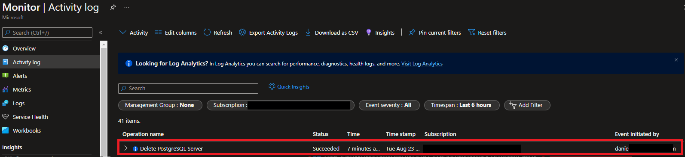

   Click on the event, select the **JSON** option and note the *resourceId* and *submissionTimestamp* attributes in JSON output

   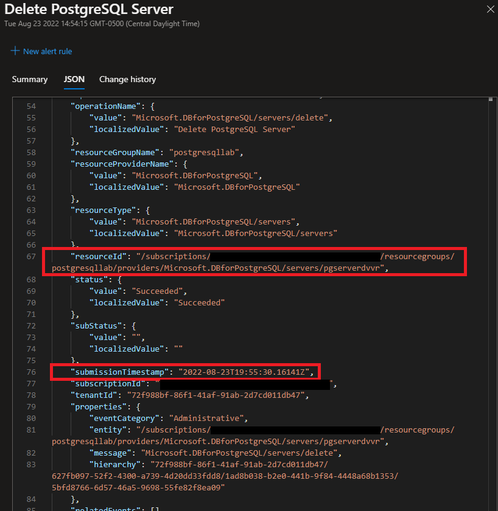

1. Recover the deleted server 

   Go to Create Server [Create Server REST API Page](https://docs.microsoft.com/en-us/rest/api/postgresql/singleserver/servers/create?tabs=HTTP)  and click on the "Try It" tab highlighted in green and login in with your Azure account.

   Provide the resourceGroupName, serverName (deleted server name), subscriptionId, derived from resourceId attribute captured in task 4

   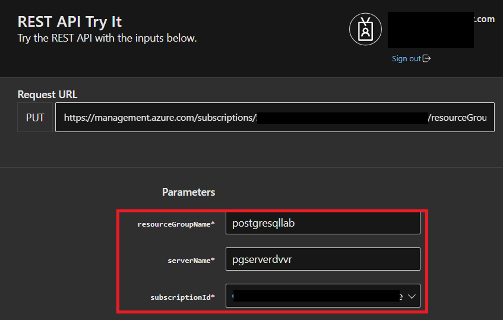

   Scroll below on **Body** section and paste the following:

   ```JSON
   {
    "location": "Dropped Server Location",  
    "properties": 
        {
            "restorePointInTime": "submissionTimestamp - 15 minutes",
            "createMode": "PointInTimeRestore",
            "sourceServerId": "resourceId"
        }
   }
   ```

   Replace the following values in the above request body:
   - "Dropped server Location" with the Azure region where the deleted server was originally created
   - "submissionTimestamp", and "resourceId" with the values captured in task 4
   - For "restorePointInTime", specify a value of "submissionTimestamp" minus 15 minutes to ensure the command does not error out.

   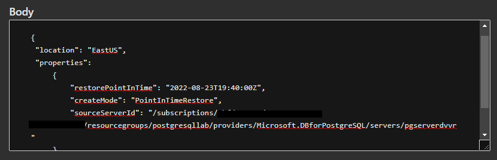
   
   Click on **Run**. If you see Response Code 201 or 202, the restore request is successfully submitted.

   The restore status can be monitored from Activity log by filtering for:
   - Subscription = Your Subscription
   - Resource Type = Azure Database for PostgreSQL servers (Microsoft.DBforPostgreSQL/servers)
   - Operation = Update MySQL Server Create

   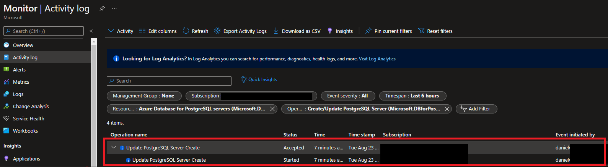

   >The server creation can take time depending on the database size and compute resources provisioned on the original server

   When the restore is done, the operation will be marked as **Succeeded**

   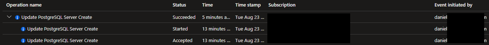

1. Explore your restored server

   Go to your Azure Database for PostgreSQL Single Server in any way you prefer to look for a resource on Azure

   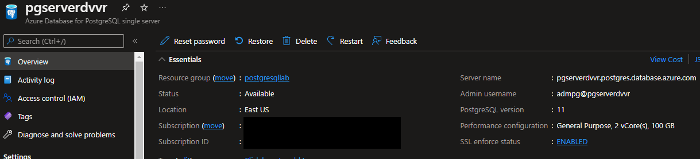

   The server has been restored!!!!

1. Bonus: Prevent accidental deletion of servers

   To prevent accidental deletion of servers, we highly recommend using Resource Locks.

   Go to your Azure Database for PostgreSQL Single Server in any way you prefer to look for a resource on Azure

   Click on **Locks** under **Settings**

   Click on **+ Add**

   Set a lock name, select lock type *Delete* and add a note that explains the purpose of the lock

   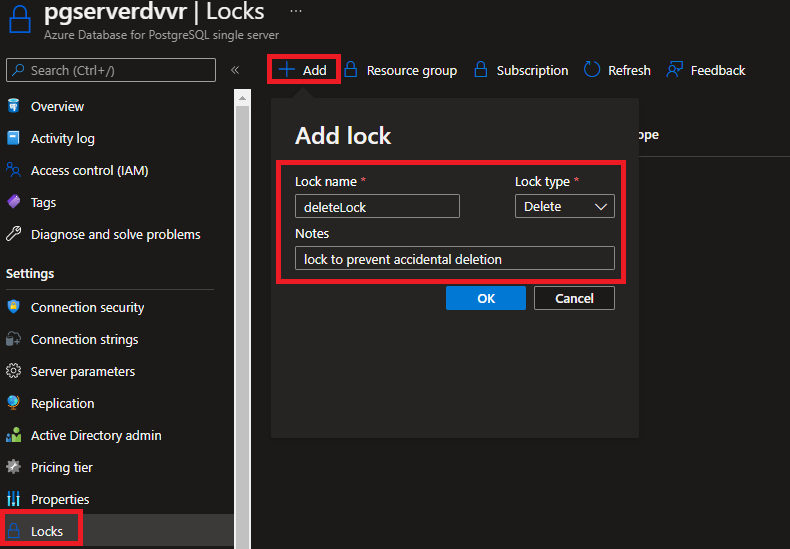

   Click **OK**

   Go to the **Overview** panel and try to delete the server. Your delete operation will not succeed, and you will see this message." 

   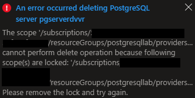

   To delete the server, you must delete the lock first, so if the server is deleted it won�t be accidental.

Congratulations!. You have successfully completed this exercise and the Lab. 