# Create a Read replica for an Azure Database for PostgreSQL Single Server

**Introduction**

During this lab, you will learn how to create a Read replica for an Azure Database for PostgreSQL Single Server using the Azure Portal

**Objectives**

After completing this lab, you will be able to: 

- Set a read replica for an Azure Database for PostgreSQL Single Server
- Read from an Azure Database for PostgreSQL read replica

**Considerations**

This lab considers that an Azure Database for PostgreSQL Single Server named pgserver[your name initials] exists with a server admin login named *admpg*, if not, create it or use another existing server before continuing with the lab.

**Estimated Time:** 50 minutes

---

## Exercise 1: Create a sample database on the Azure Database for PostgreSQL Single Server

**Tasks**

1. Create the *adventureworks* database on the Azure Database for PostgreSQL Single Server
   
   Dowonlad the [adventureworks demo database](https://github.com/danvalero/AzureOSSDBLabs/raw/main/Azure%20Database%20for%20PostgreSQL%20Single%20Server/PostgresSQLSSLabFiles/adventureworks.dump) in **C:\\\PostgresSQLSSLabFiles** folder

   Open a Windows Prompt and execute a script to create the adventureworks schema, create objects and load the demo employee data using:
    
   ```bash
   psql --host=<server_name>.postgres.database.azure.com --port=5432 --username=<admin_user>@<server_name> --dbname=postgres -c "DROP DATABASE IF EXISTS adventureworks;" -c "CREATE DATABASE adventureworks;"
   ```

   ```bash
   pg_restore -v --no-owner --host=<server_name>.postgres.database.azure.com --port=5432 --username=<admin_user>@<server_name> --dbname=adventureworks C:\\PostgresSQLSSLabFiles\\adventureworks.dump
   ```
    
   for example:

   ```bash
   psql --host=pgserverdvvr.postgres.database.azure.com --port=5432 --username=admpg@pgserverdvvr --dbname=postgres -c "DROP DATABASE IF EXISTS adventureworks;" -c "CREATE DATABASE adventureworks;"
   ```

   ```bash
   pg_restore -v --no-owner --host=pgserverdvvr.postgres.database.azure.com --port=5432 --username=admpg@pgserverdvvr --dbname=adventureworks C:\\PostgresSQLSSLabFiles\\adventureworks.dump
   ```

   
   
   
   >IMPORTANT: For both commands, you need to enter password when prompted. 

   >IMPORTANT: This is destructive action. If there is a database named moviesdb in the Azure Database for PostgreSQL Single Server, the existing moviesdb will be dropped and replaced.
    
   
   
   
    
   If you get a message like:
    
   *Psql: FATAL:  no pg_hba.conf entry for host "45.23.185.251", user "admpg", database "postgres",  SSL on*
    
   You must allow access from the Virtual Machine to the Azure Database for PostgreSQL by adding a rule for the client machine IP address. Go to **Connection security** in **Settings**, add the rule and click **Save**.
    
   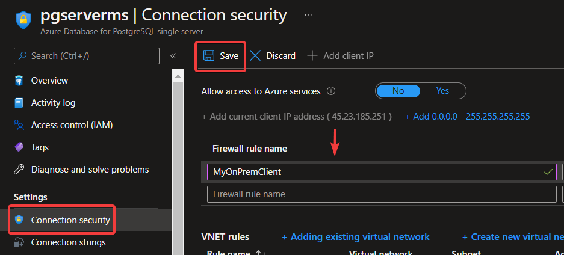

Congratulations!. You have successfully completed this exercise.

---

## Exercise 2: Add a replica

This exercise shows how to add a read replica for an Azure Database for PostgreSQL Single Server.

**Tasks**

1. Connect to Microsoft Azure Portal
    
   Open Microsoft Edge and navigate to the [Azure Portal](http://ms.portal.azure.com) to connect to Microsoft Azure Portal. Login with your subscriptions credential.

1. Go to your PostgreSQL Server

   Go to your Azure Database for PostgreSQL Single Server in any way you prefer to look for a resource on Azure

1.  Go to Replication
    
   Select **Replication** from the menu, under **Settings**
    
   h2u8
    
   Notice that no replica has been set.

1. Add a replica
    
   If Azure replication support is not set to at least __Replica__, set it. Select __Save__.
    
   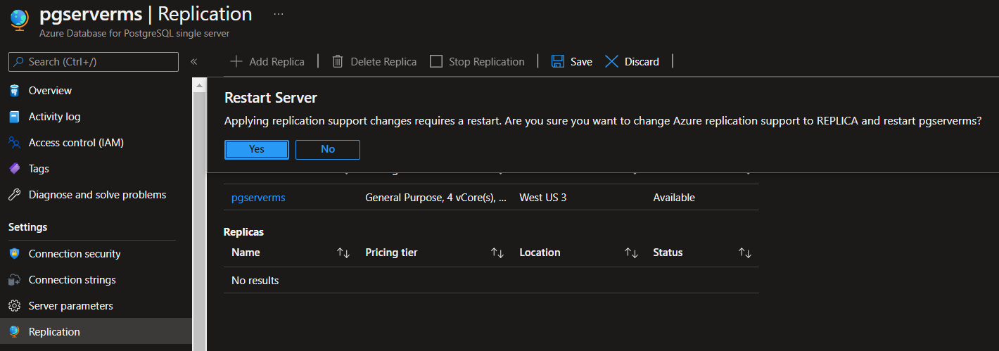
    
   >When you create a replica for a master that has no existing replicas, the master will first restart to prepare itself for replication. Please take this into consideration and perform these operations during an off-peak period.
    
   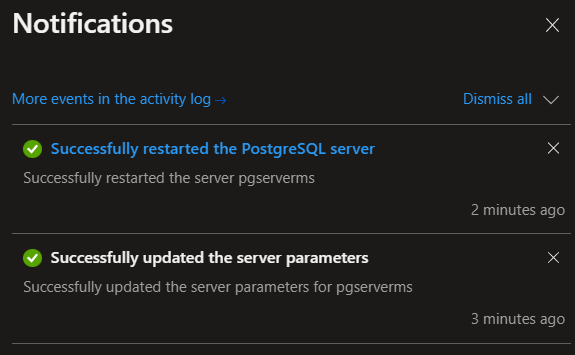
    
   After replication support is enabled, click on **Add Replica**.
    
   Configure the new server using the following instruction:

   - Name your server using the same name of the master server and add *-r1* at the end.
        
     NOTE: This is just a suggestion for the lab. You can name your server in any way you want as long as it not used by you or any other Azure customer.

   - The default location is the same as the master server. You can select any other region. For this lab, use the same region as the master server

   - Notice that you cannot select the tier.
    
   >Read replicas are created with the same server configuration as the master. The replica server configuration can be changed after it has been created. It is recommended that the replica server's configuration should be kept at equal or greater values than the master to ensure the replica is able to keep up with the master.
    
   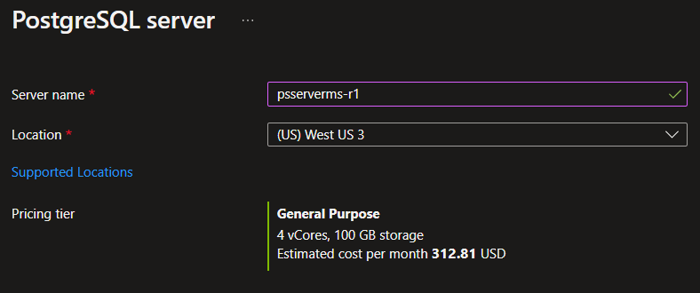
    
   Click **OK** and wait until the server creation finishes. It can take several minutes, this is good time to take a break, or even better, use this time to ask questions to the instructor.

1. Review the replication configuration
    
   In the replication panel you will see that the replica is now listed.
    
   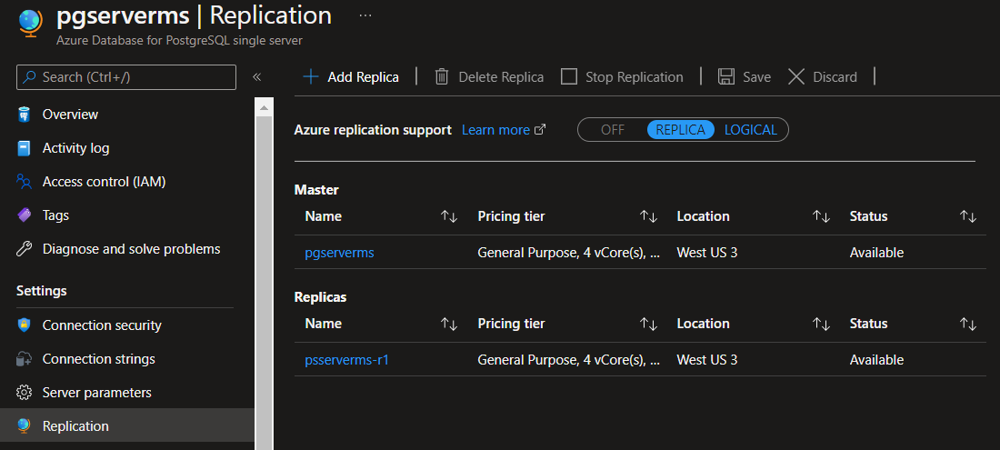
    
   You have configured a read replica for your Azure Database PostgreSQL Server.

Congratulations!. You have successfully completed this exercise.

---

## Exercise 3: Read from a replica

This exercise shows a data motification being replicated a how to red from a replica server.

**Tasks**

1. Query the master replica
    
   Open **pgAdmin**. 

   If you have not done it yet, register your Azure Database for PostgreSQL on pgAmdin and connect to it.
    
   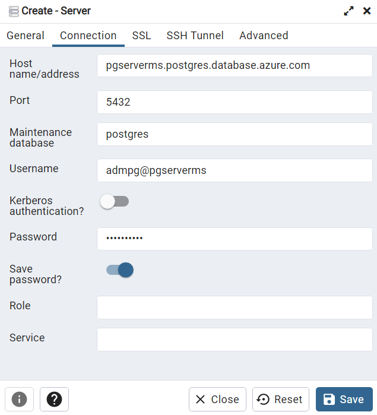
    
   Connect to *adventureworks* and open a Query Tool. Execute:
    
   ```sql
    Select * from largetable where id<5;
   ```
    
   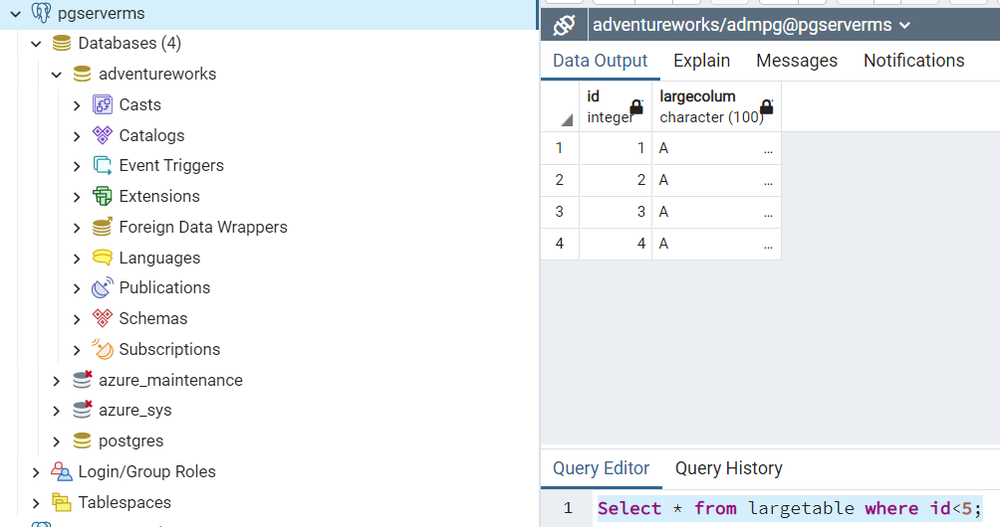

   4 rows must be returned.

1. Query the read replica
    
   Register your Azure Database for PostgreSQL replica on pgAdmin  and connect to it. Use the same user and password you use to connect to the source server.
    You will not be able to connect as your IP is not authorized on the replica server.
    
   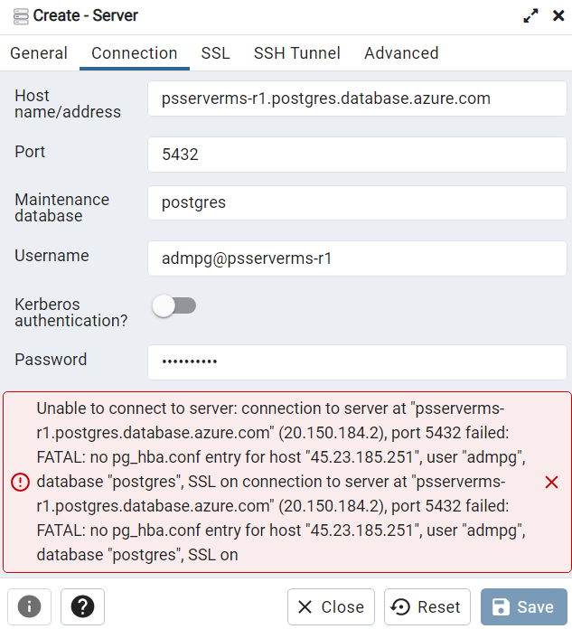
   
   >When you create a replica, it doesn't inherit the firewall rules or VNet service endpoint of the master server. These rules must be set up independently for the replica.
    
   You must allow access to the Azure Database for PostgreSQL by adding a rule for the client machine IP address. In the Azure Database for PostgreSQL replica server, go to **Connection security** in **Settings**, add the rule and click **Save**.
    
   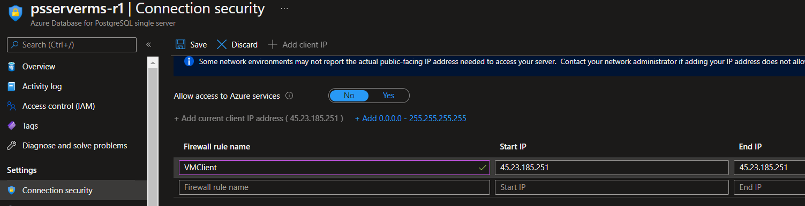
    
   Once the firewall rules are set, connect to *adventureworks* on the read replica, open a Query Tool and Execute:
    
   ```sql
   Select * from largetable where id<5;
   ```
    
   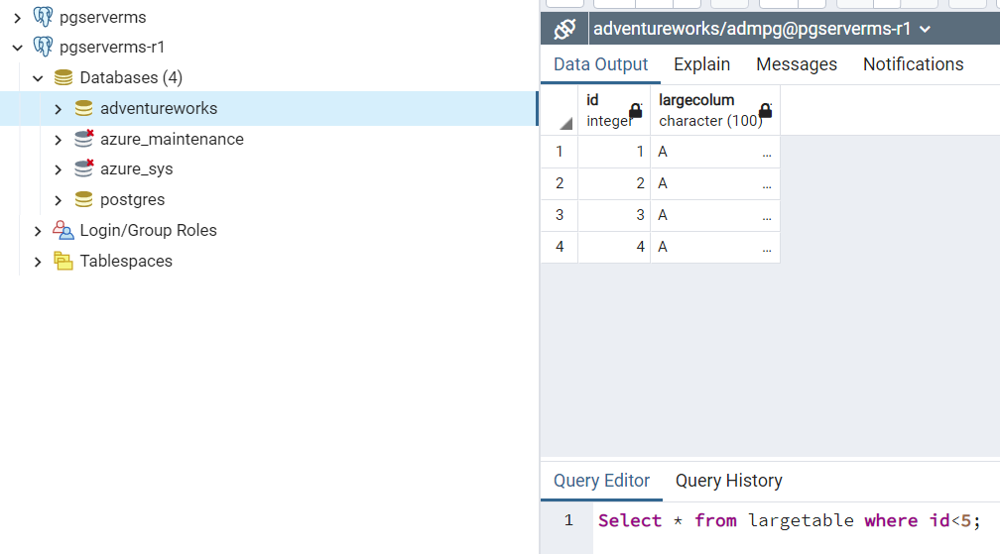
   
   4 rows must be returned. You see the same data than in the master server.

1. Insert a new record on the master server
    
   Connect to *moviesdb* on the master replica, open a Query Tool and Execute:

   ```sql
   INSERT INTO largetable (id, largecolum) VALUES (2,'Replica-test');
   ```

   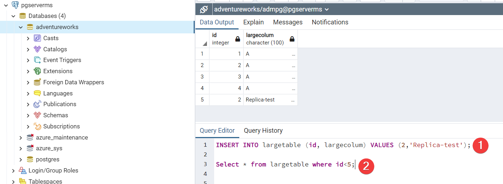

1. Verify replication is working
    
   Go back to the tab where you queried the actor table on the read replica server and execute again:
    
   ```sql
   Select * from largetable where id<5;
   ```
    
   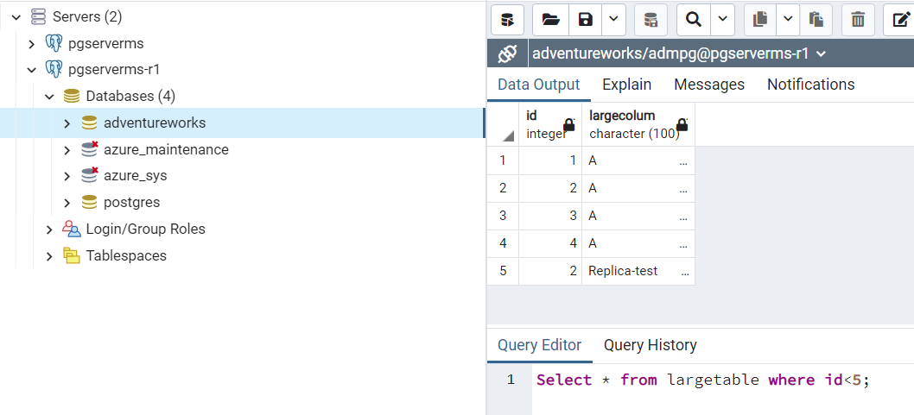
    
   Now the query returns 5 rows, including the row you just inserted on the master. The row inserted on the master server was already replicated to the replica.

Congratulations!. You have successfully completed this exercise.

---

## Exercise 4: Stop Replication 

This exercise shows how to stop the replication

**Tasks**

1. Connect to Microsoft Azure Portal
    
   Open Microsoft Edge and navigate to the [Azure Portal](http://ms.portal.azure.com) to connect to Microsoft Azure Portal. Login with your subscriptions credential.

1. Go to your master PostgreSQL Server

   Go to your master Azure Database for PostgreSQL Single Server in any way you prefer to look for a resource on Azure

1.  Go to Replication
    
   Select **Replication** from the menu, under **Settings**

1. Stop replication
    
   To stop replication between the primary and replica server:

   - Go to the master Azure Database for Postgres Single Server

   - Select **Replication** from the menu, under **SETTINGS**

   - Select the replica server you wish to stop replication for. In this case, you only have one replica.
    
     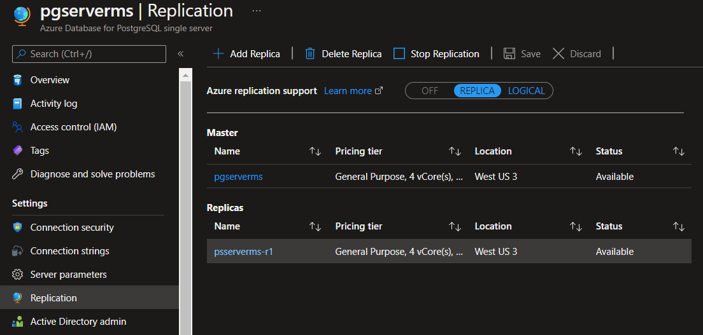

   - Click **Stop Replication** and click on **OK** to confirm the operation.
    
     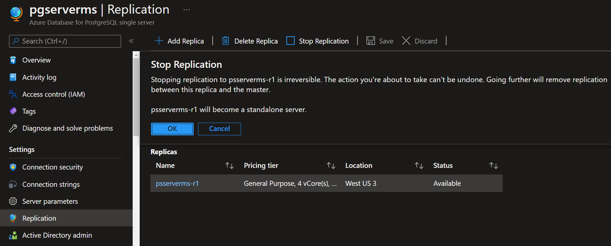
    
   >The stop action causes the replica to restart and to remove its replication settings. Once you stopped the replication, the former replica server became a regular standalone server.
    
   Wait until replication is stopped
    
      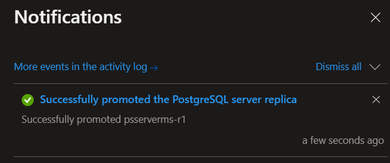

1. Delete the Azure Database for PostgreSQL Single Server used as replica server
    
   To save money, delete the server you created to be a read replica (pgserver[your name initials]-r1)
    
   On the Overview Pane, select **Delete**. Type the server name and click on **Delete**
    
   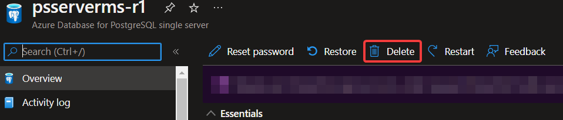

Congratulations!. You have successfully completed this exercise and the Lab. 
