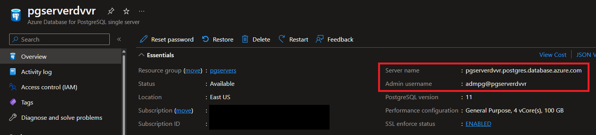
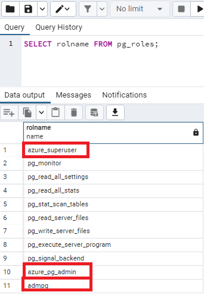
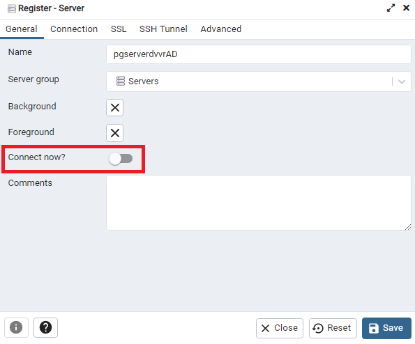
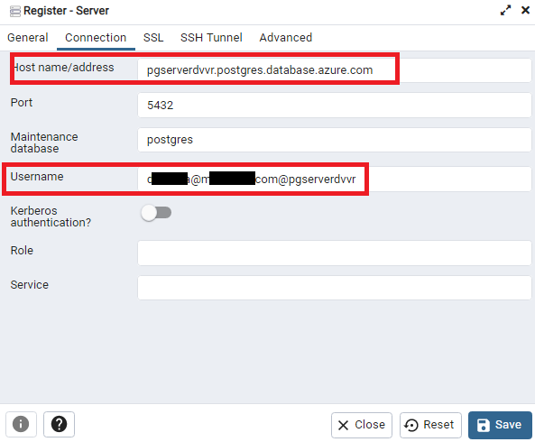
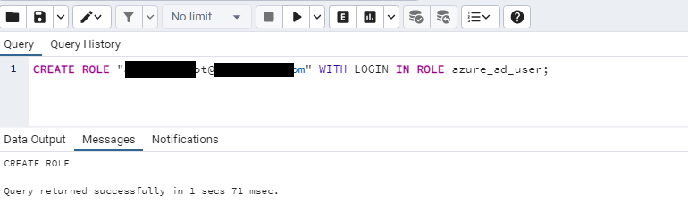

# Add additional users to an Azure Database for PostgreSQL Single Server Single Server

**Introduction** 

During this lab, you will review how to add additional users for application connectivity

**Objectives**

After completing this lab, you will be able to: 

- Create database users in Azure Database for PostgreSQL
- Magane database users with Azure Active Directory (AAD) authentiction

**Considerations**

This lab considers that an Azure Database for PostgreSQL Single Server named pgserver[your name initials] exists with a server admin login named *admpg*, if not, create it or use another existing server before continuing with the lab.

**Estimated Time:** 1 hour 35 minutes

---

## Exercise 1: Create additional admin users in Azure Database for PostgreSQL

This exercise shows how to create additional admin users in Azure Database for PostgreSQL

**Tasks**

1. Connect to Microsoft Azure Portal
    
   Open Microsoft Edge and navigate to the Azure Portal ([http://ms.portal.azure.com](http://ms.portal.azure.com)) to connect to Microsoft Azure Portal. Login with your subscriptions credential.

1. Select the three lines in the top left, Home and Azure Database for PostgreSQL
   

1. Select the database server you want to work with
   

1. You will see the server details including server name and admin user
   

1. Connect to your Azure Database for PostgreSQL Single Server using the details from the previous step

   Open **pgAdmin** and connect to your server using the admin user.
   
   

   Double click on the entry you just created

   

   Open the Query Tool

   


1. Review the default roles defined when The Azure Database for PostgreSQL Single Server is created
           
   The Azure Database for PostgreSQL Single Server is created with the 3 default roles defined.
    
   On the **postgres** database, run the following command:
    
   ```sql
   SELECT rolname FROM pg_roles;
   ```
   
   You will see the three default roles defined on every Azure Database for PostgreSQL Single Server:
   - azure_pg_admin
   - azure_superuser
   - your server admin user
    
   
    
   >Your server admin user is a member of the *azure_pg_admin* role. However, the server admin account is not part of the azure_superuser role. Since this service is a managed PaaS service, only Microsoft is part of the super user role.
    
   In Azure Database for PostgreSQL, the server admin user is granted these privileges: LOGIN, NOSUPERUSER, INHERIT, CREATEDB, CREATEROLE, NOREPLICATION
    
   The server admin user account can be used to create additional users and grant those users into the *azure_pg_admin* role. Also, the server admin account can be used to create less privileged users and roles that have access to individual databases and schemas.

1. Create a new admin user
    
   To create a new admin user, on the **postgres** database, execute:
    
   ```sql
   CREATE ROLE [new_user] WITH LOGIN NOSUPERUSER INHERIT CREATEDB CREATEROLE NOREPLICATION PASSWORD '[StrongPassword]';

   GRANT azure_pg_admin TO [new_user];
   ```

   For example:

   ```sql
   CREATE ROLE admin2 WITH LOGIN NOSUPERUSER INHERIT CREATEDB CREATEROLE NOREPLICATION PASSWORD 'SuperStrongPassword!';

   GRANT azure_pg_admin TO admin2;
   ```
    
   >IMPORTANT: Replace *[new_user]* with your new username and replace *[StrongPassword]* with your own strong password.
    
   

Congratulations!. You have successfully completed this exercise.

---

## Exercise 2: Create database users in Azure Database for PostgreSQL

This exercise shows how to Create less privileged users and roles that have access to individual databases and schemas

**Tasks**

1. Connect to Microsoft Azure Portal
    
   Open Microsoft Edge and navigate to the [Azure Portal](http://ms.portal.azure.com) to connect to Microsoft Azure Portal. Login with your subscriptions credential.

1. Go to your PostgreSQL Server

   Go to your Azure Database for PostgreSQL Single Server in any way you prefer to look for a resource on Azure

1. Create new database users

   To create a new user and grant connect privileges to the new database for that user, on the **postgres** database, execute:

   ```sql
   CREATE ROLE [new_user] WITH LOGIN NOSUPERUSER INHERIT NOCREATEROLE NOREPLICATION PASSWORD '[StrongPassword]';

   GRANT CONNECT ON DATABASE [your initials]db TO [new_user];
   ```

   For example:

   ```sql
   CREATE ROLE dbuser WITH LOGIN NOSUPERUSER INHERIT NOCREATEROLE NOREPLICATION PASSWORD 'A43.adjsa8.!s';

   GRANT CONNECT ON DATABASE dvvrdb TO dbuser;
   ```

   >Replace *[new_user]* with the name of the user you want to create. Replace *[your initials]* with your initials if the database [your initials]db exists, if not, use a different database. Replace *[StrongPassword]* with your own strong password.

   

   Now you need to grant object permissions to the user, for example, to create tables or read tables.

   To grant permissions to create schemas and tables to the new user, execute:

   ```sql
   GRANT CREATE ON DATABASE [your initials]db TO [user_name];
   ```

   For example:

   ```sql
   GRANT CREATE ON DATABASE dvvrdb TO dbuser;
   ```

   >Replace *[user_name]* with the name of the user you created Replace *[your initials]* with your initials if the database [your initials]db exists, if not, use a different database.

   

   Refer to the [PostgreSQL documentation](https://www.postgresql.org/docs/current/static/ddl-priv.html) for further details on database roles and privileges.

1. Log in to your server, using the new username and create a table
    
   Using pgAdmin, connect to your database with *dbuser*.
    
   When registering the server, make sure you set the database where you granted permission in the previous tasks in the **Maintenance Database** field
    
   
    
   Explore the database

   

   Connected to the database, open the query tool. Create a table by executing:

   ```sql
   CREATE TABLE public.testtable
   (   id integer not null,
       name character varying(25) not null,
       primary key (id)
   )
   ```

   List the tables in the database, you will see the table you just created.

   

Congratulations!. You have successfully completed this exercise.

---

## Exercise 3: Setting and connecting with the Azure AD Admin user

This exercise shows how to configure Azure Active Directory access with Azure Database for PostgreSQL, and how to connect using an Azure AD token

**Tasks**

1. Connect to Microsoft Azure Portal
    
   Open Microsoft Edge and navigate to the [Azure Portal](http://ms.portal.azure.com) to connect to Microsoft Azure Portal. Login with your subscriptions credential.

1. Go to your PostgreSQL Server

   Go to your Azure Database for PostgreSQL Single Server in any way you prefer to look for a resource on Azure

1. Set the Azure Active Directory admin user
    
   Under the **Settings** section in the sidebar, select **Active Directory admin**
    
   Click on **Set Admin**
    
   
    
   Look for the user you want to add. For this lab, look for the user you are logged in with. Click **Select**
    
   
    
   You will see the selected user as the Active Directory Admin. Click on **Save**
    
   

   >Only one Azure AD admin can be created per PostgreSQL single server and selection of another one will overwrite the existing Azure AD admin configured for the server. You can specify an Azure AD group instead of an individual user to have multiple administrators. Note that you will then sign in with the group name for administration purpose

1. Install Azure CLI

   If you have not done it yet. Isntall Azure CLI following the instrcutions at [How to install the Azure CLI](https://docs.microsoft.com/en-us/cli/azure/install-azure-cli) 

1. Connect Azure Database for PostgreSQL Single Server using Azure Active Directory
    
   Open the **Windows Powershell**
    
   Invoke the Azure CLI tool to authenticate with Azure AD. It requires you to give your Azure AD user ID (the one you set as Azure Active Directory admin in the previous step) and the password:
    
   ```bash
   az login
   ```
    
   
    
   Acquire an access token for the Azure AD authenticated user to access Azure Database for PostgreSQL by executing:

   ```bash
   az account get-access-token --resource https://ossrdbms-aad.database.windows.net
   ```

   
    
   Use token as password for logging in with PostgreSQL using psql by executing:

   ```bash
   $accessToken = Get-AzAccessToken -ResourceUrl https://ossrdbms-aad.database.windows.net
   $env:PGPASSWORD = $accessToken.Token

   .\psql.exe "host=pgserver<your name initials>.postgres.database.azure.com user=<user@domain>@pgserver<your name initials> dbname=postgres sslmode=require"    
   ```

   >When using the psql command line client, the access token needs to be passed through the PGPASSWORD environment variable, since the access token exceeds the password length that psql can accept directly

   

   Get a list of databases just to validate you have successfully logged in using the Azure Active Directory admin by executing:

   ```nocolor
   \l
   ``` 

   


   You have successfully set an Azure Active Directory admin and logged to the Azure Database for PostgreSQL Single Server with it.

Congratulations!. You have successfully completed this exercise.

---

## Exercise 4: setting and connecting with  Azure AD regular users in Azure Database for PostgreSQL

This exercise shows how to configure Azure Active Directory access with Azure Database for PostgreSQL, and how to connect using an Azure AD token

> For this exercise you will need to use your user as the Administrator for the datbase server and another user in Azure Active Directory to log into the database, if you cannot add another user into your Azure Active Directory you may add a colleague to help you test, in that case you may need to also add yours colleague IP address into the PostgreSQL sever firewall [https://docs.microsoft.com/en-us/azure/postgresql/single-server/concepts-firewall-rules](https://docs.microsoft.com/en-us/azure/postgresql/single-server/concepts-firewall-rules)

**Tasks**

1. Connect to Microsoft Azure Portal
    
   Open Microsoft Edge and navigate to the [Azure Portal](http://ms.portal.azure.com) to connect to Microsoft Azure Portal. Login with your subscriptions credential.

1. Go to your PostgreSQL Server

   Go to your Azure Database for PostgreSQL Single Server in any way you prefer to look for a resource on Azure

1. Set the Azure Active Directory admin user
    
   Under the **Settings** section in the sidebar, select **Active Directory admin**
    
   Click on **Set Admin**
    
   
    
   Look for the user you want to add. For this lab, look for the user you are logged in with. Click **Select**
    
   
    
   You will see the selected user as the Active Directory Admin. Click on **Save**
    
   

   >Only one Azure AD admin can be created per PostgreSQL single server and selection of another one will overwrite the existing Azure AD admin configured for the server. You can specify an Azure AD group instead of an individual user to have multiple administrators. Note that you will then sign in with the group name for administration purpose

1. Install Azure CLI

   If you have not done it yet. Isntall Azure CLI following the instrcutions at [How to install the Azure CLI](https://docs.microsoft.com/en-us/cli/azure/install-azure-cli) 

1. Connect Azure Database for PostgreSQL Single Server using Azure Active Directory
    
   Open the **Windows Powershell**
    
   Invoke the Azure CLI tool to authenticate with Azure AD. It requires you to give your Azure AD user ID (the one you set as Azure Active Directory admin in the previous step) and the password:
    
   ```bash
   az login
   ```
    
   
    
   Acquire an access token for the Azure AD authenticated user to access Azure Database for PostgreSQL by executing:

   ```bash
   az account get-access-token --resource https://ossrdbms-aad.database.windows.net
   ```

   
    
   Use token as password for logging in with PostgreSQL using psql by executing:

   ```bash
   $accessToken = Get-AzAccessToken -ResourceUrl https://ossrdbms-aad.database.windows.net
   $env:PGPASSWORD = $accessToken.Token

   .\psql.exe "host=pgserver<your name initials>.postgres.database.azure.com user=<user@domain>@pgserver<your name initials> dbname=postgres sslmode=require"    
   ```

   >When using the psql command line client, the access token needs to be passed through the PGPASSWORD environment variable, since the access token exceeds the password length that psql can accept directly

   

1. Add the second user (the new user you created in AAD or your colleague user) executing the following command:

   ```SQL
   CREATE ROLE "user1@yourtenant.onmicrosoft.com" WITH LOGIN IN ROLE azure_ad_user;
   ```

   

1. Connect to **psql** with the user you just added in the previous step

   ```bash
   az logout
   az login
   az account get-access-token --resource https://ossrdbms-aad.database.windows.net
   $accessToken = Get-AzAccessToken -ResourceUrl https://ossrdbms-aad.database.windows.net
   $env:PGPASSWORD = $accessToken.Token
   .\psql.exe "host=pgserver<your name initials>.postgres.database.azure.com user=<user@domain>@pgserver<your name initials> dbname=postgres sslmode=require"    
   ```

   

Congratulations! You have successfully completed this exercise and the Lab. 