# Configure and access server logs for Azure Database for PostgreSQL Single Server Single Server

**Introduction**

During this lab, you will learn how to Configure and access server logs in Azure Database for PostgreSQL.

**Objectives**

After completing this lab, you will be able to: 

- Configure server logs in Azure Database for PostgreSQL from the Azure portal
- Access server logs in Azure Database for PostgreSQL from the Azure portal

**Considerations**

This lab considers that an Azure Database for PostgreSQL Single Server named pgserver[your name initials] exists with a server admin login named *admpg*, if not, create it or use another existing server before continuing with the lab.

**Estimated Time:** 30 minutes

---

## Exercise 1: Configure server logs in Azure Database for PostgreSQL from the Azure portal

This exercise shows how to, configure server logs in Azure Database for PostgreSQL from the Azure portal and to enable the logging of DDL sentences.

**Tasks**

1. Connect to Microsoft Azure Portal
    
   Open Microsoft Edge and navigate to the [Azure Portal](http://ms.portal.azure.com) to connect to Microsoft Azure Portal. Login with your subscriptions credential.

1. Go to your PostgreSQL Server

   Go to your Azure Database for PostgreSQL Single Server in any way you prefer to look for a resource on Azure

1. Under the **Monitoring** section in the sidebar, select **Server Logs**.
    
   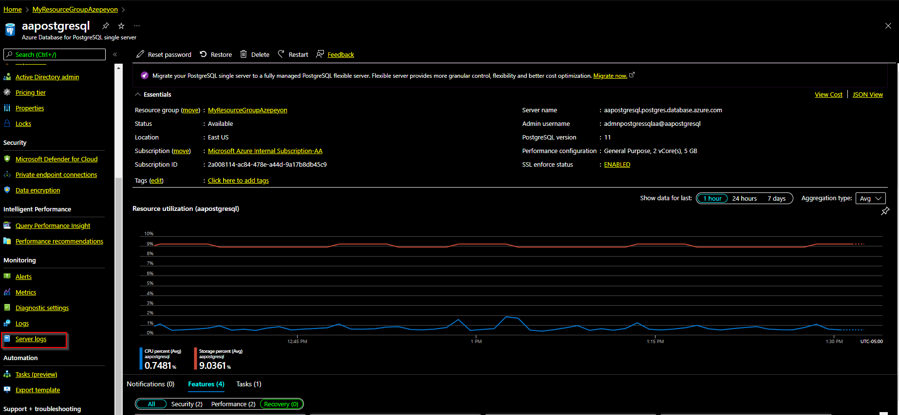
1. Select the heading **Click here to enable logs and configure log parameters** to see the server parameters.
    
  
    
   Explore the parameters that control logging behavior

1. Change the **log_statement** parameter to **DDL** then click **Save**.
    
    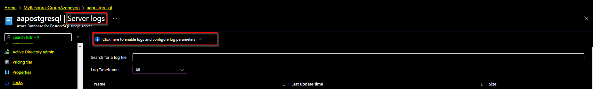

Congratulations!. You have successfully completed this exercise.

---

## Exercise 2: Test logging for DDL statements and access server logs

This exercise you will execute a DDL operation and then access the server logs in Azure Database for PostgreSQL from the Azure portal to see the entry for the operation.

**Tasks**

1. Connect to Microsoft Azure Portal
    
   Open Microsoft Edge and navigate to the [Azure Portal](http://ms.portal.azure.com) to connect to Microsoft Azure Portal. Login with your subscriptions credential.

1. Go to your PostgreSQL Server

   Go to your Azure Database for PostgreSQL Single Server in any way you prefer to look for a resource on Azure

1. Identify the connection information for the Azure Database for PostgreSQL Single Server

   Make a note of the **Server name** and the **Server admin login name**.

   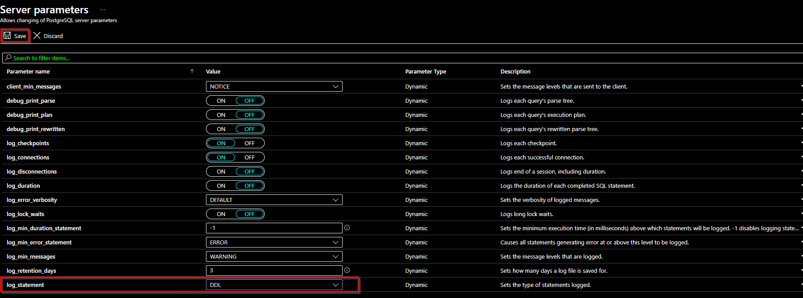

1. Register your Azure Database for PostgreSQL on pgAdmin.

   Open pgAdmin and register your Azure Database for PostgreSQL using the admin user. If you are asked to set a master password, use *Password1!*

   From the toolbar go to **Object**, hover over **Create**, and select **Server**.

   In the **Create - Server dialog** box, on the **General** tab, enter a unique friendly name for the server, such as *pgserver[your name initials]*.

   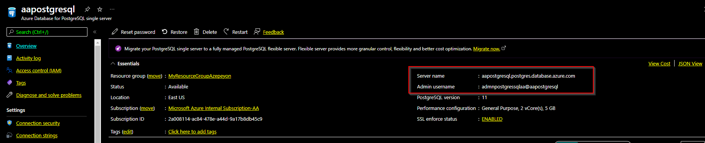

   In the **Create - Server** dialog box, on the **Connection** tab, fill in the settings table.

   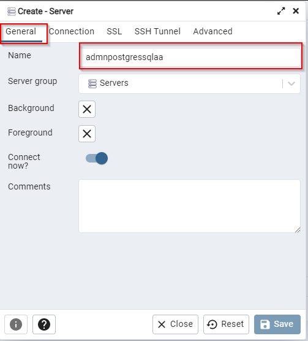
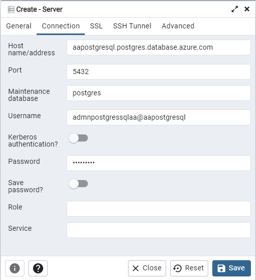

   In the **Create - Server** dialog box, on the **SSL** tab, select SSL mode *Require*.

   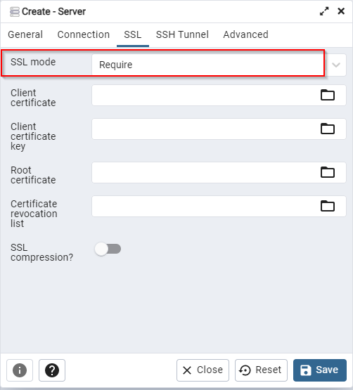

   Click **Save**

  
1. Execute some DLL operations
    
   Let's create a database and a table.
    
   Right click **Databases** then **Create > Database**
    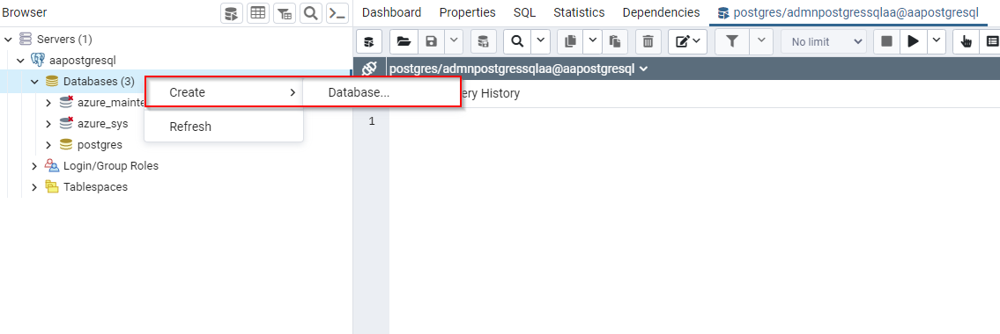
   
    
   Use *Company* as database name and then click **Save**.
    
   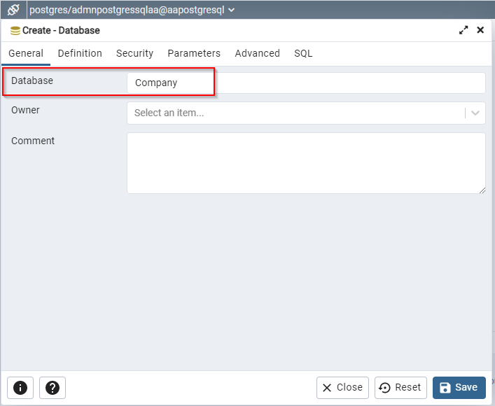
    
   Right click on *customers* database and select **Query Tool**
    
   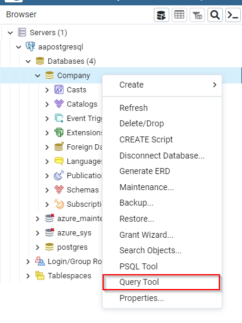
    
   Execute the following script to create a schema called *person* and create a table called *person*:
    
   ```sql
   CREATE SCHEMA person;
   
   CREATE TABLE person.person
   (
       person_id int not null,
       person_name varchar(100) not null
   );
   ```
    
   

1. Examine the server log and find the DLL operations entries
    
   Open Microsoft Edge and navigate to the [Azure Portal](http://ms.portal.azure.com) to connect to Microsoft Azure Portal. Login with your subscriptions credential.

   Go to your Azure Database for PostgreSQL Single Server in any way you prefer to look for a resource on Azure

   Under the **Monitoring** section in the sidebar, select **Server Logs**. The page shows a list of your log files, as shown:

   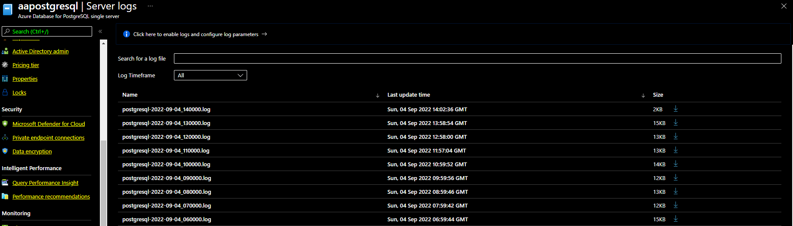

   >The naming convention of the log is postgresql-yyyy-mm-dd_hh0000.log. The date and time used in the file name is the time is when the log was issued. The log files rotate every hour or 100-MB size, whichever comes first.

   Download individual log files using the download button (down arrow icon) next to each log file in the table row.

   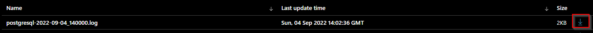

   Open the file you just downloaded and review that the DDL statements were logged.

   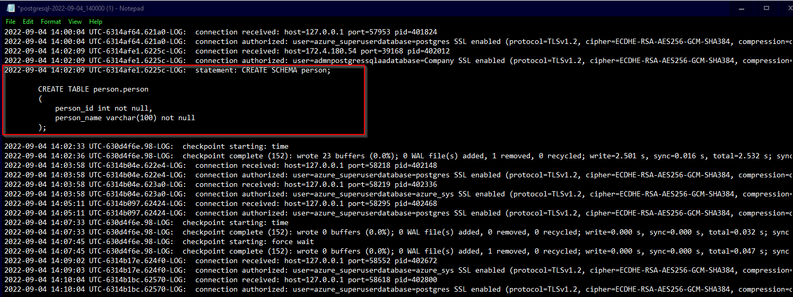

Congratulations!. You have successfully completed this exercise and the Lab.