# Configure and access audit logs for Azure Database for PostgreSQL

**Introduction**

During this lab, you will learn how to Configure and access audit logs for Azure Database for PostgreSQL in the Azure portal.

Audit logging of database activities in Azure Database for PostgreSQL - Single Server is available through the PostgreSQL Audit extension, pgAudit. The pgAudit extension provides detailed session and object audit logging.

The pgAudit documentation is available at [pgAudit Open Source PostgreSQL Audit Logging](https://github.com/pgaudit/pgaudit/blob/master/README.md)

**Objectives**

After completing this lab, you will be able to: 

- Configure and access audit logs for Azure Database for PostgreSQL Single Server using the Azure portal

**Prerequisites**

This lab considers that an Azure Database for PostgreSQL Single Server named pgserver[your name initials] exists with a server admin login named *admpg*, if not, create it or use another existing server before continuing with the lab.

**Estimated Time:** 40 minutes

**Exercises list**
- [Configure and access audit logs for Azure Database for PostgreSQL](#configure-and-access-audit-logs-for-azure-database-for-postgresql)
  - [Exercise 1: Enable pgAudit and configure the log format](#exercise-1-enable-pgaudit-and-configure-the-log-format)
  - [Exercise 2: Set up diagnostic logs](#exercise-2-set-up-diagnostic-logs)
  - [Exercise 3: Configure Session Audit Logging](#exercise-3-configure-session-audit-logging)
  - [Exercise 4: Accessing the audit log for Session Audit Logging](#exercise-4-accessing-the-audit-log-for-session-audit-logging)
  - [Exercise 5: Configure Object Audit Logging](#exercise-5-configure-object-audit-logging)
  - [Exercise 6 Accessing the audit log for Object Audit Logging](#exercise-6-accessing-the-audit-log-for-object-audit-logging)

---

## Exercise 1: Enable pgAudit and configure the log format

pgAudit can be enabled on general purpose and memory-optimized servers only.

This exercise shows how to enable the extension pgAudit 

**Tasks**

1. Connect to Microsoft Azure Portal
    
   Open Microsoft Edge and navigate to the [Azure Portal](http://ms.portal.azure.com) to connect to Microsoft Azure Portal. Login with your subscriptions credential.

1. Go to your PostgreSQL Server

   Go to your Azure Database for PostgreSQL Single Server in any way you prefer to look for a resource on Azure

1. Install pgAudit

   Under the **Settings** section in the sidebar, select **Server parameters**.
   
   Search for **shared_preload_libraries**.

   Select **PGAUDIT**.

   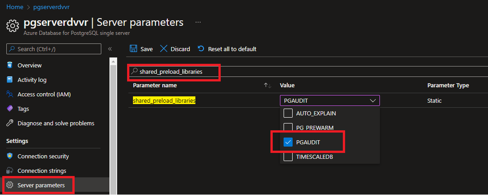

   Click on **Save**

   Restart from the Overview panel the server to apply the change.

   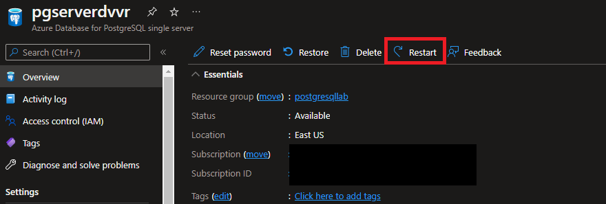

   Connect to your server by using any PostgreSQL client such as psql or pgAdmin, and enable the pgAudit extension:

   ```sql
   CREATE EXTENSION pgaudit;
   ```

   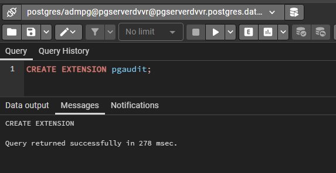

1. Configure Audit log format

    Each audit entry is indicated by AUDIT: near the beginning of the log line. 

    If you need any other fields to satisfy your audit requirements, use the Postgres parameter [log_line_prefix](https://www.postgresql.org/docs/current/runtime-config-logging.html#GUC-LOG-LINE-PREFIX). The string log_line_prefix is output at the beginning of every Postgres log line. 
    
    Set log_line_prefix  to provide timestamp, username, database name, process ID and session ID:

    - Under the **Settings** section in the sidebar, select **Server parameters**.
    - Search for **log_line_prefix.* and set it to     
      ```text
      t=%m u=%u db=%d pid=[%p] Session ID=[%c]:
      ```

      >you can set *log_line_prefix* in any way you want in order to achieve your needs and preferences, The value set in this lab is an example and allows to log information commonly needed in audit reviews

    - Click **Save**


    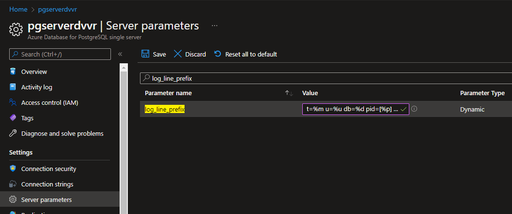

Congratulations!. You have successfully completed this exercise.

---

## Exercise 2: Set up diagnostic logs

If you're using .log files, your audit logs are included in the same file as your PostgreSQL error logs. You can download log files from the portal or the CLI.

Audit logs are integrated with Azure Monitor Diagnostic Logs. Once you've enabled audit logs on your PostgreSQL server, you can emit them to Azure Monitor logs, Event Hubs, or Azure Storage.

This exercise shows how to set up diagnostic logs

**Tasks**

1. Connect to Microsoft Azure Portal
    
   Open Microsoft Edge and navigate to the [Azure Portal](http://ms.portal.azure.com) to connect to Microsoft Azure Portal. Login with your subscriptions credential.

1. Create a Storage Account

   Create a Storage Account in the same region as your Azure Database for PostgreSQL Server using the instructions at [Create a storage account](https://docs.microsoft.com/en-us/azure/storage/common/storage-account-create?tabs=azure-portal)

1. Create a Log Analytics workspace

   Create a Log Analytics workspace in the same region as your Azure Database for PostgreSQL Server using the instructions at [Create a Log Analytics workspace](https://docs.microsoft.com/en-us/azure/azure-monitor/logs/quick-create-workspace?tabs=azure-portal)

1. Go to your PostgreSQL Server

   Go to your Azure Database for PostgreSQL Single Server in any way you prefer to look for a resource on Azure

1. Add a Diagnostic Setting 

   Under the **Monitoring** section in the sidebar, select **Diagnostic settings** and then click on **+ Add diagnostic setting**

   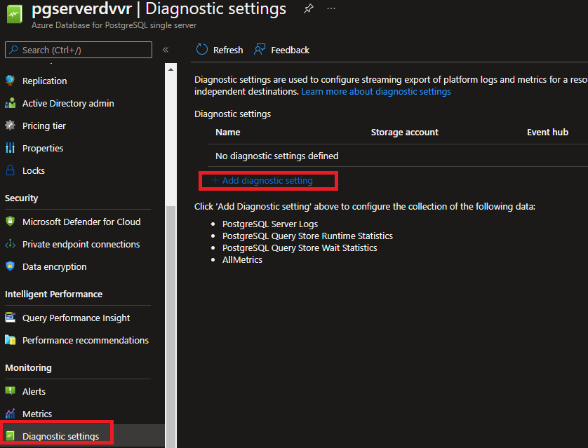

1. Configure the Diagnostic Setting 

   - Provide a diagnostic setting name.
   - Specify which data sinks to send the audit logs. For this lab use storage account and Log Analytics workspace created in the previous tasks.
   - Select **PostgreSQL Server Logs** as the log type and archive to a storage account 
   - Set the Retention (days) to 90. this indicates the retention of the log in the Storage Account

   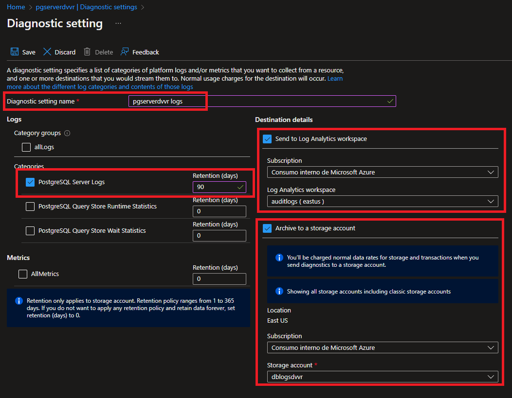

   Click Save and close the tile. You will see the new Diagnostic Setting listed for the server

   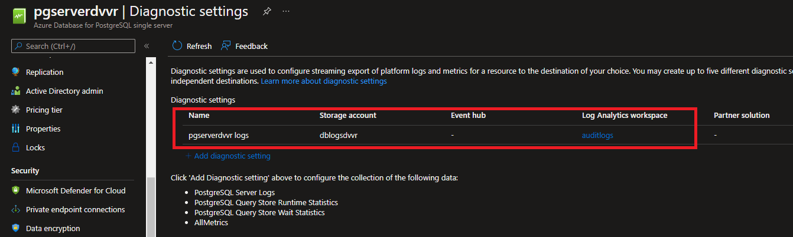

Congratulations!. You have successfully completed this exercise.

---

## Exercise 3: Configure Session Audit Logging

Session audit logging provides detailed logs of all statements executed by a user in the backend.

This exercise shows how to set up session audit logging

**Tasks**

1. Connect to Microsoft Azure Portal
    
   Open Microsoft Edge and navigate to the [Azure Portal](http://ms.portal.azure.com) to connect to Microsoft Azure Portal. Login with your subscriptions credential.

1. Go to your PostgreSQL Server

   Go to your Azure Database for PostgreSQL Single Server in any way you prefer to look for a resource on Azure

1. Configure Session Audit Logging

       >In this lab, not all pgaudit parameters are not mentioned and can be left to there default setting. For a full list of pgAudit paramters refer to [PgAudit Documentation](https://github.com/pgaudit/pgaudit/blob/master/README.md#settings)

   Under the **Settings** section in the sidebar, select **Server parameters**.
   
   Filer by **pgAudit**.
   
   - For **pgAudit.log** select **READ** and **WRITE**

     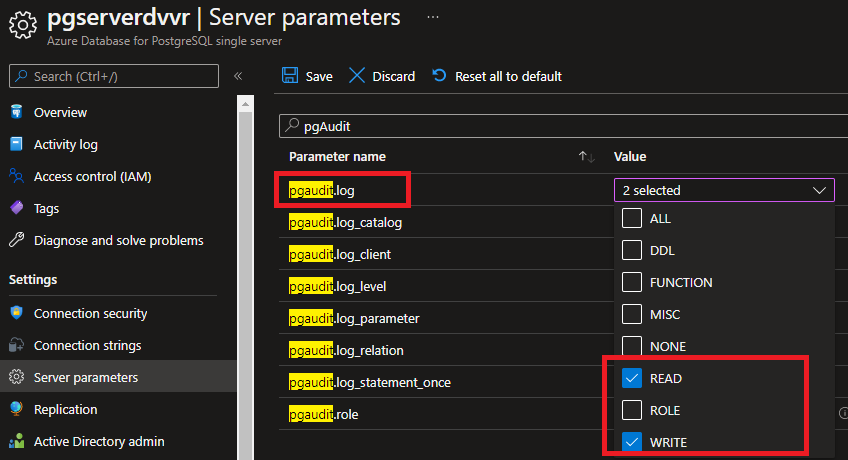
   
     Consider the possible value:
     - READ: SELECT and COPY when the source is a relation or a query.
     - WRITE: INSERT, UPDATE, DELETE, TRUNCATE, and COPY when the destination is a relation.
     - FUNCTION: Function calls and DO blocks.
     - ROLE: Statements related to roles and privileges: GRANT, REVOKE, CREATE/ALTER/DROP ROLE.
     - DDL: All DDL that is not included in the ROLE class.
     - MISC: Miscellaneous commands, e.g. DISCARD, FETCH, CHECKPOINT, VACUUM, SET.
     - MISC_SET: Miscellaneous SET commands, e.g. SET ROLE.
     - ALL: Include all of the above.

     >It is recommended to only log the event types and users required for your auditing purposes to ensure your server's performance is not heavily impacted and minimum amount of data is collected.

   - Set **pgaudit.log_relation** to OFF (default)

     *pgaudit.log_relation* specifies whether session audit logging should create a separate log entry for each relation (TABLE, VIEW, etc.) referenced in a SELECT or DML statement. 
     
     This is a useful shortcut for exhaustive logging without using object audit logging.

   - Set **pgaudit.log_client** to OFF (default)

     When the setting pgaudit.log_client is turned on, it redirects logs to a client process like psql instead of being written to a file. 

   Once you have changed the parameters, click **Save**.

Congratulations!. You have successfully completed this exercise.

---

## Exercise 4: Accessing the audit log for Session Audit Logging

This exercise shows how to access log events using differente methods (server log and Diagnostics settings sinks)

**Tasks**

1. Using PostgreSQL pgAdmin or any other PostgreSQL client tool connect to the database server and the **postgres** database

1. Create a sample database 

   Execute:

   ```sql
   CREATE DATABASE dbtest;
   ```

1. Create a sample table

   Connect to the **dbtest** database and create a sample table:

   ```sql
   CREATE TABLE people
   ( id   INT
    ,name VARCHAR(25)
   );
   ```

1. Modify and query the table

   Insert a few test rows:

   ```sql
   INSERT INTO people VALUES (1,'DANIEL');
   INSERT INTO people VALUES (2,'ANDREA');
   INSERT INTO people VALUES (3,'JOHN');
   ```

   Query the table

   ```sql
   SELECT * FROM people;
   ```

   ```sql
   SELECT * FROM people WHERE id = 1;
   ```

   Update the table

   ```sql
   UPDATE people set name = 'SCOTT' WHERE id = 1;
   ```

1. Consult the audit log using the server log

   Under **Monitoring** select **Server Log**

   For the Lab, download the latest log (in a real scenario you need to download the log for the timeframe you need to analyze)

   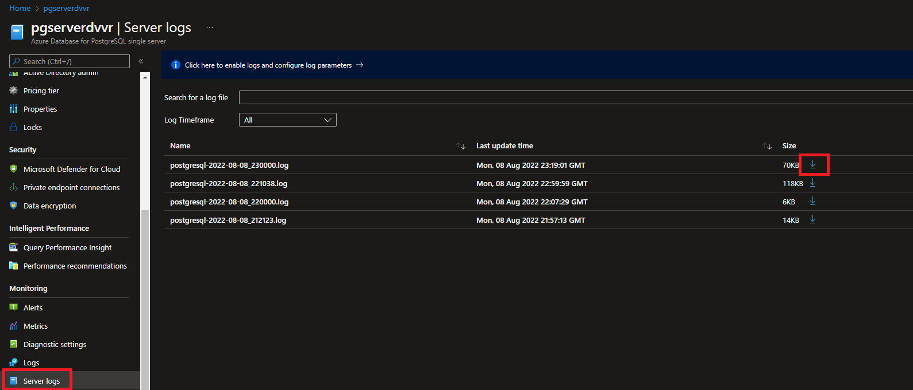

   Using your favorite text editor, search for the word **AUDIT**

   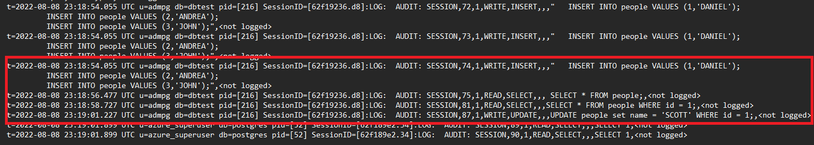

1. Consult the audit log in Log Analytics

   Under the **Monitoring** section in the sidebar, select **Logs** 

   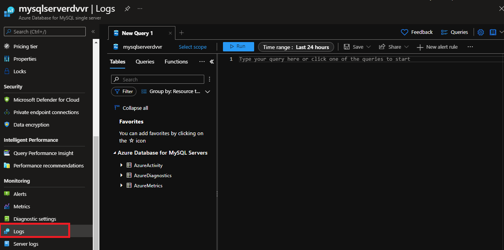

   To get all AUDIT events for the server in the last day, run the following kusto query 

   ```kusto
   AzureDiagnostics
   | where LogicalServerName_s == '<servername>'
   | where TimeGenerated > ago(1d) 
   | where Message contains "AUDIT:"
   | order by TimeGenerated asc nulls last
   ```
   
   >Make sure you replace *\<servername\>* with your server name

   You will find the entries for the events including:
   - when it happened (TimeGenerated[UTC])
   - the user and session information logged based on the log_line_prefix server setting. You can see there the user (u), database (db), pid, etc.
   - The query executed as part of Message text

   !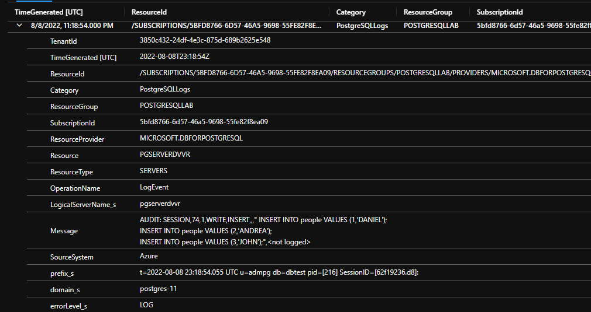

   also
 
   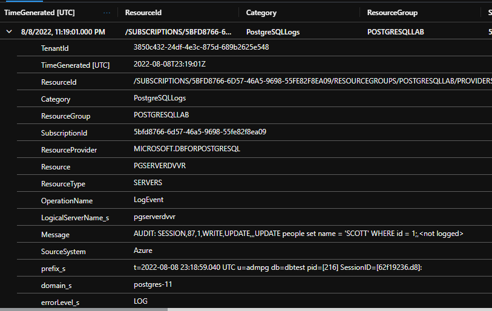

   This query is just an example, you can modify it to add the filters you need to get only the information you are looking for.
 
   For example, if you want to see only SELECT events on the table *people* for a specific user, you can use:

   ```kusto
   AzureDiagnostics
   | where LogicalServerName_s == '<servername>'
   | where TimeGenerated > ago(1d) 
   | where Message contains "AUDIT:"
   | where prefix_s contains "u=<username>"
   | where Message has_all ('SELECT','people')
   | order by TimeGenerated asc nulls last
   ```

   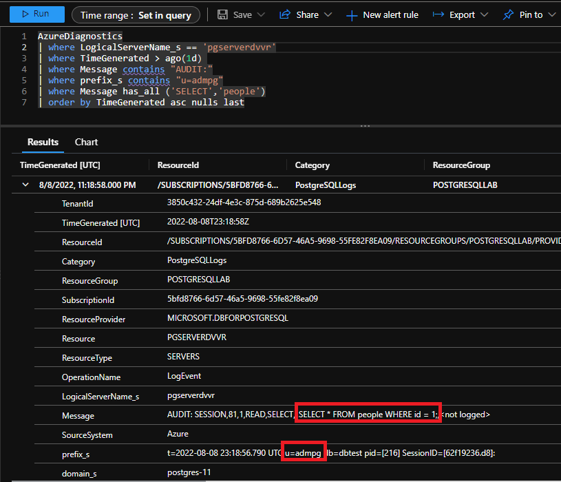

   >Kusto Query Language is very powerful, if you want to get familiar with it go to [Tutorial: Use Kusto queries](https://docs.microsoft.com/en-us/azure/data-explorer/kusto/query/tutorial?pivots=azuredataexplorer) 

1. Consult the audit log in the Storage Account

   Go to the Storage Account you set in the Diagnostics Setting
    
   Under the **Data Storage** section in the sidebar, select **Container**. 
   You will see a folder named **insights-logs-postgresqllogss** that was created automatically. 

   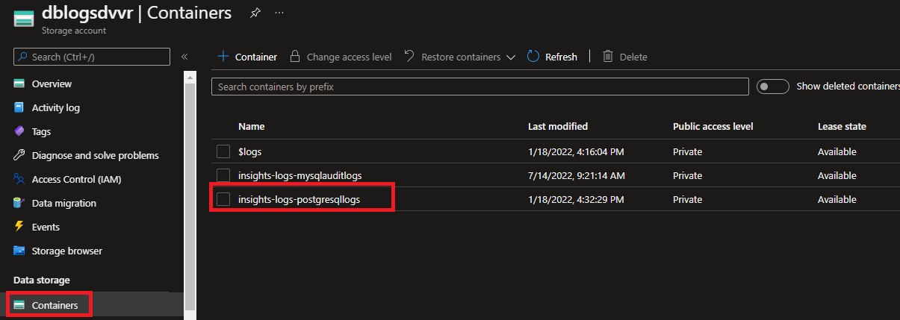

   click on the folder, and continue doing so until you get to the log for the resource group, server name, date and time you want to review

   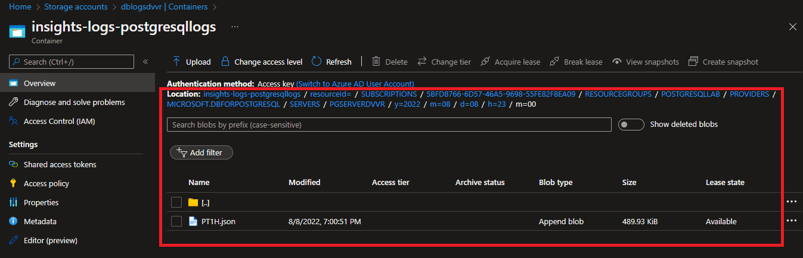

   Click on the JSON with the log entries. Then click on **Download**

   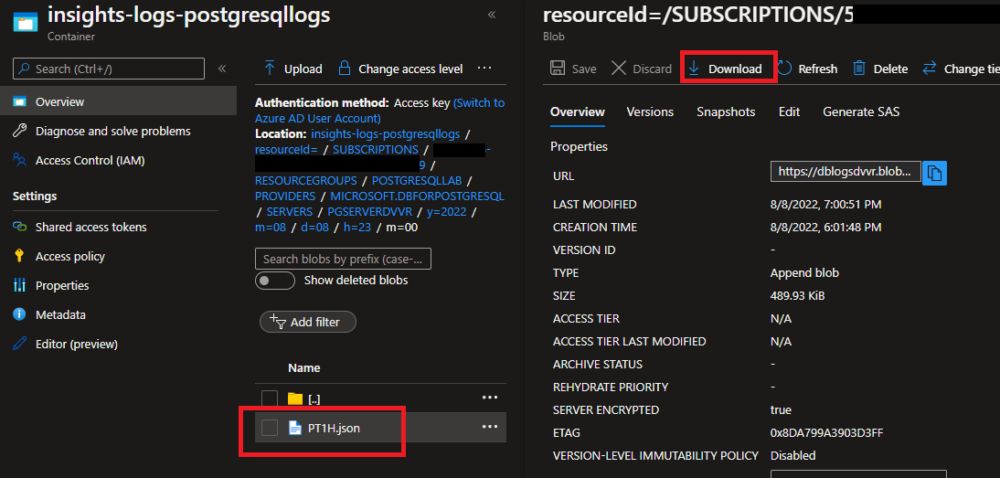

   Open the file using your favorite editor/JSON formatter and explore it. You will see the audit events in there 

   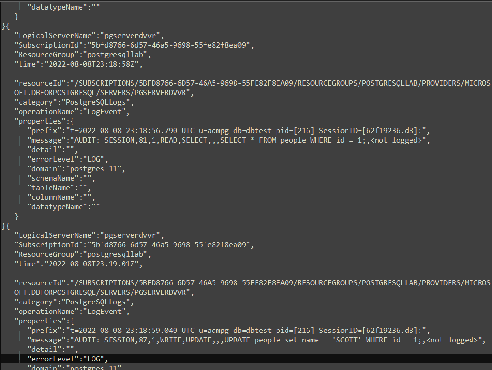

Congratulations!. You have successfully completed this exercise.

---

## Exercise 5: Configure Object Audit Logging

Object audit logging logs statements that affect a particular relation. Only SELECT, INSERT, UPDATE and DELETE commands are supported. TRUNCATE is not included in object audit logging.

Object audit logging is intended to be a finer-grained replacement for pgaudit.log = 'read, write'. As such, it may not make sense to use them in conjunction but one possible scenario would be to use session logging to capture each statement and then supplement that with object logging to get more detail about specific relations.

This exercise shows how to set up session audit logging

In this scenario, you only want to audit INSERT and DELETE events on the table *people*

**Tasks**

1. Connect to Microsoft Azure Portal
    
   Open Microsoft Edge and navigate to the [Azure Portal](http://ms.portal.azure.com) to connect to Microsoft Azure Portal. Login with your subscriptions credential.

1. Configure Object Audit Logging

   >For a full list of pgAudit parameters refer to [PgAudit Documentation](https://github.com/pgaudit/pgaudit/blob/master/README.md#settings)

   Under the **Settings** section in the sidebar, select **Server parameters**.
   
   Filer by **pgAudit**.
   
   - For **pgAudit.log** select **NONE** to disable Session Audit Logging configured in early in this lab.
  
   - Set **pgaudit.role** to *auditor*
     
     Object-level audit logging is implemented via the roles system. The pgaudit.role setting defines the role that will be used for audit logging. A relation (TABLE, VIEW, etc.) will be audit logged when the audit role has permissions for the command executed or inherits the permissions from another role.

   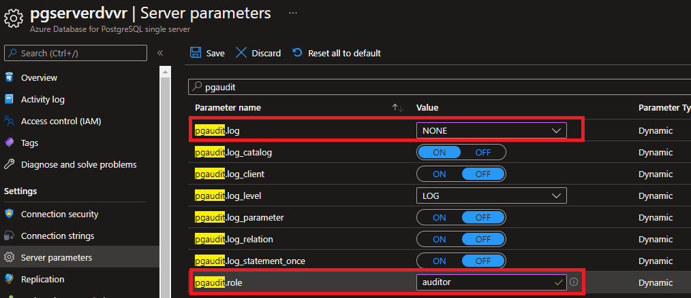

   Once you have changed the parameters, click **Save**.

1. Grant privileges to the audit role

   Using PostgreSQL pgAdmin or any other PostgreSQL client tool connect to the database server and the **dbtest** database
   
   Crete the *auditor* role

   ```sql
   CREATE ROLE auditor NOLOGIN;
   ```

   Grant INSERT and DELETE events on the *people* table to *auditor*

   ```sql
   GRANT INSERT, DELETE 
   ON public.people
   TO auditor;
   ```
   
Congratulations!. You have successfully completed this exercise.

---

## Exercise 6 Accessing the audit log for Object Audit Logging

This exercise shows how to access object audit events using different Log Analytics

>You can access the audit events log using the same methods as in Exercise 4

**Tasks**

1. Using PostgreSQL pgAdmin or any other PostgreSQL client tool connect to the database server and the **dbtest** database

1. Modify and query the table

   Insert a new row:

   ```sql
   INSERT INTO people VALUES (4,'MARIA');
   ```

   Query the table

   ```sql
   SELECT * FROM people WHERE id = 3;
   ```

   Update the table

   ```sql
   UPDATE people set name = 'ANGELICA' WHERE id = 2;
   ```

   Delete a row in the table

   ```sql
   DELETE FROM people WHERE id = 1;
   ```

1. Consult the audit log using the server log

   Under **Monitoring** select **Server Log**

   For the Lab, download the latest log (in a real scenario you need to download the log for the timeframe you need to analyze)

   

   Using your favorite text editor, search for the word **AUDIT**

   

1. Consult the audit log in Log Analytics

   Under the **Monitoring** section in the sidebar, select **Logs** 

   

   To get all AUDIT events for the server in the last 30 minutes, run the following kusto query:

   ```kusto
   AzureDiagnostics
   | where LogicalServerName_s == '<servername>'
   | where TimeGenerated > ago(30m) 
   | where Message contains "AUDIT:"
   | order by TimeGenerated asc nulls last
   ```
   
   >Make sure you replace *\<servername\>* with your server name

   You will find the entries for the INSERT AND DELETE events only, as the *auditor* role only has INSERT and DELETE privileges on the *people* table

   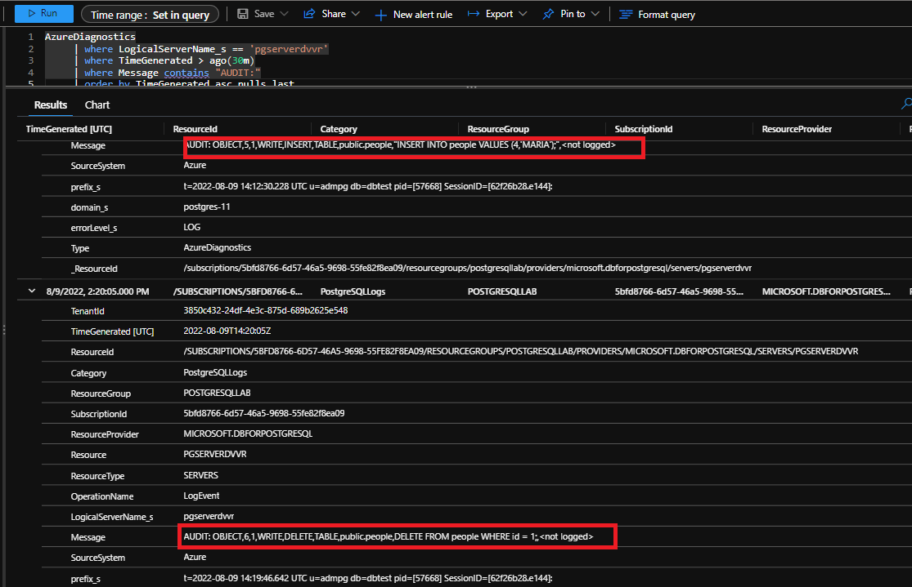

Congratulations!. You have successfully completed this exercise and the Lab. 