# Troubleshooting query performance in Azure Database for PostgreSQL Single Server

**Introduction** 

During this lab, you will learn how to use multiple tools that will help you troubleshooting query performance in Azure Database for PostgreSQL.

**Objectives** 

After completing this lab, you will be able to: 

- Setup Query Store for an Azure Database for PostgreSQL Single Server.
- Review Performance Recommendation on the Portal for Azure Database for PostgreSQL.
- Review Query Performance Insight on the Portal for Azure Database for PostgreSQL.

**Considerations**

This lab considers that an Azure Database for PostgreSQL Single Server named pgserver[your name initials] exists with a server admin login named *admpg*, if not, create it or use another existing server before continuing with the lab.

**Estimated Time:** 50 minutes

---

## Exercise 1: Create a sample database on the Azure Database for PostgreSQL Single Server

**Tasks**

1. Connect to Microsoft Azure Portal
    
   Open Microsoft Edge and navigate to the [Azure Portal](http://ms.portal.azure.com) to connect to Microsoft Azure Portal. Login with your subscriptions credential.

1. Go to your PostgreSQL Server

   Go to your Azure Database for PostgreSQL Single Server in any way you prefer to look for a resource on Azure

1. Identify the connection information for the Azure Database for PostgreSQL Single Server

   Make a note of the **Server name** and the **Server admin login name**.

1. Create the *adventureworks* database on the Azure Database for PostgreSQL Single Server
    
   Open a Windows Prompt and execute a script to create the adventureworks schema, create objects and load the demo employee data using:
    
   ```bash
   psql --file=C:\PostgresSQLSSLabFiles\adventureworks_creation.sql --host=<server_name>.postgres.database.azure.com --port=5432 --username=<admin_user>@<server_name> --dbname=postgres
   ```

   ```bash
   pg_restore -v --no-owner --host=<server_name>.postgres.database.azure.com --port=5432 --username=<admin_user>@<server_name> --dbname=adventureworks C:\PostgresSQLSSLabFiles\adventureworks.dump
   ```
    
   for example:

   ```bash
   psql --file=C:\PostgresSQLSSLabFiles\adventureworks_creation.sql --host=pgserverdvvr.postgres.database.azure.com --port=5432 --username=admpg@pgserverdvvr --dbname=postgres
   ```

   ```bash
   pg_restore -v --no-owner --host=pgserverdvvr.postgres.database.azure.com --port=5432 --username=admpg@pgserverdvvr --dbname=adventureworks C:\PostgresSQLSSLabFiles\adventureworks.dump
   ```

   >For both commands, you need to enter password when prompted. 
   
   >This is destructive action. If there is a database named adventureworks in the Azure Database for PostgreSQL Single Server, the existing adventureworks will be dropped and replaced.
    
   If you get a message like:
    
   *Psql: FATAL: no pg_hba.conf entry for host “127.172.166.85”, user “admpg”, database “postgres”, SSL on**
    
   You must allow access from the Virtual Machine to the Azure Database for PostgreSQL by adding a rule for the client machine IP address. Go to **Connection security** in **Settings**, add the rule and click **Save**.
    
   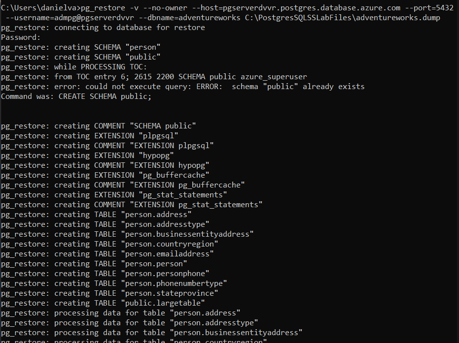
    
   If you get a timeout error like:
    
   ```nocolor-nocopy
   pg_restore: error: COPY failed for table "largetable": server closed the connection unexpectedly
       This probably means the server terminated abnormally
       before or while processing the request.
   pg_restore: error: could not execute query: no connection to the server
   Command was: -- Completed on 2019-10-25 20:40:59

   pg_restore: error: could not execute query: no connection to the server
   Command was: --
   -- PostgreSQL database dump complete
   --
   pg_restore: warning: errors ignored on restore: 15
   ```
   
   just retry the restore. The restore should take around 5 minutes to complete.

Congratulations!. You have successfully completed this exercise.

---

## Exercise 2: Enable Query Store and review performance info in the Query Store

This exercise shows how to enable Query Store and use it to review performance data of your queries.

**Tasks**

1. Connect to Microsoft Azure Portal
    
   Open Microsoft Edge and navigate to the [Azure Portal](http://ms.portal.azure.com) to connect to Microsoft Azure Portal. Login with your subscriptions credential.

1. Go to your PostgreSQL Server

   Go to your Azure Database for PostgreSQL Single Server in any way you prefer to look for a resource on Azure

1. Go to Server Parameters
    
   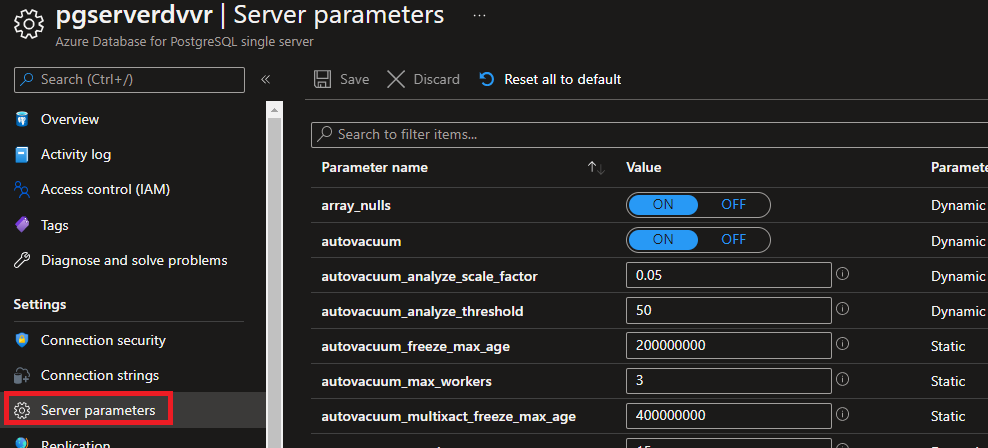

1. Search forn*pg_qs.query_capture_mode*
    
   Click on Value and change it to **ALL.**
    
   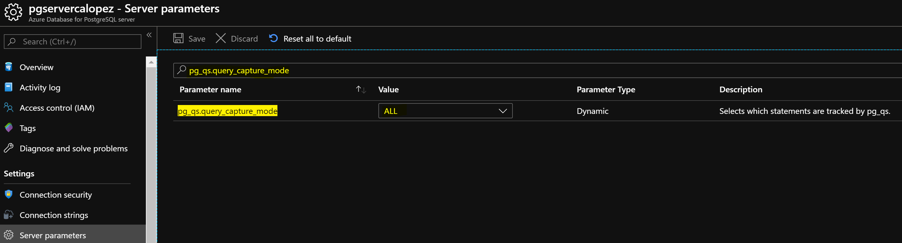
    
   Click **Save**.

1. Search for *pgms_wait_sampling.query_capture_mode*
    
   Click on Value and change it to **ALL.** This option will enable the wait statistics
    
   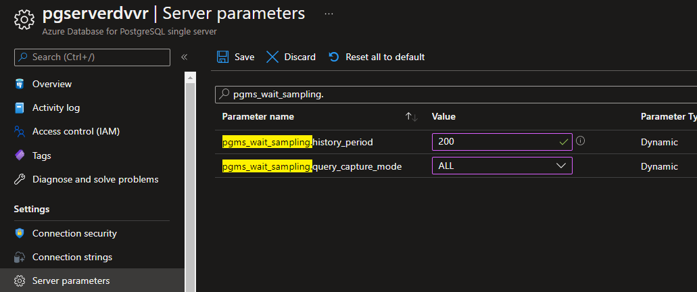
    
   Click **Save**.

1. Search for *pg_qs.retention_period_in_days*
    
   Click on Value and change it to **14.** This option will allow you to set the retention period of the query store, between 1 and 30 days.
    
   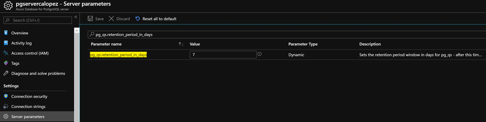
    
   Click **Save**.

1. Search for *pgms_wait_sampling.history_period*
    
   Click on Value and change it to **200.** This option specifies how often (in Milliseconds) wait events are sampled.
      
   Click **Save**.
    
   For *pgms_wait_sampling.history_period*, the shorter the period, the more frequent the sampling. More information is retrieved, but that comes with the cost of greater resource consumption. Increase this period if the server is under load or you don't need the granularity.
    
   You can check your section to verify that the parameters values have been changed, it should only take a few seconds for each parameter to change.
    
   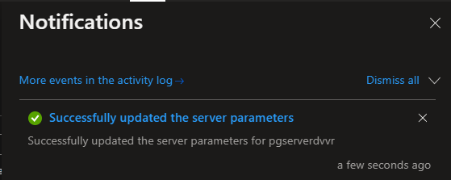

1. Open pgAdmin and connect to your server
    
   Open **pgAdmin**.
    
   You can find pgAdmin on Windows by typing pgAdmin in the Search box

1. Run some queries to populate its statistics on the Query Store.
    
   Connect to *adventureworks* and open a Query Tool. Execute the following query:

   >You can find the query at **C:\PostgresSQLSSLabFiles\heavy_query.sql**    

   **```sql**
   SELECT
       p.title
       , p.firstname
       , p. middlename
       , p. lastname
       , p.suffix
       , p.emailpromotion
       , at.name AS addresstype
       , a.addressline1
       , a.addressline2
       , a.city
       , sp.stateprovincecode
       , sp.name AS stateprovicename
       , cr.name AS countryregionname
       , a.postalcode
       , ea.emailaddress
       , pnt.name AS phonenumbertype
       , pp.phonenumber
   FROM person.person AS p
       INNER JOIN person.businessentityaddress AS bea
           ON p.businessentityid = bea.businessentityid
       INNER JOIN person.address AS a
           ON a.addressid = bea.addressid
       INNER JOIN person.addresstype AS at
           ON at.addresstypeid = bea.addresstypeid
       INNER JOIN person.stateprovince AS sp
           ON sp.stateprovinceid = a.stateprovinceid
       INNER JOIN person.countryregion AS cr
           ON cr.countryregioncode = sp.countryregioncode
       INNER JOIN person.emailaddress AS ea
           ON ea.businessentityid = p.businessentityid
       INNER JOIN person.personphone AS pp
           ON pp.businessentityid = p.businessentityid
       INNER JOIN person.phonenumbertype AS pnt
           ON pnt.phonenumbertypeid = pp.phonenumbertypeid
       ORDER BY lastname, firstname, middlename;
   ```
   
   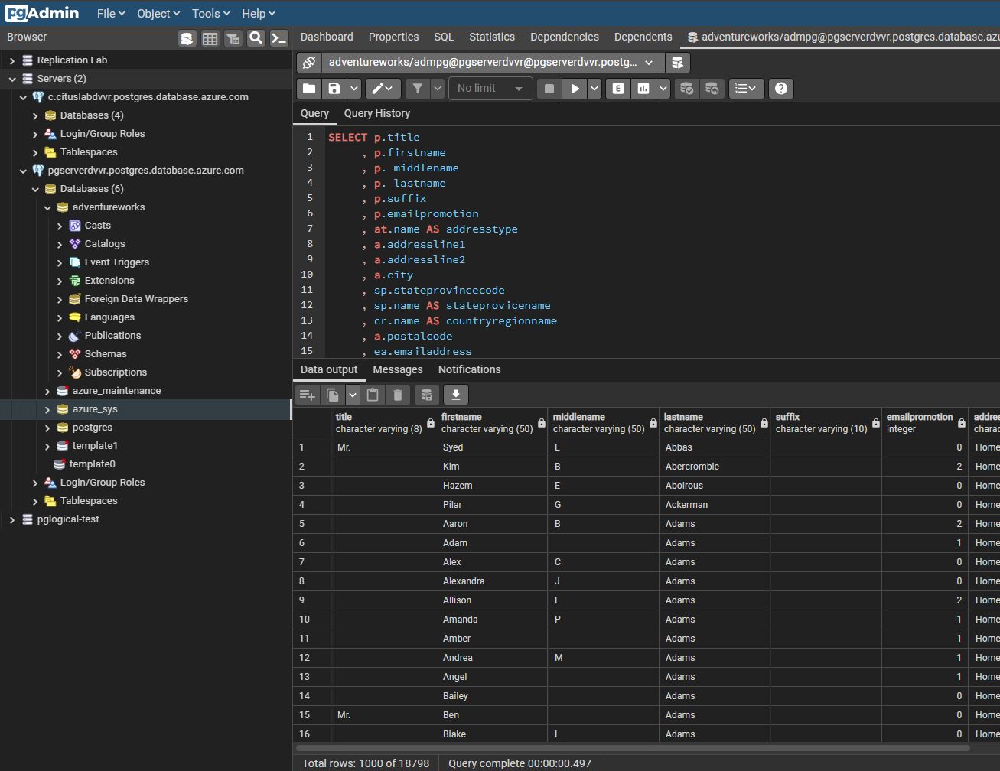
   
   Connect to *adventureworks* and open a Query Tool. Execute the following query:
   
   ```sql
   select * from LargeTable where id = 5000;
   ```
   
   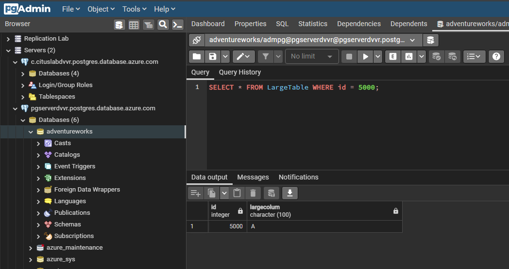

1. Review the query statistics on the Query Store
    
   >Allow up to 20 minutes for the first batch of data to persist in the *azure_sys* database. You might want to continue to the next two exercises and come back to this task.

   >Query Store data is stored in the *azure_sys* database on your Postgres server.

  To see execution statistics for the query we ran earlier in Task 10 (note: you can remove the where clause filter if you are not getting anything returned and search for the query in Task 10 on that result set), connect to *azure_sys*, open a Query Tool and execute the following query:

   ```sql
   SELECT pgu.usename
       , qsv.*
   FROM query_store.qs_view AS qsv
       INNER JOIN pg_user AS pgu ON pgu.usesysid = qsv.user_id
   WHERE is_system_query = 'false'
       AND query_sql_text LIKE 'SELECT p.title%';
   ```

   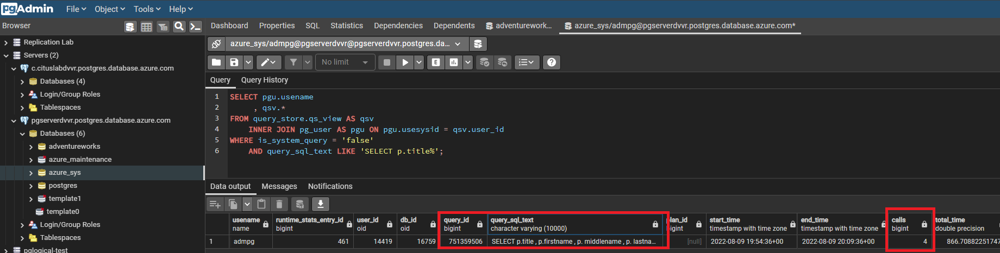

   To see all the waits encountered for all non-system queries, connect to *azure_sys*, open a Query Tool and execute the following query:

   ```sql
   SELECT pgu.usename
       , pws.*
   FROM query_store.pgms_wait_sampling_view AS pws
       INNER JOIN pg_user AS pgu ON pgu.usesysid = pws.user_id
   WHERE query_id > 0 and user_id > 10;
   ```

   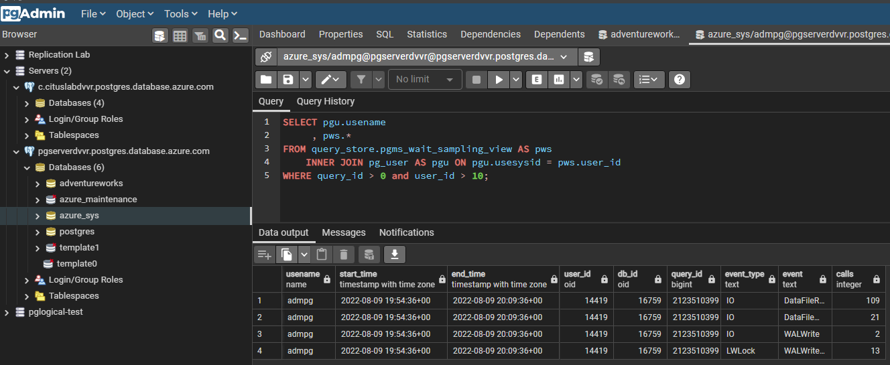

   Additionally, expand the *azure_sys* database and review the tables and views under the *query_store* schema to see what else this query store has to offer.

Congratulations!. You have successfully completed this exercise.

---

## Exercise 3: Performance Recommendations for Azure Database for PostgreSQL Single Server

This exercise shows how to use the Azure Portal's Performance Recommendations for Azure Database for PostgreSQL.

**Tasks**

1. Connect to Microsoft Azure Portal
    
   Open Microsoft Edge and navigate to the [Azure Portal](http://ms.portal.azure.com) to connect to Microsoft Azure Portal. Login with your subscriptions credential.

1. Go to your PostgreSQL Server

   Go to your Azure Database for PostgreSQL Single Server in any way you prefer to look for a resource on Azure

1. Go to **Performance Recommendations** under **Intelligent Performance**
    
   The first time you run this service, it will show no recommendations, and advice you to perform and analysis. Click on the **Analyze** option
    
   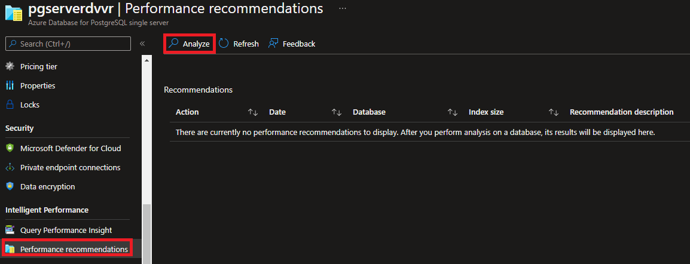

1. Change the database to *Adventureworks* and click on **Analyze**
    
   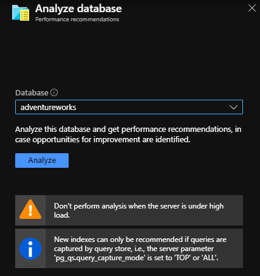
    
   Notice a couple of things:
   - First, it recommends not to perform the analysis when the server is under high load, this is because the analysis will need to evaluate your database and that will most likely produce additional I/O and CPU. We will ignore this recommendation for lab purposes.
   - Second, to get the best possible analysis, you should enable the query store first, since this will allow the service to use the query store to evaluate the historic performance of the database.

1. Review the results
    
   If you ran the query in Task 10 of Exercise 2 you should get a similar result as the one shown below.
    
   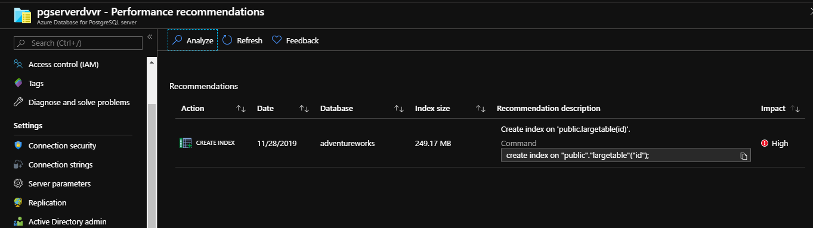
    
   The recommendation includes the command you need to execute to create the index and it even indicates the size for the index
    
   In a production environment you would evaluate the recommendations and apply those that you believe will improve the performance of your queries.

Congratulations!. You have successfully completed this exercise.

---

## Exercise 4: Query Performance Insight for Azure Database for PostgreSQL Single Server 

This exercise shows how to use Query Performance Insight for Azure Database for PostgreSQL Single Server

**Tasks**

1. Connect to Microsoft Azure Portal
    
   Open Microsoft Edge and navigate to the [Azure Portal](http://ms.portal.azure.com) to connect to Microsoft Azure Portal. Login with your subscriptions credential.

1. Go to your PostgreSQL Server

   Go to your Azure Database for PostgreSQL Single Server in any way you prefer to look for a resource on Azure

1. Go to **Performance Recommendations** under **Intelligent Performance**
    
   Under **Long Running Queries** tab, you will be able to see the different execution for the longest running queries.
    
   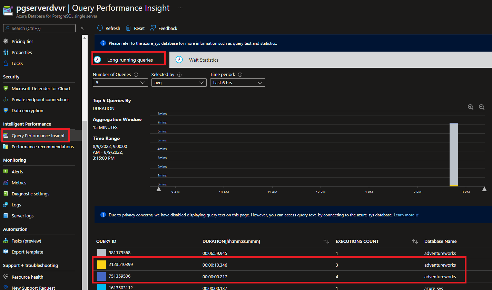
    
   Notice that the queries executed in Task 10 of Exercise 2 are reported.
    
   In this tab:
   - By default you will see the top five longest running queries but you can view the top *10* or top *15* queries by changing the value of the *Number of Queries* pulldown.
   - You can also see the *min, max, sum* values by changing the *Selected by* pulldown, with *avg* as the default value.
   - You can change the *Time Period* pull down to see the queries for the last *6 hours, last week* or *last month*, with the last *24 hours* as the default value.
    
   Under **Wait Statistic** tab, you will be able to see the Top Events (waits) by either individual Queries or by Event type.
    
   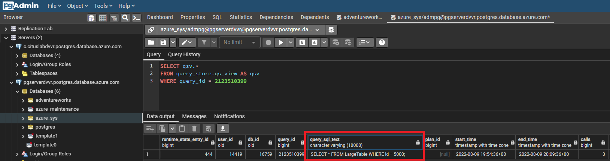
    
   Examine the wait types that affected the queries executed in Task 10 of exercise 2.
    
   In this tab:
   - By default, you should be able to see the events in the last *24 hours* or change the *Time Period* pulldown to *6 hours, last week* or *last month*.
   - You can change how to group the report by either *Query* or *Event* by changing the value of the *Group By* pulldown.
   - You can show *10* or *15* groups by changing the value of the *Number of Groups* pulldown, with *5* as the default number of groups

Congratulations!. You have successfully completed this exercise and the Lab.