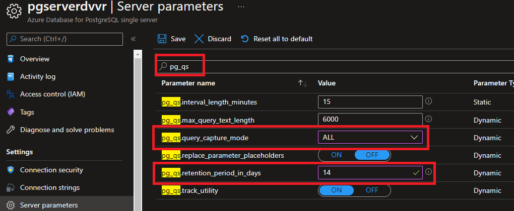

# Troubleshooting query performance in Azure Database for PostgreSQL Single Server

**Introduction** 

During this lab, you will learn how to use multiple tools that will help you troubleshooting query performance in Azure Database for PostgreSQL.

**Objectives** 

After completing this lab, you will be able to: 

- Setup Query Store for an Azure Database for PostgreSQL Single Server.
- Review Performance Recommendation on the Portal for Azure Database for PostgreSQL.
- Review Query Performance Insight on the Portal for Azure Database for PostgreSQL.

**Considerations**

This lab considers that an Azure Database for PostgreSQL Single Server named pgserver[your name initials] exists with a server admin login named *admpg*, if not, create it or use another existing server before continuing with the lab.

**Estimated Time:** 50 minutes

---

## Exercise 1: Create a sample database on the Azure Database for PostgreSQL Single Server

**Tasks**

1. Connect to Microsoft Azure Portal
    
   Open Microsoft Edge and navigate to the [Azure Portal](http://ms.portal.azure.com) to connect to Microsoft Azure Portal. Login with your subscriptions credential.

1. Go to your PostgreSQL Server

   Go to your Azure Database for PostgreSQL Single Server in any way you prefer to look for a resource on Azure

1. Identify the connection information for the Azure Database for PostgreSQL Single Server

   Make a note of the **Server name** and the **Server admin login name**.

1. Create the *adventureworks* database on the Azure Database for PostgreSQL Single Server
   
   Dowonlad the [adventureworks demo database](https://github.com/danvalero/AzureOSSDBLabs/raw/main/Azure%20Database%20for%20PostgreSQL%20Single%20Server/PostgresSQLSSLabFiles/adventureworks.dump) in **C:\\\PostgresSQLSSLabFiles** folder

   Open a Windows Prompt and execute a script to create the adventureworks schema, create objects and load the demo employee data using:
    
   ```bash
   psql --host=<server_name>.postgres.database.azure.com --port=5432 --username=<admin_user>@<server_name> --dbname=postgres -c "DROP DATABASE IF EXISTS adventureworks;" -c "CREATE DATABASE adventureworks;"
   ```

   ```bash
   pg_restore -v --no-owner --host=<server_name>.postgres.database.azure.com --port=5432 --username=<admin_user>@<server_name> --dbname=adventureworks C:\\PostgresSQLSSLabFiles\\adventureworks.dump
   ```
    
   for example:

   ```bash
   psql --host=pgserverdvvr.postgres.database.azure.com --port=5432 --username=admpg@pgserverdvvr --dbname=postgres -c "DROP DATABASE IF EXISTS adventureworks;" -c "CREATE DATABASE adventureworks;"
   ```

   ```bash
   pg_restore -v --no-owner --host=pgserverdvvr.postgres.database.azure.com --port=5432 --username=admpg@pgserverdvvr --dbname=adventureworks C:\\PostgresSQLSSLabFiles\\adventureworks.dump
   ```

   >For both commands, you need to enter password when prompted. 
   
   >This is destructive action. If there is a database named adventureworks in the Azure Database for PostgreSQL Single Server, the existing adventureworks will be dropped and replaced.
   
   

   If you get a timeout error like:
    
   ```nocolor-nocopy
   pg_restore: error: COPY failed for table "largetable": server closed the connection unexpectedly
       This probably means the server terminated abnormally
       before or while processing the request.
   pg_restore: error: could not execute query: no connection to the server
   Command was: -- Completed on 2019-10-25 20:40:59

   pg_restore: error: could not execute query: no connection to the server
   Command was: --
   -- PostgreSQL database dump complete
   --
   pg_restore: warning: errors ignored on restore: 15
   ```
   
   just retry the restore. The restore should take around 5 minutes to complete.

Congratulations!. You have successfully completed this exercise.

---

## Exercise 2: Enable Query Store and review performance info in the Query Store

This exercise shows how to enable Query Store and use it to review performance data of your queries.

**Tasks**

1. Connect to Microsoft Azure Portal
    
   Open Microsoft Edge and navigate to the [Azure Portal](http://ms.portal.azure.com) to connect to Microsoft Azure Portal. Login with your subscriptions credential.

1. Go to your PostgreSQL Server

   Go to your Azure Database for PostgreSQL Single Server in any way you prefer to look for a resource on Azure

1. Go to Server Parameters
    
   

1. Enable query capture and enable wait statistics

   Search for *pg_qs*
    
   Set **pg_qs.query_capture_mode** to **ALL.**.

   Set **pg_qs.retention_period_in_days** to **14**. 
   
   >This option will allow you to set the retention period of the query store it can be between 1 and 30 days.Avoid keeping historical data you do not plan to use. Increase the value if you need to keep data longer.

       

   Search for *pgms_wait_sampling.*
    
   Set **pgms_wait_sampling.query_capture_mode** to **ALL**. This option will enable the wait statistics

   Set **pgms_wait_sampling.history_period** to **200**. This option specifies how often (in Milliseconds) wait events are sampled.

   >For *pgms_wait_sampling.history_period*, the shorter the period, the more frequent the sampling. More information is retrieved, but that comes with the cost of greater resource consumption. Increase this period if the server is under load or you don't need the granularity.

   

   >Other configuration options are available Rfefer to [Configuration options](https://docs.microsoft.com/en-us/azure/postgresql/single-server/concepts-query-store#configuration-options) for further information 
   
   Click **Save**.

   It should only take a few seconds for each parameter to change. When the paremters are updated you will see the notification
    
   

1. Run some queries to populate its statistics on the Query Store.
    
   Using PostgreSQL pgAdmin or any other PostgreSQL client tool connect to the database server and the **adventureworks** database

   Execute 4 times the following query:

   ```sql
   SELECT p.title
        , p.firstname
        , p. middlename
        , p. lastname
        , p.suffix
        , p.emailpromotion
        , at.name AS addresstype
        , a.addressline1
        , a.addressline2
        , a.city
        , sp.stateprovincecode
        , sp.name AS stateprovicename
        , cr.name AS countryregionname
        , a.postalcode
        , ea.emailaddress
        , pnt.name AS phonenumbertype
        , pp.phonenumber
   FROM person.person AS p
       INNER JOIN person.businessentityaddress AS bea
           ON p.businessentityid = bea.businessentityid
       INNER JOIN person.address AS a
           ON a.addressid = bea.addressid
       INNER JOIN person.addresstype AS at
           ON at.addresstypeid = bea.addresstypeid
       INNER JOIN person.stateprovince AS sp
           ON sp.stateprovinceid = a.stateprovinceid
       INNER JOIN person.countryregion AS cr
           ON cr.countryregioncode = sp.countryregioncode
       INNER JOIN person.emailaddress AS ea
           ON ea.businessentityid = p.businessentityid
       INNER JOIN person.personphone AS pp
           ON pp.businessentityid = p.businessentityid
       INNER JOIN person.phonenumbertype AS pnt
           ON pnt.phonenumbertypeid = pp.phonenumbertypeid
       ORDER BY lastname, firstname, middlename;
   ```
   
   
      
   Also, execute 3 times the following query:
   
   ```sql
   SELECT * FROM LargeTable WHERE id = 5000;
   ```
   
   

   Notice it takes several seconds tu run een when it is a simple query looking a row by id.

1. Review the query statistics on the Query Store
    
   Query Store data is stored in the *azure_sys* database on your Postgres server.

   >Allow up to 20 minutes for the first batch of data to persist in the *azure_sys* database. You might want to take a break now

   To see execution statistics for the 1st query you ran in the previous Task, connect to *azure_sys* and execute the following query:

   ```sql
   SELECT pgu.usename
        , qsv.*
   FROM query_store.qs_view AS qsv
       INNER JOIN pg_user AS pgu ON pgu.usesysid = qsv.user_id
   WHERE is_system_query = 'false'
       AND query_sql_text LIKE 'SELECT p.title%';
   ```

   

   You can see the queryID (751359506 in the example image), the whole query test, the execution count (calls), etc.

   To see all the waits encountered for all non-system queries, connect to *azure_sys*, open a Query Tool and execute the following query:

   ```sql
   SELECT pgu.usename
        , pws.*
   FROM query_store.pgms_wait_sampling_view AS pws
       INNER JOIN pg_user AS pgu ON pgu.usesysid = pws.user_id
   WHERE query_id > 0 and user_id > 10;
   ```

   

   Additionally, expand the *azure_sys* database and review the tables and views under the *query_store* schema to see what else this query store has to offer. For further infomation about the meaning of each column refer to [query_store.qs_view](https://docs.microsoft.com/en-us/azure/postgresql/single-server/concepts-query-store#query_storeqs_view)


Congratulations!. You have successfully completed this exercise.

---

## Exercise 3: Query Performance Insight for Azure Database for PostgreSQL Single Server 

Query Performance Insight helps you to quickly identify what your longest running queries are, how they change over time, and what waits are affecting them.

This exercise shows how to use Query Performance Insight for Azure Database for PostgreSQL Single Server

**Tasks**

1. Connect to Microsoft Azure Portal
    
   Open Microsoft Edge and navigate to the [Azure Portal](http://ms.portal.azure.com) to connect to Microsoft Azure Portal. Login with your subscriptions credential.

1. Go to your PostgreSQL Server

   Go to your Azure Database for PostgreSQL Single Server in any way you prefer to look for a resource on Azure

1. Go to **Query Performance Insight** under **Intelligent Performance**
    
   Under **Long Running Queries** tab, you will be able to see the different execution for the longest running queries.

   In this tab:
   - By default you will see the top five longest running queries but you can view the top *10* or top *15* queries by changing the value of the *Number of Queries* pulldown.
   - You can also see the *min, max, sum* values by changing the *Selected by* pulldown, with *avg* as the default value.
   - You can change the *Time Period* pull down to see the queries for the last *6 hours, last week* or *last month*, with the last *24 hours* as the default value.

   
    
   Notice that the queries executed in the previuos Exercise are reported.
       
   Under **Wait Statistic** tab, you will be able to see the Top Events (waits) by either individual Queries or by Event type.
    
   In this tab:
   - By default, you should be able to see the events in the last *24 hours* or change the *Time Period* pulldown to *6 hours, last week* or *last month*.
   - You can change how to group the report by either *Query* or *Event* by changing the value of the *Group By* pulldown.

   
    
   Examine the wait types that affected the queries executed in the previous exercise.
    
1. Identify the query text

   Due to privacy concerns, the query text is not shown in the Query Performance Insight
   
   To access query text, connect to the azure_sys database and execute

   ```sql
   SELECT qsv.*
   FROM query_store.qs_view AS qsv
   WHERE query_id = <query_id>  
   ```

   >Make sure you replace *\<query_id\>* with the id you see in the query Performance Insight screen for the query that was executed 3 times

   

   Notice is the query you executed 3 times in the previos exercise

   ```sql
   SELECT * FROM LargeTable WHERE id = 5000;
   ```

1. Basic troubleshooting

   Connect to the **adventureworks** database and run the query using EXPLAIN 

   ```sql
   EXPLAIN ANALYZE
   SELECT * FROM LargeTable WHERE id = 5000;
   ```

   

   This is a simple query, however, PostgreSQL is using parallelism and doing a Parallel Seq Scan on *largetable*.   

   >Seq Scan means PostgreSQL is examining the whole table to get the rows it needs to return... not efficient at all! 

   There query has contidion in the WHERE clause to filter by *id*

   Review the indexes for *largetable* by executing:

   ```sql
   SELECT *
   FROM pg_indexes
   WHERE tablename = 'largetable'
   ```

   No results... There is no index on *largetable*
   
   To optimize this query, an index on column *id* on table *largetable* could help. 

   >Do not create any index yet.

Congratulations!. You have successfully completed this exercise.

---

## Exercise 4: Performance Recommendations for Azure Database for PostgreSQL Single Server

This exercise shows how to use the Azure Portal's Performance Recommendations for Azure Database for PostgreSQL.

**Tasks**

1. Connect to Microsoft Azure Portal
    
   Open Microsoft Edge and navigate to the [Azure Portal](http://ms.portal.azure.com) to connect to Microsoft Azure Portal. Login with your subscriptions credential.

1. Go to your PostgreSQL Server

   Go to your Azure Database for PostgreSQL Single Server in any way you prefer to look for a resource on Azure

1. Go to **Performance Recommendations** under **Intelligent Performance**
    
   The first time you run this service, it will show no recommendations, and advice you to perform and analysis. Click on the **Analyze** option
    
   

1. Analyze the database
 
   Change the database to *adventureworks* and click on **Analyze**
   
   It can take a few minutes for the analysis to complete
   
   Notice a couple of things:
   - First, it recommends not to perform the analysis when the server is under high load, this is because the analysis will need to evaluate your database and that will most likely produce additional I/O and CPU. We will ignore this recommendation for lab purposes.
   - Second, to get the best possible analysis, you should enable the query store first, since this will allow the service to use the query store to evaluate the historic performance of the database.

   
  
1. Review recommendations
    
   You should get a similar result as the one shown below.
    
   
    
   The recommendation includes the command you need to execute to create the index and it even indicates the size for the index

   Notice the recommendation is to create an index on table *largetable* by column *id*. This is same conclusion we got on previuos exercise
   
 1. Apply recommendation and evaluate resuts 

    Create the index using the command in the "Recomendation description"

    ```sql
    create index on "public"."largetable"("id");
    ```

    > In a production environment you would evaluate the recommendations and apply those that you believe will improve the performance of your queries.

    Run the affected query again:

    ```sql
    SELECT * FROM LargeTable WHERE id = 5000;
    ```

    It now runs in less than a second. Great improvement

    Review the execution plan by executing

    ```sql
    EXPLAIN ANALYZE
    SELECT * FROM LargeTable WHERE id = 5000;
    ```

    

    The query now uses and Index Scan using index *largetable_id_idx* on *largetable* instead of a Seq Scan . The cost has also gone down to cost=0.44..2.65 

    The recomendation was valid and helpuful for performance.

Congratulations!. You have successfully completed this exercise and the Lab.