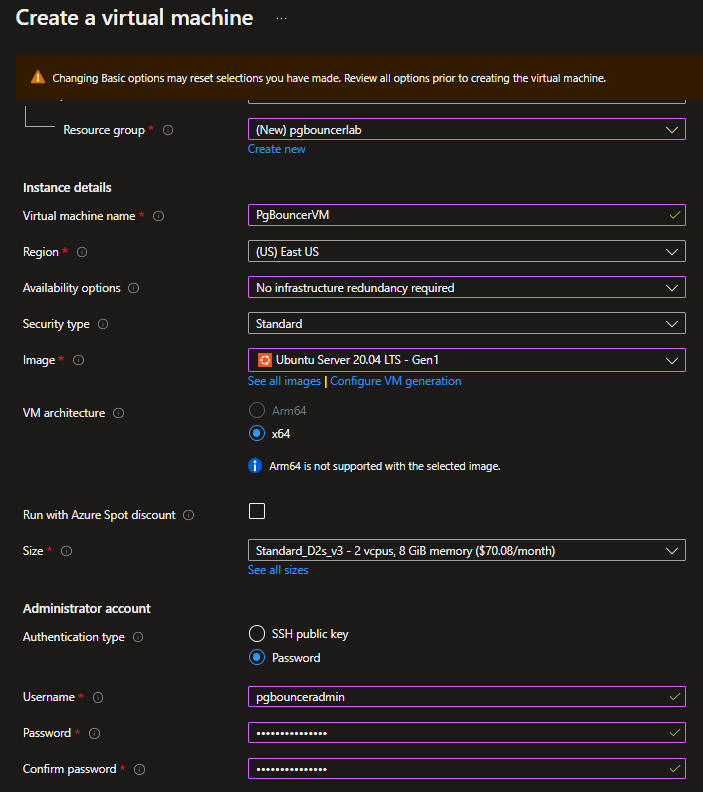
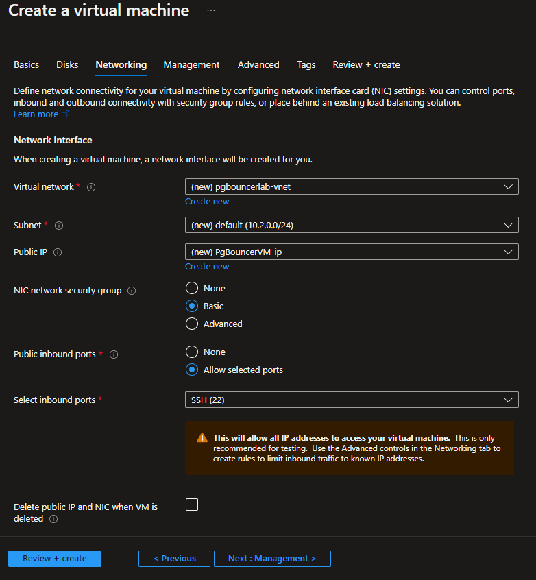
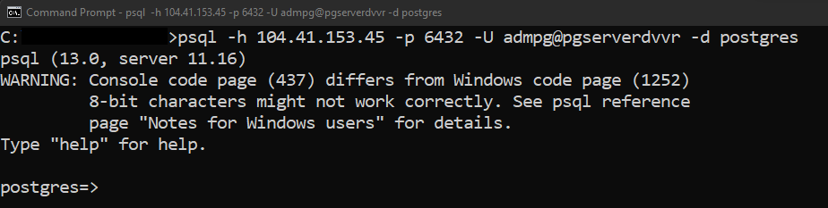
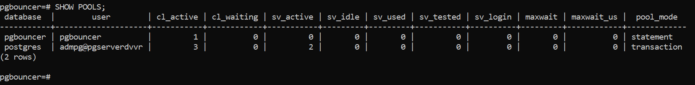

# Install and setup PgBouncer connection pooling service for Azure Database for PostgreSQL Single Server Single Server

**Introduction**

During this lab, you will learn how to install and setup pgbouncer connection pooling service for Azure Database for PostgreSQL

**Objectives**

After completing this lab, you will be able to:

- Install pgbouncer service on an Ubuntu VM. 
- Setup and Configure pgbouncer service for connection pooling with Azure Database for PostgreSQL.
- Connect to Azure PostgreSQL service using pgbouncer.
- Understand how to check the Pool and Stats Information.

**Considerations**

This lab considers that an Azure Database for PostgreSQL Single Server named pgserver[your name initials] exists with a server admin login named *admpg*, if not, create it or use another existing server before continuing with the lab.

**Estimated Time:** 120 minutes

---

## Exercise 1: Deploy an Ubuntu Server VM, install PgBouncer and PostgreSQL clients

In this exercise you will install the PgBouncer service on an Ubuntu VM on Azure

**Tasks**

1. Connect to Microsoft Azure Portal
    
   Open Microsoft Edge and navigate to the [Azure Portal](http://ms.portal.azure.com) to connect to Microsoft Azure Portal. Login with your subscriptions credential.

1. Create a VM for pgBouncer
   
   Click on **+ Create a resource**, then click on **Create** unser **Virtual Machine**
   
   

   Configure the VM using the following information in the **Basics** section:
   - **Resource Group**: pgbouncerlab
   - **Name**: PgBouncerVM
   - **Region**: The same region as the Azure Database for PostgreSQL Single Server
   - **Availability zone**: Choose *No infrastructure redundancy required*   
   - **Scecurity type**: Standard
   - **Image**: Look for **Ubuntu Server** and select the most recent LTS version (use at least Ubuntu 20.04)
   - **Authentication type**: Password
   - **Username**: pgbounceradmin
   - **Password**: Set a strong password
   - **Pulic inbound ports**: Allow selected ports
   - **Select inbound ports**: select *SHH (22)*
   - Use default values for other settings
 
   
 
   Click **Next** until you get to the **Networking** section
 
   Use the following information in the **Networking** section:
   - **NIC network security group**: Basic
   - **Public inbound ports**: Allow selected ports
   - **Select inbound ports**: select *SHH (22)*
   - Use default values for other settings
   
   NOTE: You can use an existing VNET, however, for lab purposes it is recommended to create a new VNET you can delete when the lab ends. Take a note of the new VNET being created

   

   Click on **Review + create**, and then click on **Create**
    
   Wait until the VM is created

1. Identify private and public IP addresses for the VM

   In Azure portal, go to your Virtual Machine **PgBouncerVM** in any way you prefer to look for a resource on Azure

   In the **Overview** pane, you can see the public and private IPs. Take note of both of them as they will be used at later section.

   

1. Open pgBouncer port in the VM

   >The default port for pgBouncer is 6432. You can use another port if needed by changing the pgBouncer configuration file, but for lab purposes the default port will be used.

   In Azure portal, go to your Virtual Machine **PgBouncerVM** in any way you prefer to look for a resource on Azure

   Go to **Networking** under **Settings**. Click **Add inbound port rule**

   

   Configure the rule using the following information:
   - **Destination port ranges**: 6432
   - **Protocol**: TCP
   - **Priority**: 310
   - **Name**: PgBouncer_Port
   - Use default values for all other settings
 
   

   Click **Add**
 
   Wait until the rule is created. The final configuration should look like:

   

   > When creating the inbound port rule, consider security implication and limit the possible sources for the connection. Ideally, the possible sources should be limited to valid clients that need to connect to Azure Database for PostgreSQL Single Server through the PgBouncer service in this VM. In this lab you can enable connections from any source but that is not recommended from security perspective.

1. Install PgBouncer and PostgreSQL client

   Using any ssh client, connect to the VM **PgBouncerVM** using its Public IP adress.

   >On Windows you can use [Putty](https://www.putty.org/). If using Windows 10 or superior you can use built-in ssh client in the Windows Command Prompt

   Authenticate with the user **pgadminuser** and the password you set during VM creation

   

   Update packages information by executing:

   ```bash
   sudo apt-get -y update
   ```

   Install PgBouncer and postgresql-client by executing:

   ```bash
   sudo apt-get install -y pgbouncer postgresql-client
   ```

   >You might need to provide the password for the user pgadminuser when use sudo

Congratulations!. You have successfully completed this exercise.

---

## Exercise 2: Configure PgBouncer

In this exercise you will configure PgBouncer to connect to your Azure Database for PostgreSQL Single Server.

You will modify just some basic parameters. However, it is important you get familiar with other parameters as they can be useful to meet your needs. Refer to [https://www.pgbouncer.org/config.html](https://www.pgbouncer.org/config.html)

**Tasks**

1. Connect to the PgBouncerVM machine

   Using any ssh client, connect to the VM **PgBouncerVM** using its Public IP adress.

   >On Windows you can use [Putty](https://www.putty.org/). If using Windows 10 or superior you can use built-in ssh client in the Windows Command Prompt

   Authenticate with the user **pgadminuser** and the password you set during VM creation

1. Download certificate file used to connect to Azure DB for PostgreSQL using SSL connection

   For further information on SSL configuration refer to [Configure TLS connectivity in Azure Database for PostgreSQL - Single Server](https://docs.microsoft.com/en-us/azure/postgresql/single-server/concepts-ssl-connection-security)

   Download the certificates and create the required bundle by executing:

   ```bash
   curl -LO https://www.digicert.com/CACerts/BaltimoreCyberTrustRoot.crt.pem
   curl -LO https://cacerts.digicert.com/DigiCertGlobalRootG2.crt.pem
   sudo cat BaltimoreCyberTrustRoot.crt.pem DigiCertGlobalRootG2.crt.pem > azurepostgresql.pem
   sudo mv azurepostgresql.pem /etc/azurepostgresql.pem
   ```

   >In this lab, the certificate file is being downloaded in /etc for lab purposes. You can save it any other place when implementing PgBouncer in your own environment.

1. Configure PgBouncer

   Using your favorite Linux text editor, open */etc/pgbouncer/pgbouncer.ini*

   Under the **[databases]** section, modify the line to indicate the target server and database

   ```nocolor-nocopy
   * = host=<postgresql_server_name>.postgres.database.azure.com port=5432
   ```

   Example:

   ```nocolor-nocopy
   * = host=pgserverdvvr.postgres.database.azure.com port=5432
   ```

   

   Under the **[pgbouncer]** section, make sure the parameters *listen_addr*, *server_tls_sslmode* and *server_tls_ca_file* are configured as follow:

   ```nocolor-nocopy
   listen_addr = *
   server_tls_sslmode = verify-ca
   server_tls_ca_file = /etc/azurepostgresql.pem
   pool_mode = transaction
   admin_users = admin1
   ```

   Save modifications.

   In the image below you can see the paramters you must modify. Some content was remove to show these parameters, so you will see something slighlty different when editing the file 

   

   >In the *pgbouncer.ini* file, notice that the default port for PgBouncer is 6432. If you change it, you need to create an inbound port rule in the VM that runs PgBouncer

1. Configure the authentication file for PgBouncer

   When using PgBouncer, the application connects to the PgBouncer proxy service running locally on the VM while PgBouncer service in-turn connects to the Azure Database for PostgreSQL service using the credentials in *userlist.txt* file and configuration settings specified in the *Pgbouncer.ini* file

   >In a production environment you will not use the admin user for the Azure Database for PostgreSQL Single Server, but users with less privileges.

   Only users listed in the configuration parameters *admin_users* or *stats_users* are allowed to log in to the console. (Except when auth_type=any, then any user is allowed in as a stats_user.)

   Additionally, the user name *pgbouncer* is allowed to log in without password, if the login comes via the Unix socket and the client has same Unix user UID as the running process.

   Using your favorite Linux text editor, open */etc/pgbouncer/userlist.txt*

   Replace the sample text with your Azure Database for PostgreSQL Single Server user and password in the format:

   ```nocolor-nocopy
   "username@hostname" "password"
   ```

   Example:

   ```nocolor-nocopy
   "admpg@pgserverdvvr" "AS434ASm.s2er"
   ```

   and add it as the first line of the file
      
   In the previous task, you made sure the file **pgbouncer.ini** set *admin1* as admin user. Only users listed in the configuration parameters admin_users or stats_users are allowed to log in to the pgBouncer stat database

   Add a second line with the text:

   ```nocolor-nocopy
   "admin1" "admin1123#"
   ```

   Save modifications.

   At the end, your file should look similar to:

   

   
1. Start PgBouncer service

   Start the PgBouncer service by executing:

   ```bash
   sudo service pgbouncer start
   ```

   Now the PgBouncer service is configured and running on a VM. The Azure Database for PostgreSQL is also running as a separate service in Azure outside the VM.

   Check the status of the pgBouncer service by running:

   ```bash
   sudo service pgbouncer status
   ```

   

   Applications can now connect to the backend PostgreSQL using the PgBouncer service running on the VM.

1. Allow access from the VM running PgBouncer to the Azure Database for PostgreSQL Single Server
 
   Open Microsoft Edge and navigate to the [Azure Portal](http://ms.portal.azure.com) to connect to Microsoft Azure Portal. Login with your subscriptions credential.
    
   Go to your Azure Database for PostgreSQL Single Server in any way you prefer to look for a resource on Azure

   There are three ways you can allow access from the VM running PgBouncer to the Azure Database for PostgreSQL Single Server:
   - enable **Allow access to Azure services**
   - create a firewall rule to allow access to the Public IP address of the VM
   - create a virtual network rule for the VNET used by the VM.

   For the purpose of this lab, you create a firewall rule to allow access from the Public IP address of the VM

   Go to **Connection security** under **Settings**. Add a firewall rule for the Public IP address of the PgBouncerVM. Your final configuration should look similar to:

   

Congratulations!. You have successfully completed this exercise.

---

## Exercise 3: Connect to Azure Database for PostgreSQL using PgBouncer

In this exercise you will connect to the Azure Database for PostgreSQL Single Server through PgBouncer from the VM running PgBouncer and from and external machine.

**Tasks**

1. Connect to the PgBouncerVM machine

   Using any ssh client, connect to the VM **PgBouncerVM** using its Public IP adress.

   >On Windows you can use [Putty](https://www.putty.org/). If using Windows 10 or superior you can use built-in ssh client in the Windows Command Prompt

   Authenticate with the user **pgadminuser** and the password you set during VM creation

1. Test the direct connectivity between the VM and the Azure Database for PostgreSQL Single Server

   Connect from the VM to your Azure Database for PostgreSQL Single Server, skipping PgBouncer:

   ```bash
   psql -h <servername>.postgres.database.azure.com -p 5432 -U <user>@<servername> -d postgres
   ```

   Example:

   ```bash
   psql -h pgserverdvvr.postgres.database.azure.com -p 5432 -U admpg@pgserverdvvr -d postgres
   ```

   

   The connection must succeed. 

   Type **\q** and press **Enter** to quit psql.

1. Connect to the PostgreSQL Database from the VM using the PgBouncer service

   Connect from the VM to your Azure Database for PostgreSQL Single Server, through PgBouncer:

   ```bash
   psql -h localhost -p <PgBouncer port> -U <user>@<servername> -d postgres
   ```

   Example:

   ```bash
   psql -h localhost -p 6432 -U admpg@pgserverdvvr -d postgres
   ```

   >In the example, 6432 is the port used by PgBouncer running in the Ubuntu Server VM

   

   The connection must succeed. this connection was made to pgBouncer and not directly tothe database server.

   Type **\q** and press **Enter** to quit psql

1. Connect to the PostgreSQL Database using the PgBouncer service from an external machine

   >In this lab, you connect to the PgBouncerVM using its public access, however, it can be done using a name register in a DNS. DNS configuration for the VM is out of the scope of this lab

   From an external machine (e.g. your laptop) connect to the Azure Database for PostgreSQL Single Server through PgBouncer using psql.

   Open a Windows Command Prompt and execute:

   ```bash
   psql -h <Public IP VM> -p <PgBouncer port> -U <user>@<servername-d postgres    
   ```

   Replace \<Public IP VM\> with the Public IP address of the VM **PgBouncerVM**

   Example:

   ```bash
   psql -h 104.41.153.45 -p 6432 -U admpg@pgserverdvvr -d postgres    
   ```

   In the example, 104.41.153.45 is the Public IP of the VM running the PgBouncer service, and 6432 is the port used by PgBouncer

   

   The connection must succeed. this connection was made to pgBouncer and not directly tothe database server.

   Type **\q** and press **Enter** to quit psql

   In your machine, Open [PgAdmin](https://www.pgadmin.org/)

   Use the following information to register your database server
   - Name: PgBouncer-AzurePG
   - Host name\address: use the Public IP address of the VM running PgBouncer
   - Port: 6432 (unless you had set a different one when configured PgBouncer)

   

   Connect to PgBouncer-AzurePG and explore the server

   

   Close PgAdmin

   The basic connectivity to the Azure Database for PostgreSQL Single Server was tested through PgBouncer service both inside the PgBouncer VM and outside the VM.

Congratulations!. You have successfully completed this exercise.

---

## Exercise 4: Understand how to check the Pool and Stats Information

In this exercise you will check the pool and stats information for the PgBouncer connection pooling.

When using PgBouncer, the application connects to the PgBouncer proxy service while PgBouncer service in-turn connects to the Azure Database for PostgreSQL service using the credentials and configuration settings specified in the pgbouncer.ini file.


We have 3 Pool modes: **Session(default), Transaction, and Statement**.
- **Session** - Server is released back to pool after client disconnects. This is the Default pool mode.
- **Transaction** - Server is released back to pool after transaction finishes.
- **Statement** - Server is released back to pool after query finishes. Transactions spanning multiple statements are disallowed in this mode

In this lab, PgBouncer was set to "Transaction" pooling mode in the exercise 2 (you can find this value set in /etc/pgbouncer/pgbouncer.ini)

Focus on what happens behind the scenes when connection pooling is in place and how to check the pooling and connection status in the PgBouncer.

The Admin console for PgBouncer is available by connecting as normal to the database pgbouncer. You can use the Admin console to view the stats that PgBouncer collects, including the application connections running, pool mode, status, active, inactive client and server connection details.

**Tasks**

1. Connect to the PgBouncerVM machine

   Using any ssh client, connect to the VM **PgBouncerVM** using its Public IP adress.

   >On Windows you can use [Putty](https://www.putty.org/). If using Windows 10 or superior you can use built-in ssh client in the Windows Command Prompt

   Authenticate with the user **pgadminuser** and the password you set during VM creation

1. Clean up stats information

   For lab purposes, resatrt the pgBoucner service to clean up stat information. To restart the service, execute:

   ```bash
   sudo service pgbouncer restart
   ```

1. Checking Pool and Stats information

   Connect to the Admin console:

   ```bash
   psql -p 6432 -U admin1 pgbouncer
   ```
   
   

   To see the list of commands that can be run in the Admin console, run.

   ```bash
   SHOW HELP;
   ```

   

   To see the pools, execute:
   ```bash
   SHOW POOLS;
   ```

   

   You have only one connection to the PgBouncer Database and there is no connection to the actual Azure Database for PostgreSQL Single Server.

   Keep the session connected to the Admin console.

   On an external machine (e.g. your laptop), open a Windows Command Prompt and create a connection to the Azure Database for PostgreSQL Single Server through the PgBouncer service:

   ```bash
   psql -h < Public IP VM > -p <PgBouncer port> -U <user>@<servername> -d postgres
   ```

   Example:

   ```bash
   psql -h 104.41.153.45 -p 6432 -U admpg@pgserverdvvr -d postgres
   ```

   In the example, 104.41.153.45 is the Public IP of the VM running the PgBouncer service, and 6432 is the port used by PgBouncer

   

   Go back to the ssh session where you are connected to the Admin console and execute:

   ```bash
   SHOW POOLS;
   ```

   

   You can see a pool to database postgresql with the user for your Azure Database for PostgreSQL Single Server with:
   - a **cl_active value** of 1. **cl_active** indicates the Client connections that are linked to server connection and can process queries
   - a **

   Check the connections open from pgBouncer to the database erver by executing:

   ```bash
   SHOW SERVERS;
   ```

   

   You can see the connection open to the Azure Database for PostgreSQL Single Server and the details for tha connection such as user, conenction time and the process id in the database server (remote_pid)

   On an external machine (e.g. your laptop), open a second Windows Command Prompt and create a second connection to the Azure Database for PostgreSQL Single Server through the PgBouncer service.

   On an external machine (e.g. your laptop), open a third Windows Command Prompt and create a third connection to the Azure Database for PostgreSQL Single Server through the PgBouncer service.

   Go back to the ssh session where you are connected to the Admin console and execute:

   ```bash
   SHOW POOLS;
   ```

   

   You can see that for the second pool the **cl_active** value has increased to 3

   Check the connections open from pgBouncer to the database erver by executing:

   ```bash
   SHOW SERVERS;
   ```

   

   Notice that only one connection to the server exists. Three connections have been open to pgBouncer but as no operation has been exeucted in any of them, pgBouncer has not opened more than one connection to the database server... pooling in action

   Now go to the first connection to the PostgreSQL Database and open a transaction by running:

   ```bash
   begin transaction;
   ```

   

   Go back to the ssh session where you are connected to the Admin console and execute:

   ```bash
   SHOW POOLS;
   ```

   

   Notice that **sv_active** has increased to 1 as you have opened a transaction and not closed it (**sv_active** indicated server connections that are linked to a client)

   Open a transaction on the second connection

   Go back to the ssh session where you are connected to the Admin console and execute:

   ```bash
   SHOW POOLS;
   ```

   

   As expected, the **sv_active** increased to 2 (since we have 2 transactions active)

   Execute 

   ```bash
   SHOW SERVERS;
   ```

  

   Notice that a second connections was opened to the server as it is needed to run the second transtracion as the first one has not ended

   Go to both the sessions where you started transaction and execute:
   ```sql
   commit;
   ```

   

   Go back to the ssh session where you are connected to the Admin console and execute:

   ```bash
   SHOW POOLS;
   ```

   

   Notice that **sv_active** has a value of 0 and **cl_active** has a value of 3 for the sessions opened.

   Now go to the first connection to the PostgreSQL Database and close the connection by running:

   ```bash
   \q
   ```

   Go back to the ssh session where you are connected to the Admin console and execute:

   ```bash
   SHOW POOLS;
   ```

   

   Notice that **cl_active** is now 2 instead of 3

   To see statistics details, execute:

   ```bash
   SHOW STATS_TOTALS;
   ```

   

Congratulations!. You have successfully completed this exercise and the Lab.