# Install and setup PgBouncer connection pooling service for Azure Database for PostgreSQL Single Server Single Server

**Introduction**

During this lab, you will learn how to install and setup pgbouncer connection pooling service for Azure Database for PostgreSQL

**Objectives**

After completing this lab, you will be able to:

- Install pgbouncer service on an Ubuntu VM. 
- Setup and Configure pgbouncer service for connection pooling with Azure Database for PostgreSQL.
- Connect to Azure PostgreSQL service using pgbouncer.
- Understand how to check the Pool and Stats Information.

**Considerations**

This lab considers that an Azure Database for PostgreSQL Single Server named pgserver[your name initials] exists with a server admin login named *admpg*, if not, create it or use another existing server before continuing with the lab.

**Estimated Time:** 60 minutes

---

## Exercise 1: Deploy an Ubuntu Server VM, install PgBouncer and PostgreSQL clients

In this exercise you will install the PgBouncer service on an Ubuntu VM on Azure

**Tasks**

1. Connect to Microsoft Azure Portal
    
   Open Microsoft Edge and navigate to the [Azure Portal](http://ms.portal.azure.com) to connect to Microsoft Azure Portal. Login with your subscriptions credential.

1. Create an Ubuntu VM
    
   Click on **+ Create a resource**
    
   Look for **Ubuntu Server** and select the most recent LTS version (use at least Ubuntu 18.04)
    
   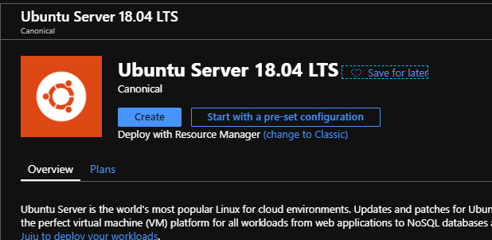
    
   Click on **Create**
    
   Configure the VM using the following information in the **Basics** section:
   - **Resource Group**: Use the same the resource group that hosts the Azure Database for PostgreSQL Single Server (*wsppg* if you used the name used in other labs)
   - **Name**: PgBouncerVM
   - **Region**: The same region as the Azure Database for PostgreSQL Single Server
   - **Image**: The most recent Ubuntu Server LTS available
   - **Authentication type**: Password
   - **Username**: pgadminuser
   - **Password**: Set a strong password
   - Use default values for other settings
 
   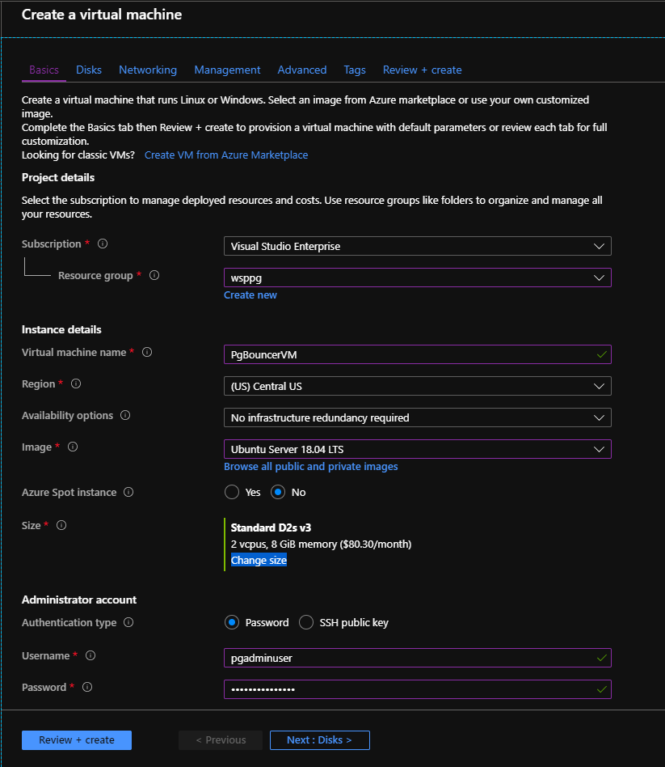
 
   Click **Next** until you get to the **Networking** section
 
   Use the following information in the Networking section:
   - **Public IP**: (Create new)
   - **Public IP name**: PgBouncerVM-pip
   - **Public IP assignment**: Static (To avoid connectivity errors due to a change of IP after a server restart)
    
   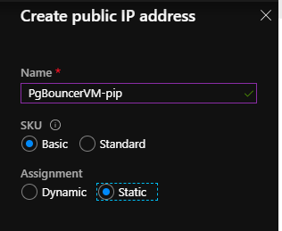
    
   Once the new IP address is configured, click on **Review + Create**
    
   Click on **Create**
    
   Wait until the VM is created

1. Identify private and public IP addresses for the VM

   In Azure portal, go to VM **PgBouncerVM**
 
   Take note of the private and public IP addresses of the VM as we will be using them at later section.

   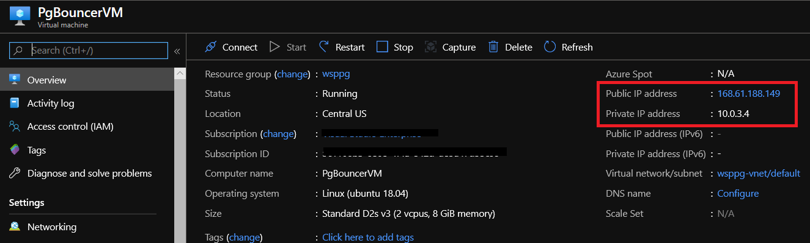

1. Open port 6432 in the VM

   >The default port for PgBouncer is 6432

   In Azure portal, go to the VM PgBouncerVM

   Go to **Networking** under **Settings**. Click **Add inbound port rule**

   Configure the rule using the following information:
   - **Destination port ranges**: 6432
   - **Name**: PgBouncer_Port
   - Use default values for all other settings
 
   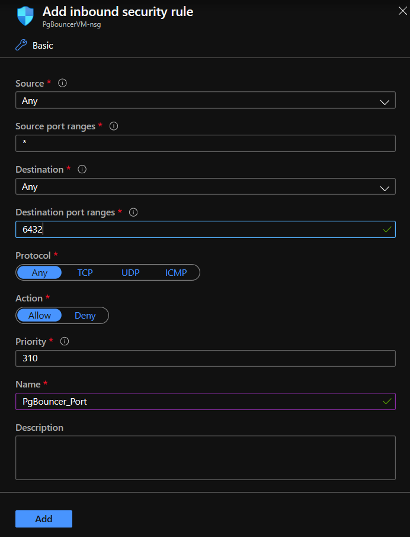
 
   Click **Add**
 
   Wait until the rule is created. The final configuration should look like:

   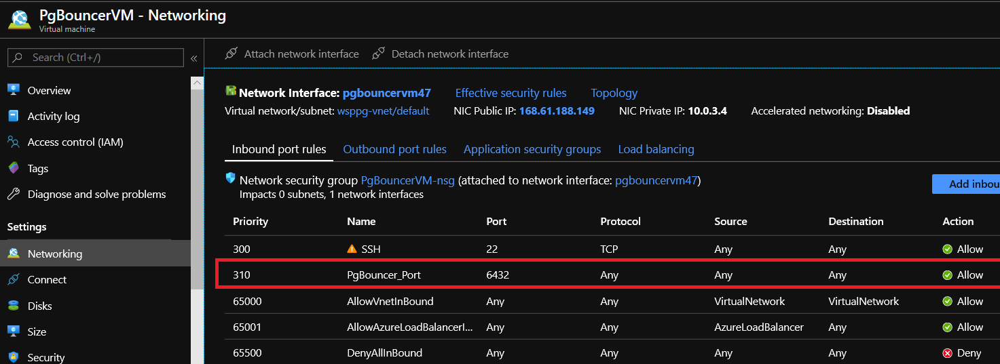

   > When creating the inbound port rule, consider security implication and limit the possible sources for the connection. Ideally, the possible sources should be limited to valid clients that need to connect to Azure Database for PostgreSQL Single Server through the PgBouncer service in this VM. In this delivery you can use enable connections from any source but that is not recommended from security perspective.

1. Connect to the PgBouncerVM machine

   Open **Putty**

   Connect using the Public IP Address of the VM

   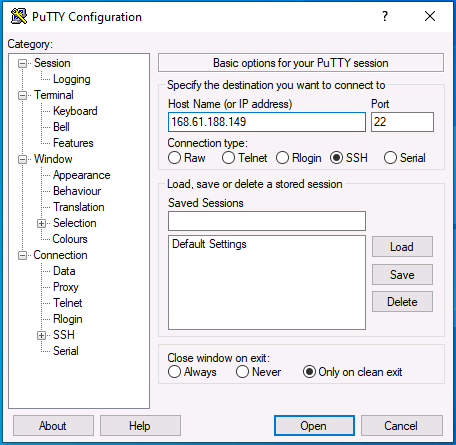

   Authenticate with the user **pgadminuser** and the password you set during VM creation

   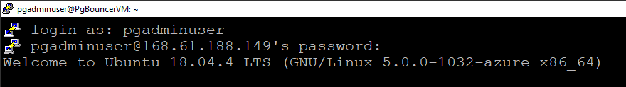

1. Install PgBouncer

   Update packages information and install PgBouncer by executing:

   ```bash
   sudo apt-get -y update
   ```

   ```bash
   sudo apt-get install -y pgbouncer
   ```

   >You might need to provide the password for the user pgadminuser when use sudo

1. Install PostgreSQL client

   Install postgresql-client in the VM by executing:

   ```bash
   sudo apt-get install -y postgresql-client
   ```

   >You might need to provide the password for the user pgadminuser when use sudo

Congratulations!. You have successfully completed this exercise.

---

## Exercise 2: Configure PgBouncer

In this exercise you will configure PgBouncer to connect to your Azure Database for PostgreSQL Single Server.

You will modify just some basic parameters. However, it is important you get familiar with other parameters as they can be useful for the customer. Refer to [https://www.pgbouncer.org/config.html](https://www.pgbouncer.org/config.html)

**Tasks**

1. Connect to Microsoft Azure Portal
    
   Open Microsoft Edge and navigate to the [Azure Portal](http://ms.portal.azure.com) to connect to Microsoft Azure Portal. Login with your subscriptions credential.

1. Connect to the PgBouncerVM machine

   Get the public IP address for the VM in the portal
     
   
    
   Open **Putty**
    
   Connect using the Public IP Address of the VM
    
   Authenticate with the user **pgadminuser** and the password you set during VM creation

1. Download certificate file used to connect to Azure DB for PostgreSQL using SSL connection

   Download the certificate file from the Certificate Authority by executing:

   ```bash
   sudo wget https://www.digicert.com/CACerts/BaltimoreCyberTrustRoot.crt
   ```

   ```bash
   sudo openssl x509 -inform DER -in BaltimoreCyberTrustRoot.crt -text -out /etc/root.crt
   ```

   The certificate file is being downloaded in /etc using the name /root.crt for lab purposes. You can save it any other place when implementing PgBouncer in your own environment.

1. Configure PgBouncer

   Open **C:\PostgresSQLSSLabFiles\pgbouncer\pgbouncer.ini** using Notepad

   Under the **[databases]** section, modify the line to indicate the target server and database

   ```nocolor-nocopy
   * = host=<postgresql_server_name>.postgres.database.azure.com port=5432
   ```

   Example:

   ```nocolor-nocopy
   * = host=pgserverdvvr.postgres.database.azure.com port=5432
   ```

  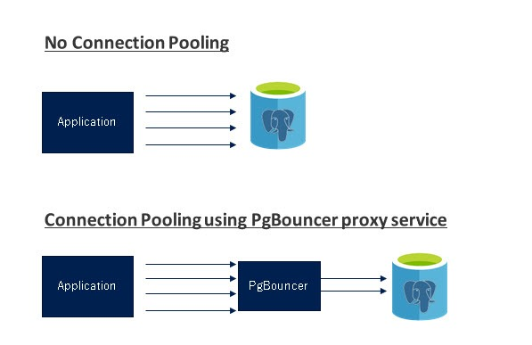

   Under the **[pgbouncer]** section, make sure the parameters *listen_addr*, *server_tls_sslmode* and *server_tls_ca_file* are configured as follow:

   ```nocolor-nocopy
   listen_addr = *
   server_tls_sslmode = verify-ca
   server_tls_ca_file = /etc/root.crt
   pool_mode = transaction
   admin_users = admin1
   ```

   Save modifications.

   In the **pgbouncer.ini** file, notice that the default por for PgBouncer is 6432. If you change it, you need to create an inbound port rule in the VM that runs PgBouncer

1. Configure the authentication file for PgBouncer

   Open **C:\PostgresSQLSSLabFiles\pgbouncer\userlist.txt** using Notepad

   Replace the sample text with your Azure Database for PostgreSQL Single Server and password in the format:

   ```nocolor-nocopy
   "username@hostname" "password"
   ```

   Example:

   ```nocolor-nocopy
   "admpg@pgserverdvvr" "AS434ASm.s2er"
   ```

   Only users listed in the configuration parameters *admin_users* or *stats_users* are allowed to log in to the console. (Except when auth_type=any, then any user is allowed in as a stats_user.)

   Additionally, the user name pgbouncer is allowed to log in without password, if the login comes via the Unix socket and the client has same Unix user UID as the running process.

   In the previous task, you made sure the file **pgbouncer.ini** set *admin1* as admin user. Only users listed in the configuration parameters admin_users or stats_users are allowed to log in

   Add a second line with the text

   ```nocolor-nocopy
   "admin1" "admin1123#"
   ```
   Save modifications.
    
   When using PgBouncer, the application connects to the PgBouncer proxy service running locally on the VM while PgBouncer service in-turn connects to the Azure Database for PostgreSQL service using the credentials and configuration settings specified in the Pgbouncer.ini file

   >In a production environment you will not use the admin user for the Azure Database for PostgreSQL Single Server, but users with less privileges.

1. Upload PgBouncer confiugration and user files to the PgBouncer server.

   - Open the **Bitvise SSH Client**
   - As Host use the Public IP address of PgBouncerVM
   - As user name, use the user you created when provisioned the VM

     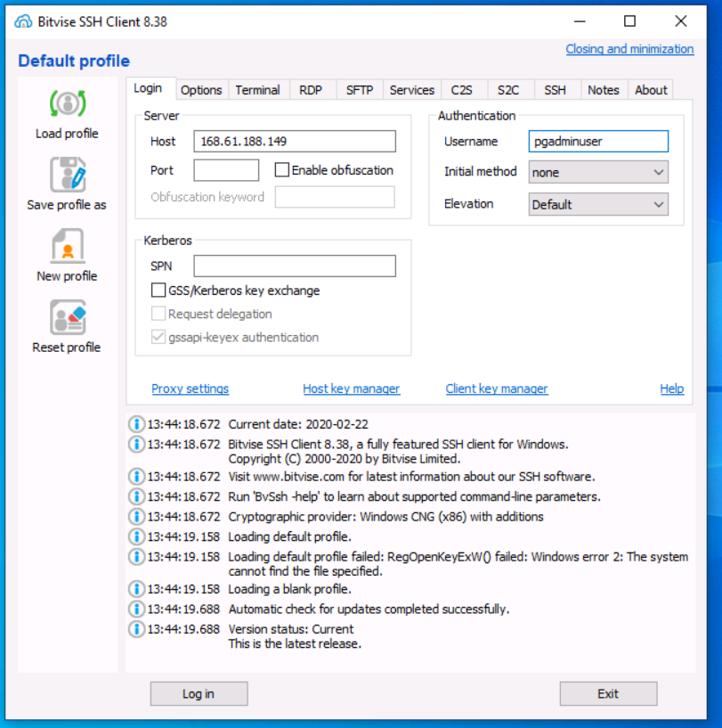

   - Click **Log in**
   - Click on **Accept and Save**
   - Type the password for the user and click **OK**

     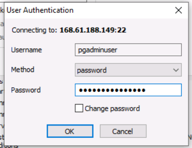

   - In the **Local files** panel, go to **C:\PostgresSQLSSLabFiles\pgbouncer**
   - In the **Remote files** panel, go to **/tmp**

    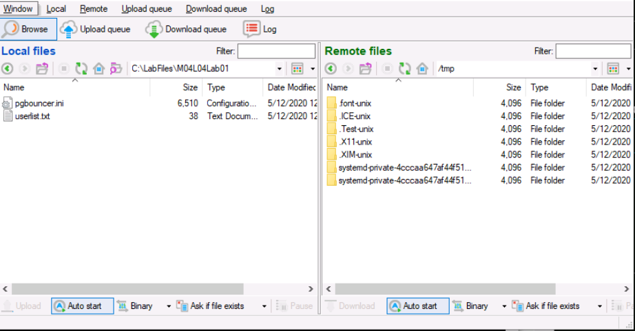

   - Drag the files **pgbouncer.ini** and **userlist.txt** from the left panel to the right panel. The files will be copied

     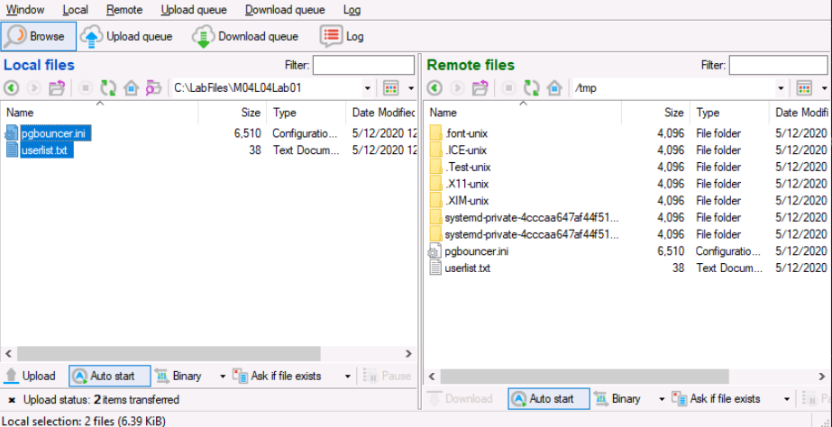

   - In the putty session connected to *PgBouncerVM*, execute:

     ```bash
     sudo mv /tmp/pgbouncer.ini /etc/pgbouncer/pgbouncer.ini
     ```

     ```bash
     sudo chown postgres:postgres /etc/pgbouncer/pgbouncer.ini
     ```

     ```bash
     sudo chmod 640 /etc/pgbouncer/pgbouncer.ini
     ```

     ```bash
     sudo mv /tmp/userlist.txt /etc/pgbouncer/userlist.txt
     ```

     ```bash
     sudo chown postgres:postgres /etc/pgbouncer/userlist.txt
     ```

     ```bash
     sudo chmod 640 /etc/pgbouncer/userlist.txt
     ```

1. Start PgBouncer service

   Start the PgBouncer service by executing:

   ```bash
   sudo service pgbouncer start
   ```

   Now the PgBouncer service is configured and running on a VM. The Azure Database for PostgreSQL is also running as a separate service in Azure outside the VM.

   Applications can now connect to the backend PostgreSQL using the PgBouncer service running on the VM.

1. Allow access from the VM running PgBouncer to the Azure Database for PostgreSQL Single Server
    
   Open Microsoft Edge and navigate to the [Azure Portal](http://ms.portal.azure.com) to connect to Microsoft Azure Portal. Login with your subscriptions credential.
   
   Go to your Azure Database PostgreSQL server

   There are three ways you can allow access from the VM running PgBouncer to the Azure Database for PostgreSQL Single Server:
   - enable **Allow access to Azure services**
   - create a firewall rule to allow access to the Public IP address of the VM
   - create a virtual network rule for the VNET used by the VM.

   For the purpose of this lab, you create a firewall rule to allow access from the Public IP address of the VM

   Go to **Connection security** under **Settings**. Add a firewall rule for the Public IP address of the PgBouncerVM. Your final configuration must look like:

   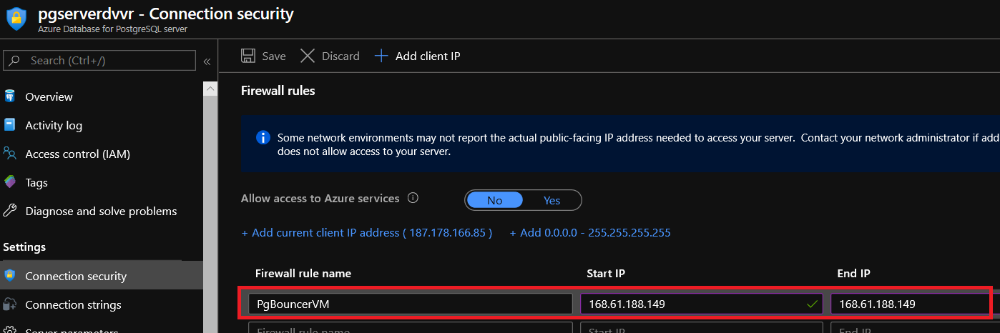

Congratulations!. You have successfully completed this exercise.

---

## Exercise 3: Connect to Azure Database for PostgreSQL using PgBouncer

In this exercise you will connect to the Azure Database for PostgreSQL Single Server through PgBouncer from the VM running PgBouncer and from and external machine.

**Tasks**

1. Connect to Microsoft Azure Portal
    
   Open Microsoft Edge and navigate to the [Azure Portal](http://ms.portal.azure.com) to connect to Microsoft Azure Portal. Login with your subscriptions credential.

1. Connect to the PgBouncerVM machine

   Get the public IP address for the VM in the portal
     
   
    
   Open **Putty**
    
   Connect using the Public IP Address of the VM
    
   Authenticate with the user **pgadminuser** and the password you set during VM creation

1. Test the direct connectivity between the VM and the Azure Database for PostgreSQL Single Server

   Connect from the VM to your Azure Database for PostgreSQL Single Server, skipping PgBouncer:

   ```bash
   psql -h <servername>.postgres.database.azure.com -p 5432 -U <user>@<servername> -d postgres
   ```

   Example:

   ```bash
   psql -h pgserverdvvr.postgres.database.azure.com -p 5432 -U admpg@pgserverdvvr -d postgres
   ```

   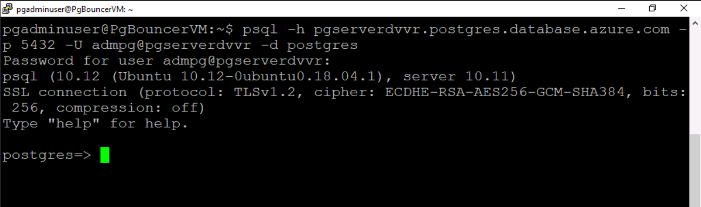

   Type **\q** and press **Enter** to quit psql

1. Connect to the PostgreSQL Database from the VM using the PgBouncer service

   Connect from the VM to your Azure Database for PostgreSQL Single Server, through PgBouncer:

   ```bash
   psql -h localhost -p <PgBouncer port> -U <user>@<servername> -d postgres
   ```

   Example:

   ```bash
   psql -h localhost -p 6432 -U admpg@pgserverdvvr -d postgres
   ```

   In the example, 6432 is the port used by PgBouncer running in the Ubuntu Server VM

   Type **\q** and press **Enter** to quit psql

1. Connect to the PostgreSQL Database using the PgBouncer service from an external machine

   You can get the public IP address for the VM in the portal

   

   From an external machine connect to the Azure Database for PostgreSQL Single Server through PgBouncer using psql.

   Open a Windows Prompt and execute:

   ```bash
   psql -h < Public IP VM > -p <PgBouncer port> -U <user>@<servername-d postgres    
   ```

   Example:

   ```bash
   psql -h 168.61.188.149 -p 6432 -U admpg@pgserverdvvr -d postgres    
   ```

   In the example, 168.61.188.149 is the Public IP of the VM running the PgBouncer service, and 6432 is the port used by PgBouncer

   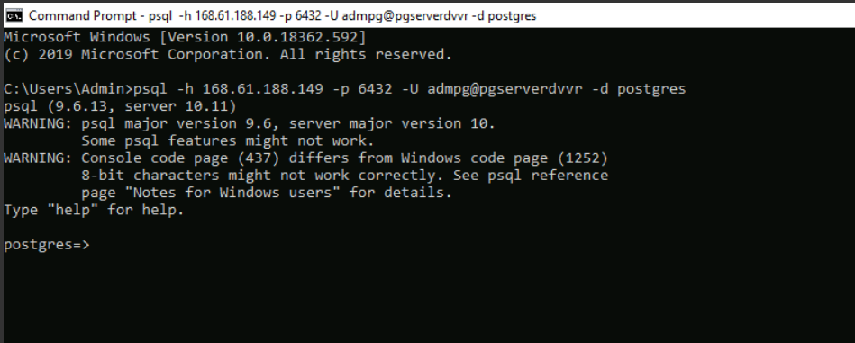

   Type **\q** and press **Enter** to quit psql

   Open PgAdmin.

   Use the following information to register the server
   - Name: PgBouncer-AzurePG
   - Host name\address: use the Public IP address of the VM running PgBouncer
   - Port: 6432 (unless you had set a different one when configured PgBouncer)

   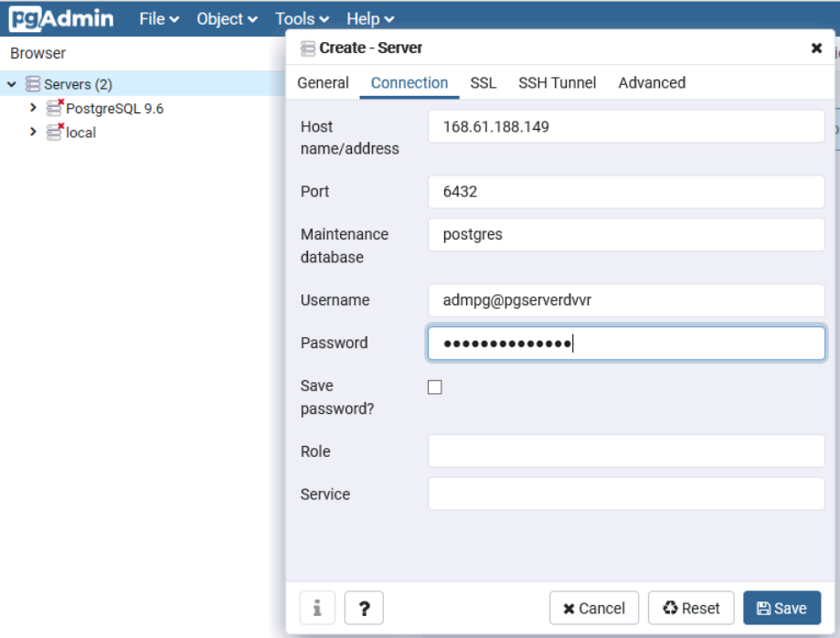

   Connect to PgBouncer-AzurePG and explore the server

   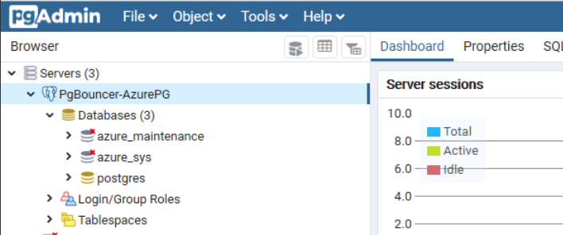

   Close PgAdmin

   The basic connectivity to the Azure Database for PostgreSQL Single Server was tested through PgBouncer service both inside the PgBouncer VM and outside the VM.

Congratulations!. You have successfully completed this exercise.

---

## Exercise 4: Understand how to check the Pool and Stats Information

In this exercise you will check the pool and stats information for the PgBouncer connection pooling.

When using PgBouncer, the application connects to the PgBouncer proxy service while PgBouncer service in-turn connects to the Azure Database for PostgreSQL service using the credentials and configuration settings specified in the pgbouncer.ini file.


We have 3 Pool modes: **Session(default), Transaction, and Statement**.
- **Session** - Server is released back to pool after client disconnects. This is the Default pool mode.
- **Transaction** - Server is released back to pool after transaction finishes.
- **Statement** - Server is released back to pool after query finishes. Transactions spanning multiple statements are disallowed in this mode

In this lab, PgBouncer was set to "Transaction" pooling mode in the exercise 2 (you can find this value set in /etc/pgbouncer/pgbouncer.ini)

Focus on what happens behind the scenes when connection pooling is in place and how to check the pooling and connection status in the PgBouncer.

The Admin console for PgBouncer is available by connecting as normal to the database pgbouncer. You can use the Admin console to view the stats that PgBouncer collects, including the application connections running, pool mode, status, active, inactive client and server connection details.

**Tasks**

1. Connect to Microsoft Azure Portal
    
   Open Microsoft Edge and navigate to the [Azure Portal](http://ms.portal.azure.com) to connect to Microsoft Azure Portal. Login with your subscriptions credential.

1. Connect to the PgBouncerVM machine

   Get the public IP address for the VM in the portal
     
   
    
   Open **Putty**
    
   Connect using the Public IP Address of the VM
    
   Authenticate with the user **pgadminuser** and the password you set during VM creation

1. Checking Pool and Stats information

   Connect to the Admin console:

   ```bash
   psql -p 6432 -U admin1 pgbouncer
   ```

   

   To see the list of commands that can be run in the Admin console, run.

   ```bash
   SHOW HELP;
   ```

   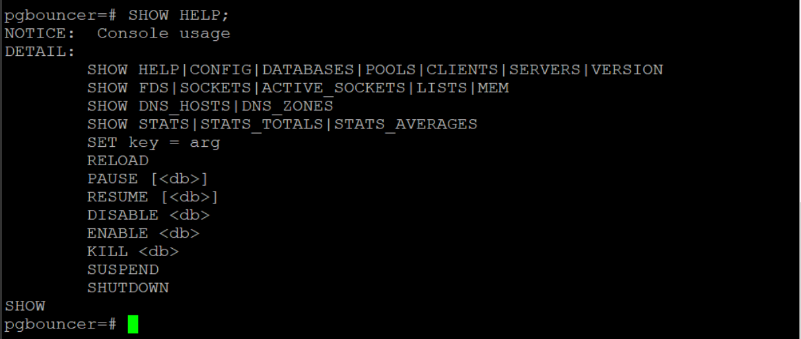

   To see the pools, execute:
   ```bash
   SHOW POOLS;
   ```

   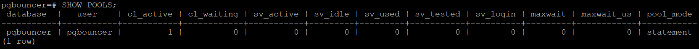

   As per the below results, we have only one connection to the PgBouncer Database and we don’t have any connection to the Actual PostgreSQL Database.

   Keep the session connected to the Admin console.

   Open a Windows Prompt and create a connection to the Azure Database for PostgreSQL Single Server through the PgBouncer service:

   ```bash
   psql -h < Public IP VM > -p <PgBouncer port> -U <user>@<servername> -d postgres
   ```

   Example:

   ```bash
   psql -h 168.61.188.149 -p 6432 -U admpg@pgserverdvvr -d postgres
   ```

   In the example, 168.61.188.149 is the Public IP of the VM running the PgBouncer service, and 6432 is the port used by PgBouncer

   

   Go back to the Putty windows where you are connected to the Admin console and execute:

   ```bash
   SHOW POOLS;
   ```

   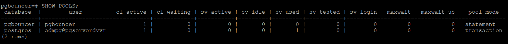

   You can see a pool to database postgresql with the user for your Azure Database for PostgreSQL Single Server and a **cl_active value** of 1. (**cl_active** indicates the Client connections that are linked to server connection and can process queries)

   Open a second Windows Prompt and create a second connection to the Azure Database for PostgreSQL Single Server through the PgBouncer service.

   Go back to the Putty windows where you are connected to the Admin console and execute:

   ```bash
   SHOW POOLS;
   ```

   

   You can see that because of the second pool the **cl_active** value has increased to 2. But nothing is active on the server.

   Open a third Windows Prompt and create a third connection to the Azure Database for PostgreSQL Single Server through the PgBouncer service.

   Go back to the Putty windows where you are connected to the Admin console and execute:

   ```bash
   SHOW POOLS;
   ```

   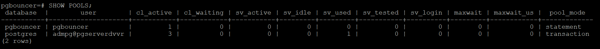

   You can see that for the second pool the **cl_active** value has increased to 3

   Now go to the first connection to the PostgreSQL Database and open a transaction by running:

   ```bash
   begin transaction;
   ```

   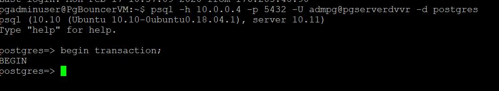

   Go back to the Putty windows where you are connected to the Admin console and execute:

   ```bash
   SHOW POOLS;
   ```

   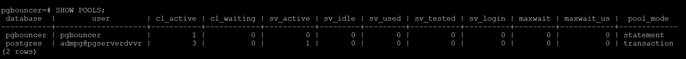

   Notice that **sv_active** has increased to 1 as you have opened a transaction and not closed it (**sv_active** indicated server connections that are linked to a client)

   Open a transaction on the second connection

   Go back to the Putty windows where you are connected to the Admin console and execute:

   ```bash
   SHOW POOLS;
   ```

   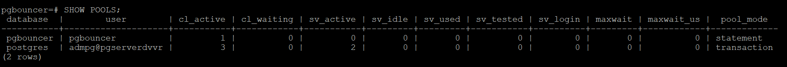

   As expected, the **sv_active** increased to 2 (since we have 2 transactions active)

   Go to both the sessions where you started transaction and execute:
   ```sql
   commit;
   ```

   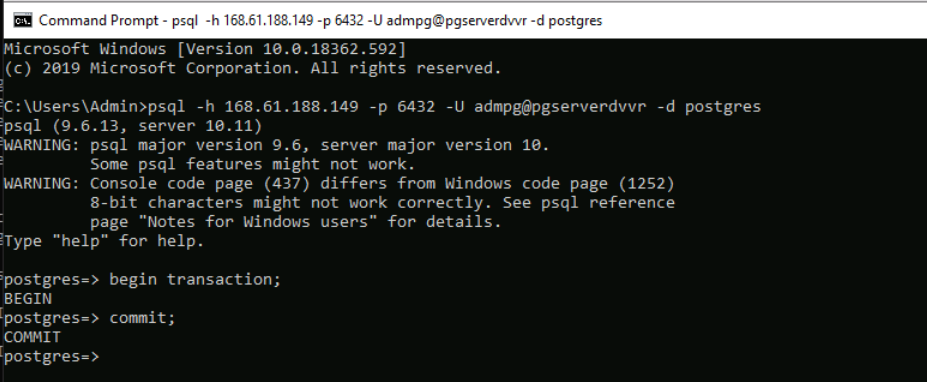

   Go back to the Putty windows where you are connected to the Admin console and execute:

   ```bash
   SHOW POOLS;
   ```

   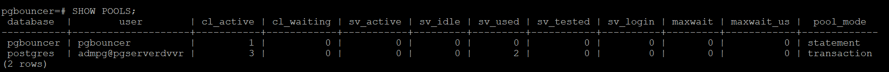

   Notice that **sv_active** has a value of 0 and **cl_active** has a value of 3 for the sessions opened.

   Now go to the first connection to the PostgreSQL Database and close the connection by running:

   ```bash
   \q
   ```

   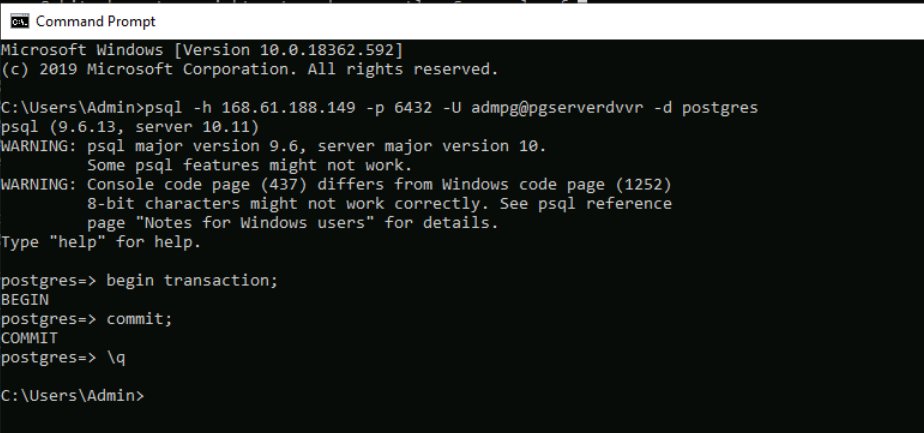

   Go back to the Putty windows where you are connected to the Admin console and execute:

   ```bash
   SHOW POOLS;
   ```

   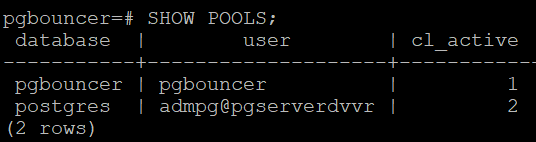

   Notice that **cl_active** is now 2 instead of 3

   To see statistics details, execute:

   ```bash
   SHOW STATS_TOTALS;
   ```
    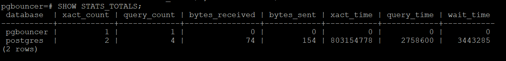

Congratulations!. You have successfully completed this exercise and the Lab.