# Design a multi tenant database by using Azure Database for PostgreSQL Hyperscale Citus

**Introduction**

In this Lab, we will walk through designing a multi-tenant database by using Azure Database for PostgreSQL – Hyperscale.

**Objectives**

After completing this lab, you will be able to: 

- Create a Hyperscale (Citus) server group.
- Use psql utility to create a schema.
- Shard tables across nodes.
- Query tenant data.
- Share data between tenants.
- Customize the schema per-tenant.

**Estimated Time:** 90 minutes

---

## Exercise 1: Create an Azure Database for PostgreSQL - Hyperscale (Citus)

Azure Database for PostgreSQL is a managed service that you use to run, manage, and scale highly available PostgreSQL databases in the cloud. This lab shows you how to create an Azure Database for PostgreSQL - Hyperscale (Citus) server group using the Azure portal.

**Tasks**

1. Connect to Microsoft Azure Portal
    
  Open Microsoft Edge and navigate to the [Azure Portal](http://ms.portal.azure.com) to connect to Microsoft Azure Portal. Login with your subscriptions credential.

1. Create an Azure Database for PostgreSQL - Hyperscale (Citus) server group.
    
   Select **+ Create a resource** in the upper-left corner of the portal.
   
   Select **Databases** from the New page and select **Azure Database for PostgreSQL** from the Databases page.
    
   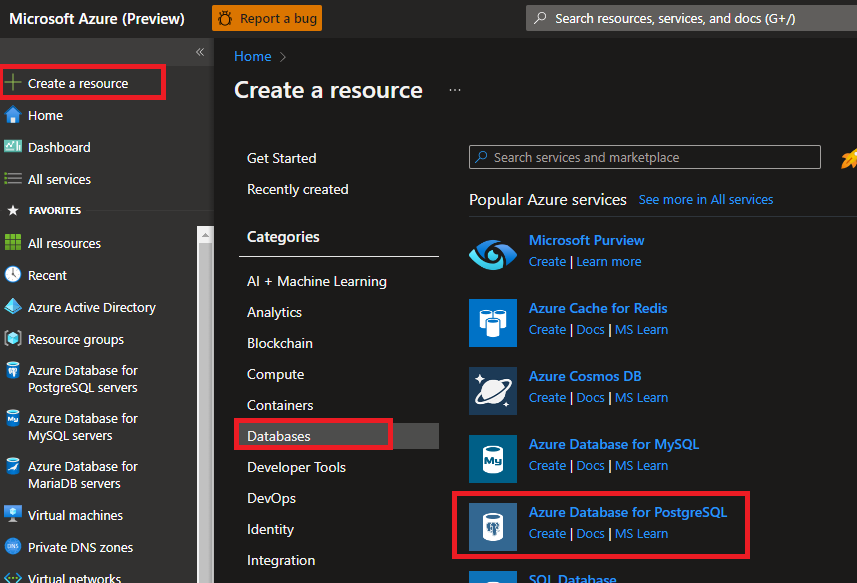
    
   For the deployment option, select the **Create** button under Hyperscale (Citus) server group .
   
   
    
   Fill out the new server details form with the following information:
   - **Subscription**: Select your subscription
   - **Resource group:** Create a new resource group named *wsppgcitus*
   - **Server group name:** cituslab[your name initials]
   - **Admin username:** Currently required to be the value citus and can't be changed.
   - **Password:** Must be at least eight characters long and contain characters from three of the following categories – English uppercase letters, English lowercase letters, numbers (0-9), and non-alphanumeric characters ("\!, $, \#, %," and so on.)
   
     Note: the password that you specify here is required to sign into the server and its databases. Remember or record this information for later use.

   - **Location:** Use the location that is closest to your users to give them the fastest access to the data
    
   
    
   Select **Configure server group**.
    
   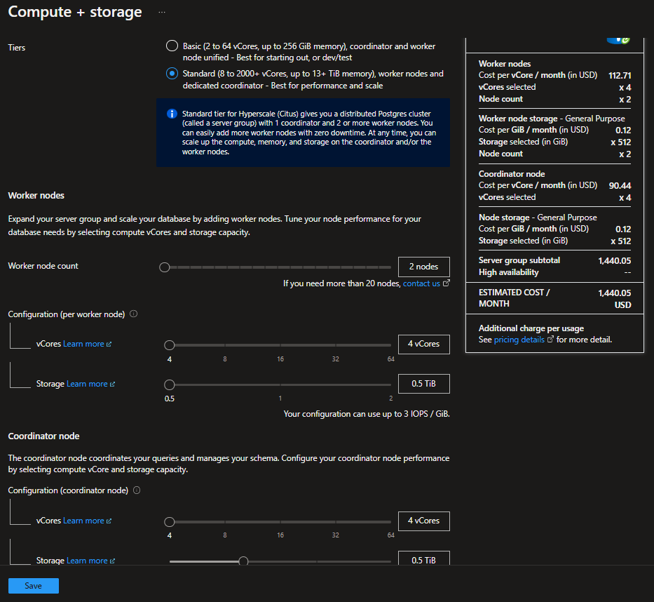
    
   Explore the settings but use default values to continue. Select **Save**.
    
   
    
   Select **Review + create** 
    
   
    
   Select **Create** to provision the server. It can take up to 15 minutes for the provisioning to complete.
    
   The page will redirect to monitor deployment. When the live status changes from **Your deployment is underway** to **Your deployment is complete**, go to the Azure Database for PostgreSQL Servers, the new server will be listed there.
    
   
    
   Go to the new Azure Database for PostgreSQL server group.
    
   In the **Overview** panel, you will see the server group nodes. The server name ending with **-C** indicates the **coordinator node** and **-w(n)** indicates the **worker nodes.**
    
   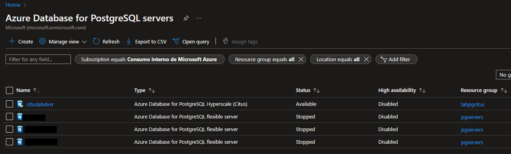

1. Configure a server-level firewall rule.
    
   The Azure Database for PostgreSQL – Hyperscale (Citus) service uses a firewall at the server-level. By default, the firewall prevents all external applications and tools from connecting to the coordinator node and any databases inside. We must add a rule to open the firewall for a specific IP address range.
    
   Select **Firewall** under Security in the left-hand menu.
    
   Select **Add client IP** on the toolbar. This automatically creates a firewall rule with the public IP address of your computer, as perceived by the Azure system. Change the name of the rule to **Lab-VM-Public-IP**.
    
   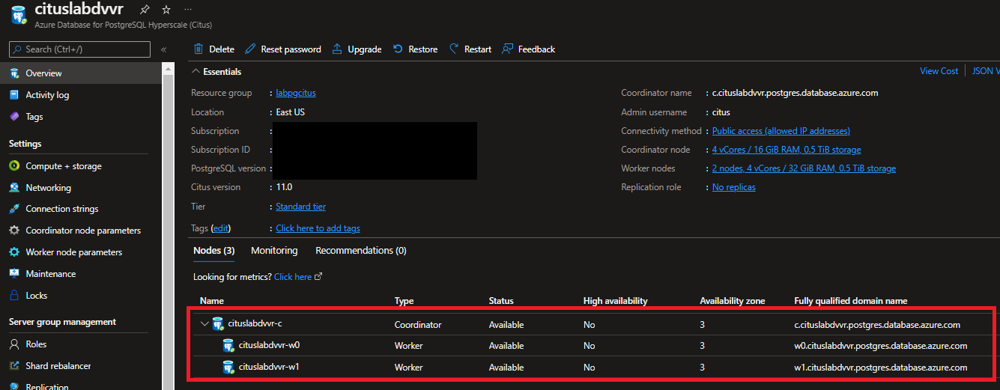
    
   Verify your IP address before saving the configuration. In some situations, the IP address observed by Azure portal differs from the IP address used when accessing the internet and Azure servers. Therefore, you may need to change the Start IP and End IP to make the rule function as expected. Use a search engine or other online tool to check your own IP address. For example, search for **what is my IP**.
    
   Select **Save** on the toolbar to save this server-level firewall rule. Wait for the confirmation that the update to the firewall rules was successful.
    
   

   >Azure PostgreSQL server communicates over port 5432. If you are trying to connect from within a corporate network, outbound traffic over port 5432 may not be allowed by your network's firewall. If so, you cannot connect to your Azure SQL Database server unless your IT department opens port 5432.

Congratulations!. You have successfully completed this exercise.

---

## Exercise 2: Connect to the database using psql and Create Schema

When you create your Azure Database for PostgreSQL server, a default database named **citus** is created. To connect to your database server, you need a connection string and the admin password.

In this Exercise, you will use the [psql](https://www.postgresql.org/docs/current/app-psql.html) utility, but you can execute all commands by using any other tools such as pgAdmin.

**Tasks**

1. Connect to the database using psql.
    
   Obtain the connection string. In the server group page select the **Connection strings** menu item. (It's under**Settings**.)
    
   Find the string marked **psql**.
    
   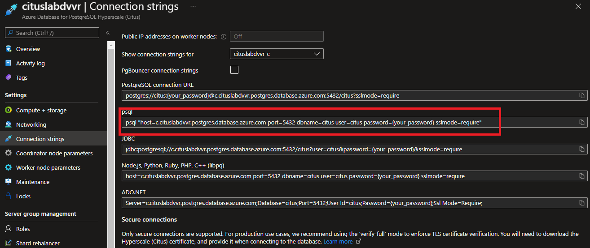
    
   Notice that you connect to the Coordinator node to interact with the cluster.
    
   Copy the connection string. You will need to replace {your_password} with the administrative password you chose earlier. The system doesn't store your plain text password and so can't display it for you in the connection string.
    
   Open a command window on the server and execute the modified command
   
   For example:
    
   ```bash
   psql "host=cituslabdvvr-c.postgres.database.azure.com port=5432 dbname=citus user=citus password={your_password} sslmode=require"
   ```
    
   If the connection is successful, you will see the prompt *citus=\>*
    
   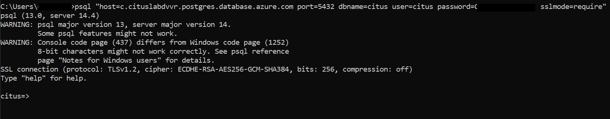

1. Create the database schema.
    
   This lab walks you through creating schema and structure that allows advertisers to track their campaigns through the application.
    
   Multiple companies can use the app, so let's create a table to hold companies and another for their campaigns. In the psql console, run these commands:

   ```sql
   CREATE TABLE companies (
     id bigserial PRIMARY KEY,
     name text NOT NULL,
     image_url text,
     created_at timestamp without time zone NOT NULL,
     updated_at timestamp without time zone NOT NULL
   );

   CREATE TABLE campaigns (
     id bigserial,
     company_id bigint REFERENCES companies (id),
     name text NOT NULL,
     cost_model text NOT NULL,
     state text NOT NULL,
     monthly_budget bigint,
     blacklisted_site_urls text[],
     created_at timestamp without time zone NOT NULL,
     updated_at timestamp without time zone NOT NULL,
     PRIMARY KEY (company_id, id)
   ); 
   ```

   

   Each campaign will pay to run ads. Add a table for ads too, by running the following code in psql:

   ```sql
    CREATE TABLE ads (
     id bigserial,
     company_id bigint,
     campaign_id bigint,
     name text NOT NULL,
     image_url text,
     target_url text,
     impressions_count bigint DEFAULT 0,
     clicks_count bigint DEFAULT 0,
     created_at timestamp without time zone NOT NULL,
     updated_at timestamp without time zone NOT NULL,
     PRIMARY KEY (company_id, id),
     FOREIGN KEY (company_id, campaign_id) REFERENCES campaigns (company_id, id)
    ); 
    ```

   

   Finally, we'll track statistics about **clicks** and **impressions** for each ad:

   ```sql
   CREATE TABLE clicks (
     id bigserial,
     company_id bigint,
     ad_id bigint,
     clicked_at timestamp without time zone NOT NULL,
     site_url text NOT NULL,
     cost_per_click_usd numeric(20,10),
     user_ip inet NOT NULL,
     user_data jsonb NOT NULL,
     PRIMARY KEY (company_id, id),
     FOREIGN KEY (company_id, ad_id) REFERENCES ads (company_id, id)
    );

    CREATE TABLE impressions (
      id bigserial,
      company_id bigint,
      ad_id bigint,
      seen_at timestamp without time zone NOT NULL,
      site_url text NOT NULL,
      cost_per_impression_usd numeric(20,10),
      user_ip inet NOT NULL,
      user_data jsonb NOT NULL,
      PRIMARY KEY (company_id, id),
      FOREIGN KEY (company_id, ad_id) REFERENCES ads (company_id, id));
   ```

   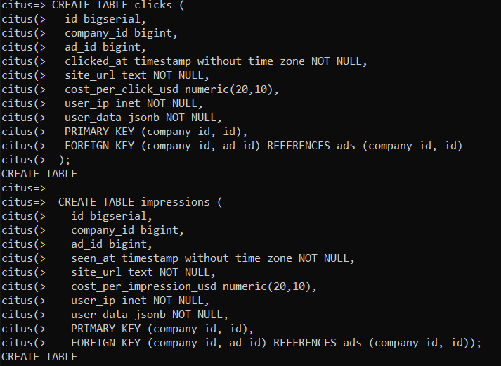

   You can see the newly created tables in the list of tables now in psql by running the command 

   ```sql
   \dt
   ```

   
 
   Multi-tenant applications can enforce uniqueness only per tenant, which is why all primary and foreign keys include the company ID.

Congratulations!. You have successfully completed this exercise.

---

## Exercise 3: Create distributed tables

There are three types of tables in a Hyperscale server group, each used for different purposes.

- **Distributed tables:** The first type, and most common, is *distributed* tables. They appear to be normal tables to SQL statements, but are horizontally *partitioned* across worker nodes. What this means is that the rows of the table are stored on different nodes, in fragment tables called *shards*.
- **Reference tables:** A reference table is a type of distributed table whose entire contents are concentrated into a single shard. The shard is replicated on every worker, so queries on any worker can access the reference information locally, without the network overhead of requesting rows from another node. Reference tables have no distribution column because there is no need to distinguish separate shards per row. Reference tables are typically small and are used to store data that is relevant to queries running on any worker node. For example, enumerated values like order statuses, or product categories.
- **Local tables:** When you use Hyperscale, the coordinator node you connect to is a regular PostgreSQL database. You can create ordinary tables on the coordinator and choose not to shard them. A good candidate for local tables would be small administrative tables that don't participate in join queries. For example, a user's table for application login and authentication.

In this exercise, you will configure tables to be distributed, reference or local depending on the needs.

A hyperscale deployment stores table rows on different nodes based on the value of a user-designated column. This distribution column marks which tenant owns which rows.

Let's set the distribution column to be **company_id** the tenant identifier.

Finishing the previous exercises are the pre-requisites for completing this exercise.

**Tasks**

1. Shard tables across nodes.
    
   Connect to the database using psql (following the same steps mentioned in the previous exercise).
    
   Let's set the distribution column to be *company_id* the tenant identifier. In psql, run these functions:

   ```sql
   SELECT create_distributed_table('companies', 'id');
  ```

   ```sql
   SELECT create_distributed_table('campaigns', 'company_id');
   ```

   ```sql
   SELECT create_distributed_table('ads', 'company_id');
   ```

   ```sql
   SELECT create_distributed_table('clicks', 'company_id');
   ```

   ```sql
   SELECT create_distributed_table('impressions', 'company_id');
   ```

   

   By executing the previous commands, the five tables have been configured as distributed tables.

1. Load and query sample data.
    
   Create a folder named **cituslab** on C: drive.
    
   Open Microsoft Edge and replace the following URLs one by one to download the respective CSV files in the **C:\cituslab** folder
    
   - https://examples.citusdata.com/mt_ref_arch/companies.csv
   - https://examples.citusdata.com/mt_ref_arch/campaigns.csv
   - https://examples.citusdata.com/mt_ref_arch/ads.csv
   - https://examples.citusdata.com/mt_ref_arch/clicks.csv
   - https://examples.citusdata.com/mt_ref_arch/impressions.csv
    
   
    
   Connect back to psql to bulk load the data by executing the following commands:

   ```nocolor
   \copy companies from 'C:\cituslab\companies.csv' with csv
   ```

   ```nocolor
   \copy campaigns from 'C:\cituslab\campaigns.csv' with csv
   ```

   ```nocolor
   \copy ads from 'C:\cituslab\ads.csv' with csv
   ```

   ```nocolor
   \copy clicks from 'C:\cituslab\clicks.csv' with csv
   ```

   ```nocolor
   \copy impressions from 'C:\cituslab\impressions.csv' with csv
   ```

   

   This data has been spread across worker nodes.

   When the application requests data for a single tenant, the database can execute the query on a single worker node. Single-tenant queries filter by a single tenant ID. For example, the following query filters company_id = 5 for ads and impressions. Try running it in psql to see the results.

   ```sql
   SELECT a.campaign_id, 
          RANK() OVER ( 
            PARTITION BY a.campaign_id 
            ORDER BY a.campaign_id, count(*) desc), 
            count(*) as n_impressions, a.id 
   FROM ads as a 
        JOIN impressions as I  
        ON i.company_id = a.company_id AND i.ad_id = a.id 
   WHERE a.company_id = 5 
   GROUP BY a.campaign_id, a.id 
   ORDER BY a.campaign_id, n_impressions desc;
   ```

    You will see the output like following:

    

Congratulations!. You have successfully completed this exercise.

---

## Exercise 4: Create reference tables

Until now all tables have been distributed by company_id, but some data doesn't naturally "belong" to any tenant in particular and can be shared. For instance, all companies in the example ad platform might want to get geographical information for their audience based on IP addresses.

Finishing the previous exercises are the pre-requisites for completing this exercise.

**Tasks**

1. Share data between tenants.
    
   Connect to the database using psql (following the same steps mentioned in the previous exercise).
    
   Create a table to hold shared geographic information. Run the following commands in psql:

   ```sql
   CREATE TABLE geo_ips (
     addrs cidr NOT NULL PRIMARY KEY,
     latlon point NOT NULL
       CHECK (-90  <= latlon[0] AND latlon[0] <= 90 AND
              -180 <= latlon[1] AND latlon[1] <= 180)
   );
   CREATE INDEX ON geo_ips USING gist (addrs inet_ops);
   ```

   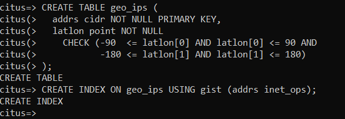

   Next make geo_ips a *reference table* to store a copy of the table on every worker node. To do it, execute:

   ```sql
   SELECT create_reference_table('geo_ips');
   ```
    
   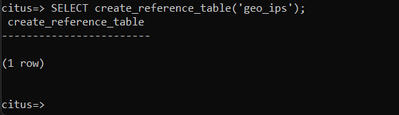

1. Load and query sample data.
    
   Open Microsoft Edge and go to https://examples.citusdata.com/mt_ref_arch/geo_ips.csv to download the respective CSV file in the **C:\cituslab** folder.
    
   Then load the data using the copy command in psql.

   ```sql
   \copy geo_ips from 'C:\cituslab\geo_ips.csv' with csv
   ```
  
   
    
   Now, there is local copy of *geo_ips* in all nodes. Joining the *clicks** table with *geo_ips* is efficient on all nodes.
    
   Here is a join to find the locations of everyone who **clicked on ad 290**. Try running the query in psql:

   ```sql
   SELECT c.id, clicked_at, latlon 
   FROM geo_ips, clicks c 
   WHERE addrs >> c.user_ip 
         AND c.company_id = 5 
         AND c.ad_id = 290;
   ```

   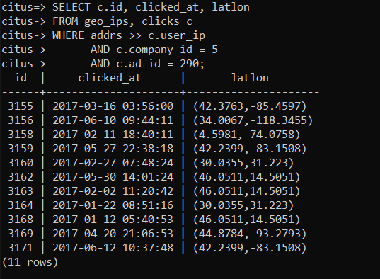

Congratulations!. You have successfully completed this exercise.

---

## Exercise 5: Customize the schema per-tenant

Each tenant may need to store special information not needed by others. However, all tenants share a common infrastructure with an identical database schema. Where can the extra data go?

One trick is to use an open-ended column type like PostgreSQL's JSONB. Our schema has a JSONB field in clicks called *user_data*. A company (say company 5), can use the column to track whether the user is on a mobile device.

Finishing the previous exercises are the pre-requisites for completing this exercise.

**Task**

1. Customize the schema per tenant.
    
   Connect to the database using psql (following the same steps mentioned in the previous exercise).
    
   Here's a query to find who clicks more: mobile, or traditional visitors.

   ```sql
   SELECT
     user_data->>'is_mobile' AS is_mobile,
     count(*) AS count 
   FROM clicks 
   WHERE company_id = 5 
   GROUP BY user_data->>'is_mobile' 
   ORDER BY count DESC;
   ```

   

   The query can be optimized for a single company by creating the following [partial index](https://www.postgresql.org/docs/current/static/indexes-partial.html):

   ```sql
   CREATE INDEX click_user_data_is_mobile 
   ON clicks ((user_data->>'is_mobile')) 
   WHERE company_id = 5;
   ```

   

   More generally, we can create a [GIN index](https://www.postgresql.org/docs/current/static/gin-intro.html) on every key and value within the column.

   ```sql
   CREATE INDEX click_user_data 
   ON clicks USING gin (user_data);
   ```

Congratulations!. You have successfully completed this exercise.

---

## Exercise 6: Viewing Metadata Information and Distributed Query Execution

Each distributed table is divided into multiple logical shards based on the distribution column. The coordinator maintains metadata tables to track statistics and information about the health and location of these shards. 

In this exercise, you will explore these metadata tables and their schema. You will view and query these tables and see how you can see the details of the Distributed query execution.

For further information refer to:
- [CITUS Metadata Tables Reference](https://docs.citusdata.com/en/v7.2/reference/metadata_tables.html)
- [CITUS Query Performance Tuning](http://docs.citusdata.com/en/v9.2/performance/performance_tuning.html)

Finishing the previous exercises are the pre-requisites for completing this exercise.

**Tasks**

1. Viewing Metadata Information.

   Connect to the database using psql (following the same steps mentioned in the previous exercise).
    
   **PARTITION TABLE**
    
   The **pg\_dist\_partition** table stores metadata about which tables in the database are distributed. For each distributed table, it also stores information about the distribution method and detailed information about the distribution column.

   | Name          | Type      | Description |
   |:--------------|:----------|:------------|
   | Logicalrelid  | regclass  | Distributed table to which this row corresponds. This value references the relfilenode column in the pg_class system catalog table. |
   | Partmethod    | char      | The method used for partitioning / distribution. The values of this column corresponding to different distribution methods are: append (a) or hash (h) |
   | partkey       | text      | Detailed information about the distribution column including column number, type and other relevant information.| 
   | colocationid  | integer   | Co-location group to which this table belongs. Tables in the same group allow co-located joins and distributed rollups among other optimizations. This value references the colocationid column in the pg_dist_colocation table. |
   | repmodel      | char      | The method used for data replication. The values of this column corresponding to different replication methods are : citus statement-based replication (c) or postgresql streaming replication (s) |

   Query the **pg_dist_partition** table 

   ```sql
   select * from pg_dist_partition;
   ```

   

   You can see the rows for all the tables we created in previous exercise. You can also see that the method used for partitioning is *hash* distribution for all the distributed tables. (Value 'h' for the partmethod column for all the distributed tables except the reference table geo_ips). You do not have any tables using the append distribution methods.
    
   **SHARD TABLE**
    
   The **pg_dist_shard** table stores metadata about individual shards of a table. This includes information about which distributed table the shard belongs to and statistics about the distribution column for that shard. For append distributed tables, these statistics correspond to min / max values of the distribution column. In case of hash distributed tables, they are hash token ranges assigned to that shard.
    
   These statistics are used for pruning away unrelated shards during SELECT queries.

   | Name          | Type      | Description |
   |:--------------|:----------|:------------|
   | logicalrelid  | regclass  | Distributed table to which this shard belongs. This value references the relfilenode column in the pg_class system catalog table. |
   | shardid       | bigint    | Globally unique identifier assigned to this shard |
   | shardstorage  | char      | Type of storage used for this shard. Different storage types are discussed in the table below. | 
   | shardminvalue | text      | For append distributed tables, minimum value of the distribution column in this shard (inclusive). For hash distributed tables, minimum hash token value assigned to that shard (inclusive). |
   | shardmaxvalue | text      | For append distributed tables, maximum value of the distribution column in this shard (inclusive). For hash distributed tables, maximum hash token value assigned to that shard (inclusive).|

   Query the **pg_dist_shard **table 

   ```sql
   select * from pg_dist_shard;
   ```

   You will see rows like below (Shown only sample rows and not all rows)
    
   

   You can see Individual shards for each distributed table.
   - shardid is the Global unique identifier assigned to the shard.
   - shardstorage column value 't' is for table storage type which indicates the shard stores data belonging to a regular distributed table.
   - shardminvalue – Since these are hash distributed tables , the values indicates minimum hash token value assigned to that shard (inclusive).
   - shardmaxvalue – Since these are hash distributed tables, the values indicates maximum hash token value assigned to that shard (inclusive).

   **SHARD PLACEMENT TABLE**
    
   The **pg_dist_placement** table tracks the location of shard replicas on worker nodes. Each replica of a shard assigned to a specific node is called a shard placement. This table stores information about the health and location of each shard placement.

   | Name          | Type      | Description |
   |:--------------|:----------|:------------|
   | shardid       | bigint    | Shard identifier associated with this placement. This values references the shardid column in the pg_dist_shard catalog table. |
   | shardstate    | int       | Describes the state of this placement. Different shard states are discussed in the section below. |
   | shardlength   | bigint    | For append distributed tables, the size of the shard placement on the worker node in bytes. For hash distributed tables, zero. |
   | placementid   | bigint    | Unique auto-generated identifier for each individual placement. |
   | groupid       | int       | Identifier used to denote a group of one primary server and zero or more secondary servers, when the streaming replication model is used. |

   Query the **pg_dist_placement** table (Shown only sample rows)

   ```sql
   select * from pg_dist_placement;
   ```

   

   You will see 
   - the values in the **shardid** column references the shardid column in the **pg\_dist\_shard** table we had seen earlier in this section.
   - the values in the **shardlength** column as always **'0'** as all our tables are hash distributed tables.
   - the **shardstate** column values mostly **'1'** which indicates the Shard Placement state as **"FINALIZED"**
    
   There are 3 different Shard Placement states.
   - **(1) FINALIZED:** This corresponds to shardstate column value as '1'. This is the state new shards are created in. Shard placements in this state are considered up-to-date and are used in query planning and execution.
   - **(3) INACTIVE:** This corresponds to shardstate column value as '3'. Shard placements in this state are considered inactive due to being out-of-sync with other replicas of the same shard. This can occur when an append, modification (INSERT, UPDATE or DELETE ) or a DDL operation fails for this placement. The query planner will ignore placements in this state during planning and execution. Users can synchronize the data in these shards with a finalized replica as a background activity.
   - **(4) TO_DELETE:** This corresponds to shardstate column value as '4'. If Citus attempts to drop a shard placement in response to a master\_apply\_delete\_command call and fails, the placement is moved to this state. Users can then delete these shards as a subsequent background activity.
    
   **WORKER NODE TABLE**
    
   The **pg_dist_node** table contains information about the worker nodes in the cluster.

   | Name          | Type      | Description |
   |:--------------|:----------|:------------|
   | nodeid        | int       | Auto-generated identifier for an individual node. |
   | groupid       | int       | Identifier used to denote a group of one primary server and zero or more secondary servers, when the streaming replication model is used. By default it is the same as the nodeid. |
   | nodename      | text      | Host Name or IP Address of the PostgreSQL worker node. |
   | nodeport      | int       | Port number on which the PostgreSQL worker node is listening. |
   | noderack      | text      | (Optional) Rack placement information for the worker node. |
   | hasmetadata   | boolean   | Reserved for internal use. |
   | isactive      | boolean   | Whether the node is active accepting shard placements. |
   | noderole      | text      | Whether the node is a primary or secondary |
   | nodecluster   | text      | The name of the cluster containing this node |

   Query the **pg_dist_node** (Shown only sample rows)

   ```sql
   select * from pg_dist_node;
   ```

   

   You will see:
   - one row for each worker node. The above screenshot indicates that we have 2 worker nodes.
   - the worker node IPs in the nodename column values.
   - the port 5432 on which the PostgreSQL worker node is listening.
   - The node roles values *Primary* for both the worker nodes.
    
   **SHARD PLACEMENTS**
    
   The mapping of shard to worker is known as the shard placement.
    
   Query the **pg_dist_shard** table and pick up any **shardid.** For example, take **shardid – 102008** (first row in the below screen shot)
    
   ```sql
   select * from pg_dist_shard;
   ```

   
    
   Suppose that shard **102008** is associated with the row in question. The row is read or written in a table called **companies\_102008** in one of the workers. Which worker is determined entirely by the metadata tables. The mapping of shard to worker is known as the shard placement.
   
   The coordinator node rewrites queries into fragments that refer to the specific tables like **companies_102008** and runs those fragments on the appropriate workers. Here's an example of a query run behind the scenes to find the node holding shard ID **102008**.

   ```sql
   SELECT
       shardid,
       node.nodename,
       node.nodeport 
   FROM pg_dist_placement placement 
   JOIN pg_dist_node node 
     ON placement.groupid = node.groupid
    AND node.noderole = 'primary'::noderole 
   WHERE shardid = 102008;
   ```

   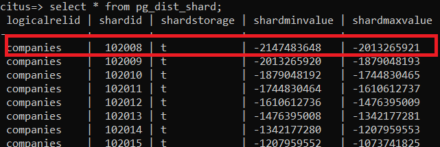

1. Getting information about the Distributed Query Execution
    
   **EXPLAIN** command provides information about distributed query execution. The **EXPLAIN** output shows how each worker processes the query and also a little about how the coordinator node combines their results.
    
   Connect to the database using psql (following the same steps mentioned in the previous exercise).
    
   Run an example, query like below and use EXPLAIN command to view the query execution plan:

   ```sql
   EXPLAIN select company_id, sum (cost_per_click_usd) as Totalcost_perclick 
   from clicks 
   group by company_id 
   order by Totalcost_perclick desc;
   ```

   

   The plan explains that there are 32 shards and planner choose the Citus Adaptive executor to execute this query

   

   Then we can see that we have details about the how query behaves in one of the worker and shows details on the host, port and DBname.

   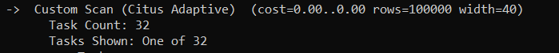

   Distributed EXPLAIN shows the results of running a normal PostgreSQL EXPLAIN on that worker for the fragment query

   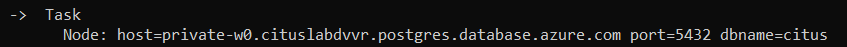

1. Cleanup the environment, delete the resource group

   In this lab, you created an Azure resource group to host the Azure Database for PostgreSQL server group. If you don't expect to need these resources in the future, delete the resource group.

Congratulations!. You have successfully completed this exercise and the Lab.
