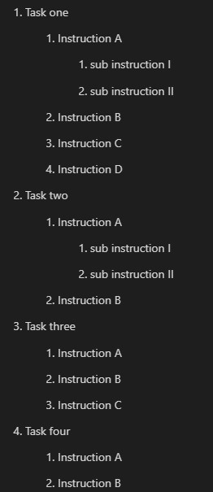
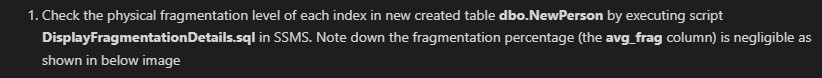
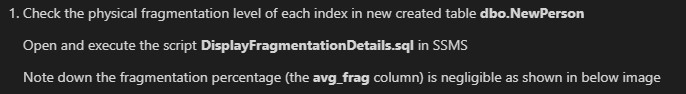
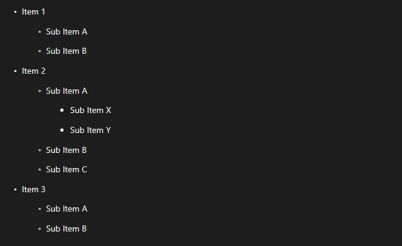
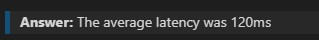
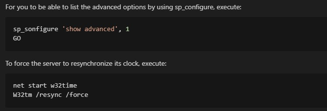

# Lab Development Rules

- [Lab Development Rules](#lab-development-rules)
  - [1. Instructions template](#1-instructions-template)
  - [2. Tasks style](#2-tasks-style)
    - [2.1 Tasks Numbering](#21-tasks-numbering)
    - [2.2 Tasks writing](#22-tasks-writing)
  - [3. URL links](#3-url-links)
  - [4. Demo and lab files](#4-demo-and-lab-files)
    - [4.1 File names](#41-file-names)
    - [4.2 Demo and lab files references in the manual](#42-demo-and-lab-files-references-in-the-manual)
  - [5. Passwords references](#5-passwords-references)
  - [6. Use of bullets](#6-use-of-bullets)
  - [7. Questions and answers:](#7-questions-and-answers)
  - [8. Code boxes](#8-code-boxes)

---

## 1. Instructions template

Always use the template *DevInstructionsAndTemplates/instuctions_sample.md** as a start point 

Respect the style defined for the manual elements

- Lab name uses **# Heading level 1**
- Exercise name uses **## Heading level 2**
- Do not modify lines with the content **\*\*Tasks\*\*** as it is just a title. You must not define a title for the tasks section.
- Exercises must be separated from one another with a line that only contains the characters **---**. 
- As you add several exercises to the lab, make sure that:
    - at the end of each exercise it says: **Congratulations!. You have successfully completed this exercise.** 
    - the last line of the manual file says: **Congratulations!. You have successfully completed this exercise and the Lab.**

---

## 2. Tasks style

### 2.1 Tasks Numbering 

- Do not number the tasks manually. Always use **1.** as task number for all tasks. The final document will be numbered automatically. 

   This will allow you to add tasks later without worrying about the numbering

- If you need to use nested numbered lists, use **1.** in all levels. Adding a Tab will define the level.

  >IMPORTANT: Avoid nested numbered lists. If you need to use them, try to have a maximum of two levels

   For example, writing
  
       1. Task one

          1. Instruction A

              1. sub instruction I

              1. sub instruction II

          1. Instruction B

          1. Instruction C

          1. Instruction D

        1. Task two

          1. Instruction A

              1. sub instruction I

              1. sub instruction II

          1. Instruction B

        1. Task three

          1. Instruction A

          1. Instruction B

          1. Instruction C

        1. Task four

          1. Instruction A

          1. Instruction B

    produces the following result 

    

Notice that the list was correctly numbered and different leves were defined.

### 2.2 Tasks writing

1. Keep the task name simple. If the task requires complex actions, describe them in paragraphs after the task title

   Example:

   ```text
   1. Action to be executed

      Instructions
   ```
    
   Make sure all actions within the task start after a Tab so the parser aligns text correctly

   Examples

   - a not recommended task writing style:

     ```text
     1. Check the physical fragmentation level of each index in new created table  **dbo.NewPerson** by executing script **DisplayFragmentationDetails.sql** in SSMS. Note down the fragmentation percentage (the **avg_frag** column) is negligible as shown in below image
     ```

     produces a task that can be hard to follow

     

   - a recommended task writing style:

     ```text
     1. Check the physical fragmentation level of each index in new created table **dbo.NewPerson** 

        Open and execute the script **DisplayFragmentationDetails.sql** in SSMS
  
        Note down the fragmentation percentage (the **avg_frag** column) is negligible as shown in below image
     ```

     produces a more elegant document:

     

1. For tasks name use imperative sentences

   - Example 1

     Use

     >Start the SQL Server service

     instead of

     > Now, let's start the SQL server service

   - Example 2

     Use

     >Look at the Actual Execution Plan. Notice that although there's an Inner Join between *SalesOrderHeader* and *SalesOrderDetail* the Optimizer doesn't need to access SalesOrderHeader

     instead of

     > Next, you will Look at the Actual Execution Plan. Notice that although there's an Inner Join between *SalesOrderHeader* and *SalesOrderDetail* the Optimizer doesn't need to access SalesOrderHeader

---

## 3. URL links

For URLs use external link sintax. For example:

```text
>Consult documentation at [Azure Database for PostgreSQL documentation](https://docs.microsoft.com/en-us/azure/postgresql) 
```

will produce an ouput like: 


---

## 4. Demo and lab files 

### 4.1 File names

Do not use spaces in the name for demo and lab files. 

For example:
- **create_sample_db.sql** is a valid name
- **create sample db.sql** is not a valid name

### 4.2 Demo and lab files references in the manual

Every time you refer to a path and/or a file name or a full, it must be enclosed in **\*\*** and  **\*\***. For example, writing:

```text
The queries used in this exercise are in the **Lab_Script1.sql** script file found in **C:\MySQLSSLabFiles**.
```

produces the following result 


---

## 5. Passwords references

If a fixed password must be used during the lab, it must be enclosed in **\*\*** and  **\*\***. For example:

```text
Open PgAdmin. If you are asked to set a master password, use *Password1!*
```

will produce an ouput like


---

## 6. Use of bullets

- If you use bullets, Always use **-** to define the item. If you need nested bullets, use **-** in all levels. Adding a Tab will define the level.

  >IMPORTANT: Avoid nedested list. If you need to use them, try to have a maximum of two levels

    For example, writing

        - Item 1 

          - Sub Item A

          - Sub Item B

        - Item 2

          - Sub Item A

              - Sub Item X

              - Sub Item Y

          - Sub Item B

          - Sub Item C

        - Item 3 

          - Sub Item A

          - Sub Item B

    produces the following result 

    

    Notice that different leves were defined by using Tab, and the bullet style is different in each level.

---

## 7. Questions and answers: 

To write questions and answers consider:

- To ask a question, use the following format:

    **>\*\*Question:\*\* [place the question here]?**

    for example, writing:

   **>\*\*Question:\*\* What was the average latency during this test?**

    creates a text box that looks like

    

- To present an answer, use the following format:

    **>\*\*Answer:\*\* [place the answer here]?**

    for example, writing:

    **>\*\*Answer:\*\* The average latency was 120ms**

    creates text box that looks like  

    

---

## 8. Code boxes

To show code, follow the rules:
- Every time you use code blocks, indicate the language
- Explain the purpose of the command as part of the task instruction. not as a comment on the code box

for example, writing:

    For you to be able to list the advanced options by using sp_configure, execute:

    ```SQL
    sp_sonfigure 'show advanced', 1
    GO
    ```
   
    To force the server to resynchronize its clock, execute:

    ```Powerhell
    net start w32time
    W32tm /resync /force
    ```


it will generate an output like:

