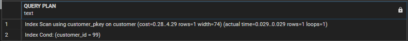
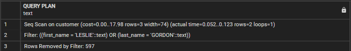
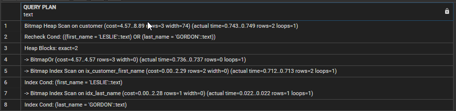
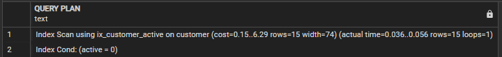
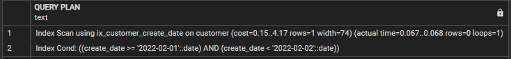

# PostgreSQL Indexing 101

**Author**: Daniel Valero

- [1. Setting up the environment](#1-setting-up-the-environment)
- [2. Basic indexing 1 (searching conditions on a single column)](#2-basic-indexing-1-searching-conditions-on-a-single-column)
- [3. Basic indexing 2 (searching conditions on multiple column)](#3-basic-indexing-2-searching-conditions-on-multiple-column)
- [4. Why is PostgreSQL not using existing indexes?](#4-why-is-postgresql-not-using-existing-indexes?)

I will go step by step in the process of indexing a table to improve query performance. For this scenario, we will focus on reducing the number of pages read by the query as the criteria for success.

> We will see some basic options to solve some common issues, however, when defining the indexes on a table you must not considered queries one by one but all queries that use the table, to avoid duplicated or redundant indexes.


## 1. Setting up the environment

If you want to do the demos by yourself, you can use same test database [Pagila](https://github.com/devrimgunduz/pagila):

NOTE: This steps were completed on an Azure Database for PostgreSQL Flexible Server v13 Standard_Ds2_v3

---

## 2. Basic indexing 1 (searching conditions on a single column)

If you come from SQL Server or MySQL, consider that in PostgreSQL there is no such thing as a Clustered Index. 
However, you can cluster the table on any existing index using [CLUSTER](https://www.postgresql.org/docs/current/sql-cluster.html).
As PostgreSQL documentation states:

>When a table is clustered, it is physically reordered based on the index information. Clustering is a one-time operation: when the table is subsequently updated, the changes are not clustered.

1. Open a new query window
 
1. Run a query that filters rows using the first column on the primary key

 	Use the [EXPLAIN](https://www.postgresql.org/docs/current/sql-explain.html) command to see the execution plan created

	```sql
	EXPLAIN (ANALYZE, COSTS)
	SELECT * 
	FROM public.customer
	WHERE customer_id=99;
   ```

	


	Notice the plan does an **Index Scan** using *customer_pkey* on *customer* to efficiently identify the rows that must be returned

	An **Index Scan**, does a B-tree traversal walks through the leaf nodes to find all matching entries, and fetches the corresponding table data.
	An Index Scan fetches one tuple-pointer at a time from the index, and immediately visits that tuple in the table

	**Question**: No index has been explicitly created on *customer*. Where did the index *sales_detail_pk* on *sales_detail* comes from? 
	
	**Answer**: PostgreSQL creates an unique index when the primary key is defined 

	The cost for this plan is 4.29 (How it is calculated will be covered in another document, but for now it is good for comparison purposes) 

	The execution plan estimated it would return 1 row (this is important as the estimation is used to define if an index should be used, but how it is calculated will be covered in another document), and it returned 11 rows (expected as the query filters by the primary key).

1. Query the table filtering by a column not included in the Primary Key

	```sql
	EXPLAIN (ANALYZE, COSTS)
	SELECT customer_id, first_name, last_name, email
	FROM public.customer
	WHERE first_name= 'LESLIE';
	```

	This query uses a **Seq Scan** with a cost of 16.49 on *customer* as there is no index by *first_name*.

	

	An **Seq Scan** operation scans the entire table 

	Create an index on *first_name*

	```sql
	CREATE INDEX ix_customer_first_name ON public.customer (first_name);
	```

	Run the query again

	```sql
	EXPLAIN (ANALYZE, COSTS)
	SELECT customer_id, first_name, last_name, email
	FROM public.customer
	WHERE first_name= 'LESLIE';
	```

	

	Notice the plan now does an **Bitmap Index Scan** using the new index *ix_customer_first_name* on *customer*, and the cost went down to 5.37, much better than 16.49.

	**Bitmap Index Scan** as explained at [Tom Lane’s post to the PostgreSQL performance mailing list](https://www.postgresql.org/message-id/12553.1135634231@sss.pgh.pa.us)
	> A bitmap scan fetches all the tuple-pointers from the index in one go, sorts them using an in-memory “bitmap” data structure, and then visits the table tuples in physical tuple-location order."

   The **bitmap heap scan** operation takes a row location bitmap generated by a Bitmap Index Scan and looks up the relevant data on the table. So it is expected to see **Bitmap Index Scan** and **Bitmap Heap Scan** together.

	The cost for the query went down from 16.49 to 5.37. Is there any way to make it even better?

	Drop the index you just created (ix_customer_first_name), and create a new index by *first_name* (used in the WHERE clause) that includes the columns used in the SELECT clause 

	```sql
	DROP INDEX ix_customer_first_name;

	CREATE INDEX ix_customer_first_name ON public.customer (first_name)
	INCLUDE (customer_id, last_name, email);
	```
		
	Run the query again

	```sql
	EXPLAIN (ANALYZE, COSTS)
	SELECT customer_id, first_name, last_name, email
	FROM public.customer
	WHERE first_name= 'LESLIE';
	```
	
	

	Notice the plan now does an **Index Only Scan** using *ix_customer_first_name* on *customer*, and the cost went down to 2.31, better than 5.37

	The **Index Only Scan** means the query returned all the data without accessing the table, just the index. 
	
	This index is called a covering index. An index that includes all the columns needed to satisfy the query (all columns in the WHERE clause and also in the SELECT clause) so there is no need to access the table to return the information,

	However, if your query changes and uses a column not in the index

   ```sql
	EXPLAIN (ANALYZE, COSTS)
	SELECT customer_id, first_name, last_name, email, active
	FROM public.customer
	WHERE first_name= 'LESLIE';
	```

	The index is not a covering index for that query and other operators are used.

	> **IMPORTANT:** When creating covering indexes, do not have the practice of adding all columns of the table as included columns in all indexes. If you do that, database will be bigger (as indexes are bigger) and it can even lead to worse perfornmace.

1. Let's see what happens when a wildcard is used in the search value

   Find a row by using a simple equality condition on an indexed column  

	```sql
	EXPLAIN (ANALYZE, COSTS)
	SELECT *
	FROM public.customer
	WHERE first_name= 'LESLIE';
	```

	The plan will use a **Bitmap Index Scan** as we had seen before... nothing new 5.37

	Let's retrieve all rows where the value on *first_name* ends with *LIE*. Execute:

	```sql
	EXPLAIN (ANALYZE, COSTS)
	SELECT *
	FROM public.customer
	WHERE first_name like '%LIE';
	```

	

	Notice it uses a **Seq Scan** (no index is used) on *customer* with a cost of 16.49 
	
	Let's retrieve all rows where the value on *first_name* starts with *LES*. Execute:

	```sql
	EXPLAIN (ANALYZE, COSTS)
	SELECT *
	FROM public.customer
	WHERE first_name like 'LES%';
	```
	
	

	Notice that the execution plan is exactly the same. 

	**IMPORTANT:** Using wildcards make an index on the column not usable. This is different to other DBMS like SQL Server where other optimizations exists. See [SQL Serve Indexing 101](https://github.com/danvalero/SQLServer/tree/main/SQL%20Server%20Indexing%20101) for more details) 
	
	For demo purposes, let's delete the index on *first_name*

	```sql
	DROP INDEX ix_customer_first_name;
	```

---

## 3. Basic indexing 2 (searching conditions on multiple column)

1. Find a row by using equality conditions with *AND* on two different columns, consider that an index on *last_name* exists

	```sql
	EXPLAIN (ANALYZE, COSTS)
	SELECT *
	FROM public.customer
	WHERE first_name= 'LESLIE' AND last_name = 'GORDON';
	```

	

   Notice the plan does an **Index Scan** using *idx_last_name* on *customer* with a cost of 4.30. Expected.

	But what happens if an index on *first_name* is created?

	```sql
	CREATE INDEX ix_customer_first_name ON public.customer (first_name);
	```

	Execute the query again

	```sql
	EXPLAIN (ANALYZE, COSTS)
	SELECT *
	FROM public.customer
	WHERE first_name= 'LESLIE' AND last_name = 'GORDON';
	```

	Notice the plan still does an **Index Scan** using *idx_last_name* on *customer*. 

	Why is PostgreSQL not using at all the index created on first_name?

	For testing purposes, delete the index on *last_name*

	```sql
	DROP INDEX idx_last_name;
	```

	Execute the query again

	```sql
	EXPLAIN (ANALYZE, COSTS)
	SELECT *
	FROM public.customer
	WHERE first_name= 'LESLIE' AND last_name = 'GORDON';
	```

	

	Notice the plan does a **Bitmap Index Scan** using *ix_customer_first_name* on *customer*, and the total cost of the plan is 5.38

	PostgreSQL uses the index on *last_name* because the plan cost (4.30) is lower than the plan that uses the index on *first_name* (5.38)

	What happens if the an composite index is created?

	```sql
	CREATE INDEX ix_customer_first_last_name ON public.customer (first_name, last_name);
	```

	Execute the query again

	```sql
	EXPLAIN (ANALYZE, COSTS)
	SELECT *
	FROM public.customer
	WHERE first_name= 'LESLIE' AND last_name = 'GORDON';
	```

	Notice it uses the composite index as the cost is the lowest (4.29)

	

	Take the database to the original state
	```sql
	DROP INDEX ix_customer_first_name;
	DROP INDEX ix_customer_first_last_name;
   CREATE INDEX idx_last_name ON public.customer (last_name);
	```


1. Find a row by using equality conditions with *OR* on two different columns, consider that an index on *last_name* exists

	```sql
	EXPLAIN (ANALYZE, COSTS)
	SELECT *
	FROM public.customer
	WHERE first_name= 'LESLIE' OR last_name = 'GORDON';
	```

	

	This query uses a **Seq Scan** with a cost of 17.98 on *customer*. It is reading the whole table

	Question: Why is it reading the whole table if there is an index on one of the column used to filter?

	Answer: The query returns rows where *first_name* is equal to a value, and also rows where *last_name* is equal to a value. The index on *last_name* is useful only to get some of the rows, it is still necessary to read the whole table to get the rows that satisfy the condition on *first_name*, so a single read of the whole table is done

	Create an index on *first_name*

   ```sql
	CREATE INDEX ix_customer_first_name ON public.customer (first_name);
	```

	Run the query again

	```sql
	EXPLAIN (ANALYZE, COSTS)
	SELECT *
	FROM public.customer
	WHERE first_name= 'LESLIE' OR last_name = 'GORDON';
	```

   

	Notice that now it is using both indexes. *ix_customer_first_name* to get the rows that satisfy the filter on *first_name*, *idx_last_name* to get the rows that satisfy the filter on *last_name* and finally combining them (*BitmapOr* operation) and the total plan cost is 8.89, much better than reading the whole table with a cost of 17.98


---

## 4. Why is PostgreSQL not using existing indexes?

Some common causes for SQL Server not to use (or not used as we expect) an existing index, and what we can do about it.

### Reason 1: The tipping point

Run the following query 

```sql
EXPLAIN (ANALYZE, COSTS)
SELECT * FROM public.customer
WHERE active = 0;
```


The plan does an **Seq Scan** on *customer* as there is no index on *active*

Create an index on *active*

```sql
CREATE INDEX ix_customer_active ON public.customer (active);
```

Run the query again:

```sql
EXPLAIN (ANALYZE, COSTS)
SELECT * FROM public.customer
WHERE active = 0;
```



The plan does an **Index Scan** using *ix_customer_active* on *customer*.. Great, the index helps

Run the query again changing the value to filter on the *active* column

```sql
EXPLAIN (ANALYZE, COSTS)
SELECT * FROM public.customer
WHERE active = 1;
```


Notice the plan is not using the index. Instead, it is doing a **Seq Scan** and reading the whole table. 

What happened? Has PostgreSQL gone crazy? There is an index on *active*, and it used it before, why is it not using it now?

Count how many rows exist for each value in **active**

```sql
SELECT active, count(*)
FROM public.customer
GROUP BY active
ORDER BY 2 desc;
```


Notice that approximately 2.6% of the rows have a value of *0*, and 97.4% of the rows have a value of *1*

This means that for the column *active*, the value *0* has a higher selectivity than the value *1*

The higher the selectivity, more efficient the index is to identify the rows to return

In this case, the index is very efficient to get the rows where *active=0* as they are few rows. However, using the index to identify the 588 rows *active=1* and then go to the table to get the actual rows will have a higher cost than just reading the whole table once

Ok, so what is the **Tipping Point** then? it is the point at which the cost using an index is is higher than the cost reading the table. 

But, How PostgreSQL knows how the selectivity for a value?? The answer is simple: **statistics**

Statistics is a complex topic that will be covered in another post, but I will introduce the concept here using a basic example to complete the explanation of the tipping point.

To get the statistics for column *active* in table *customer*, run:

```sql
SELECT attname, inherited,most_common_vals, most_common_freqs
FROM pg_stats
WHERE tablename = 'customer'
      AND
      attname = 'active';
```


You can see the most commom values (*most_common_vals*) for the columnm and a list of the frequencies of the most common element values (*most_common_elem_freqs*). Notice that are exactly what we got when manually counted the values for the column

The information in *pg_stats* is used by PostgreSQL to select an exection plan for a query.

---

### Reason 2: Non Sargable expressions

Some constructions can make PostgreSQL unable to use an existing index.

One common reason for an expression to be non sargable is the usage of functions

#### A. Usage of explicit functions 

Create a non clustered index on [ModifiedDate] 

```sql
CREATE INDEX ix_customer_create_date ON public.customer (create_date);
```

Get the rows created on a specific day

```sql
EXPLAIN (ANALYZE, COSTS)
SELECT *
FROM public.customer
WHERE DATE_PART('year',create_date) = 2022
      AND 
      DATE_PART('month',create_date) = 02
      AND 
      DATE_PART('day',create_date) = 01;
```


Notice the plan does a **Seq Scan** on *customer* with a cost of 28.47. 

It is reading the whole table even when an index exists on *create_date*. Why?

One possible reason could be the tipping point discussed in the previous section. 

Another possible reason is that for some reason the expression in the WHERE clause is non sargable: Even when there is an index on *create_date*, in the WHERE clause the search condition uses a function on *create_date*. The index is on *create_date*, not DATE_PART('year',create_date) or DATE_PART('month',create_date) or DATE_PART('day',create_date), so PostgreSQL has no option other than scanning the table.

Rewrite the query to get the same information 

NOTE: This is a common pattern, but it can be easily fixed. The query can be rewritten as


```sql
EXPLAIN (ANALYZE, COSTS)
SELECT *
FROM public.customer
WHERE create_date>= '2022-02-01'
      AND 
      create_date < '2022-02-02';
```



Notice the plan now uses the index, and the cost of the query went down to 4.17. 

As an alternative, you could create an index on the result of the function:

```sql
CREATE INDEX ix_customer_create_date2 
ON public.customer (DATE_PART('year',create_date),DATE_PART('month',create_date), DATE_PART('day',create_date));
```

and the original query will use it.


NOTE: We proposed 2 different options to make the plan use an index, however, which option is better depends on multiple factor 

As another example execute

```sql
SELECT *
FROM public.customer
WHERE UPPER(first_name)= UPPER('Leslie');
```

Notice that the values in the database the values for *first_name* are sorted in upper case. As PostgreSQL is case sensitive by default, some developers might want to prefer to make sure they compare values in upper case or lower case all the time is the data they comparison they need to make is not case sensitive.

Check the execution plan:

```sql
EXPLAIN (ANALYZE, COSTS)
SELECT *
FROM public.customer
WHERE UPPER(first_name)= UPPER('Leslie');
```


The plan does not uses the index on *first_name* because the index is on *first_name*, not *UPPER(first_name)*

The solution for this case will depend on the real scenario, but in general, there are two option:
- Create an index on UPPER(first_name)
- Clean up data and make sure data is inserted using the expected case so the query can be written without UPPER.
- If you know the data is in lower case or upper case, modify the query to apply the function only to the search value 

```sql
EXPLAIN (ANALYZE, COSTS)
SELECT *
FROM public.customer
WHERE first_name = UPPER('Leslie');
```

Take the database to the original state

```sql
DROP INDEX ix_customer_first_name;
DROP INDEX ix_customer_active;
DROP INDEX ix_customer_create_date;
DROP INDEX ix_customer_create_date2;
```
