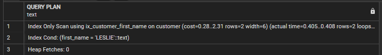
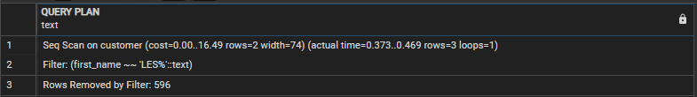
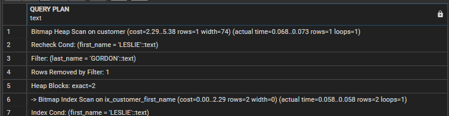
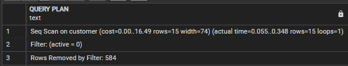
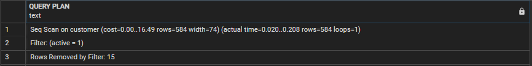

# PsotgreSQL Indexing 101

- [1. Setting up the environment](#1-setting-up-the-environment)
- [2. Basic indexing 1 (searching conditions on a single column)](#2-basic-indexing-1-searching-conditions-on-a-single-column)
- [3. Basic indexing 2 (searching conditions on multiple column)](#3-basic-indexing-2-searching-conditions-on-multiple-column)
- [4. Why is PostgreSQL not using existing indexes?](#4-why-is-postgresql-not-using-existing-indexes?)

I will go step by step in the process of indexing a table to improve query performance. For this scenario, we will focus on reducing the number of pages read by the query as the criteria for success.

## 1. Setting up the environment

If you want to do the demos by yourself, you can use same test database [Pagila](https://github.com/devrimgunduz/pagila):

NOTE: This steps were completed on an Azure Database for PostgreSQL Flexible Server v13 Standard_Ds2_v3

---

## 2. Basic indexing 1 (searching conditions on a single column)

If you come from SQL Server or MySQL, consider that in PostgreSQL there is no such thing as a Clustered Index. 
However, you can cluster the table on any exisisting index using [CLUSTER](https://www.postgresql.org/docs/current/sql-cluster.html).
As PostgreSQL documentation states:

>When a table is clustered, it is physically reordered based on the index information. Clustering is a one-time operation: when the table is subsequently updated, the changes are not clustered.

1. Open a new query window
 
1. Run a query that filter rows using the first column on the primary key

 	Use the [EXPLAIN](https://www.postgresql.org/docs/current/sql-explain.html) command to see the execution plan created

	```sql
	EXPLAIN (ANALYZE, COSTS)
	SELECT * 
	FROM public.customer
	WHERE customer_id=99;
   ```

	When the tables were created, no index was explicitly created so you should expect PostgreSQL to read the whole table to find the rows, or not?

	Notice the plan does an **Index Scan** using *customer_pkey* on *customer* to efficintly indentify the rows that must be returned
   

	An **Index Scan**, does a B-tree traversal walks through the leaf nodes to find all matching entries, and fetches the corresponding table data.
	An Index Scan fetches one tuple-pointer at a time from the index, and immediately visits that tuple in the table

	Question: You have not created any index, where did the index *sales_detail_pk* on *sales_detail* comes from? 
	
	Answer: PostgreSQL creates an unique index when the primary keys is defined 

	The cost for this plan is 4.29 (How it is calculated will be covered in another document, but for now it is goo to do comparisons) 

	The execution plan estimated it would return 1 row (this is important as the estimation is used to define if an index should be used, but how it is calculated will be covered in another document), and it returned 11 row (expected as the query filter by the primary key).

1. Query the table filtering by a column not included in the Primary Key

	```sql
	EXPLAIN (ANALYZE, COSTS)
	SELECT customer_id, first_name, last_name, email
	FROM public.customer
	WHERE first_name= 'LESLIE';
	```

	This query uses a **Seq Scan** with a cost of 16.49 on *customer* as there is no index by *first_name*, so create the index

   

	```sql
	CREATE INDEX ix_customer_first_name ON public.customer (first_name);
	```

	Run the query again

	```sql
	EXPLAIN (ANALYZE, COSTS)
	SELECT customer_id, first_name, last_name, email
	FROM public.customer
	WHERE first_name= 'LESLIE';
	```

	Notice the plan now does an **Bitmap Index Scan** using the new index *ix_sales_detail_product* on *sales_detail*, and the cost went down to 4.45, much better than 12.74, however the cost for the whole plan is 2022.67, much better than 62806.67

	

	**Bitmap Index Scan** "  as explained at [Tom Lane’s post to the PostgreSQL performance mailing list](https://www.postgresql.org/message-id/12553.1135634231@sss.pgh.pa.us)
	> A bitmap scan fetches all the tuple-pointers from the index in one go, sorts them using an in-memory “bitmap” data structure, and then visits the table tuples in physical tuple-location order."

   The **bitmap heap scan** operation takes a row location bitmap generated by a Bitmap Index Scan and looks up the relevant data on the table. SO it is expected to see **Bitmap Index Scan** and **Bitmap Heap Scan**  together.

	The cost for the query went down from 16.49 to 5.37. Is there any way to make it even better?

	Drop the index you just created (ix_customer_first_name) , and create a new index by *first_name* (used in the WHERE clause) that includes the columns used in the SELECT clause 

	```sql
	DROP INDEX ix_customer_first_name;

	CREATE INDEX ix_customer_first_name ON public.customer (first_name)
	INCLUDE (customer_id, last_name) ;
	```
		
	Run the query again

	```sql
	EXPLAIN (ANALYZE, COSTS)
	SELECT customer_id, first_name, last_name, email
	FROM public.customer
	WHERE first_name= 'LESLIE';
	```

	Notice the plan now does an **Index Only Scan** using *ix_customer_first_name* on *customer*, and the cost went down to 4.29, better than 5.37

   

	The **Index Only Scan** means the query returned all the data without accessing the table, just the index. 
	
	This index is called a covering index. An index that includes all the columns needed to satisfy the query (all columns in the WHERE clause and also in the SELECT clause) so there is no need to access the table to return the information,

	However, if your query changes and uses a column not in the index

   ```sql
	EXPLAIN (ANALYZE, COSTS)
	SELECT customer_id, first_name, last_name, email, active
	FROM public.customer
	WHERE first_name= 'LESLIE';
	```

	The index is not a covering index for that query and other operators are used.

	NOTA: no agregar todas las columnas, no crear indices redundantes, la otra forma es:

1. Find a row by using a simple equality condition on a non indexed column  

	```sql
	EXPLAIN (ANALYZE, COSTS)
	SELECT *
	FROM public.customer
	WHERE first_name= 'LESLIE';
	```

	The plan will use a **Bitmap Index Scan** as we had seen before.. nothing new 5.37

1. Let's see what happens when a wildcard is used in the search value

	Let's retrieve all rows where the value on *first_name" ends with *LIE*. Execute:

	```sql
	EXPLAIN (ANALYZE, COSTS)
	SELECT *
	FROM public.customer
	WHERE first_name like '%LIE';
	```

	Notice it uses a **Sqe Scan** (no index is used) on *customer* with a cost of 16.49 

	
	
	Let's retrieve all rows where the value on *first_name" starts with *LES*. Execute:

	```sql
	EXPLAIN (ANALYZE, COSTS)
	SELECT *
	FROM public.customer
	WHERE first_name like 'LES%';
	```

	Notice that the execution plan is exactly the same. 

	 

	**IMPORTANT:** Unsing wildcard make an index on the column not usable. This is different to other DBMS like SQL Server where other optimizations exists (See [https://github.com/danvalero/SQLServer/tree/main/SQL%20Server%20Indexing%20101](https://github.com/danvalero/SQLServer/tree/main/SQL%20Server%20Indexing%20101) for more details) 
	
	For demo purposes, lets delete the index on *first_name*

	```sql
	DROP INDEX ix_customer_first_name;
	```

---

## 3. Basic indexing 2 (searching conditions on multiple column)

1. Find a row by using equality conditions with *AND* on two different columns, consider that an index on *last_name* exists

	```sql
	EXPLAIN (ANALYZE, COSTS)
	SELECT *
	FROM public.customer
	WHERE first_name= 'LESLIE' AND last_name = 'GORDON';
	```

   Notice the plan does an *Index Scan** using *idx_last_name* on *customer* with a cost of 4.30. Expected.

	

	But what happens if an index on *first_name* is created?

	```sql
	CREATE INDEX ix_customer_first_name ON public.customer (first_name);
	```

	Execute the query again

	```sql
	EXPLAIN (ANALYZE, COSTS)
	SELECT *
	FROM public.customer
	WHERE first_name= 'LESLIE' AND last_name = 'GORDON';
	```

	Notice the plan still does an *Index Scan** using *idx_last_name* on *customer*. 

	Why PostgreSQL is not using at all the index created on first_name?

	For testing purposes, delete the index on *last_name*

	```sql
	DROP INDEX idx_last_name;
	```

	Execute the query again

	```sql
	EXPLAIN (ANALYZE, COSTS)
	SELECT *
	FROM public.customer
	WHERE first_name= 'LESLIE' AND last_name = 'GORDON';
	```

	Notice the plan does a *Bitmap Index Scan** using *ix_customer_first_name* on *customer*, and the total cost of the plan is 5.38

	

	PostgreSQL uses the index on *last_name* becuase the plan cost (4.30) is lower than the plan that uses the index on *fist_name* (5.38)

	What happens if the an composite index is created?

	```sql
	CREATE INDEX ix_customer_first_last_name ON public.customer (first_name, last_name);
	```

	Execute the query again

	```sql
	EXPLAIN (ANALYZE, COSTS)
	SELECT *
	FROM public.customer
	WHERE first_name= 'LESLIE' AND last_name = 'GORDON';
	```

	Notice it uses the composite index as the cost is the lowest (4.29)

	


	Take the database to the original state
	```sql
	DROP INDEX ix_customer_first_name;
	DROP INDEX ix_customer_first_last_name;
   CREATE INDEX idx_last_name ON public.customer (last_name);
	```


1. Find a row by using equality conditions with *OR* on two different columns, consider that an index on *last_name* exists


	```sql
	EXPLAIN (ANALYZE, COSTS)
	SELECT *
	FROM public.customer
	WHERE first_name= 'LESLIE' OR last_name = 'GORDON';
	```

	

	This query uses a **Seq Scan** with a cost of 17.98 on *customer*. It is reading the whole table

	Why is it reading the whole table if there is an index on one of the column used to filter?

	the query returns rows where *first_name* is equal to a value, and also rows where *last_name* is equal to a value

	The index on *last_name* is useful only to get some of the rows, it is still necessary to read the whole table to get the rows that satisfay the conditon on *first_name*, so a single read of the shole talbe is done

	Create an index on *first_name*

   ```sql
	CREATE INDEX ix_customer_first_name ON public.customer (first_name);
	```

	Run he query again

	```sql
	EXPLAIN (ANALYZE, COSTS)
	SELECT *
	FROM public.customer
	WHERE first_name= 'LESLIE' OR last_name = 'GORDON';
	```

   

	Notice that now it i using both indexes. *ix_customer_first_name* to get the rows that satisfy the filter on *first_name*, *idx_last_name* to get the rows that satisfy the filter on *last_name* and finally combining them (*BitmapOr* operation) and the total plan cost is 8.89, much better than reading the whole table with a cost of 17.98


---

## 4. Why is PostgreSQL not using existing indexes?

Some common causes for SQL Server not to use (or not used as we expect) an existing index, and what we can do about it.

### Reason 1: The tipping point

Run the following query 

```sql
EXPLAIN (ANALYZE, COSTS)
SELECT * FROM public.customer
WHERE active = 0;
```

The plan does an **Seq Scan** on *customer*  and there is no idex on *active*



Create the index on *active*

```sql
CREATE INDEX ix_customer_active ON public.customer (active);
```

run the query again:

```sql
EXPLAIN (ANALYZE, COSTS)
SELECT * FROM public.customer
WHERE active = 0;
```

The plan does an **Index Scan** using *ix_customer_active* on *customer*.. Great, the index helps


run the query again changing the value to filter on the *active* column

```sql
EXPLAIN (ANALYZE, COSTS)
SELECT * FROM public.customer
WHERE active = 1;
```



Notice the plan is not using the index. Instead it is doing a **Seq Scan** and reading the whole table. 

What happened?

Count how many rows exist for each value in **active**

```sql
SELECT active, count(*)
FROM public.customer
GROUP BY active
ORDER BY 2 desc;
```

Notive that 2.6% of the roes have a value of *0*, and 97.4% of the rows have a value of *1*


This means that for the column *active*, the value *0* has a higher selectivity than the value *1*

Higher the selectivity, more efficient the index is to iden	tify the rows to return

In this case, the index is very efficient to get the rows where *active=0* as they are few rows. However, using the index to identify the 588 rows *active=1* and then go to the table to get the actual rows will have a higher cost than just reading the whole table once


What happened? Has SQL Server gone crazy? There is an index for PersonType, and it used it before, why is it not using it now?


Let's see in more detail the execution plans to find out why SQL Server is making such a decision.


SQL Server had already evaluated the cost of using an **Index Seek** and the cost of using an **Clustered Index Scan** and chose the best of both options

**IMPORTANT:** This is a simple example and SQL Server was able to choose the best execution plan, but in more complex scenarios SQL Server will look for a good enough plan, not necessarily the best plan

Ok, so what is the **Tipping Point** then? it is the point at which the number of page reads required by the lookups operator are higher than the total number of data pages in the table. If this happens doing an Index Seek is more expensive than scanning the table 

In the previous example, SQL Server decided to use or not use an index depending on the number of estimated rows to be returned. How did SQL Server know how many  rows the query would return? The answer is simple: **statistics**

Statistics is complex topic that will be covered in another post, but I will introduce the concept here to complete the explanation of the tipping point.

```sql
SELECT attname, inherited,most_common_vals, most_common_freqs
FROM pg_stats
WHERE tablename = 'customer';
```


When SQL Server is creating the execution plan for a query it identify relevant indexes and uses the statistics to determine the expected number of rows to be read for an operator and decide the best way to access the data.

The Execution Plan XML has a property named **OptimizerStatsUsage** that lists all statistics that were used during the optimization of the execution plan. You can also see the proprerty in SSMS


---

### Reason 2: Non Sargable expresions

Some constructions can make SQL Server unable to use an existing index on an **Index Seek** or **Clustered Index Seek** operation, causing the usage of **Index Scan** or a **Clustered Index Scan** operator.

One common reason for an expression to be non sargable is the usage of functions

#### A.  Usage of explicit functions 

Create a non clustered index on [ModifiedDate] 

```sql
CREATE INDEX ix_customer_create_date ON public.customer (create_date);
```

Get the rows created on a specific day

```sql
EXPLAIN (ANALYZE, COSTS)
SELECT *
FROM public.customer
WHERE DATE_PART('year',create_date) = 2022
      AND 
      DATE_PART('month',create_date) = 02
	   AND 
      DATE_PART('day',create_date) = 01;
```

Notice the plan does a **Seq Scan** on *customer* with a cost of 29.97. 


It is reading the whole table even when an index exists on *create_date*. Why?

One possible reason could be the tipping point discussed in previous section. 

Another possible reason is that for some reason the expression in the WHERE clause is non sargable: Even when there is an index on *create_date*, in the WHERE clause the search condition uses a function on *create_date*. The index is on *create_date*, not DATE_PART('year',create_date) or DATE_PART('month',create_date) or DATE_PART('day',create_date), so PostgreSQL has no option other than scanning the table.

Rewrite the query to get the same information 

NOTE: This is a common pattern, but it can be easily fixed. The query can be rewritten as


```sql
EXPLAIN (ANALYZE, COSTS)
SELECT *
FROM public.customer
WHERE create_date>= '2022-02-01'
      AND 
      create_date < '2022-02-02';
```

Notice the plan now uses the index, and the cost of the query went down to 4.17. 


As an alternative, you could create an index on the result of the funtion:

```sql
CREATE INDEX ix_customer_create_date2 ON public.customer (DATE_PART('year',create_date),DATE_PART('month',create_date), DATE_PART('day',create_date));
```

and it could help, however, it is another index using disk space and that need to be updated every time a row is inserted or deleted.


As another example execute

```sql
SELECT *
FROM public.customer
WHERE UPPER(first_name)= UPPER('Leslie');
```

Notice that the values in the database the values are sorted in upper case. As PostgreSQL is case sensitive by default, some developers might want to prefer to make sure they compare values in upper case or lower case all the time is the data they comparison they need to make is not case sensitive.

Check the execution plan:

```sql
EXPLAIN (ANALYZE, COSTS)
SELECT *
FROM public.customer
WHERE UPPER(first_name)= UPPER('Leslie');
```


The plan does not uses the index on *first_name* because the index is on *first_name*, not *UPPER(first_name)*

The solution for this case will depend on the real scenario, but in general, there are two option:
- Create an index on UPPER(first_name)
- Clean up data and make sure data is inserted using the expected case so the query can be written without UPPER.
- If you know the data is in lower case or upper case, modify the query to apply the function only to the search value 

```sql
EXPLAIN (ANALYZE, COSTS)
SELECT *
FROM public.customer
WHERE first_name = UPPER('Leslie');
```

